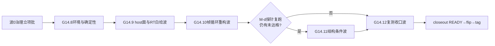

# G14plus 硬收尾全绿战役计划

## 现状结论(7个探索/调研agent + 3个fable5方案agent的收敛结果)

- G14五个P0中M-a/M-b绿;**M-c红**(GPU热节流双态致倒挂复发)、**M-d红**(通过线0/18达标 + RD-045间歇digest漂移);M-e/soak被拖红;closeout未跑。收口四门脚本已在树(步骤261~264,`next_free=265`)。
- 18格差距已完全归因四座大山:①TSR kernel无`#[numthreads]`(LocalSize 1,1,1,bistro锁死~120ms) ②scene readback选中WC内存(~200MB/s,t100损失~71ms) ③RT段结构低效(AS flags=0、阴影closest-hit全遍历、megakernel) ④mv纯CPU双循环(12.4ms)+vendor host交接。
- 方案A毫秒预算:全部优化落地后**18格全部≤UE×1.00**(14格余量≥30%;cornell t100三格约16~18%、bistro t100 tsr约9.8%为临界格,配后备链)。
- "严格全绿"还要求修复RD-045非确定性(约0.6%/run漂移)与锁频消热漂,否则soak统计上必然间歇红。

## 波次结构(方案B治理裁决:契约§7裁决7的G14.x延续波,唯一新门M-h)

### 波0 治理立项批

- 异己面清场:12个异己文件`git diff`导出patch**双份存档**(K盘+`.tmp`)后`git checkout`回退(否决stash——CRLF整文件重写场景不可三方合并);`ci/check_schemas.py`(纯换行漂移)与`g12_pt_sampler_selection.json`(异己时间戳)直接回退;三张G14登记表保留工作树态。
- [G14_P2_DECISIONS.md](milestones/g14/G14_P2_DECISIONS.md)表后事件登记单条汇总:G14-N8~N14七行承接锚窗口提前兑现(契约§7裁决7载体二选一+用户2026-08-22授权字面,42行闭集0-byte)。
- `milestones/g14/G14PLUS_RECORD.md`首建(立项授权/优化清单/波次记录/ratio收敛轨迹);契约§8.8立项记录。
- **RFC-0030**(编号按ledger实测领取)伞形Full RFC:mv GPU化(temporal底座演进显式修订行)+确定性协议缺陷修复(RD-045)+阴影/主可见性结构面+TSR kernel变体,D-409对抗评审(沿RFC-0029先例)→Agent Approved。
- MAP附录A **M-h行**(`g14.p0.m_h.continuation_closeout`,步骤265):锚重收割合法性三证+18/18达标+RD-045登记完备。
- p2/candidate门RD-045 history对账校准。

### G14.8 环境与确定性基线波

- 锁频(`nvidia-smi -lgc`)+环境画像登记(M-b已有登记位);UE臂6格基线锁频重测。
- flip-trace诊断臂扩展至`g14_3_pipeline_perf` TSR车道(RD-045 backfill_condition字面动作);基线漂移率N=20测量。

### G14.9 host面与RT白给波(全部位级不变,预期砍掉约70%差距)

- `render_exec.rs`(已清场的HEAD基线):readback按用途分路选择器(+`HOST_CACHED`,镜像`vendor_upscale.rs` L1811先例);FIF=2 submit/collect分离+per-slot资源。
- `vk.rs`:BLAS/TLAS `PREFER_FAST_TRACE`+compaction。
- rurixc编译器新内建`ray_query_initialize_first_hit`(发射flags 0x5,全链+conformance语料);`g14_3_direct_gi.rx`阴影臂切换(仅消费`has_committed`,位级等价)+背光keep预判跳射线(严格位级不变)。
- **新建**`g14_8_tsr_resample/resolve.rx`变体(`#[numthreads(8,8,1)]`),旧`g13_tsr_*.rx` 0-byte保留(RD-045归因链保护);M-c门SPV路径切换。
- 每项L0探针验证(双跑digest==旧锚,方案C协议)。

### G14.10 帧循环重构波

- TSR并入场景session(消输入再上传+独立session调度——RD-045候选根因消除面);生产帧`readback_subset=Some(vec![])`关全帧回读+锚点帧机制。
- mv GPU化(新`kernels/g14_mv.rx`,host算逆矩阵传uniform;`temporal/`目录0-byte不动,M-c的`temporal_base_0byte`机核保绿)。
- cornell 16样本拆散重排(3-pass:primary→shadow_scatter(z=16层)→shade_reduce同序求和,位级设计)。
- vendor DLSS原生VkImage tag(可选:若M-d探针已达标则skip并如实登记)。
- L1验证:digest锚过渡+SSIM+**AI读图**(EXR→PNG三曝光档+C1~C6检查清单,方案C协议)。

### G14.11 结构条件波(仅当G14.10后仍有未达格)

- bistro光栅G-buffer主可见性(G7.5b VS+FS先例);保守光贡献剔除;阴影结构面。
- 画质锚超带处置树:调参重试→回退改动→极端时停线呈报用户(不得自行取舍"全绿"vs"不降画质"两个授权字面)。

### G14.12 复测收口波

- digest锚18格程序重收割(前置M-c复跑绿;三证:双跑位级+画质带内+读图登记)。
- soak/closeout特判修订为达标分支(soak改4点、closeout改6点;wave4/M-d原生支持达标无需改)。
- 收口序列:M-c→**M-d(18/18达标判定,全案成败点)**→M-a/M-b复跑→M-e→wave门→收口基线commit→soak full-run(≥1800s)→M-h→closeout READY→§8.13→flip commit→`g14-closed`系tag。单轮全绿约10~13小时,先预跑排红再进soak。

## 全程纪律

- **先优化再测试**:中间波仅轻量验证(L0探针4~6min/L1单格10~15min),重型全矩阵只在G14.12跑一轮(节省约50小时验证)。
- **画质守护**:cornell t67 tsr SSIM deficit≤0.0107798硬门+G13双对拍门复跑带内+每个改图波AI亲自读图(优化前/后/G13.4基线三图对比+diff热图)。
- **并行分工**(委派fable5实施agent,按文件冲突域):A执行器域(`render_exec.rs`/`vk.rs`)、B编译器与kernel域(`rurixc`/`kernels/*.rx`)、C管线bin域(`g14_3_pipeline_perf.rs`/`vendor_upscale.rs`)、D治理验证域(RFC/登记/读图/复跑)。
- commit按波、按文件名显式择取、不push,沿现分支;共享面幂等重放防并发回退。
- 未达格如实登记不冒充;RD-045修复后维持open(长窗观察归G15+)。

## 主要风险

- bistro t100 tsr余量仅9.8%:锁频后UE变快可能压线——后备链(TSR两pass合一/阴影tile相干化/保守光剔除)至少落一项。
- RD-045根因不可定位:soak硬门与间歇漂移逻辑不相容,若TSR重构后仍复发则flip-trace取证升级,如实呈报。
- 画质与全绿冲突的极端分支:停线请用户裁决。

