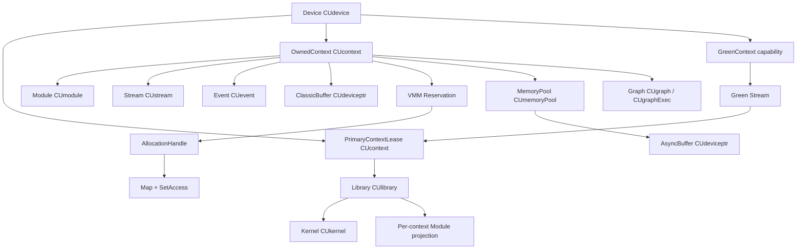

# Windows 上以 CUDA Driver API 为一等后端的运行时设计报告

## 执行摘要

如果你的新语言在 Windows 上把 **CUDA Driver API** 作为一等后端，并且默认采用 **显式 H2D/D2H + pinned host buffer**，而把 **Unified Memory 和 zero-copy** 明确降为 opt-in，这个方向与 NVIDIA 和 Windows 官方材料能够支撑出的“最可控、最可预测”路线是吻合的。核心原因有四个：其一，Driver API 把 **context、module/library、JIT、VMM、stream-ordered allocator、memory pool** 等低层对象全部显式化；其二，Windows 上的 **WDDM/VidMm/VidSch** 会把显存驻留、分页、预算和调度交给 OS 管，而不是让 CUDA 运行时替你“稳定地”屏蔽这些细节；其三，**GeForce 基本不支持 TCC**，因此大量消费级部署天然落在 WDDM 路径上；其四，官方文档对 **context 线程绑定、destroy 行为、module unload 后果、event/stream destroy 语义、async allocator 的时序契约** 都写得足够明确，足以支撑“affine ownership + 少量显式 unsafe 边界”的语言级设计。citeturn38view0turn39view1turn39view3turn41view0turn36view0turn27view0turn28view0

对运行时设计最重要的一条结论是：**应该把“资源所属 context”建模为类型系统里的第一公民**。因为 CUDA 资源本质上是 **context-bound** 的；而在 Driver API 中，当前 context 又是 **CPU 线程局部状态**，并且 `cuCtxDestroy()` 会“无论还有多少线程把它设为 current”都直接销毁该 context，后续其他线程再碰到它时会得到 `CUDA_ERROR_CONTEXT_IS_DESTROYED`。这意味着：如果语言运行时不把 context token、stream/event/module/buffer 的生命期与所有权绑定起来，最终一定会在跨线程 drop、异步 free、library/module unload、graph capture 这些边缘上出错。citeturn39view1turn39view3turn39view4

Windows 特有的设计结论也相当清楚：**不要把 WDDM 看成 Linux/TCC 的弱等价物**。NVIDIA 在 `nvidia-smi` 文档里明确写了：Windows 上支持 **TCC、WDDM、MCDM** 三种驱动模型；其中 **TCC 对计算优化、kernel launch 更快**，而 **WDDM 面向图形，不推荐用于计算**。同时，CUDA Windows 安装指南又明确说，**GeForce GPU（GTX Titan 例外）不支持 TCC**。因此，如果你的目标用户含大量 GeForce 机器，那么你的运行时就必须把 WDDM 的预算、分页、抢占、TDR 风险和 HAGS 变动性，当作**默认现实**而不是异常路径。citeturn28view0turn27view0

## Driver API 当前版能力版图

当前在线 Driver API 文档树把你关心的对象族全部单列为正式章节：**Primary Context Management、Context Management、Module Management、Library Management、Memory Management、Virtual Memory Management、Stream Ordered Memory Allocator、Unified Addressing、Stream Management、Event Management、Graph Management、Green Contexts** 等。这意味着你的运行时不需要“借 Runtime API 补齐语义”；相反，Driver API 已经足够完整，只是要求你自己承担对象模型与生命周期约束。citeturn14view0turn24view0turn24view1turn16view0

| 能力族 | 当前文档中的关键 API / 章节 | 对运行时设计的直接含义 |
|---|---|---|
| 主 context | `cuDevicePrimaryCtxRetain/Release/Reset/SetFlags/GetState`；主 context **每设备唯一**，并且**与 Runtime API 共享**。citeturn38view0 | 必须把“主 context 租约”与“显式 context 所有权”区分建模。 |
| 显式 context | `cuCtxCreate/Destroy/GetCurrent/SetCurrent/PushCurrent/PopCurrent/Synchronize(_v2)`。`cuCtxCreate()` 把新 context 关联到调用线程；`cuCtxPushCurrent()` / `cuCtxPopCurrent()` 操作的是 **CPU 线程的 current-context 栈**。citeturn38view1turn39view0turn39view1 | 需要线程局部的 `CurrentContextToken` 或等价能力对象。 |
| 绿色上下文 | Driver API 有独立 **Green Contexts** 章节；编程指南把它描述为表达“期望的并发 stream-ordered workload 数量”的机制；stream 查询 API 已经显式返回 regular context 与 green context 的双重关联。citeturn14view0turn25search10turn41view1 | 绿色上下文不是普通 `CUcontext` 的简单别名，建议单独建模。 |
| Module/JIT linker | `cuLinkCreate/AddData/AddFile/Complete/Destroy`、`cuModuleLoad/LoadData/LoadDataEx/LoadFatBinary/Unload`。citeturn24view0turn20view0 | PTX-first 运行时可以直接走 Driver JIT，不必经 Runtime API。 |
| Library | `cuLibraryLoadData/LoadFromFile`、`cuLibraryGetKernel/GetModule/GetGlobal/GetManaged/GetUnifiedFunction`、`cuKernel*`。citeturn24view1turn20view1turn20view2 | 更适合 separate compilation、统一函数指针和“代码包”抽象。 |
| 经典内存 API | `cuMemAlloc`、`cuMemAllocHost`、`cuMemAllocManaged`，以及 Host Register / 拷贝族等；`cuMemAllocHost()` 返回 page-locked host memory。citeturn12view0 | 正好支撑“显式拷贝 + pinned staging buffer 默认开启”的策略。 |
| VMM | `cuMemAddressReserve/Free`、`cuMemCreate/Release`、`cuMemMap/Unmap`、`cuMemSetAccess`、import/export handle。citeturn16view0turn17view0turn18view0 | 适合大地址空间、稀疏/重映射、跨进程共享，但状态机复杂。 |
| 流有序分配器与内存池 | `cuMemAllocAsync`、`cuMemAllocFromPoolAsync`、`cuMemFreeAsync`、`cuMemPool*`、`cuMemSetMemPool`。citeturn14view0turn15view3 | 适合高频短生命周期 buffer，但必须把“时序契约”编码进类型系统。 |
| Stream/Event/Graph | Stream 与 Event 都有完整 Driver 族；Graph 是独立正式章节，并且文档明确说 **graph objects are not threadsafe**。citeturn14view0turn41view0turn40view3turn41view1 | Graph 要么全程 affine，要么所有图 API 外围都加外部同步。 |

### PTX JIT、lazy loading 与 cache 语义

`cuModuleLoadDataEx()` 与 `cuLibraryLoadData()` 都允许传入 `CUjit_option` 数组。当前官方列出的 JIT 选项包括：**最大寄存器数、threads-per-block 约束、编译/链接 wall time、信息与错误日志 buffer、优化级别、从当前 context 推导 target、显式 target、fallback strategy、debug info、verbose log、line info、`CU_JIT_CACHE_MODE`、PIC、最小 CTA/SM、最大线程数、覆盖 PTX 指令值、split compile、binary loader thread count** 等。这里要特别注意：**`CU_JIT_CACHE_MODE` 说的是生成代码的 `-dlcm` cache mode，不是“磁盘 PTX JIT 编译缓存”的总开关**。citeturn20view0turn20view1turn22view0

module 与 library 都支持 **lazy/eager** 装载模式。`cuModuleGetLoadingMode()` 明确指出，module loading mode 由 `CUDA_MODULE_LOADING` 环境变量控制；library 文档则把 eager / lazy 的行为写得更具体：**EAGER** 会在调用时把 library 装到所有现存 context，且之后新建的 context 也会继续装载；**LAZY** 则只在某个 context 真正需要函数时才加载。对新语言来说，这意味着 `Library` 更像“全进程代码包”，而不是“单 context 内的模块句柄”。citeturn23view0turn23view1turn20view1turn20view2

### 经典内存、VMM、异步分配器之间的边界

如果目标是 **Windows-only 且可预测性优先**，建议把内存能力分成三层。第一层是“经典显式分配”：`cuMemAlloc` + `cuMemAllocHost`/`cuMemHostRegister` + 明确的 H2D/D2H；这是最稳妥的默认层。第二层是 VMM：`cuMemAddressReserve` 预留 VA、`cuMemCreate` 创建物理分配、`cuMemMap` 绑定、`cuMemSetAccess` 开权限；它适合你自己做大对象 arena、切片映射和跨进程句柄导入，但映射粒度、访问权限与 Windows handle 元数据都会引入更多状态机。第三层是流有序分配器：`cuMemAllocAsync` / `cuMemFreeAsync` + `CUmemoryPool`，它的核心承诺不是“对象立即存在/销毁”，而是“**在给定 stream 顺序契约下有效**”；一旦越过这个时序边界访问，就进入未定义行为区。citeturn12view0turn16view0turn17view0turn18view0turn14view0

官方对流有序分配器的约束写得非常直白：allocation 与 free 都是插入到 stream 的操作；**allocation 完成前不得访问**；free 一旦被 stream 执行到，后续 GPU 工作或指针属性查询再访问该内存就是 **undefined behavior**。memory pool 还公开了复用与回收策略：release threshold、事件依赖复用、opportunistic reuse、内部依赖插入等。对语言设计的含义是：`AsyncBuffer` 不应该只是一个“可随便 clone 的裸指针对象”，而应当携带至少一个**分配 stream、释放 stream、以及证明跨流依赖已经成立**的运行时事实。citeturn14view0turn15view3

## Driver 与 Runtime 的真实差异

Driver API 与 Runtime API 最根本的差别，不是函数名风格，而是 **谁拥有 context 模型**。Primary Context Management 文档明确说：**primary context 每个 device 唯一，并且与 CUDA runtime API 共享**；而显式 `cuCtxCreate()` 创建的是独立 context，并和当前调用线程关联。换句话说，Runtime API 天然偏向“每设备一主 context 的进程级共享模型”，而 Driver API 允许你做“进程内多个显式 context、显式 current-context 栈、显式 module/library/JIT 装载”的更低层控制。citeturn38view0turn39view1

真正需要警惕的是 **混用边界**。因为资源是 context-bound 的，而 Runtime API 默认围绕 primary context 运作；如果你的语言运行时自己用 `cuCtxCreate()` 建了显式 context，但用户或第三方库又偷偷调用 Runtime API，那么后者很可能会落到 **primary context**，从而形成“两套互不透明的资源世界”。在这种情况下，最安全的工程策略通常只有两种：要么**硬性禁止** Runtime API 与你的 Driver 后端在同一进程混用；要么只支持一种受控的“interop mode”，即**统一退回 primary context**，并把它作为唯一合法的 device context。这个结论来自官方“primary context 与 runtime 共享”以及“显式 context 是线程 current 且资源 context-bound”的组合，而不是社区经验。citeturn38view0turn39view1turn39view4

版本兼容模型上，NVIDIA 官方把 **Driver API 规则**、**Runtime API version mixing 规则**、以及 **CUDA Compatibility / minor version compatibility** 分开写。高层可归纳成三条：第一，Driver API 对更老应用是 **backward compatible**，但不是 forward compatible；第二，Runtime 会避免调用安装驱动不支持的 driver entry point；第三，自 CUDA 11 起，同一大版本内存在 **minor version compatibility**，但这不是“所有特性都稳妥可用”的承诺——尤其当你依赖 **PTX JIT**、新指令集或更高版本的编译器特性时，仍可能因为驱动太旧而得到 `CUDA_ERROR_UNSUPPORTED_PTX_VERSION`、`CUDA_ERROR_JIT_COMPILER_NOT_FOUND` 或“需要更新驱动”的错误。对你的语言来说，这几乎直接导出一个策略：**分发时优先 fatbin/cubin，PTX 只作回退；运行时启动阶段主动做 driver/toolkit 能力协商。** citeturn20view0turn13search6turn7view1turn7view2turn7view3

## Windows 驱动模型与内存现实

Windows 上，NVIDIA 和 Microsoft 官方材料共同描述了三类你不能回避的现实。首先是 **WDDM / TCC / MCDM**。CUDA Windows 安装指南说，Windows 10+ 下 NVIDIA 驱动可工作在 **WDDM** 或 **TCC**；其中 WDDM 用于显示设备，TCC 面向非显示设备。`nvidia-smi` 文档进一步补充：Windows 上支持 **TCC、WDDM、MCDM** 三种 driver model；其中 **TCC 针对计算优化，kernel launch 更快**，而 **WDDM 面向图形，不推荐用于计算**。同时，安装指南也把部署限制写得非常明白：**GeForce GPU（GTX Titan 例外）不支持 TCC**，而且一旦某块 GPU 处于 TCC，就**不能当显示设备**。citeturn27view0turn28view0

其次是 **MCDM 的语义边界**。Microsoft 2025 的 MCDM 概览写明：MCDM 是 **WDDM 2.0+ 的 compute-only 子集**，设备需要以“render-only、无显示功能”的方式向系统暴露。文档还强调：在 Windows 10 1903（WDDM 2.6）及以后，MCDM 可用于编写 compute-only driver；标准 MCDM 设备要求有 MMU，例外的原型设备在 2004 起也只能被单进程使用。对你的 CUDA 运行时而言，这意味着“Windows 计算设备”并不只是一种 WDDM 变体，而是可能落在一个**根本没有显示责任、但仍由 Windows 内核管理调度和地址空间保护**的模型上。需要谨慎的一点是：虽然 `nvidia-smi` 已经把 MCDM 作为 Windows 上支持的 driver model 列出，但在本报告掌握的证据集中，**尚不足以说明你的目标 NVIDIA SKU/驱动在真实部署中是否会以 MCDM 运行**；因此运行时应做 **能力探测**，而不是做静态假设。citeturn28view0turn31view0turn31view2

第三个现实是 **VidMm / VidSch / residency budget / paging**。Microsoft 2024 的“Video Memory Management and GPU Scheduling”页面明确写道：**VidMm** 是系统提供的 GPU 内存管理组件，负责 allocation / deallocation / overall management；它和系统提供的 GPU scheduler（VidSch）一起工作。到 WDDM 2.0，residency 语义变成了**设备显式驻留列表**：VidMm 在调度任何属于该设备的 context 之前，会先确保 residency requirement list 上的分配已经 resident。与此同时，系统还会施加 **process residency budget**；在内存压力下预算会变化；如果 GPU 访问了 **nonresident allocation**，那是非法的，结果会是该应用的 **device removed**。再往物理层看，WDDM 2.0 把 GPU 物理资源抽象为 **memory segment / aperture segment / implicit system memory segment**。这意味着：在 Windows 上，显存是否驻留、是否被搬移、是否需要经过 aperture、预算是否收紧，不是你用不用 Runtime API 的问题，而是 **OS 级事实**。citeturn33view1turn36view0turn36view1

HAGS 也必须从“**只信官方能证明的部分**”出发。Microsoft 2024 的 `D3DKMT_WDDM_2_7_CAPS` 明确提供了 `HwSchSupported`、`HwSchEnabled`、`HwSchEnabledByDefault` 三个位；同年关于 **User-Mode Work Submission** 的官方文档又写到，这一特性在 Windows 11 24H2（WDDM 3.2）下仍在开发中，其目标是让应用从 user mode 以**很低延迟**直接向 GPU 提交工作。能稳妥下结论的是：**HAGS 至少确实改变了 Windows GPU 调度能力集，并与更低延迟的工作提交方向相关**；不能稳妥下结论的是：**某个具体 CUDA Driver 调用在你机器上的延迟一定更低、提交行为一定更接近 Linux/TCC**。因此，正确的运行时策略不是写死假设，而是在启动时记录 HAGS 状态，并允许用户或基准框架对 **HAGS on/off** 做 A/B 测试。citeturn33view0turn29search2

最后，Windows 上的 **Unified Memory** 必须被保守对待。NVIDIA 官方 WSL 指南虽然是 WSL 文档，但里面直接写道：**“Windows native 上不提供 full managed memory support，因此 WSL 2 也不会支持它；使用 managed memory 的应用可能看到性能下降和更高的系统内存占用。”** 这已经足够支撑你的默认策略：Windows-only 运行时应该把 **显式 copy + pinned staging** 作为标准路径，而把 managed memory 降为“为了易用性而牺牲语义和性能可预测性”的 opt-in。citeturn26search13

## 所有权 线程与错误模型

### 运行时对象模型图

这张图对应的核心事实是：**device 是可复制的标识；context 是真正的资源根；stream/event/module/buffer 都从属于某个 context；library 是“代码包”而不是单 context 模块；green context 与 regular context 并列存在，且它的 stream 查询会同时暴露 green context 与关联 device 的 primary context。** Primary context 与 Runtime API 共享；显式 context 则由 Driver API 显式创建、压栈、弹栈和销毁。citeturn38view0turn39view1turn41view1

### 生命周期与线程规则

关于 **context 与线程绑定**，官方文档给出了足够严格的规则：`cuCtxCreate()` 会创建一个新 context，并把它**关联到调用线程**；`cuCtxGetCurrent()` / `cuCtxSetCurrent()` 读写的是**调用 CPU 线程已绑定的 context**；`cuCtxPushCurrent()` / `cuCtxPopCurrent()` 操作的是**该 CPU 线程上的 current-context 栈**，并且 `cuCtxPopCurrent()` 明确说，被弹出的 context 之后可以通过 `cuCtxPushCurrent()` 变为**另一个 CPU 线程**的 current context。也就是说，context 不是“天然线程局部且不可转移”的对象，而是“**必须经由显式 push/pop/set current 才能跨线程转移的 affine 资源**”。citeturn39view1turn39view0turn38view1

最关键的销毁规则是 `cuCtxDestroy()`。官方原文几乎直接决定了语言设计边界：**它会无视多少线程还把该 context 设为 current 而直接销毁；调用方必须保证销毁期间没有 API 正在使用该 context；context 或其资源之后若再被访问就是 undefined behavior。** 如果该 context 仍然 current 于调用线程，它还会被从该线程栈中 pop；如果它 current 于其他线程，那么那些线程再访问它时会得到 `CUDA_ERROR_CONTEXT_IS_DESTROYED`。这意味着 `Context` 的 drop 不应是普通共享对象的析构，而必须是**独占、带全局停机点/引用栅栏的操作**。citeturn39view3turn39view4

**Stream** 的文档没有提供“同一 handle 的并发调用一定线程安全”的总保证，但它非常明确地给出了两条更可操作的事实。第一，`cuStreamGetCtx_v2()` 说明：普通 stream 关联的是创建时线程当前的 regular context；green-context stream 则同时关联 green context 与该 device 的 primary context；而 `CU_STREAM_LEGACY`、`CU_STREAM_PER_THREAD` 这类 special stream 的语义依赖于**调用线程当前 context**。第二，`cuStreamDestroy()` 在 stream 上仍有 pending work 时会**立即返回**，资源会在设备完成该 stream 上所有工作后**异步释放**。因此，`Stream` 最适合建模成 **affine queue handle**：可以把“向其提交工作”暴露成受控借用，但不应把“销毁”暴露成任何共享引用都能调用的普通方法。citeturn41view1turn41view0

**Event** 的规则比 stream 更“适合 RAII”，但前提仍是 context 一致。`cuEventRecord()` 写得很清楚：`hEvent` 与 `hStream` **必须来自同一个 context**；事件捕获的是”调用瞬间 stream 中已排队的工作“，后续对 stream 的使用不会 retroactively 改变 event。`cuEventDestroy()` 又明确允许你在 event 尚未完成时销毁它：此时 API **不会阻塞**，资源会在事件完成后**自动异步释放**。所以事件非常适合做“只读同步令牌”或“可提前 drop 的 one-shot completion object”，但 **record / wait 的上下文一致性** 必须由类型系统或运行时检查保证。citeturn40view1turn40view3

**Module / Library** 则更接近“代码对象”。`cuModuleLoad*()` 都是把映像装入**当前 context**；`cuModuleUnload()` 文档明确说：对通过 Library Management API 得到的 module 调 `cuModuleUnload()` 会报 `CUDA_ERROR_NOT_PERMITTED`，而且 **use-after-unload 是 undefined behavior**。对应地，`cuLibraryGetModule()` 返回的是“**library 在当前 context 里的 module handle**”；`cuLibraryGetKernel()` / `cuKernelGetFunction()` 则把 `CUlibrary`、`CUkernel`、`CUfunction` 串起来。最合理的语言建模是：`Library` 是上层拥有者，`Module`/`Kernel` 是面向具体 context 的投影对象；任何 unload 都必须级联失效全部子句柄。citeturn20view0turn19view0turn20view1turn19view2

**Graph** 是唯一一个官方明确写出“对象本身不线程安全”的对象族。虽然本报告未展开 Graph 章节的全量函数表，但 stream capture 相关文档已经直接给出：**graph objects are not threadsafe**。因此，Graph 设计不应只是“affine by convention”，而应在 API 层强制：**所有图构建、更新、查询与 exec 管理都要么在单线程所有权下执行，要么外围加互斥。** citeturn41view1

### 新语言资源类型到 Driver 句柄的映射与安全边界

| 新语言资源类型 | 底层句柄 | 可以静态保证安全的操作 | 必须 `unsafe` 或至少做运行时检查的操作 | 事实依据 |
|---|---|---|---|---|
| `GpuDevice` | `CUdevice` | 枚举、属性查询、复制传递 | 无需特殊 `unsafe` | `CUdevice` 只是 device 标识。citeturn38view0 |
| `PrimaryContextLease` | `CUcontext` from `cuDevicePrimaryCtxRetain` | retain/release、绑定为 current、与 Runtime 受控互操作 | `Reset`、与第三方 Runtime 混用、在别处仍 current 时销毁式操作 | 主 context 每 device 唯一且与 Runtime 共享；release/reset 语义独立。citeturn38view0 |
| `OwnedContext` | `CUcontext` from `cuCtxCreate` | 在线程 token 下 `push/pop/set current/sync` | `destroy`、跨线程迁移、并发使用/销毁 | context 与调用线程关联；destroy 跨线程生效且 use-after-destroy UB。citeturn39view1turn39view3turn39view4 |
| `GreenContext` | green-context capability | 查询/创建其 stream | 把它当普通 `CUcontext` 处理 | stream 查询会同时返回 green context 与关联 primary context。citeturn41view1turn25search10 |
| `Module` | `CUmodule` | load/get function/get global | unload 后继续使用、对 library-derived module 调 `cuModuleUnload` | module 装入当前 context；use-after-unload UB；library-derived module 不能这样卸载。citeturn20view0turn19view0 |
| `Library` | `CUlibrary` | load/get kernel/get module/get global | unload 时子句柄仍在用 | library 暴露 per-context module / kernel 投影。citeturn24view1turn20view1 |
| `Stream` | `CUstream` | create/query/sync；在受控借用下提交工作 | destroy 与并发外部别名；假设同一 handle 并发 mutation 有文档保证 | stream 关联创建时 context；destroy 非阻塞、异步回收。citeturn41view1turn41view0 |
| `Event` | `CUevent` | create/record/query/wait；提前 drop | 跨 context record/wait | event 与 stream 必须同 context；destroy 可早于完成。citeturn40view1turn40view3 |
| `DeviceBuffer` | `CUdeviceptr` from `cuMemAlloc` | alloc/copy/query | 未证明 quiescent 就 free；跨错误 context 使用 | `cuMemFree` 对异步 allocator 指针不隐式同步；上下文仍然重要。citeturn12view1turn12view0 |
| `AsyncBuffer` | `CUdeviceptr` from `cuMemAllocAsync` | 在同一 stream 时序区间内使用 | 越出承诺的 stream order 访问；用普通 free 破坏契约 | 官方明确把 allocate/free 定义成 stream-ordered，越界访问是 UB。citeturn14view0turn15view3 |
| `PinnedHostBuffer` | host ptr from `cuMemAllocHost` / registered memory | staging、显式 H2D/D2H | 过量 page-lock、长期滥用 | page-lock 过多会降低系统性能。citeturn12view0 |
| `VmmReservation` / `VmmHandle` / `MappedRegion` | reserve/create/map/access tuple | 粒度对齐后 reserve/create/map/set access | 任意重映射、跨进程句柄、Windows 安全属性 | VMM 明确要求粒度、映射后还需 `cuMemSetAccess`；Windows 共享句柄需要 `LPSECURITYATTRIBUTE`。citeturn17view0turn18view0 |
| `MemoryPool` | `CUmemoryPool` | alloc/free async、调属性、trim | 假设跨流复用自动安全 | pool 的复用策略依赖事件/流依赖与 host 观察到的完成。citeturn15view3 |
| `Graph` / `GraphExec` | `CUgraph` / `CUgraphExec` | 单线程独占下 build/update/launch | 任何并发图 API | 官方明确 graph objects not threadsafe。citeturn41view1 |

### 错误模型与所谓 sticky errors

社区常说的 **sticky errors**，在官方 Driver 文档里的表述其实更保守也更普遍：**很多 API “may also return error codes from previous, asynchronous launches”**。这个注记出现在 memory、module、context、stream、event 等多个族上。换句话说，更准确的说法不是“所有错误都会粘滞”，而是：**异步执行产生的错误可能在后续看似无关的 API 调用上被观察到。** 运行时应把这件事编码进错误模型：不要把“某个 API 返回的错误”机械地归因给“这个 API 本身的参数一定错了”。citeturn12view0turn20view0turn39view1turn41view0turn40view3

真正的**不可恢复边界**，官方写得最清楚的是 `CUDA_ERROR_ASSERT` / `cudaErrorAssert`。Driver/runtime 的错误类型文档都说明：**device-side assert 触发后，context 不可再用，必须销毁；该 context 现有的 device allocations 全部失效，需要重建。** 同一类不可恢复状态还包括 `CUDA_ERROR_CONTEXT_IS_DESTROYED`：它表示当前线程的 context 已经被 `cuCtxDestroy()` 销毁，或者 primary context 尚未初始化。对新语言来说，这意味着：一旦观察到 `ASSERT` 或 `CONTEXT_IS_DESTROYED`，最合理的恢复动作不是“重试这次调用”，而是**整块 context 子树失效并重建**。citeturn37search18turn37search13turn39view4

至于你问题里特别点名的 **device-side trap / exception**，当前证据集中能被官方直接支持到的结论较窄：`cuCtxCreate()` 的 coredump 选项明确说，如果某个 context **在执行中抛出 exception**，CUDA 可以为它生成 GPU coredump；但这些页面没有像 `CUDA_ERROR_ASSERT` 那样，给出“所有 trap 后 context 一定何时可恢复”的统一条文。因此，保守而正确的语言级策略应是：**对 `assert` 明确按 fatal context failure 处理；对 generic exception / trap 也默认走同样的灾难恢复路径，除非未来拿到更精确的 NVIDIA 官方条文，把它缩窄成可恢复子集。** citeturn38view2turn37search13

## 资源映射 风险清单 与案例

### Windows 特有风险清单与缓解

| 风险 | 为什么是 Windows 特有高概率问题 | 缓解建议 | 依据 |
|---|---|---|---|
| GeForce 无法切到 TCC | GeForce（Titan 例外）不支持 TCC，很多最终部署只能跑 WDDM；而 WDDM 又被 NVIDIA 明确标为“不推荐用于计算”。 | 以 **WDDM 为默认目标** 做性能与稳定性设计；低延迟极限场景再建议 TCC-capable SKU。 | citeturn27view0turn28view0 |
| WDDM launch latency 与提交路径不稳定 | TCC 明确“kernel launch 更快”；WDDM 面向图形。 | 合并小 kernel、优先 graph / stream-ordered allocator / 预热；不要假设 Linux/TCC 水平的 launch 抖动。 | citeturn28view0 |
| HAGS 影响无法静态假设 | 2024+ 官方只给出 capability / enabled 位和“更低延迟用户态提交方向”，没给 CUDA 特定收益合同。 | 启动时探测 HAGS，公开 telemetry，允许 on/off 基准。 | citeturn33view0turn29search2 |
| VidMm 分页与预算收紧 | WDDM 2.0 用显式 residency list，process 有 budget；访问 nonresident allocation 非法且会 device removed。 | 运行时做 working-set 预算、池化复用、超额告警；避免“显存看似够用就继续涨”。 | citeturn36view0turn36view1 |
| TDR / 抢占相关失败 | 官方说明长包不能及时 preempt 会拖慢高优先级 GPU 工作并触发反复 TDR。 | 切小 kernel、限制长时间独占执行、把用户可调 timeout/批大小做成公开参数。 | citeturn34view2 |
| Unified Memory 语义受限 | NVIDIA 明说 Windows native 没有 full managed memory support，可能导致更高系统内存占用和更差性能。 | 默认禁用 UM；保持显式 copy + pinned buffer。 | citeturn26search13 |
| VMM 共享句柄的 Win32 安全元数据 | `cuMemCreate()` 在 Windows 上需要 `LPSECURITYATTRIBUTE` 之类元数据。 | 把跨进程共享抽成单独 Windows-only unsafe API；默认不暴露。 | citeturn17view0 |
| Async allocator 时序误用 | Windows 下 residency / paging 已复杂，再叠加 stream-ordered free，错一次就进入 UB。 | 把 `cuMemAllocAsync` 封成线性对象，只允许在证明确认的 stream order 内流转。 | citeturn14view0turn15view3 |

### 已核对到的真实案例

在已核对到的开源案例中，**CUDA.jl** 有一个很有代表性的坑：issue #780 讨论了在异步分配/释放与 pointer 复用场景下，`compute-sanitizer` 报出 out-of-bounds / invalid pointer 类问题；讨论中的变通方案是把 `cuMemFree` 换成 `cuMemFreeAsync` 并配合同步。这件事的价值不在于“CUDA.jl 独有 bug”，而在于它把官方文档里那条最容易被忽略的规则暴露了出来：**stream-ordered allocator 的生命期不是“指针对象”的生命期，而是“流时序区间”的生命期。** 如果你的语言打算把 `AsyncBuffer` 当普通 `Buffer` 用，这类问题迟早会复现。citeturn13search9turn14view0turn15view3

对 **PyTorch、CuPy、tinygrad**，本报告在当前证据集中没有拿到与上面同等严格的“源码行号 + issue 行号”材料，因此我不把任何框架特定断言写成结论性事实。能高置信给出的只有一个更抽象、也更重要的结论：**成熟运行时最终都会把 raw CUDA handle 的生命期藏起来，把 current-context 绑定集中化，把 free 延后到同步点或时序证明之后。** 这并不是某个框架的偶然风格，而是被官方 Driver 语义逼出来的结果。citeturn39view3turn41view0turn40view3turn20view0

## 开放问题与限制

本报告已经足以支撑你的 **对象模型、unsafe 边界、Windows 风险控制**，但仍有四个点值得在下一轮实现验证里继续补强。第一，在线 Driver API 文档的不同章节当前显示的版本号并不完全一致：我核对到的页面同时出现了 **13.3.0、13.2.1、13.1.1** 的章节版本号；不过相关能力都已经出现在当前文档树中。第二，本轮已核对到的是 `CU_JIT_CACHE_MODE` 这类 **JIT 编译选项**，而不是“磁盘 PTX JIT cache”环境变量的最新官方条文，因此后者不宜在语言规范中写成硬承诺。第三，**device-side assert** 的 fatal 语义有官方明确条文，但 **generic trap / exception** 的可恢复边界，在当前证据集中还没有对应的“官方一句话判决”，所以实现上应先按 fatal 对待。第四，**PyTorch / CuPy / tinygrad** 的源码与 issue 案例，本轮没有做到与官方文档同等级别的逐行核证，因此不应把它们当成规范依据。citeturn24view0turn38view1turn14view0turn22view0turn37search13turn38view2