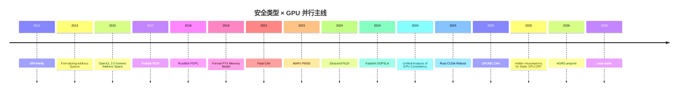
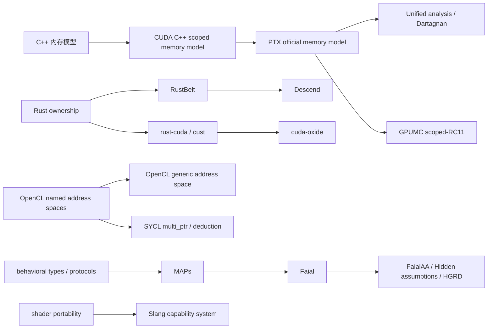

# GPU 内存模型与所有权类型系统

## 核心结论

如果你的目标是“**宿主层 Rust 式资源所有权 + kernel 子语言受限借用与显式地址空间**”，并且设备侧语义明确对齐 **CUDA 风格弱序内存模型**，那么现有工作里**最接近你设计点的不是 Rust-CUDA，也不是 Slang，而是 Descend**。它把 Rust 的 ownership / lifetime 思路扩展到了 GPU，额外引入 **execution resources**（grid / block / warp / thread）和 **views** 来表达安全的并行分区访问；这正好对应你语言想解决的核心张力：既要保留 CUDA 级别的低层控制，又要在类型系统里证明“谁拥有哪段内存、在哪个并行层级上可读写、何时同步后才能重用”。但 Descend 也清楚暴露了边界：**运行时决定的索引、图算法式工作队列、以及依赖 CUDA 弱内存原语的精细同步**，目前仍然会落到 `unsafe`。这说明“GPU 上的安全借用”在理论上可行，但其**安全包络并不覆盖全部高性能 CUDA 惯用法**。citeturn19view1turn20view2turn21view3

从内存模型角度，你的设备语义若要真正“CUDA 风格”，就不能只复用 C++/Rust 传统 happens-before 叙事。**PTX 官方模型的核心不是 DRF 假设，而是 scoped synchronization、morally strong、release/acquire patterns、proxy 等概念的组合**。官方 PTX ISA 文档明确把 **morally strong** 定义为“程序顺序或双向 scope 包含 + 同一 proxy + 完全重叠”之类的关系；很多关键公理——原子性、SC-per-location、`fence.sc` 排序——都只对 morally strong 的操作成立。与此同时，**CUDA C++** 又在源语言层面把标准 C++ 内存模型扩展为带 **thread scopes** 的版本，并把 data race 定义成“不是对方线程可见 scope 下的原子、又没有 happens-before”的冲突行为；这与 PTX 的“允许部分 uniform-size races 但对其行为给出约束”不是同一件事。若你的语言表面语义做 Rust/C++ 风格，而底层发射到 PTX，则**必须显式设计源语言到 PTX scope/order 的映射层**，不能把“Rust 的 Send/Sync + C++ atomics”直接当作设备真语义。citeturn10view0turn10view2turn10view3turn11view0turn11view1turn12view0turn12view1

就工程策略而言，最稳妥的路线不是“一次性静态证明所有 GPU kernel 无竞争”，而是分层：**MVP 静态保证**覆盖 host/device 资源生命周期、地址空间不混淆、显式 block-local shared memory 借用、规则化的 owner-computes / interval partition / tiled shared-memory 模式；而对**动态索引引发的别名、非结构化工作队列、跨作用域弱序原子协议、inline PTX/CUDA、全局级自定义同步协议**，应明确放进 `unsafe`，并辅以静态/动态外部工具。Faial / MAPs、GPUVerify、GPUMC、HGRD、iGUARD、HiRace 这些工作共同给出的不是“一把银弹”，而是一条很清楚的边界线：**结构化并发可以静态建模；弱内存 + 动态行为则要么降表达力，要么引入外部证明/检查。**citeturn35view0turn35view1turn35view3turn34search20turn34search6turn35view2

最后，关于你提出的 **RustBelt 方法论**：我认为它对你的语言**非常合适，但应只用于“锚定 unsafe 边界”，而不是覆盖整个 GPU 栈**。RustBelt 的核心贡献不是“证明了所有 Rust 程序”，而是给出了**一个可扩展的、能为每个使用 unsafe 的库生成验证义务的形式化框架**；而后续的 *RustBelt meets relaxed memory* 进一步表明，这一套方法可以延伸到弱内存并发库。对你的语言而言，最值得借鉴的是：把 **unsafe kernel primitives**（原子、barrier、async copy、inline PTX、动态 shared memory partition、host launch/runtime FFI）做成**少数语义原子**，然后只为这些原子写验证义务，而不是试图把所有 CUDA 设备行为都内化进核心类型系统。理论上可行；工程上成本很高，但收益也最大。citeturn40search0turn40search6turn40search11

## 年表与谱系图

下面这张年表把本次调研中最重要的主线串起来：一条是 **GPU 内存模型与其分析**，一条是 **安全/所有权型 GPU 语言**，一条是 **地址空间类型化的工业教训**，一条是 **静态/动态竞争检测**。覆盖面上已包含你要求特别强调的 **Descend**，以及 **2023–2026** 的新工作：MAPs、FaialAA、Descend、Rust-CUDA reboot、GPUMC、HGRD、cuda-oxide。citeturn35view0turn15search5turn15search10turn33search10turn40search0turn9search1turn35view1turn38search1turn8search1turn19view1turn13search1turn24view2turn34search20turn29view0

如果把谱系按“思想来源”而不是按年份组织，大体会得到下图：**C++/CUDA scoped atomics** 进入 **PTX 正式模型**，进一步催生 **统一一致性分析和弱内存模型检查**；**Rust ownership** 经过 **RustBelt** 这条线，为 Descend 一类“GPU 上的借用系统”提供方法论启发；而 **OpenCL/SYCL 地址空间** 与 **Slang capability** 则更像工业侧的两种不同答案：前者强调内存区分，后者强调目标能力与可用性约束。citeturn12view0turn9search1turn9search10turn35view3turn40search0turn19view1turn15search16turn18view1turn27view0

对你这门新语言而言，**真正该合成的不是某一条单线，而是三条线的交叉**：  
其一，设备端语义必须站在 **PTX / CUDA scoped memory model** 这条线上；其二，静态安全应该优先吸收 **Descend 的 ownership + execution resources + views**；其三，`unsafe` 与验证义务则最好沿 **RustBelt + MAPs/Faial** 的方法论来组织。citeturn19view1turn12view0turn35view1turn40search6

## GPU 内存模型的形式化基础

### PTX 的正式定义为何值得直接采用

PTX 官方 ISA 文档把设备侧操作分成 **strong** 与 **weak**：带 `.relaxed/.acquire/.release/.acq_rel/.volatile/.mmio` 的内存操作，以及内存 fence，属于 strong；普通 `.weak` 的 `ld/st` 则是 weak。每个 strong operation 必须带 scope，当前官方文档给出 `.cta`、`.cluster`、`.gpu`、`.sys` 等层级。更关键的是，**morally strong** 不是“是否 atomic”这么简单，而是一个二元关系：两操作要么在程序顺序中，要么彼此 scope 互相包含；还要经由同一 proxy；若都是内存操作，还要完全重叠。PTX 把大量关键公理都建立在 morally strong 上，而不是建立在“程序必须 DRF”上。citeturn11view0turn11view1turn10view0

这直接带来两点设计启示。第一，**atomicity / SC-per-location 不是全局兜底性质，而是 scoped、proxy-sensitive 的局部性质**。PTX 文档明确说：conflicting morally strong operations 才有 single-copy atomicity；pairwise morally strong 的重叠内存操作才满足 per-location 的顺序一致性。第二，**PTX 并不以“有数据竞争即全未定义”作为基础语义**。官方定义里，两个冲突访问若既非 causality ordered、又不 morally strong，即构成 data race；但只要程序里只有 **uniform-size data-races**，官方公理依然足以描述行为；真正超出公理覆盖的是 **mixed-size data-races**。这与 C++ / Rust 思路明显不同。citeturn10view0turn10view3

PTX 的“同步”也不是只靠 barrier。官方文档把 `fence.sc`、`bar{.cta}.sync/red/arrive`、`barrier.cluster.arrive/wait`、以及 **release pattern ↔ acquire pattern** 都纳入 `synchronizes-with` 关系，并由此建立跨线程的 causality order。也就是说，如果你的 kernel 子语言要有“受限借用 + 显式地址空间 + CUDA 弱序”，那么类型系统至少要看见三类设备事件：**barrier、fence、以及带 scope/order 的原子/读写模式**；只建模“借用”和“共享内存块作用域”，不足以覆盖 PTX 的真实可见性语义。citeturn10view2turn11view3turn11view4

### PTX 与 C++ 内存模型的映射关系

在源语言层面，**CUDA C++** 的做法是：保留标准 C++ atomics/barriers 等语法与语义骨架，但在 `cuda::` 命名空间里扩展出 **thread scopes**，包括 `system/device/block/thread`。官方 CUDA Programming Guide 与 libcu++ 文档都明确说明：`std::` 与 `cuda::std::` 类型在 `thread_scope_system` 上与 `cuda::` 对应类型行为相同；而 data race 的定义被改写为“至少一侧不是在包含对方线程的 scope 上原子，且两者不 happens-before”。这说明**源语言层可继续采用 C++/Rust 风格的 happens-before 叙事，但必须加入 scope 参数**。citeturn12view0turn12view1

这套源语言扩展与 PTX 的关系，ASPLOS 的 PTX 正式化工作给出的结论是：**可以为 C++ 风格 scoped atomics 设计到 PTX 的正确编译映射，并用 Alloy / Coq 做验证**。NVIDIA 研究页面把该论文定位为“首次对官方 PTX 内存一致性模型做正式分析”；作者演讲与配套仓库进一步说明，编译器 mapping 经过 Alloy 测试与 Coq 验证。对你的语言来说，最值得借鉴的不是“照搬 C++”，而是**采用：表面层 = scoped-Rust/C++，后端层 = 明确映射到 PTX 的 scope/order/fence。**citeturn9search1turn9search12turn9search18

一个特别值得注意的近期工程变化是 **memory synchronization domains**。当前 CUDA 文档明确要求：在使用 domains 时，同一 GPU 上不同 domain 之间若要排序或同步，**必须提升到 system-scope fencing**；device-scope 只对同一 domain 内足够。这意味着你的 effect / type 设计如果将来想支持 CUDA 新特性，最好不要把“device scope”硬编码成“GPU 内全互通”的单一层级，而应给 future-proof 的域/代理维度留口子。citeturn39search18

### 近期形式分析进展与它们对你语言的意义

PTX 正式模型之后，分析工具沿两条线发展。第一条线是**跨 GPU 一致性模型的统一分析**。*Towards Unified Analysis of GPU Consistency* 把 PTX 与 Vulkan 一类带 scope 的 GPU 内存模型纳入同一分析框架，并把 Dartagnan推进到能够分析多个 GPU consistency models 的真实代码。第二条线是**GPU 弱内存模型检查**。GPUMC 在 2025 年针对 **scoped-RC11** 提出无状态模型检查器，可发现 races、barrier divergence、assertion violations，并自动修复某些错误。需要强调的是：这些工作**并不等于 PTX 官方模型本身**，但它们给你语言一个很实用的启示：可以把**源语言核心语义简化到 scoped-RC11 风格**，再为 PTX 特有 proxy / async / domain 特性留一个“底层不透明原语层”。这样既保留分析可行性，又不给 MVP 元理论增加过高负担。citeturn9search10turn13search4turn35view3

## 所有权借用与地址空间类型化

### Descend 是与你的设计最接近的工作

Descend 的论文与官网都非常清晰地表明，它的目标是**把 Rust 的 ownership / lifetimes 适配到 GPU systems programming**。它不是把 kernel 隐式复制到几千线程，而是让程序员在语言里显式描述 computation 如何分配到 `grid / block / warp / thread` 执行资源；在这个层级化调度上，借用检查器会检查**内存所有权如何被“收窄”到子执行资源**。Descend 还把 reference type 直接标上 address space：`cpu.mem`、`gpu.global`、`gpu.shared`、`gpu.local`，并用 execution resources 限制引用只能在正确的执行上下文中解引用。对 shared memory，它采用了非常强的设计：**每个 block 的 shared memory 作为参数传入 block 级并行体**，这本质上就是“shared borrow 不得逃出 block 作用域”的第一类可行编码——**lifetime + execution-resource** 路线。citeturn19view0turn19view1turn22view0turn22view1turn22view3

Descend 最有价值的机制是 **views**。论文把 `group / take_left / take_right / transpose / reverse / map` 等视图加入 place expressions，用于把一个数组重塑为“某个执行资源拥有的若干不相交片段”。作者明确给出目标：让 borrow checker **在不理解任意整数索引算术的前提下**，仍能知道“哪些线程/warp/block 写的是互不重叠的元素”。这非常适合你的语言：若你要求 safe kernel 只能通过 **structured partition combinators** 访问共享可变数组，你就能把大量 GPU pattern 从“索引算术证明”降维到“分区代数证明”。citeturn20view0turn22view3

但 Descend 同时也非常诚实地展示了边界。论文给出 SSSP 这类图算法例子，说明当目标节点 `dst` 来自运行时内存、无法静态保证索引范围，或者当实现依赖于 CUDA 弱内存模型的工作队列协议时，safe Descend 不再够用，必须进入 `unsafe`，甚至直接调用现有 CUDA 库。换句话说，Descend 证明了“**安全所有权 × GPU 并行**”在 tiled GEMM、scan、reduce、histogram、transpose 等规则化模式下是可落地的，并且生成代码性能与 CUDA 持平，某些 GEMM 甚至更快；但它也证明了**图算法式动态别名 + 弱序协议**几乎必然成为 `unsafe` 边界。citeturn20view2turn21view0turn20view4

形式化程度上，Descend 已经明显高于“只有工程实现”的项目：论文给出正式语法、类型规则和扩展 borrow checking，官网还公开了“Type System Formalization”仓库。但在我已读到的主论文材料里，它**没有像 Faial 那样把关键正确性定理与 Coq 机械化证明作为主结论来强调**。因此我会把它的形式化成熟度判断为：**有正式类型系统，离 RustBelt 级别的元理论闭环还有距离**。这是极其可借鉴的状态：已经足够为新语言提供结构模板，却还没有把工程路线锁死。citeturn19view0turn19view1turn35view1

### Rust GPU 生态的真实状态

Rust-CUDA（`rust-cuda`）最值得你借鉴的，其实不是“GPU 上的安全借用”，而是**它明确承认自己没有做到这件事**。官方 guide 直接写明：**所有 GPU functions 都是 `unsafe`**，因为 GPU kernel 的并行执行与数据共享与 safe Rust 不兼容；同时 kernel 参数里不允许用 `&mut [T]` 表示输出，因为那会错误暗示“独占可变状态”，而实际多个 kernel invocation 是共享执行的，所以输出用原始指针 `*mut T`。这恰恰说明：如果你的语言不把 GPU 执行资源与地址空间语义拉进类型系统，单靠现成 Rust 借用规则是无法得到 sound kernel safety 的。citeturn24view0turn25view3turn25view4

工程成熟度方面，Rust-CUDA 在 2025 年明确进入 reboot 阶段，官方 repo 也仍提醒“expect bugs, safety issues, and things that don’t work”。同年的项目更新则展示了一个与你设计紧密相关的现实问题：**address space 不只是“类型上写 global/shared/local”这么简单，还涉及编译期布局决策**。他们因为 constant memory 自动放置引发运行时崩溃，最后改成默认把 statics 放入 global memory，并通过 `#[cuda_std::address_space(constant)]` / `global` 显式覆盖。这很能说明工业教训：**地址空间应作为可见而明确的程序属性存在，但过度自动推断很容易把性能和正确性交织成难调的黑箱。**citeturn24view1turn24view2turn25view0turn25view2

`cust` 则是另一条线：它是 **host-side 的高层 CUDA Driver API 封装**。文档把自己定义为“safe, fast, user-friendly wrapper around the CUDA Driver API”，但也保留了原始 CUDA handle 的 `unsafe` 互操作，用于 OptiX 等高级库嵌入。对你语言的意义是：**宿主层资源所有权** 完全可以像 Rust host 库一样做得很好；困难集中在 kernel 子语言，而不是 host 运行时。你的双层设计与 `cust` 这种“安全宿主 + 不透明设备模块”天然兼容。citeturn26view0turn26view1

2026 年 NVlabs 的 **cuda-oxide** 进一步把这条工程线往前推了一步。它是“safe(ish)” 的 Rust-to-CUDA 编译器，支持 single-source 编译、shared memory、scoped atomics、barriers 等等；文档里的 `SharedArray` / `DynamicSharedArray` 会编译到 PTX shared address space，`thread::sync_threads()` 对应 `bar.sync 0`，并明确说明 shared memory wrapper 是 `!Sync`，需要程序员负责同步；与此同时，示例里对输出使用 `DisjointSlice` 这类“按线程分区的可变切片”，把 owner-computes 风格编码为库级不变量。它没有给出 Descend 式的完整借用元理论，但它已经证明：**通过少量线性/不相交容器 + 库约束，可以把大量常见 race pattern 从“裸 `unsafe` 指针”提升到“结构化但未完全证明”的层次。**这非常适合作为你语言 MVP 的过渡层。citeturn29view0turn29view1turn30view0turn30view2turn30view3

### Slang 的能力系统与它在你语言中的位置

Slang 不是 ownership 语言，但它的 **capability system** 很值得你借鉴，因为它提供了一种**效果化、可组合的“可用性约束”**。官方文档说明：Slang 把 codegen targets、shader stages、API extensions、hardware features 都当作 capability atoms；函数可以用 `[require(...)]` 声明对某些 capability 的需求，而编译器会推断并验证公共接口的 capability requirement 是否被满足。比如某个操作在 D3D/Vulkan 可用而在 CUDA 不可用，Slang 会在 type-check 阶段直接报错。对你而言，这说明**“kernel 能否做某事”** 不一定都要编码成所有权/借用；像“只能在 block 内使用 barrier”“只能在 shared/global 上形成某些指针”“某原子协议仅在特定后端特性上合法”，都可以视作 capability/effect 约束。citeturn27view0turn27view1turn27view2

更细一点地看地址空间，Slang 的 pointer 支持也很有启发：官方说明它支持 **global 与 shared memory pointers，但不支持 local memory pointers**，且不能形成对局部变量的指针。这实际上就是一种“**某些地址空间永远不出现在一般引用体系里**”的保守设计。若你的语言未来要避免 register / local memory 被用户当作可逃逸的一等引用，这种“类型系统里只暴露可安全建模的地址空间，其余交给编译器内部寄存器分配”的策略会比“把 register 也做成用户可见 borrowable region”稳健得多。citeturn28search1

### OpenCL / SYCL 的地址空间教训

OpenCL C 的传统做法是把 `__global/__local/__constant/__private` 做成**互斥的命名地址空间限定符**；规范同时给出不少限制，例如不能随意把多种地址空间混用。后来 OpenCL 2.0 引入 **generic address space**，其动机非常实用：不必为每个地址空间写一套重复函数，普通算法代码可以在不同地址空间上复用。但是 Intel 的官方文章也明确指出，generic pointer 只能从 named space 单向升格，不能随意反向赋给特定命名空间，而且 constant 也不包含在 generic 里。换言之，generic address space 提高了可复用性，却**弱化了“指针携带具体 provenance”这件事的可见性**。如果你的目标是安全而不是仅减少样板代码，那么 OpenCL 2.0 的教训是：**generic pointer 最好作为受限桥接层，而不是默认表示。**citeturn15search16turn15search10

SYCL 把这个问题又往 C++ 里推进了一步。官方规范和 Clang 文档都说得很直白：SYCL 中 address space **不影响 C++ 类型本身**；实现可以选择“generic as default address space”或“inferred address space”模式。若后端不能表示 generic，编译器就会对未注解的 pointer/reference 做地址空间推断，并为不同地址空间实参复制函数版本。当前 Clang 文档甚至明确说其实现只支持 “generic as default address space”。这套机制在可移植性与兼容普通 C++ 工具链上非常漂亮，但从你关心的方向看，它有两个明显问题：**地址空间事实被从类型层挪到了编译器推断层；shared/local provenance 变成了编译器内部知识，而不是用户可证明的 API 合约。**这不利于表达“shared memory 借用不得逃出 block 作用域”这类强安全不变量。citeturn17view0turn17view1turn18view0turn18view1turn18view2

### 对三条编码路线的判断

如果你要编码“**shared memory 借用不能逃逸 block 作用域**”，我建议优先级是：**lifetime 路线 > region 路线 > effect 路线单独使用**。  
lifetime 路线的代表就是 Descend：shared ref 带地址空间与 lifetime，并受 execution resource 约束，最接近你拟定的 Rust 风格双层设计。region 路线在 OpenCL / SYCL / 地址空间 formalisms 里很常见，优点是容易与后端地址空间对应；缺点是单独使用时很难表达“谁在何时独占/共享”。effect 路线则更适合补充“何时 barrier、何时 atomic、何时 launch、何 scope 可用”，但它本身**不擅长证明可变别名排斥**。因此，最好的组合不是三选一，而是：**lifetime/ownership 做排他与生命周期，region/address-space 做物理可达性，effects/capabilities 做同步与可用性约束。**这正是 Descend、Slang、PTX/CUDA 文档等资料共同指向的合成方案。citeturn22view1turn15search16turn18view1turn27view0turn10view2

## 静态无竞争保证的边界

### 哪些模式适合静态证明

从已验证工作看，**最适合静态保证无数据竞争的 GPU 模式**有三类。第一类是 **owner-computes / disjoint partition**：每个线程、warp、block 只拥有可证明不相交的数组区间，典型做法是 interval partition、tile partition、按维度 group 的视图分裂。Descend 的 views 正是为此设计；cuda-oxide 的 `DisjointSlice` 也是同一思想的工程实现。第二类是 **block-local shared memory 的阶段化协议**：所有线程先协作写 shared memory，再 barrier，再协作读，再 barrier，重复下一轮。只要同步点和分区规则结构化，静态系统就能很好地承载。第三类是 **host/device 资源所有权**：CPU heap、GPU global memory、kernel launch 生命周期，这部分最适合 Rust 式资源所有权。citeturn20view0turn22view3turn29view1turn30view2turn26view0

而且这些并不是“只有理论”。Descend 实验覆盖了 transpose、reduce、scan、histogram、Jacobi SVD、matrix multiply、GEMM 等多类 benchmark，表明这些结构化模式不仅能静态保证安全，还能生成与手写 CUDA 同级的代码；某些 GEMM 甚至更快。cuda-oxide 的 shared memory 文档同样把 tiled GEMM 作为一等示例，说明库级结构化容器也能承载这一类模式。**所以：对规则化数据并行模式做静态保证，是“工程已验证”的，不只是“理论可行”。**citeturn21view0turn20view4turn29view1turn30view2

### 哪些模式不应强求在 safe core 内覆盖

与你语言设计最相关的坏消息也很明确：**动态图、工作队列、自适应 frontier、依赖运行时读出的索引来决定写目标的 kernel**，会迅速越出静态借用系统的舒适区。Descend 用 SSSP 的例子说明：当数组索引来自运行时图结构、不能静态证明范围和不重叠时，就得进入 `unsafe`；更麻烦的是，当实现依赖 CUDA 弱内存模型上的工作队列库时，safe core 根本不表达那套协议。这个边界并不是 Descend 独有的不足，而是当前“安全类型系统 × GPU 并行”大多数工作的共同边界。citeturn20view2turn21view3

从分析工具的角度看，这个边界也得到印证。GPUMC 把 scoped-RC11 下的 GPU 共享内存并发当作模型检查对象，关注的是 races、barrier divergence、assertions；它证明了这类协议可以被探索，但代价是**把问题交给模型检查而非源语言类型系统**。2026 年的 HGRD 进一步说明，单看 kernel 常会产生大量静态误报，而将 **host launch code** 的参数约束一并分析，能大幅收缩假阳性。这再次说明：对于动态 kernel，**想靠 kernel 局部类型系统独立完成证明，往往要么过保守，要么过复杂**。citeturn35view3turn34search20

### GPUVerify、Faial 及其后续究竟能保证什么

GPUVerify 的经典价值在于：它把 GPU kernel 验证推进到了自动化层面，能直接作用于 OpenCL / CUDA 源码，并能自动推断一部分 loop invariants；它建立在 **synchronous, delayed visibility semantics**、DRF 与 divergence freedom 之上，对 163 个 kernel 做了评估。但这也恰恰揭示了它的边界：它更接近**早期 bulk-synchronous GPU 语义**，并不直接覆盖今天 PTX/CUDA 的 scoped weak memory 精细语义。对于你这门新语言，GPUVerify 更像“**结构化 safe 子集的古典验证基线**”，而不是设备弱内存的最终答案。citeturn35view0

Faial / MAPs 这条线的价值更贴近你。CAV 2021 的 Faial 用 **Memory Access Protocols** 这类 behavioral types 建模线程如何通过 shared memory 交互，并把 DRF 分析归约到 SMT 可满足性；作者明确强调这是**首个对 GPU DRF analysis correctness 做 Coq 机械化证明**的结果。2023 年 FMSD 的 MAPs 论文把这一思路进一步系统化。对你而言，这条线特别值得借鉴的不是“把 kernel 语言写成 behavioral types”，而是：**把 unsafe kernel 所需的并发协议抽到独立的 protocol/effect 层，再对该层做机械化证明**。这与 RustBelt 的“为 unsafe extension 生成验证义务”高度契合。citeturn35view1turn38search1turn38search4

OOPSLA 2024 的 FaialAA 与 2025 的 *Hidden Assumptions in Static Verification of Data-race Free GPU Programs* 则把问题推进了一步：不仅要 sound 地证明无竞争，还要回答“**什么时候一个 alarm 一定是真的**”。作者给出 True Positive Theorem，识别出一类程序，在这类程序上分析器发出的告警都是真告警；并在经验上报告更少的 potential alarms、发现新 race。这个方向对你的语言很有价值，因为它意味着：**unsafe 区域不一定非要二元化成“相信用户”或“完全报错”；还可以有第三条路——对 unsafe 协议运行近似分析，并附带‘哪些告警一定真’的元信息。**citeturn8search1turn8search4turn37search2turn37search5

### 动态检测器的能力边界

动态工具则更多告诉我们“safe core 不覆盖的部分应该如何补救”。iGUARD 在 2021 年提出了 **in-GPU 的运行时 race detection**，面向 advanced GPU synchronization features，目标是以更低开销检测由于这些特性误用产生的 races。HiRace 在 2024 年进一步强调，NVIDIA Compute Sanitizer 的 Racecheck **不检查 global memory 上的数据竞争**，而 HiRace 试图以更高覆盖率、更低开销弥补这一点，并把模型设计成适合 bulk-synchronous GPU 编程模型的状态机。BARRACUDA、CURD、ScoRD 等也分别代表二进制级、动态及硬件辅助路线。共同结论是：**如果你把某些高性能模式放进 `unsafe`，那就应把动态 race detection 当成官方开发流程的一部分，而不是“额外选项”。**citeturn34search6turn34search2turn34search3turn34search18turn34search13

## RustBelt 与 effect system 的适用性

### RustBelt 该如何迁移到 GPU 语言

RustBelt 的核心不是“证明了 Rust”，而是两步。第一，它为一个现实 Rust 子集给出了**机器检查的安全性证明**。第二，更重要的是，它证明这个框架是**可扩展的**：每当一个库用 `unsafe` 扩展核心语言时，都可以生成并验证一个明确的验证条件；满足条件，该库就算是对核心语言的“安全扩展”。这正好对应你的语言设计：核心 safe kernel 子语言只负责规则化、结构化的 GPU 并发；而所有 **inline PTX、弱序原子协议、自定义 barrier 协议、动态 shared memory partition、host runtime FFI** 都变成少数 `unsafe` 原语或库边界，然后为这些边界写验证义务。citeturn40search0turn40search6

更关键的是，RustBelt 的后续工作已经表明这套思路可以与**弱内存并发**结合。*RustBelt meets relaxed memory* 明确写到，它把 RustBelt 调整到现实并发库使用的 relaxed-memory operations 上。对你的语言来说，这意味着：即便设备侧采用 CUDA/PTX 弱序，也不必因此放弃 RustBelt 方法论；但你应把目标设定为**“验证 unsafe 库边界在弱内存下仍满足抽象规范”**，而不是“把整个 PTX 一致性模型塞进 borrow checker”。citeturn40search11

### 我建议的 effect system 角色

就本次语料看，我**没有看到一个已广泛采用、同时覆盖 kernel launch、同步、地址空间访问、并与 ownership 深度融合的 GPU 专用 effect system**。最接近的几类现有方案其实分别来自不同方向：  
一类是 **Slang 的 capability requirements**，它本质上是“可用性效果”；  
一类是 **Faial/MAPs 的 behavioral types / protocols**，它本质上是“并发交互效果”；  
另一类是 **PTX/CUDA 内存模型中的 scope/order/proxy 标签**，它们天然构成“同步效果”的标签空间。  
也就是说，GPU 语境下更现实的做法不是寻找现成的“正统 effect calculus”，而是自己组合出一个**ownership 主导、effects 辅助**的系统。citeturn27view0turn35view1turn10view2turn11view3

对你的语言，我建议把 effect system 限定在五类事实：  
**launch effects**：启动了哪个 grid 配置；  
**sync effects**：执行了哪种 barrier/fence，以及 scope；  
**memory effects**：访问了哪个 address space，读/写/原子，是否经某 proxy；  
**capability effects**：是否要求 cluster、async copy、tensor/TMA、特定 target domain；  
**escape effects**：是否进入 `unsafe`。  
这些 effect 不负责证明“不会别名”，那是 ownership/lifetime 的事；它们只负责**把 CUDA/PTX 中那些借用系统本身看不见的同步与平台条件，做成一等静态信息。**citeturn10view2turn11view3turn27view0turn29view0

## 面向你的语言的 MVP 清单与机制评级

### 我对主要机制的可借鉴度评级

下面这张表不是“谁最好”，而是“**对你这门语言，从设计价值与移植代价两维综合后，最该优先吸收什么**”。评级里的“可借鉴度”是我基于前述文献做的综合判断。前文已展开论证，这里只给出汇总。citeturn19view1turn12view0turn27view0turn26view0turn35view1turn35view0turn29view0

| 机制 | 代表工作 | 适合吸收的部分 | 可借鉴度 | 移植成本 |
|---|---|---|---|---|
| execution resources + ownership narrowing + views | Descend | 这是你设计最直接的蓝本；尤其适合 block/warp/thread 分层借用与规则化并行分区 | **极高** | **高** |
| address-space typed references | Descend | `gpu.global/shared/local` 进入类型层，避免 host/device 与 global/shared 混淆 | **极高** | **中** |
| source-level scoped atomics | CUDA C++ / libcu++ | 表面层可采用 C++/Rust 风格 order + scope 组合 API | **很高** | **中** |
| device memory model anchored in PTX | PTX ISA + ASPLOS formalization | morally strong、release/acquire patterns、proxy、mixed-size caveat | **很高** | **高** |
| behavioral protocols for unsafe audit | MAPs / Faial | 给 unsafe kernel 协议做离线验证与真告警判定 | **很高** | **高** |
| capability/effect gating | Slang | 适合表达 target/stage/feature/sync preconditions，但不替代 ownership | **中高** | **中** |
| 安全宿主层资源管理 | `cust` / Rust host 生态 | host/device allocation、module、stream、event 的所有权封装 | **很高** | **低** |
| kernel 全部标 `unsafe` 的最小工程路线 | rust-cuda | 适合作为早期过渡，不适合作为你的最终安全故事 | **中** | **低** |
| library-level disjoint mutable buffers | cuda-oxide `DisjointSlice` | 可作为 Descend 式完整类型系统之前的工程过渡层 | **中高** | **中** |
| generic address spaces / compiler inference | OpenCL 2.0 / SYCL | 适合作为兼容/互操作层，不适合做 safe core 默认 | **低** | **中** |

### 我建议的 MVP 静态检查清单

**MVP 就应该静态保证的性质：**

第一，**host/device 资源生命周期**。CPU heap、GPU global allocation、module/load、stream/event 的创建/释放与单重释放问题，完全应该沿 Rust 资源所有权做掉；`cust` 一类工作已经说明这在工程上很成熟。citeturn26view0turn26view1

第二，**地址空间不混淆**。至少区分 `cpu.mem`、`gpu.global`、`gpu.shared`、`gpu.local`；禁止在错误执行上下文解引用；这点 Descend 已经证明可行且价值极高。对 shared/local/register 这类 on-chip 空间，宁可一开始更保守，也不要走 SYCL 那种“先 generic，再靠推断回填”的路线。citeturn22view0turn22view1turn18view1turn17view1

第三，**规则化分区下的无竞争可变访问**。也就是 owner-computes、interval partition、tile partition、block-local staged shared-memory 模式。这里建议直接把“能写 shared/global 可变数组”的 safe 路径限制为少数结构化 combinator/view。citeturn20view0turn22view3turn29view1

第四，**barrier 位置合法性**。至少要静态禁止“非所有参与线程都能到达的 barrier”；cuda-oxide 文档就强调这是 deadlock 常见来源，而 GPUVerify 早期也把 divergence freedom 作为核心验证目标。citeturn30view2turn35view0

第五，**kernel launch 与声明匹配**。grid/block 形状、shared memory 需求、某些 compile-time 常量约束，应进入类型或 effect；Descend 已经把“调用点 grid 配置必须与函数声明匹配”做成静态检查。citeturn22view2

**建议推迟到后续版本再静态化的性质：**

第一，**弱内存原子协议的高层安全封装**。MVP 阶段可以先暴露显式 `atomic(order, scope)` 和 fences，把大部分正确性留给库规范与工具，不必强求安全 core 直接证明所有 message-passing 协议。PTX / CUDA / GPUMC 都说明这块复杂度很高。citeturn10view2turn12view0turn35view3

第二，**cluster/domain/proxy/async copy/TMA 等新硬件特性**。它们应先做成 capability/effect 标签与 `unsafe` primitives，等核心系统稳定后再讨论安全封装。Slang 与当前 PTX 文档都说明这类 feature gating 更适合渐进引入。citeturn27view0turn39search18turn11view0

第三，**跨 kernel / host-guided 的整体竞争证明**。2026 的 HGRD 表明 host launch code 能显著帮助缩小静态误报，这很有前景；但把 CPU+GPU 全栈静态化不该是 MVP 目标。citeturn34search20

**我建议永久放进 `unsafe` 的区域：**

第一，**inline PTX / inline CUDA / FFI 到外部 worklist 与同步库**。Descend 的经验已经说明这是当前最现实的边界。citeturn20view2turn21view3

第二，**基于运行时读出的任意索引做的共享可变写入**，尤其是图算法、稀疏工作集、自适应任务窃取、动态 frontier 更新等。可以以后做 refinement types 或依赖工具，但不该放入 safe MVP。citeturn21view3turn34search20

第三，**对 shared memory 做手工字节级切分/重解释/别名拼接**。这类代码在 cuda-oxide 里依然要靠 `unsafe` 与同步纪律；把它们纳入 safe core 的收益远低于成本。citeturn29view1turn30view2

### 理论可行与工程已验证的明确区分

**理论可行：**  
把 GPU kernel 语言做成“ownership/lifetime + execution resources + address-space typing + scoped effects”的组合，在形式上是连贯的；Descend、RustBelt、MAPs/Faial、PTX formalization 共同证明了这条理论路径不是空想。citeturn19view1turn40search6turn35view1turn9search1

**工程已验证：**  
对**结构化数据并行模式**提供静态无竞争保证、对 host/device 资源做 Rust 式所有权管理、对地址空间进行强区分、对 barrier 位置做基本静态检查，这些都已经在 Descend、`cust`、cuda-oxide、CUDA 官方 scoped atomics 实践中看到工程落地。citeturn20view4turn26view0turn29view1turn12view0

**尚未工程闭环：**  
把**全部高性能 CUDA 常用弱序协议**塞进 safe type system，或者为任意动态索引/图算法提供无需 `unsafe` 的静态证明，这在 2026 年仍然没有成熟工业答案；现有最好成果更多是“把 unsafe 边界缩小，并用 Faial/GPUMC/HGRD/iGUARD/HiRace 等工具补上”。citeturn20view2turn35view3turn34search20turn34search6turn35view2

## 开放问题与局限

本次调研中，**GPU 专用 effect system** 的一手资料显著少于 ownership、地址空间和 race analysis 这三条线；我在已读 primary sources 里看到的最接近方案，是 **Slang capability requirements**、**MAPs behavioral protocols** 和 **PTX/CUDA 的 scope/order 标签**，而没有发现一个像 Rust effect calculus 那样、已经被广泛接受的 GPU 统一 effect 体系。因此我在 effect 部分给出的建议更偏“合成式设计结论”，而不是“已有单一代表作可直接照搬”的结论。citeturn27view0turn35view1turn10view2

另一个局限是：2026 年的一些工作，如 **HGRD** 与 **cuda-oxide**，目前更偏 preprint / 新兴工业项目，而非像 GPUVerify、Faial、Descend 那样已经稳定沉淀到多轮同行评审与长周期生态中。因此它们很适合拿来判断前沿方向，但不应被视为“已定型答案”。citeturn34search20turn29view0

## 参考文献

以下列出本报告实际使用的主要论文与官方文档，按主题分组，便于后续继续深读。

**内存模型与一致性分析**

1. NVIDIA, *PTX ISA 9.3 Documentation*, 尤其是 Memory Consistency Model 章节：strong/weak、scope、morally strong、data-race、release/acquire patterns、synchronizes-with、公理。citeturn10view0turn10view2turn10view3turn11view0turn11view1turn11view3turn11view4  
2. Lustig, Sahasrabuddhe, Giroux. *A Formal Analysis of the NVIDIA PTX Memory Consistency Model*. ASPLOS 2019.citeturn9search1turn9search4  
3. NVIDIA, *CUDA Programming Guide*, *CUDA C++ Memory Model*.citeturn12view0  
4. NVIDIA libcu++, *Extended API Memory Model*.citeturn12view1  
5. Tong et al. *Towards Unified Analysis of GPU Consistency*. 2024/2025.citeturn9search10turn13search4  
6. Chakraborty et al. *GPUMC: A Stateless Model Checker for GPU Weak Memory Concurrency*. CAV 2025.citeturn13search1turn35view3  

**安全类型系统、所有权、地址空间**

7. Köpcke, Gorlatch, Steuwer. *Descend: A Safe GPU Systems Programming Language*. PLDI 2024. 官网与论文。citeturn19view0turn19view1  
8. Rust-GPU / Rust-CUDA official guide, *Getting Started*：kernel 必须 `unsafe`、禁止 `&mut` 作为 kernel 参数输出。citeturn24view0turn25view3turn25view4  
9. Rust-CUDA repo 与 2025 项目更新。citeturn24view1turn24view2turn25view0turn25view2  
10. `cust` 文档：safe host-side CUDA Driver API wrapper。citeturn26view0turn26view1  
11. Slang official capability system docs。citeturn27view0turn27view1turn27view2  
12. Slang pointer / memory convenience docs：支持 global/shared pointers，不支持 local-variable pointers。citeturn28search1  
13. OpenCL C address space qualifiers reference。citeturn15search16  
14. Intel, *The Generic Address Space in OpenCL 2.0*.citeturn15search10  
15. Gaster, Howes. *Formalizing Address Spaces with application to Cuda, OpenCL, and beyond*. GPGPU 2013.citeturn15search5  
16. SYCL 2020 specification 与 SYCL Reference：`multi_ptr`、generic/default/inferred address spaces。citeturn17view0turn17view2turn18view0turn18view1turn18view2  
17. Clang SYCL compiler architecture docs：generic-as-default 与 inferred-address-space 实现说明。citeturn17view1  
18. NVlabs, *cuda-oxide* repo 与 shared-memory docs。citeturn29view0turn29view1turn30view0turn30view2turn30view3  

**静态 / 动态竞争分析与验证**

19. Betts et al. *GPUVerify: a Verifier for GPU Kernels*. OOPSLA 2012.citeturn35view0  
20. Cogumbreiro et al. *Checking Data-Race Freedom of GPU Kernels, Compositionally*. CAV 2021.citeturn35view1turn38search4  
21. Cogumbreiro et al. *Memory Access Protocols: Certified Data-Race Freedom for GPU Kernels*. FMSD 2023.citeturn38search1  
22. Liew, Cogumbreiro, Lange. *Sound and Partially-Complete Static Analysis of Data-Races in GPU Programs*. OOPSLA 2024.citeturn8search1turn37search2turn37search5  
23. Cogumbreiro, Lange. *Hidden Assumptions in Static Verification of Data-race Free GPU Programs*. 2025.citeturn8search4turn37search5  
24. Nayak, Ghosh, Basu. *A Case For Host Code Guided GPU Data Race Detector*. 2026 preprint.citeturn34search20  
25. Kamath et al. *iGUARD: In-GPU Advanced Race Detection*. SOSP 2021.citeturn34search1turn34search6  
26. Jacobson, Burtscher, Gopalakrishnan. *HiRace: Accurate and Fast Data Race Checking for GPU Programs*. SC 2024.citeturn34search2turn35view2  
27. Eizenberg et al. *BARRACUDA: Binary-level Analysis of Runtime RAces in CUDA Programs*. 2017.citeturn34search3  
28. Kamath, George, Basu. *ScoRD: A Scoped Race Detector for GPUs*. ISCA 2020.citeturn34search13  
29. *CURD: a dynamic CUDA race detector*. 2018.citeturn34search18  

**相关方法论与高层安全 GPU 语言**

30. Jung et al. *RustBelt: Securing the Foundations of the Rust Programming Language*. POPL 2018.citeturn40search0turn40search6  
31. Dang et al. *RustBelt meets relaxed memory*. POPL 2020.citeturn40search11  
32. Henriksen et al. *Futhark: Purely Functional GPU-Programming with Nested Parallelism and In-Place Array Updates*. PLDI 2017.citeturn33search10  
33. Steuwer et al. *Lift: a functional data-parallel IR for high-performance GPU code generation*.citeturn33search1turn33search16