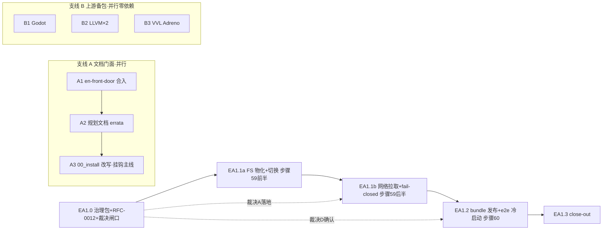

# EA1 执行计划 — 子里程碑分解

> 所属契约:[EA1_CONTRACT.md](EA1_CONTRACT.md)
> 版本:v1.0(2026-07-16)
> 粒度依据:11 §7(小里程碑两级结构);本计划是工作分解,验收以契约 §4 为准,本文不重定义成功。
> agent 裁决(契约 §7 v1.0):主线 EA1.0→EA1.1a→EA1.1b→EA1.2→EA1.3 串行;支线 A(文档门面)/ 支线 B(上游备包)全程并行,A3(00_install 改写)尾部挂钩主线。**裁决等待面(诚实口径)**:裁决 A gate EA1.1b、裁决 B 定 EA1.1a 切换机制、裁决 D 确认 EA1.2 发布面;RFC-0012 翻 Approved 与裁决落地同 PR(OWNER_DECISION_PACKAGE §3)——「零空转」仅指支线 A/B 与 EA1.0 起草,**EA1.1a 实质待 RFC Approved(即待裁决落地)**。
> **定位口径**:把「外部人装得上」做成 measured 工程事实;分发安全包络 fail-closed 是正面考试,范围蔓延(R-603)显式防守(单端点/无镜像/无自更新,超界登 RD-033+)。

---

## 0. 总览与依赖

| 子里程碑 | 时长(估) | 交付物映射 | 阻塞关系 / gating |
|---|---|---|---|
| EA1.0 | ~1 周 | D-EA1-1(治理包 + RFC-0012 Draft→Approved) | **EA1 入口**;RFC Draft 与治理包同轮起草;裁决 A~D 经 OWNER_DECISION_PACKAGE 呈 owner,落地小 PR 回填(§7/RFC §9/RD-025 history)+ RFC 翻 Approved |
| EA1.1a | ~1–1.5 周 | D-EA1-2(FS 物化 + 切换 + 步骤 59 前半) | 依赖 RFC-0012 Approved(其翻 Approved 与裁决落地同 PR);不被裁决 A 单独 gate(本地面零网络),切换机制任务按裁决 B;条款前段 + 快照重 bless 同 PR;**关键路径** |
| EA1.1b | ~1 周 | D-EA1-3(网络拉取 + hermetic 红绿) | 依赖 EA1.1a + **裁决 A 落地**;条款后段;pr-smoke 零真实外呼 |
| EA1.2 | ~1–1.5 周 | D-EA1-4(bundle 发布 + 演练)+ D-EA1-5(冷启动 evidence) | 依赖 EA1.1b + 裁决 D;首次演练 workflow_dispatch;真端点 e2e 两段式计时(裁决 C 口径) |
| EA1.3 | ~2–3 天 | close-out 终审 | 依赖 EA1.2 + 支线收口;契约翻 closed + 基准 mb1-closed→ea1-closed + tag + RD/SG 处置(agent 自主签署) |
| 支线 A | W1–W5 并行 | D-EA1-6 / D-EA1-7 | A1 零依赖;A2 建议后于治理包合入(勘误可引 EA1 立项);A3 gated on EA1.1/1.2 能力就位(文档不先于能力) |
| 支线 B | W1–W4 并行 | D-EA1-8 | 零依赖;B3 独立 MRP 若需真机而设备不可得则标 pending 不伪造 |

时长为 `estimated`,仅作排程参考,不构成验收承诺。子里程碑不另立 contract(单 EA1 阶段契约)。

**关键依赖洞察**:EA1.1b 的 CI 红绿**必须走 hermetic 本地 HTTP fixture**而非真端点——真 GitHub Release 上的 3 组件 bundle 资产要到 EA1.2 才存在,且 pr-smoke 不应依赖外网;真端点闭环留给 EA1.2 的 e2e(资产先经演练发布→rurixup 真拉取→计时取证),依赖环自然解开。

## 1. EA1.0 — 治理包 + RFC-0012 + 裁决闸口(D-EA1-1,入口)

| # | 任务 | 验证方式 / gating |
|---|---|---|
| 1 | 治理包五件(本计划所属契约四件套 + OWNER_DECISION_PACKAGE)+ deferred.json RD-025 承接(v1.56)落 PR;13/spike_gating/00-14/spec 全 pristine | host 门全绿(guardrails mb1-closed / trace 209/209 / schemas / budget 空态 / structure);零 CI 代码改动 |
| 2 | rfcs/0012-toolchain-real-distribution.md **Draft**(四级信任链/FS 物化布局/切换机制/失败模式表/发布侧/测试三缝/§9 裁决清单——A~D 标 owner-pending,其余 agent 拟裁)+ rfcs/README 台账行 | RFC 合入 Draft 态;失败测试先行声明成立(步骤 59/60 脚本与真实 IO 代码在 main 上不存在 = RED) |
| 3 | 裁决表 A~D 呈 owner(会话内)→ 裁决落地小 PR:OWNER_DECISION_PACKAGE §0 勾选留痕 + 契约 §7 追加裁决行 + RFC-0012 §9 回填 + RFC 状态 Draft→**Approved** + RD-025 history 追加;**零 13 号文档/spike_gating 改动** | 裁决 A 落地 = EA1.1b 解锁钥匙;裁决 D = EA1.2 发布面确认 |

**出口判据**:治理包 + RFC-0012 Approved 合入 main;裁决 A~D 留痕闭环。

## 2. EA1.1a — 真实 FS 物化 + 活跃版本切换(D-EA1-2,关键路径,不等裁决)

单 PR 栈式 commit(条款在前;条款/实现/重 bless/步骤 59 前半不可分 PR,步骤 49 硬红):

| # | 任务 | 验证方式 / gating |
|---|---|---|
| 1 | **spec 条款先行**:spec/release.md 延伸(G1.5 先例)落 RXS-0214(真实 FS 物化与原子落盘:版本目录仅经「staging 全量校验→同卷单次 rename」诞生;tree_digest 双向复算不变量;失败零半装)/ RXS-0215(活跃版本切换语义,机制按裁决 B——拟 shim:argv0 干名转发 default 版同名 exe,退出码透传;切换 = 确定性注册表单写);spec/README §4/§5 同步 + §3 过期号修正(7021→7023) | 每条 ≥1 `//@ spec:` 锚定同 PR;trace 209→211;stable 快照同 PR 重 bless + bless_log |
| 2 | src/rurixup 扩展:install.rs atomic_install 内核接真实磁盘(staging 目录 + 逐文件 sha256 + manifest 派生 tree_digest 判据 + 同卷 rename 提交);toolchain.rs 注册表 schema v2(+install_path/tree_digest;v1 条目读入标 registered-only 兼容);物化布局 `RURIX_HOME`(默认 `%USERPROFILE%\.rurix`)/toolchains/<ver>/{bin,lib,manifests};组件名→相对路径映射规则(*.exe→bin/,*.lib→lib/,NvidiaRedist→nvidia/) | cargo test -p rurixup 既有回归网全绿 + 新单测(staging 校验失败回滚/断电孤儿清理/幂等重校验补注册) |
| 3 | 切换机制落地(裁决 B 拟 shim):`~\.rurix\bin\` shim 目录 + rurixup 按 argv0 分派;`rurixup setup --add-path` 显式 opt-in(默认只打印指令);**若裁决 B 落地为 junction,本任务与 RXS-0215 按 OWNER_DECISION_PACKAGE §1-B 备选路径改写并修订留痕** | 切换探针真跑(切换后 `rx` 干名指到目标版本,机制中立判据) |
| 4 | CI 步骤 59 前半:ci/rurixup_dist_smoke.py(纯离线 `--from-dir` 源)——物化→toolchains 内 exe 真跑探针→切换→红:篡改组件一字节→拒且零残留/切换指已删目录→诚实报错;内建 red_self_test;evidence schema + ea1.counter 登记与 evaluator 分支同 PR | 真实红绿 + run URL 归档 §8 |

**出口判据**:本地 bundle → install 真实物化 → 切换 → 探针经 shim 指到目标版本;步骤 59 前半红绿闭合;快照/trace/guardrails 全绿。

## 3. EA1.1b — 网络拉取 + 四级校验 fail-closed(D-EA1-3,gated 裁决 A)

| # | 任务 | 验证方式 / gating |
|---|---|---|
| 1 | **spec 条款后段**:RXS-0216(网络载体与端点约束:仅 curl.exe 固定参数集 https-only `--proto =https --proto-redir =https`;环回例外仅 `RURIXUP_TEST_ALLOW_LOOPBACK_HTTP=1`+127.0.0.1,缺省 fail-closed)/ RXS-0217(四级内容寻址信任链:repo 锚 channels/stable.json→channel 清单→bundle→组件,任一级失配拒装清 staging 零半装;无锚版本拒装) | 条款先行 + 锚定 + 重 bless 同 PR;trace 211→213 |
| 2 | 下载实现:curl.exe 子进程封装(spawn 失败/非零退出→工具层错误 + 手动下载指引);staging 下载→四级校验→复用 EA1.1a 物化路径;`--expect-digest` 手动信任根注入;机器 token 行 `RURIXUP_INSTALL_ERROR: kind=<integrity|network|io|usage>` | 零新 RX 码(工具层);零第三方依赖维持 |
| 3 | repo 信任根锚 `channels/stable.json`(确定性 JSON:releases[{version,channel_manifest_sha256,base_url}]+latest;首条目随 EA1.2 首次演练发布回填,本 PR 落 schema+解析) | 锚解析单测 + 无锚版本拒装 RED |
| 4 | CI 步骤 59 后半(hermetic):Python http.server 本地 fixture——完好资产全链绿;坏字节/坏哈希/截断/默认态非 https 四路 RED 各自独立见证;离线→诚实报错非 fake | pr-smoke 零真实外呼;真实红绿 + run URL |

**出口判据**:hermetic 全链 install 绿 + 四路 fail-closed RED;真端点闭环显式留给 EA1.2。

## 4. EA1.2 — bundle 发布延伸 + 冷启动 e2e(D-EA1-4 / D-EA1-5,gated 裁决 D)

| # | 任务 | 验证方式 / gating |
|---|---|---|
| 1 | release.yml 延伸(全部 hard-block 门之后):`cargo build --release -p rx -p rurixup` + crt-static rurix_rt_cabi 真发布件 → 自签(如实 selftest 标注)→ `rurixup release` 3 组件编排 → SHA256SUMS(字典序确定性)→ `gh release upload` → **回读自校验**(curl 下载逐资产 digest 复核,失配 job 红)→ 信任根登记流(生成 channels/stable.json 新条目 → 自动开 PR → owner 合并 = 人工门) | CI 步骤 60(离线面:打包确定性两次逐字节一致 + digest 闭环 + 3 组件完备缺件即红) |
| 2 | 首次发布演练:workflow_dispatch(非真 tag,防误发)全链真跑 → 演练资产 + 信任根 PR + run URL 归档 §8 | G-EA1-4;runner 真跑 |
| 3 | 冷启动 e2e 取证(裁决 C 口径,拟两段):A 段干净 Win11 VM(零预置)文档首命令→rx check 计时;B 段开发机干净用户账户 install→首 kernel device 真跑计时(样例 kernel 避 __nv_* 数学);evidence/ea1_install_e2e_*.json + schema + 带宽/环境画像 | G-EA1-6(measured_local,不进 CI 硬门);agent 真实下载逐件授权 |
| 4 | ea1.bench.cold_start_{vm_rxcheck_s,gpu_first_kernel_s} entries + evaluator 同 PR 回填 measured_local | py -3 ci/budget_eval.py |
| 5 | 支线 A3 挂钩:guide/00_install.md 改写为 rurixup install 路径(能力已就位) | 既有 doc/tutorial 冒烟门绿 |

**出口判据**:演练发布 + 回读自校验绿;两段式计时 evidence 落档;00_install 新路径可走通。

## 5. EA1.3 — close-out(agent 自主签署)

| # | 任务 | 验证方式 |
|---|---|---|
| 1 | 全量回归冻结:cargo test/clippy/fmt + trace + budget --strict(零 estimated)+ stable_snapshot --check + bilingual + guardrails 真实输出 | 全绿原文追加契约 §8 |
| 2 | close-out 终审:G-EA1-1~8 留痕指针表 + RD-025 处置(关闭或收窄余项另立 RD-033+)+ SG 复评(SG-007 维持 not_triggered 留痕裁决 A 论证;SG-010 留续号)+ 支线 A/B 收口核 + nightly 契约外轨道成果留痕(若有) | 契约 §8 追加 |
| 3 | 签署兑现:契约 status active→closed;check_guardrails 基准 mb1-closed→ea1-closed;推 annotated ea1-closed tag(不匹配 release.yml 触发器);双基准 advisory 复核 | agent 签署留痕(MS1/MB1 先例) |

**出口判据**:EA1 期验收达成;close-out 终审完成。

## 6. 支线 A — 文档门面(D-EA1-6 / D-EA1-7,W1–W5 并行)

| # | 任务 | 验证方式 / gating |
|---|---|---|
| A1 | docs/en-front-door 合入:push 本地 tip → merge main → 追加状态刷新 commit(OVERVIEW.en/README.en 过期表述 g2-closed→现状)+ 中文 README 语言切换头 → PR | 逐文件 LF 核对;互链可达;W1 即可,零依赖 |
| A2 | 规划文档状态勘误(00/11/12/13):以 fc0ace57 为底稿**手工重放**(底稿所在 GRX 分支上 00/11/13 为 CRLF 且内容分叉——禁 cherry-pick,须逐段手工对齐保 main 侧行尾;12 为 LF 可干净套用)+ 刷新至 mb1-closed 现状(底稿目标态「MVP+G1+G2 收官」已过期三轮:v1/ms1/mb1);独立 errata PR,check_planning_docs 预期红 | 00 §6.3 先例(PR #140);建议后于治理包合入 |
| A3 | guide/00_install.md 改写为 rurixup 路径 | gated on EA1.1/1.2(文档不先于能力),归 EA1.2 表内 |

## 7. 支线 B — 上游报告三连备包(D-EA1-8,W1–W4 并行,零依赖)

| # | 任务 | 验证方式 / gating |
|---|---|---|
| B1 | godot-buffer-clear:自 origin/codex/grx-godot-dxil-workspace 的 spike/godot-rurix/upstream-repro/ 摘取 ISSUE_DRAFT.md + MRP 工程重放为 main 新文件(git show 提取,不合分支);`<FILL>` 占位(stock build hash/系统串/旧 stable 复现)实测补齐清零 | evidence/upstream-reports/godot-buffer-clear/;DRAFT 标头 |
| B2 | llvm-dxcontainer-psv0:依 evidence/dxil_path_spike_report_round7/8.md 两定罪证据 + 14 行 PoC patch 整理为 LLVM issue 草稿(PSV0 写出器 + 空签名两包各一) | evidence/upstream-reports/llvm-dxcontainer-psv0/;DRAFT 标头 |
| B3 | vvl-adreno-sigsegv:依 evidence/mb1-android-ondevice/round1_halt_excerpt.md 整理 Khronos VVL issue 草稿;独立最小复现(不依赖本项目喂损坏 SPIR-V)需真机(HONOR BKQ-AN10)——设备可得则遵工具件不入库补 MRP,不可得则该子项标 pending 不伪造 | evidence/upstream-reports/vvl-adreno-sigsegv/;DRAFT 标头 |

**纪律**:全部文件显式 `DRAFT — do NOT file` 标头;`<FILL>` 清零仍不提报;提报动作 owner 亲自。

## 8. 契约外并行观察(信息性,非规范性)

- **nightly 根治**(owner 2026-07-16 裁定契约外轨道):病灶 = bench/(40 处仅 1 处带 timeout)与 ci/(66 处仅 3 处)的 subprocess 无 timeout → 僵尸 exe 内核态锁 runner(2026-06-14 起非绿)。若本期动手:统一带超时+杀树+隔离的子进程包装模块 + nightly/pr-smoke concurrency 隔离;走常规 PR 纪律(真实红绿),成果 close-out §8 附带留痕。诚实边界:僵尸 exe 用户态只能自动隔离不能真杀;根治后首批运行可能爆一个月堆积的真实回归,预留清账缓冲。
- **7-21 TRAE 初赛公示**:晋级则复赛材料需求被激活(showcase/grx-demo 处置随之,owner 另裁)。
- **上游 MRP 时效**:上游版本漂移会使复现失效,备包完成后提报节奏归 owner。

## 9. 风险提示(引用,不另建登记)

- **安全包络范围蔓延(R-603)**:镜像/代理/多 channel/断点续传/自更新全部显式 out_of_scope,超界登 RD-033+ 再议,RFC-0012 §9 锁边界。
- **「十分钟」带宽波动**:e2e 计时含下载,坚决不进 CI 硬门;evidence 带宽画像归档;口径争议前置到裁决 C。
- **VM 无 GPU 直通**:两段式口径的存在理由;B 段外部前置(LLVM/VS/驱动)文档化不计时,README/RFC 显著位诚实标注。
- **shim 自递归/占用**:spawn 目标恒在 toolchains/ 下防自递归;自更新换 shim 文件问题显式 defer(RD-033+)。
- **信任根发布时序**:digest 构建后才可知 → 锚经 PR 门控入库,合并前新版本处于「已发布未登记」过渡窗,rurixup 对无锚版本拒装,文档写明。
- **发布演练防误发**:首次走 workflow_dispatch;gpu runner 与 pr-smoke 串行,打包耗时计入 timeout 预算。
- **LF/CRLF(全期)**:新文件 LF+尾换行;规划文档勘误重放保原行尾字节;禁 Python 文本模式写文件,逐文件核 CR+尾字节(g2.2/mb1 教训)。
- **既有 rurixup 语义回归**:RXS-0187/0188 纯确定性注册表语义只增不破坏;`--from-dir` 本地路径保留为一等公民(离线场景 + 测试主缝)。

## 10. 修订记录

| 版本 | 日期 | 变更 |
|---|---|---|
| v1.0 | 2026-07-16 | 初版(EA1 契约配套;主线 EA1.0~EA1.3 + A/B 并行支线分解 + 依赖图;裁决 A gate EA1.1b、裁决 B 定切换机制、裁决 D gate EA1.2 发布确认,支线 A/B 与 EA1.0 起草零空转;步骤 59/60 计划项随实现 PR 回填 workflow;冷启动 evidence 面不进 CI 硬门;nightly 契约外并行观察小节;deferred 承接 RD-025 → EA1 兑现对象) |
