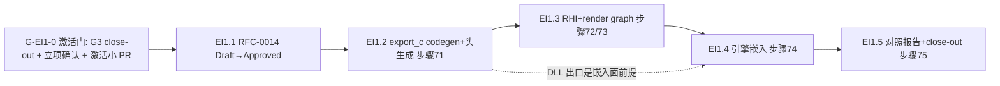

# EI1 执行计划 — 子里程碑分解(gated)

> 所属契约:[EI1_CONTRACT.md](EI1_CONTRACT.md)(**gated**:激活 gated on G3 close-out + owner 立项确认,契约 §0/G-EI1-0)
> 版本:v1.0(2026-07-18)
> 粒度依据:11 §7(小里程碑两级结构);本计划是工作分解,验收以契约 §4 为准,本文不重定义成功。
> **gated 口径**:本文全部子里程碑(EI1.1~EI1.5)为**激活后**执行序;gated 期唯一动作 = 等待 G3 close-out + owner 立项确认 → 激活小 PR(D-EI1-2)。编号(RFC-0014 / RXS-0250~0269 / 步骤 71~75)为 earmark(G3_CONTRACT §7 v1.1),激活时以届时台账实际为准复核兑现,本文引用均按 earmark 读。
> **定位口径**:把「.rx 写 RHI、export(c) 导出、C++ 工程嵌入真跑、不变量对照报告」做成 measured 工程事实;`#[export(c)]` 是最高风险面(FFI ABI codegen,硬规则 5)先行推进,RHI 语义面 in-EXE 可测与 FFI 面解耦。

---

## 0. 总览与依赖

| 子里程碑 | 时长(估,激活后起算) | 交付物映射 | 阻塞关系 / gating |
|---|---|---|---|
| (激活) | — | D-EI1-2(激活小 PR:status 翻转 + RD-009 承接 + ledger 登记 + earmark 复核) | **G-EI1-0**:G3 close-out + owner 立项确认;gated 期零动作 |
| EI1.1 | ~3–5 天 | D-EI1-3 前半(RFC-0014 Draft→对抗性评审→Approved) | 依赖激活;RFC Approved 先于任何实现 PR(失败测试先行:步骤 71~75 脚本与 export(c)/RHI 代码在 RFC 合入时点 main 不存在 = RED) |
| EI1.2 | ~1.5–2 周 | D-EI1-3 后半(export(c) 导出表 + `--emit=dll` + 内建头生成 + 条款 RXS-0250 段前段 + 步骤 71) | 依赖 RFC-0014 Approved;**关键路径 + 本期最重单段**(条款/实现/conformance/快照重 bless/步骤 71 不可分 PR);首 commit 建议最小 dll 通道 spike 取证(隔离 spike/,取证后弃) |
| EI1.3 | ~1.5 周 | D-EI1-4(apps/uc05-rhi 全 .rx + reject 矩阵 + 步骤 72/73) | 依赖 EI1.2(条款序);RHI/graph 语义 in-EXE 可测,不被 DLL 边界阻塞;kernel 保持简单核(RD-027 毒径警示,G3.1 归因结论届时并读) |
| EI1.4 | ~1 周 | D-EI1-5(rurix_rhi.dll 嵌入 engine_host v2 + 步骤 74) | 依赖 EI1.2(DLL 出口)+ EI1.3(RHI 面);G1.3 harness 母本升级,既有资产 0-byte |
| EI1.5 | ~3–5 天 | D-EI1-6(对照报告 + bench 回填 + 步骤 75 + close-out) | 依赖 EI1.3/EI1.4;close-out 终审 agent 自主签署 |

时长为 `estimated`,仅作排程参考,不构成验收承诺;gated 期不计时。子里程碑不另立 contract(单 EI1 阶段契约)。

**双轨共享面纪律**:gated 期本包对共享面(registry/deferred.json、registry/number_ledger.json、rfcs/README §5、spec/README、registry/error_codes.json)全 0-byte;激活后共享面动作(RD-009 承接/ledger 登记/RFC 台账)集中在激活小 PR 与各实现 PR,RD-/U-/RX- 码按 main 合并序取号。G3 earmark(RFC-0013 / RXS-0220~0249 / 步骤 61~70)对 EI1 一切 PR 为跳号红线。与 EA1 收口轨道互不阻塞:EI1 对 milestones/ea1/** 0-byte。

**关键依赖洞察**:.rx 代码今天没有任何 DLL 出口(rurixc host 只产 EXE;手写 `extern "C"` 回退仅对 Rust crate 有效)——「RHI 先行手写 ABI、export(c) 后替换」在本仓不成立,故 **export(c) 先行**;它同时是最高风险面(硬规则 5),先做先暴露。RHI 核(EI1.3)设计为 in-EXE 可测,语义面与 FFI 面解耦推进。

## 1. EI1.1 — RFC-0014(D-EI1-3 前半,激活后入口)

| # | 任务 | 验证方式 / gating |
|---|---|---|
| 1 | rfcs/0014-export-c-minimal-rhi.md **Draft**(Part A:`#[export(c)]` 属性语义/C 兼容签名子集 v1(标量+裸指针+unit,struct 按值不进首期)/保名与导出表/`--emit=dll` 通道(免 main,link.exe /DLL + import lib)/内建头生成确定性与单一事实源/RXS-0149 守卫共存判据/跨 ABI 运行期契约(不展开 unwind、panic 确定性终止、无 UB 措辞 10 §7.5);Part B:RHI 四件薄映射 std::gpu/graph 编译期有界/1-submit typestate(镜像 RXS-0197)/I1~I10 不变量矩阵/全 .rx 主语言判据/对照报告协议(documented_historical)/采纳判据 <5s 双口径;§8 不做:repr(C) struct 按值/回调指针/ABI 稳定承诺/Record derive/pyd 联动;§9 裁决清单——预记录 Q-A~Q-D(契约 §7 ⑦)激活确认后直接回填)+ rfcs/README §5 台账行 | RFC PR 独立合入 Draft 态 |
| 2 | 对抗性评审(D-409:评审 provenance ≠ 起草 provenance)→ §9.1 评审记录回填 → Draft→**Approved**(先于任何实现 PR) | G-EI1-1 前置兑现 |

**出口判据**:RFC-0014 Approved 合入 main;失败测试先行声明成立。

## 2. EI1.2 — `#[export(c)]` 接通(D-EI1-3 后半,关键路径,兑现 RD-009)

单 PR 栈式 commit(条款在前;条款/实现/conformance/重 bless/步骤 71 不可分 PR,步骤 49 硬红):

| # | 任务 | 验证方式 / gating |
|---|---|---|
| 1 | **spec 条款先行**:新文件 spec/export_c.md 落 RXS-0250(属性语法与合法性:仅 host `pub fn`,device/kernel 拒,沿 coloring)/ RXS-0251(C 兼容签名子集 v1 与类型映射;`name=` 覆写)/ RXS-0252(导出符号表与 cdylib 产物:保名不 mangle + dllexport + import lib)/ RXS-0253(内建头文件生成:确定性 LF 无时间戳、两次逐字节一致、单一事实源 = typeck C 映射)/ RXS-0254(头↔ABI 守卫共存判据:手写路 RXS-0149 冻结覆盖 Rust crate 出口,生成路 CI 再生成逐字节比对覆盖 .rx 出口)/ RXS-0255(跨 ABI 运行期契约);spec/README §4/§5 同步 | 每条 ≥1 `//@ spec:` 锚定同 PR;trace 全锚定维持;stable 快照同 PR 重 bless + bless_log |
| 2 | rurixc 前端:attr 规范化校验(parser 桩转正)+ resolve/typeck 导出检查(签名子集 v1 违例 → 编译期拒,新 RX 码;导出名冲突 → 编译期拒)+ hir/mir 导出标记与保名 | conformance/export_c accept/reject 语料 + UI golden;新 RX 码 en/zh 成对 |
| 3 | rurixc 后端/driver:导出 define 携 dllexport(LLVM 文本 IR)+ `--emit=dll` 通道(免 main、link.exe `/DLL` + import lib、空导出集/链接失败诊断)+ `rx build` 透传 | .rx fixture → DLL + import lib 产出;首 commit 前最小 spike 取证 dll 链路(隔离 spike/,弃) |
| 4 | 内建头文件生成器(D-113/P-11 cbindgen 内置化):从导出集确定性产 `<out>.h`;幂等判据(两次逐字节一致) | 生成头被步骤 71 C 宿主直接 include 编译 |
| 5 | CI 步骤 71:ci/export_c_smoke.py——.rx→dll+头→cl.exe 编译链接 C 调用方→device 真跑数值对照(RURIX_REQUIRE_REAL);RED 三路(坏签名拒/篡改头 byte-diff 红/名冲突拒)+ 内建 red_self_test;evidence json + ei1.counter 登记与 evaluator 分支同 PR | 真实红绿 + run URL 归档契约 §8 |

**出口判据**:.rx 单源 → `--emit=dll` → DLL + import lib + 生成头 → C 宿主真跑;RD-009 兑现主体完成;步骤 71 红绿闭合。

## 3. EI1.3 — UC-05 最小 RHI + render graph 核心(D-EI1-4)

| # | 任务 | 验证方式 / gating |
|---|---|---|
| 1 | **spec 条款先行**:新文件 spec/rhi.md 落 RXS-0256(RHI 类型面与 brand:Rhi/Queue/Res/Pass 薄映射 std::gpu lang items)/ RXS-0257(pass 声明与资源访问集 read/write)/ RXS-0258(graph 构建与依赖推导:写后读/写后写建序,依赖环构建期确定性拒绝——库层状态值零新 RX 码)/ RXS-0259(资源生命周期 affine 拦截判据 I1~I3)/ RXS-0260(submit typestate:Graph→Submitted 消费式转移,1-submit,镜像 RXS-0197)/ RXS-0261(执行语义:顺序调度 + 显式 sync + RXS-0193 诊断封口)/ RXS-0262(transient 资源图内生命周期) | 条款先行 + 锚定 + 重 bless 同 PR |
| 2 | apps/uc05-rhi 全 .rx 包(rurix.toml 声明式,镜像 ruridrop 形态;in-package mod 组织——RD-026 无跨包依赖;graph 容量编译期有界 const 泛型定长;kernel = saxpy/scale/reduce 级简单核) | 零 .rs 审计;硬缺口登记 RD 判档,不静默降级 .rs |
| 3 | in-EXE demo:graph ≥3 pass device 真跑数值对照 + 同机两跑逐字节确定 | RURIX_REQUIRE_REAL;CI 步骤 72(ci/uc05_rhi_smoke.py,桩化→数值红) |
| 4 | 不变量 reject 语料矩阵:conformance/uc05/reject/*,I1~I8 每条 ≥1 语料 + 期望诊断断言 | CI 步骤 73(ci/uc05_invariant_gate.py,漏拦即红) |

**出口判据**:全 .rx RHI/graph 库 in-EXE 端到端绿;I1~I8 编译期/构建期拦截闭合;步骤 72/73 红绿闭合。

## 4. EI1.4 — 引擎嵌入(D-EI1-5,UC-05「嵌入 C++ 工程」判据)

| # | 任务 | 验证方式 / gating |
|---|---|---|
| 1 | apps/uc05-rhi 导出面:`#[export(c)]` 导出 RHI 入口 → `rurix_rhi.dll` + 编译器生成头(自始生成,不手写) | 生成头 CI 再生成逐字节比对 |
| 2 | engine_host v2:升级 G1.3 `src/rurix-engine/harness/engine_host.cpp` 模式为新 harness(C++/D3D12 驱动方 + LUID 匹配),链接 rurix_rhi.dll 执行 ≥1 个 graph compute pass 数值对照;G1.3 既有三符号面/手写头/RXS-0149 守卫 0-byte | CI 步骤 74(ci/uc05_engine_embed_smoke.py,host 段 + device 段,步骤 43 结构先例;RURIX_REQUIRE_REAL) |

**出口判据**:C++/D3D12 宿主链接 export(c) 产 DLL 真跑绿;步骤 74 红绿闭合。

## 5. EI1.5 — 对照报告 + 采纳判据 + close-out(D-EI1-6,agent 自主签署)

| # | 任务 | 验证方式 / gating |
|---|---|---|
| 1 | **spec 条款先行**:spec/rhi.md 续落 RXS-0263(不变量矩阵与 100% 拦截判据,镜像 RXS-0134/0148 体例)/ RXS-0264(对照报告证据形态:md+json schema + documented_historical 口径)/ RXS-0265(采纳判据操作化:C ABI 成熟 = export(c) 端到端 + 增量 check <5s 双口径测量) | RXS-0266~0269 预留不落裸条款头,close-out 作废声明留痕 |
| 2 | evidence/uc05_invariant_matrix.json(逐不变量:机制条款号/reject 语料路径/期望诊断/CI 结果/证据级/Python 侧引文 文件:行号)+ milestones/ei1/uc05_invariant_matrix_schema.json 入 check_schemas + evidence/uc05_comparison_report.md(叙事面,纸面对照口径显式声明) | CI 步骤 75(ci/uc05_report_check.py:schema + md↔json↔语料一致性互查) |
| 3 | ei1.bench.uc05_check_cold_ms(apps/uc05-rhi 全包 `--emit=check` 冷检,BENCH_PROTOCOL 三次 trimmed mean)+ uc05_check_warm_ms(tooling-server didChange→publishDiagnostics,bench/lsp_bench.py 机制)回填 measured_local,阈 5000ms | py -3 ci/budget_eval.py;evidence 面不进 CI 硬门 |
| 4 | close-out 终审:全量回归冻结(cargo test/trace/snapshot/bilingual/guardrails 真实输出追加 §8)+ G-EI1-0~6 留痕指针表 + RD-009 处置(关闭或收窄余项另立 RD)+ SG 复评 + status active→closed + 基准切换按 main 合并序串行化 + annotated ei1-closed tag | budget_eval --strict 零 estimated;agent 签署留痕(MS1/MB1 先例) |

**出口判据**:EI1 期验收达成;close-out 终审完成。

## 6. 风险提示(引用,不另建登记)

- **R0 gated 期风险**:G3 全量推到底为重载期,EI1 激活时点不可预估;earmark 由 G3_CONTRACT §7 v1.1 + number_ledger 固化,激活时以届时台账复核(不应漂移,漂移即 surface owner)。
- **R1 `--emit=dll` 通道未知数**:免 main 的 host 编译路径、link.exe /DLL + import lib、CRT(/MT libcmt 现状)属常规但未在本仓验证——EI1.2 首 commit 先做最小 spike(隔离 spike/,取证后弃)。
- **R2 全 .rx 语言坑**(RD-026 + ruridrop 实证):无堆集合/无 Result 错误面/无字符串/无元组/无跨包依赖——对策已入设计(graph 容量静态化/库层 i32 状态/putchar 机器 token);最大残余风险 = API 人体工学弱化 demo 说服力;防降级 guardrail:硬缺口登记 RD 判档,不静默换 .rs。
- **R3 对照物缺失**:上一项目 Python 代码与 H01~H07 交接档不在仓库(已核实)——报告 = 纸面不变量对照 + 规划文档引文行号(documented_historical),显式声明不可复跑 A/B;owner 若补档作 annex,列 open 项不阻塞。
- **R4 增量 check 口径**:rurixc 无跨会话增量(07 §9 现状)——<5s 以「冷全检 + tooling-server 热重查」双口径诚实定义;数值余量大(既有实测 check 6.9ms / LSP 10k 行 109ms),风险在口径非数值,RXS-0265 锁死。
- **R5 RD-027 毒径**:UC-05 kernel 保持编译期有界简单核,避开深弹射循环形态;激活时并读 G3.1 归因结论(若归因 toolchain 侧已修复,本条降级)。
- **R6 G3 期资产复用机会**:G3 render graph 面(RFC-0013 graph 章)与 UC-05 render graph 核心存在概念重叠——激活时复核:UC-05 侧维持「库面 + 对照报告」定位不与 G3 语言/运行时面重复造轮,可复用面如实引用。
- **LF/CRLF(全期)**:新文件 LF+尾换行;禁 Python 文本模式写文件,逐文件核 CR+尾字节(g2.2/mb1 教训)。

## 7. 修订记录

| 版本 | 日期 | 变更 |
|---|---|---|
| v1.0 | 2026-07-18 | 初版(EI1 gated 契约配套;激活门 G-EI1-0 前置 + 激活后 EI1.1~EI1.5 串行分解 + 依赖图;export(c) 先行裁定与理由(.rx 无 DLL 出口 + 最高风险面先暴露);编号全按 earmark 读(RFC-0014/RXS-0250~0269/步骤 71~75,G3_CONTRACT §7 v1.1);RXS 区间分配草案(0250~0255 export_c / 0256~0262 rhi+graph / 0263~0265 报告判据 / 0266~0269 预留);对照报告 documented_historical 口径;R0 gated 风险与 R6 G3 资产复用机会) |
