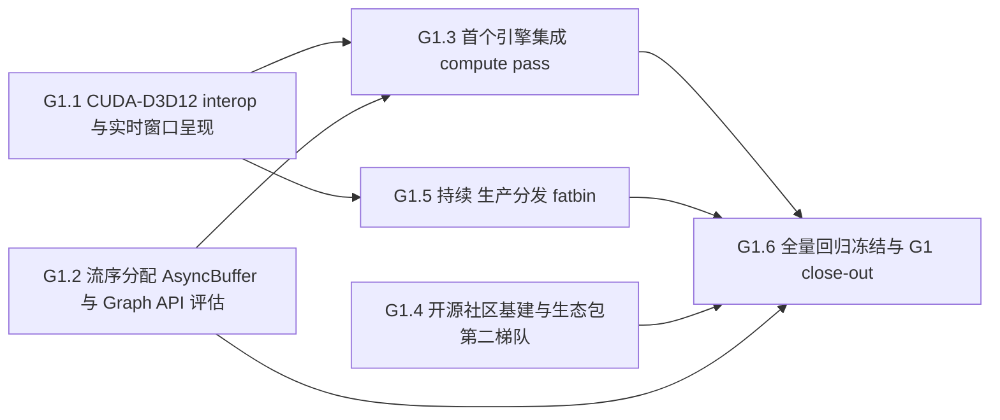

# G1 执行计划 — 子里程碑分解

> 所属契约:[G1_CONTRACT.md](G1_CONTRACT.md)
> 版本:v1.0(2026-06-18)
> 粒度依据:11 §7(1–2 周小里程碑 + 6–10 周阶段两级结构);本计划是工作分解,验收以契约 §4 为准,本文不重定义成功。
> agent 裁决(契约 §7 v1.0):粒度 = 单 G1 阶段契约;首子里程碑 = G1.1 CUDA–D3D12 interop(先 interop 出图,社区基建后置,D-005 默认)。

---

## 0. 总览与依赖

| 小里程碑 | 时长(估) | 交付物映射 | 阻塞关系 |
|---|---|---|---|
| G1.1 | ~3–4 周 | D-G1-1(CUDA–D3D12 interop:ExternalBuffer/ExternalSemaphore 类型化 + 软光栅 demo 升级实时窗口呈现)+ D-G1-6 子项(spec 互操作呈现条款 RXS-0140 续号) | 依赖 M7 G0 软光栅 kernel + M4 device codegen / 运行时;**G1 入口,先做** |
| G1.2 | ~3–4 周 | D-G1-2(流序分配 AsyncBuffer<'stream,T> 类型契约 + Compute Sanitizer 回归 + Graph API 评估 spike report) | 依赖 M4 运行时 Context/Stream/Buffer + M5 安全并行面 / Sanitizer nightly;与 G1.1 可并行 |
| G1.3 | ~3–4 周 | D-G1-3(首个引擎集成:Rurix DLL C ABI 嵌入 C++/D3D12 框架承担 compute pass) | 依赖 G1.1(interop 呈现通路)+ G1.2(流序分配)+ M8 C ABI/FFI 面 |
| G1.4 | ~2–3 周 | D-G1-4(开源社区基建:贡献指南/FCP-lite/外部 RFC 通道 + 生态包第二梯队 geometry 评估) | 依赖仓库 public(已就位)+ M8 CONTRIBUTING/治理面;与 G1.1~G1.3 可并行 |
| G1.5(持续) | 跨期 | D-G1-5(生产分发 fatbin:按架构预编 cubin + PTX fallback + manifest/lockfile [[artifact]] + rurixup 覆盖) | 依赖 M8 发布链路 + M6 包管理;G1.1 出图后启动构建矩阵维护 |
| G1.6 | ~1–2 周 | 全量 conformance/UI/基准回归冻结 + G1 验收 close-out | 依赖 G1.1~G1.5 就位;agent 自主签署关闭 |

时长为 `estimated`(M0~M8 实际节奏可作弱参考),仅作排程参考,不构成验收承诺。子里程碑不另立 contract(单 G1 阶段契约,契约 §7 v1.0);各 g1.x 落地时回填 CI 步骤实测命令与 run URL。

## 1. G1.1 — CUDA–D3D12 interop 与实时窗口呈现（~3–4 周，G-G1-1）

| # | 任务 | 验证方式 |
|---|---|---|
| 1 | spec 条款先行:**新建 spec 互操作呈现语义面**(`ExternalBuffer`/`ExternalSemaphore` affine 类型:import 句柄生命周期 + 信号时序类型化语义 / D3D12 共享堆映射约定 / present 同步序)入 spec(RXS-0140 续号,FLS 体例)——**条款 PR 先于实现 PR**;每条款 ≥1 测试锚定随实现 PR 同落,trace_matrix 维持全锚定 | spec 档位标记 guardrail + 修订行 + `trace_matrix --check` PASS |
| 2 | `ExternalBuffer`/`ExternalSemaphore` affine 类型 + 运行时 `cuImportExternalMemory`/`cuImportExternalSemaphore` 绑定(rurix-rt 扩展;Driver API 薄层,D-230);D3D12 swapchain + 共享堆经薄 C FFI 创建(不进语言) | interop 冒烟(计划步骤 40,`g1.counter.d3d12_interop`) |
| 3 | 软光栅 demo 升级实时窗口呈现:G0 kernel(binning/raster/depth/tonemap,RXS-0118~0121 语义 0-byte)写 backbuffer 等价纹理 → 信号量同步 present;窗口实时刷新 | 实时呈现冒烟(计划步骤 41,`g1.counter.realtime_present`);**真实红绿**(篡改同步时序 → 红 → 复原绿) |
| 4 | 类型系统拦截:句柄生命周期 / 跨 context 误用 / 信号时序违例编译期拦截(conformance reject 类别 + UI golden);新段位错误码首批分配(interop 诊断)+ message-key(registry 只追加) | conformance reject 全拦截 + UI snapshot + `check_schemas.py` PASS |

**出口判据**:CUDA–D3D12 interop 实时窗口呈现端到端真跑(`g1.counter.d3d12_interop ≥1` + `g1.counter.realtime_present ≥1`);interop 错误类别编译期拦截;spec 互操作呈现条款锚定;G0 软光栅 kernel 语义 0-byte。

## 2. G1.2 — 流序分配 AsyncBuffer 与 Graph API 评估（~3–4 周，G-G1-2）

| # | 任务 | 验证方式 |
|---|---|---|
| 1 | spec 条款:流序分配语义面(`AsyncBuffer<'stream,T>` 三规则:分配未完成访问被 stream 序排除 / 释放后访问 = 编译期生命周期错误 / 跨 stream 经 `share_with(other,event)` 显式时序边)入 spec(RXS 续号,06 §5.4 条款化) | 同 G1.1 第 1 项 |
| 2 | 运行时流序分配器(`cuMemAllocAsync` + `CUmemoryPool`,D-232)+ `AsyncBuffer<'stream,T>` affine 类型 + borrow check 扩展(stream 序生命周期) | AsyncBuffer 流水线冒烟(计划步骤 42,`g1.counter.async_buffer_pipeline`) |
| 3 | 三类生命周期错误 100% 编译期拦截(分配/释放/跨 stream 未同步)+ device 路径纳入 Compute Sanitizer racecheck+memcheck nightly(CUDA.jl #780 事故类永久回归项) | conformance reject 全拦截 + UI golden + nightly Sanitizer 绿;**真实红绿**(放行混用违例 → 红 → 复原绿) |
| 4 | **Graph API 评估**(spike report):CUDA Graph 与流序分配交互 / CUB-Thrust 实现对标 / 立项决策树;立项与否裁决留痕,触发新扩张方向则登记 SG-### | spike report 文档 + (若立项)registry/spike_gating.json 追加 decisions |

**出口判据**:`AsyncBuffer<'stream,T>` 三规则编译期拦截(`g1.counter.async_buffer_pipeline ≥1`);Sanitizer nightly 绿;Graph API spike report 产出(立项与否留痕)。

## 3. G1.3 — 首个引擎集成（~3–4 周，G-G1-3，UC-05 前奏）

| # | 任务 | 验证方式 |
|---|---|---|
| 1 | spec 条款(按需):引擎集成 C ABI 边界语义面(若超出 M8 既有 C ABI/导出条款则补,复用 D-113 `#[export(c)]` + 内建头文件生成) | 同 G1.1 第 1 项(按需) |
| 2 | Rurix DLL(`#[export(c)]` C ABI + 内建头文件)嵌入现存 C++/D3D12 渲染框架:宿主框架调用 Rurix 编译产物承担 ≥1 个 compute pass | 引擎集成冒烟(计划步骤 43,`g1.counter.engine_integration`) |
| 3 | compute pass 端到端数值/呈现对照 + 采纳判据对照(02 §U5:C ABI FFI 成熟 + 增量 check <5s 可控) | 数值对照 + 增量 check 延迟实测;**真实红绿**(篡改 pass 结果 → 红 → 复原绿) |
| 4 | 引擎边界 unsafe-audit(C ABI 边界凡落 unsafe 须 `// SAFETY:` + 注册,safe wrapper 对上全 safe;新 crate 默认 `unsafe_code=deny`) | unsafe-audit 注册完整性扫描 |

**出口判据**:Rurix DLL 经 C ABI 嵌入 C++/D3D12 框架承担 compute pass 端到端真跑(`g1.counter.engine_integration ≥1`);采纳判据对照达标;UC-05 前奏就位。

## 4. G1.4 — 开源社区基建与生态包第二梯队（~2–3 周，G-G1-4）

| # | 任务 | 验证方式 |
|---|---|---|
| 1 | 贡献流程实体化:三档门自助判定表 + RFC 模板 + provenance/验证强制/条款号引用 CI 阻断(10 §7;CONTRIBUTING 延伸);仓库已 public(D-003/D-007) | 流程文件 + 至少一条走通的样例 RFC/贡献 |
| 2 | FCP-lite 机制(D-401/D-405:三人组实体化 + 6 周 train)文档化 + 首批外部 RFC 通道开放 | rfcs/ 通道文档 + FCP-lite 规程 |
| 3 | 生态包第二梯队评估:geometry 库评估/落地(09 §5,G0 后);cuDNN 留 Phase 2+(明确延后,留痕) | geometry 评估/落地证据;cuDNN 延后留痕 |

**出口判据**:开源社区基建落地(贡献流程 + FCP-lite + 外部 RFC 通道,至少一条走通样例);geometry 评估/落地证据;cuDNN 留 Phase 2+。

## 5. G1.5（持续）— 生产分发 fatbin（跨期，G-G1-5）

| # | 任务 | 验证方式 |
|---|---|---|
| 1 | spec 条款:分发产物语义面(cubin/fatbin 变体 / 按架构预编 + 保守 PTX fallback 装载协商 / [[artifact]] digest)入 spec(RXS 续号;延伸 spec/release.md PTX-only→fatbin) | 同 G1.1 第 1 项 |
| 2 | device codegen 分发:按架构预编 cubin(`ptxas`)+ 保守 PTX fallback(脱离 M8 PTX-only 开发期形态,D-207);rurix-rt 装载路径覆盖 fatbin | 分发冒烟(计划步骤 44);PTX/IR golden 纳入 cubin/fatbin 形态 |
| 3 | manifest/lockfile `[[artifact]]`(ptx/cubin/fatbin 变体 + digest,D-311)+ rurixup 发布链路覆盖 fatbin + 既有 Release 层签名/SBOM/NVIDIA 白名单审计延续 | lockfile [[artifact]] 校验 + Release 层绿 + check_redistribution |

**出口判据**:生产分发 fatbin 真分发(脱离 PTX-only);manifest/lockfile [[artifact]] digest;rurixup 覆盖 + Release 层延续;cubin/fatbin 形态纳入 golden + 白名单审计。

## 6. G1.6 — 全量回归冻结与 G1 close-out（~1–2 周）

| # | 任务 | 验证方式 |
|---|---|---|
| 1 | 全量 conformance/UI/基准回归冻结(conformance 全绿 + UI/MIR/PTX golden 全绿 + L1/L2/L3 基准无 Critical 回归,10 §6) | 全量回归 nightly 冻结跑绿 |
| 2 | 性能判据(如有)`measured_local` 回填;close-out `budget_eval --strict` 全局零 estimated 残留(不跨里程碑欠债,14 §3) | `budget_eval --strict` 通过 |
| 3 | G1 close-out 草拟:验收记录 + guardrail 输出 + G1.1~G1.5 端到端红绿 + Graph API spike report 结论 + RD-007/RD-008 处置留痕(追加契约 §8) | G-G1-1~G-G1-6 + guardrail 全过 |
| 4 | **agent 自主签署兑现**:契约 status active→closed;基准 m8-closed→g1-closed 切换 + `check_closed_contracts` 口径泛化纳入 G1_CONTRACT.md;`g1-closed` tag;RD-007/RD-008 状态翻转(agent 自主签署) | agent 签署留痕(对齐 M8 §8.2 先例) |

**出口判据**:G1 期验收达成;close-out 终审完成(关闭判定 / 基准切换 / `g1-closed` tag / deferred 翻转由 agent 自主签署)。

## 7. 风险提示（引用，不另建登记）

- **D3D12 external memory/semaphore 句柄生命周期与时序(G1.1)**:`cuImportExternalMemory`/`cuImportExternalSemaphore` 句柄跨 API 共享易引入悬垂 / present 时序竞争;对策:`ExternalBuffer`/`ExternalSemaphore` affine 类型 + 信号时序类型化条款(spec),import/signal 边界 unsafe 最小化 + `// SAFETY:` + 注册,interop 同步路径篡改红绿。
- **WDDM present 路径与窗口呈现现实(G1.1)**:WDDM/TDR/HAGS 下 D3D12 present 与 CUDA 互操作的驱动现实(06 §4.2 System scope G1+ 验证项);对策:环境画像随证据存档(D-233),实时呈现冒烟降级策略(无窗口/无显示环境 → SKIP exit 0,对齐 GPU 步骤降级先例)。
- **流序分配混用事故(G1.2)**:CUDA.jl #780 流序分配 use-after-free 事故类;对策:`AsyncBuffer<'stream,T>` 三规则编译期拦截 + Compute Sanitizer racecheck/memcheck 永久回归项(nightly 全跑),混用违例放行红绿。
- **引擎 C ABI 嵌入边界(G1.3)**:Rurix DLL 嵌入 C++/D3D12 宿主的 ABI/生命周期张力(渐进采纳,02 §U5);对策:C ABI 边界 crate 经裁决最小开 unsafe + 每块 `// SAFETY:` + unsafe-audit 注册,safe wrapper 对上全 safe,compute pass 数值对照 + 篡改红绿;增量 check <5s 采纳判据实测。
- **fatbin 分发构建矩阵维护(G1.5)**:按架构预编 cubin 引入 ptxas 版本绑定 + 分发包构建矩阵;对策:保守 PTX fallback 兜底前向兼容(D-207),manifest/lockfile [[artifact]] digest 锁定变体,NVIDIA 再分发白名单审计延续(cubin 产物经 Attachment A,r6)。
- **新决策面判档(全期)**:AsyncBuffer API 形态 / Graph API 立项 / G2 DXIL(D-131)/ 多后端(D-008)/ 引擎宿主选型 / 外部 RFC 流程 = G1 执行期新决策面;对策:对应 g1.x 带档位标记落笔,**agent 自主判档,判档争议向上取严**(10 §3),触及红线/UB/内存模型/FFI ABI/安全包络须 Full RFC(AGENTS 硬规则 5/8)。
- **const 泛型值运行期单态化(RD-007)的触发面**:G1 interop/引擎集成若触发数组长度类 const 泛型运行期单态化;非 G1 验收门,按需接通或继续留痕(RXS-0064 语义不变,回填仅补实现侧),遇硬需求按 14 §4 处置而非擅自跨层改造。
- **常驻回归网绿(全期)**:hello-world + SAXPY 冒烟 + MIR/borrowck/PTX golden + conformance + UI golden + cargo fmt/clippy/test + budget_eval(normal)是常驻回归网,每个 g1.x PR 必须保持绿;新增 interop/引擎/fatbin crate 默认 `unsafe_code=deny`。

## 8. 修订记录

| 版本 | 日期 | 变更 |
|---|---|---|
| v1.0 | 2026-06-18 | 初版(G1 契约配套;G1.1~G1.6 子里程碑分解 + 依赖图;CUDA–D3D12 interop 与实时呈现 / 流序分配 AsyncBuffer + Graph API 评估 / 首个引擎集成 / 开源社区基建 + 生态包第二梯队 / 持续 fatbin 分发 / 全量冻结与 close-out 排程;deferred 承接 RD-007 inherited + RD-008 open;CI 计划步骤 40+ 为 g1.x 计划项,落地时回填实测命令与 run URL;G1.1 为入口先做,agent 裁决 D-005 默认) |
