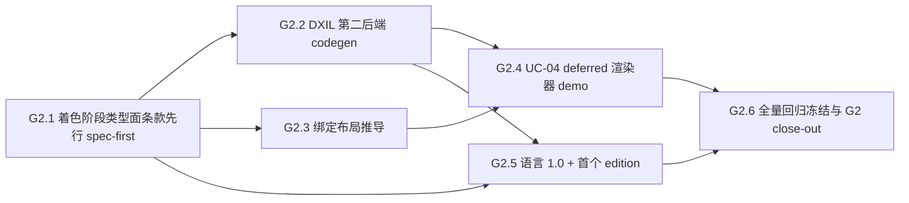

# G2 执行计划 — 子里程碑分解

> 所属契约:[G2_CONTRACT.md](G2_CONTRACT.md)
> 版本:v1.0(2026-06-23)
> 粒度依据:11 §7(1–2 周小里程碑 + 6–10 周阶段两级结构);本计划是工作分解,验收以契约 §4 为准,本文不重定义成功。
> agent 裁决(契约 §7 v1.0):粒度 = 单 G2 阶段契约;首子里程碑 = G2.1 着色阶段类型面条款先行(spec-first,规范先行硬规则 7);D-131 DXIL 路径本期 defer;红线 3 / registry 维持;延续 G1.4 RFC 流程。
> **脚手架口径**:各子里程碑实体面(着色阶段语法/类型系统、DXIL codegen、绑定推导、edition)均**触 Full RFC 面**,须经 agent 自主 Full RFC 前置后落地;本计划只登记分解 + gating + 出口判据,不实现、不解红线、不预判档。

---

## 0. 总览与依赖

| 小里程碑 | 时长(估) | 交付物映射 | 阻塞关系 / gating |
|---|---|---|---|
| G2.1 | ~4–6 周 | D-G2-1(着色阶段 vertex/fragment/mesh/task/RT 类型面条款先行)+ D-G2-6 子项(spec 着色阶段条款 RXS-0153 续号) | **G2 入口,先做**;依赖 G0/G1 device codegen 基座;**新语法/类型系统 → Full RFC 前置** |
| G2.2 | ~6–8 周 | D-G2-2(MIR→DXIL codegen 第二后端) | 依赖 G2.1 着色阶段语言面;**codegen 面 → Full RFC 前置 + D-131 生成路径裁决(本期 defer,届时按 LLVM DirectX 后端成熟度评估)** |
| G2.3 | ~4–6 周 | D-G2-3(descriptor / root signature 编译器推导,P-11) | 依赖 G2.1;**codegen 推导面 → Full RFC 前置**;与 G2.2 可部分并行 |
| G2.4 | ~4–6 周 | D-G2-4(UC-04 deferred 渲染器 demo 端到端出图) | 依赖 G2.1 + G2.2 + G2.3 就位;原生 D3D12 + DXIL 出图 |
| G2.5 | 跨期 | D-G2-5(语言 1.0:spec 全量条款化 + conformance 覆盖 + 首个 edition) | 依赖 G2.1~G2.2 语言面稳定;**edition/stabilization → Full RFC 面;RD-008 stable 快照冻结候选触发点** |
| G2.6 | ~2–3 周 | 全量 conformance/UI/golden/基准回归冻结 + G2 验收 close-out | 依赖 G2.1~G2.5 就位;agent 自主签署关闭 + 基准 g1-closed→g2-closed 切换 + g2-closed tag |

时长为 `estimated`(M0~G1 实际节奏可作弱参考),仅作排程参考,不构成验收承诺。子里程碑不另立 contract(单 G2 阶段契约,契约 §7 v1.0);各 g2.x 落地时回填 CI 步骤实测命令与 run URL。**子里程碑次序与粒度可在 G2 执行期按 agent 裁决细化(对应 D-### 留痕于契约 §8,本计划随之修订记录追加)。**

## 1. G2.1 — 着色阶段类型面条款先行（~4–6 周，G-G2-1，首子里程碑，spec-first）

| # | 任务 | 验证方式 / gating |
|---|---|---|
| 1 | **Full RFC 前置**:着色阶段进语言(vertex/fragment/mesh/task/RT 作为 kernel 着色扩展)的语法 + 类型系统形态经 agent 自主 Full RFC(新语法/类型系统,硬规则 5 / 10 §3);RFC 合入后才落条款与实现 | Full RFC + FCP-lite(延续 G1.4) |
| 2 | spec 条款先行:着色阶段语义面(着色阶段函数着色规则 / 阶段间接口类型 / 资源句柄类型化 / 纹理采样器参数化类型,06 §8.2)入 spec(RXS-0153 续号,FLS 体例)——**条款 PR 先于实现 PR**;每条款 ≥1 测试锚定随实现 PR 同落 | spec 档位标记 guardrail + 修订行 + `trace_matrix --check` 全锚定 |
| 3 | 类型系统拦截:着色阶段误用 / 阶段间接口不匹配 / 资源句柄违例编译期拦截(conformance reject 类别 + UI golden);新段位错误码首批分配(着色阶段诊断,RX7020 续号)+ message-key(registry 只追加) | conformance reject 全拦截 + UI snapshot + `check_schemas.py` PASS;**真实红绿**(放行类型违例 → 红 → 复原绿) |

**出口判据**:着色阶段类型面条款入 spec(RXS-0153 续号)+ 每条款 ≥1 测试锚定(`trace_matrix --check` 全锚定,沿用全局 `m1.counter.spec_clause_test_anchoring`,**不另立 g2 counter**);着色阶段误用编译期拦截;条款 PR 先于实现 PR。

## 2. G2.2 — DXIL 第二后端（~6–8 周，G-G2-2）

| # | 任务 | 验证方式 / gating |
|---|---|---|
| 1 | **Full RFC 前置 + D-131 裁决**:MIR→DXIL codegen 第二后端经 agent 自主 Full RFC(codegen 面,硬规则 5);**D-131 生成路径(LLVM DirectX 后端 vs SPIR-V→DXIL 转译)按当时后端成熟度裁决**(13 §D-131,本期 defer) | Full RFC + D-131 agent 裁决留痕(契约 §8) |
| 2 | spec 条款:DXIL 分发 / codegen 目标语义面入 spec(RXS 续号;延伸 07 §7 device codegen 分发,PTX→DXIL 边界) | 同 G2.1 第 2 项 |
| 3 | rurixc/rurix-rt DXIL codegen + 装载路径;DXIL 文本 golden + bless 机制(新增 tests/dxil/ 等价物,镜像 PTX golden bless) | DXIL golden bless + device 真跑数值/呈现对照;**真实红绿**(篡改 codegen → 红 → 复原绿) |

**出口判据**:MIR→DXIL codegen 端到端 device 真跑;D-131 路径裁决留痕;DXIL 形态纳入 golden;真实红绿 run URL 归档。**脚手架不实现。**

## 3. G2.3 — 绑定布局推导（~4–6 周，G-G2-3）

| # | 任务 | 验证方式 / gating |
|---|---|---|
| 1 | **Full RFC 前置**:descriptor / root signature 编译器推导生成(P-11)经 agent 自主 Full RFC(codegen 推导面) | Full RFC |
| 2 | spec 条款:绑定布局推导语义面入 spec(RXS 续号) | 同 G2.1 第 2 项 |
| 3 | 编译器推导实现 + 推导正确性 conformance + golden | conformance + golden;**真实红绿** |

**出口判据**:绑定布局推导正确性达标;真实红绿。**脚手架不实现。**

## 4. G2.4 — UC-04 deferred 渲染器 demo（~4–6 周，G-G2-4）

| # | 任务 | 验证方式 / gating |
|---|---|---|
| 1 | UC-04 deferred 渲染器 demo crate:依赖 G2.1 着色阶段 + G2.2 DXIL + G2.3 绑定推导就位,原生 D3D12 + DXIL 多 pass deferred 管线端到端出图 | demo 端到端冒烟(随实现回填计划步骤);**真实红绿**(篡改 pass → 红 → 复原绿) |
| 2 | 呈现对照 + 性能基准(若立性能门 `g2.bench.*` measured_local 回填) | 呈现对照 + budget_eval 趋势 |

**出口判据**:UC-04 原生 D3D12 + DXIL 端到端出图真跑;呈现对照 + 真实红绿。**脚手架不实现。**

## 5. G2.5（跨期）— 语言 1.0 + 首个 edition（G-G2-5）

| # | 任务 | 验证方式 / gating |
|---|---|---|
| 1 | spec 全量条款化 + conformance 覆盖达标(10 §6 稳定面) | 全量 conformance 绿 + trace 全锚定 |
| 2 | **首个 edition 机制 Full RFC**(edition/stabilization,10 §3) | Full RFC + stabilization report |
| 3 | stable API 快照冻结机制(RD-008)在首个 stable 发布时按 agent 裁决激活(stable 面定义 + 快照比对 + bless 守卫) | RD-008 激活裁决留痕 + bless 守卫 |

**出口判据**:语言 1.0 spec 全量 + conformance + edition 机制;RD-008 激活与否经 agent 裁决;`budget_eval --strict` 零 estimated。**脚手架不实现。**

## 6. G2.6 — 全量回归冻结与 G2 close-out（~2–3 周）

| # | 任务 | 验证方式 |
|---|---|---|
| 1 | 全量 conformance/UI/MIR/PTX/DXIL golden/基准回归冻结(全绿) | 全量回归 nightly 冻结跑绿 |
| 2 | 性能判据(如有)`measured_local` 回填;close-out `budget_eval --strict` 全局零 estimated 残留(14 §3) | `budget_eval --strict` 通过 |
| 3 | G2 close-out 草拟:验收记录 + guardrail 输出 + G2.1~G2.5 端到端红绿 + RD-007/RD-008/RD-009 处置留痕 + SG 复评(追加契约 §8) | G-G2-1~G-G2-6 + guardrail 全过 |
| 4 | **agent 自主签署兑现**:契约 status active→closed;基准 g1-closed→g2-closed 切换(glob 已泛化无需改) + `g2-closed` tag;RD-007/RD-008/RD-009 状态翻转;红线复评(agent 自主签署) | agent 签署留痕(对齐 G1 §8.5 先例) |

**出口判据**:G2 期验收达成;close-out 终审完成(关闭判定 / 基准切换 / `g2-closed` tag / deferred 翻转由 agent 自主签署)。

## 7. 风险提示（引用，不另建登记）

- **着色阶段进语言的语法/类型系统设计(G2.1)**:新语法 + 类型系统是 G2 最大语言面扩张,易引入复杂度黑洞(Taichi/Slang 前科,SG-005);对策:**Full RFC 前置 + 条款先行 + conformance reject 类别**,着色阶段误用编译期拦截,规范先行硬规则 7,judgment 向上取严。
- **DXIL 生成路径不确定性(G2.2,D-131)**:LLVM DirectX 后端成熟度 vs SPIR-V→DXIL 转译路径在 G2 启动时方可评估(无 MVP 期 PTX↔DXIL 对应信息,07 §7);对策:**D-131 本期 defer**,留至 DXIL 子里程碑按当时后端成熟度经 Full RFC 裁决,脚手架不锁路径。
- **纹理路径内存模型禁区(G2.2/G2.4)**:纹理/tex proxy 路径引入时需扩展内存模型映射条款(06 §4.2 禁区);对策:**仅agent 经 Full RFC 落笔内存模型映射**(硬规则 5),AI 不碰;safe 层走 generic proxy。
- **多后端红线诱惑(全期)**:DXIL 第二后端可能诱发"再加一个后端"冲动(红线 3,D-008);对策:**红线 3 维持不解除**(默认直至 NVIDIA 纵深完成,解除一次一条 10 §9.2),SG-003 维持 not_triggered;DXIL 是 D3D12 原生路径,非通用多后端。
- **edition/stabilization 面(G2.5)**:语言 1.0 + 首个 edition 触 stabilization/edition Full RFC 面(10 §3),且 stable API 快照冻结(RD-008)激活锁死接口;对策:**Full RFC + stabilization report + FCP-lite**,RD-008 激活时机经 agent 裁决,激活后快照变更须 bless。
- **registry 触发面(全期,D-312)**:生态规模增长可能触发 registry 决策点(SG-007);对策:**本期 not_triggered 维持**,留社区规模 >50 包 / 强需求触发,agent 自主裁决,MVP+G1+G2 = lockfile+vendor+checksum。
- **新决策面判档(全期)**:着色阶段形态 / DXIL D-131 / 绑定推导面 / edition 机制 / registry 触发 / stable 面定义 = G2 执行期新决策面;对策:对应 g2.x 带档位标记落笔,**agent 自主判档,判档争议向上取严**(10 §3),触红线/UB/内存模型/FFI ABI/安全包络须 Full RFC(硬规则 5/8)。
- **常驻回归网绿(全期)**:hello-world + SAXPY 冒烟 + MIR/borrowck/PTX(+DXIL)golden + conformance + UI golden + cargo fmt/clippy/test + budget_eval(normal) + 贡献门是常驻回归网,每个 g2.x PR 必须保持绿;新增着色/DXIL/绑定/demo crate 默认 `unsafe_code=deny`。

## 8. 修订记录

| 版本 | 日期 | 变更 |
|---|---|---|
| v1.0 | 2026-06-23 | 初版(G2 契约配套;G2.1~G2.6 子里程碑分解 + 依赖图;着色阶段类型面条款先行 / DXIL 第二后端 / 绑定布局推导 / UC-04 deferred 渲染器 / 语言 1.0 + edition / 全量冻结与 close-out 排程;各实体面 Full RFC 前置 gating 标记;deferred 承接 RD-007 inherited + RD-008 open + RD-009 open;D-131 本期 defer;CI 计划步骤为 g2.x 计划项,落地时回填实测命令与 run URL;G2.1 着色阶段条款先行为入口先做,agent 自主 裁定,引 D-002 已批准,留痕契约 §7) |
