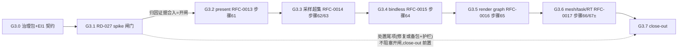

# G3 执行计划 — 子里程碑分解

> 所属契约:[G3_CONTRACT.md](G3_CONTRACT.md)
> 版本:v1.0(2026-07-18)
> 粒度依据:11 §7(小里程碑两级结构);本计划是工作分解,验收以契约 §4 为准,本文不重定义成功。
> 编排裁决(契约 §7 ⑦):主线 G3.1→G3.6 **合入序严格串行**;面 k 实现期间,面 k+1 的 RFC 起草与对抗性评审**可并行**(worktree 隔离,不进合并队列;RFC(k+1) 合入不早于面 k 实现 PR 合入;MS1 §7「并行起草、串行合入」/ EA1 支线先例);**G3.1 spike 期间零面 RFC 合入**(闸门语义,owner 已裁归因落地即开闸)。
> **定位口径**:把工业渲染特性面从 deferred 登记做成 measured 工程事实;「全量推到底」(owner 裁定)受 measured-first/blocked-honest 约束——上游 blocked 的腿以 probe 证据落尾门,不伪造。

---

## 0. 总览与依赖

| 子里程碑 | 时长(估) | 交付物映射 | 阻塞关系 / gating |
|---|---|---|---|
| G3.0 | ~2–3 天 | D-G3-1(治理包)+ D-G3-2(EI1 契约) | **G3 入口**;G3 脚手架 PR 先合,EI1 脚手架 PR 随后 |
| G3.1 | ~1–1.5 周 | D-G3-3(spike 全案 + RD-027 处置) | 闸门:归因证据合入 main 即解锁五面 RFC 合入;处置尾项并行推进 |
| G3.2 | ~1 周 | D-G3-4(present) | 依赖 G-G3-1 开闸;最低风险快胜,给全期 showcase 出口 |
| G3.3 | ~1.5–2 周 | D-G3-5(采样超集) | 依赖 G3.2 合入;含 vk graphics descriptor 建面(后续面共用底座);**关键路径** |
| G3.4 | ~1 周 | D-G3-6(bindless) | 依赖 G3.3(采样+descriptor 底座);为 G3.6 RT 材质表铺路 |
| G3.5 | ~1–1.5 周 | D-G3-7(render graph) | 依赖 G3.3(真采样 deferred 作验收语料);present 为 graph 终端 pass 的胶水随本面 |
| G3.6 | ~2 周 | D-G3-8(mesh/task/RT) | 依赖 G3.3~G3.5 全部产出;体量最大置尾;DXIL 腿 probe-first |
| G3.7 | ~2–3 天 | D-G3-9(close-out 终审) | 依赖全部前序;agent 自主签署 |

时长为 `estimated`,仅作排程参考,不构成验收承诺。子里程碑不另立 contract(单 G3 阶段契约)。

**关键依赖洞察**:① 采样面先于 bindless/graph/RT——vk.rs graphics descriptor 运行时是从零建面的共用底座,一次建成三面复用;② render graph 后于「真采样 deferred + present」——自动 barrier 推导须与 uc04 手动锚点集(RXS-0169)互证,先有真实消费者验收才硬;③ mesh/RT 吃前四面全部产出(材质采样/bindless 材质表/graph pass kind),置尾使 DXIL 腿两处上游钳制(spirv-cross mesh / RT)即使落 RD-034+ 尾门,前四面 + P2-6 Vulkan 腿仍构成完整可交付盘。

## 1. G3.0 — 治理包 + EI1 契约(D-G3-1/2,入口)

| # | 任务 | 验证方式 / gating |
|---|---|---|
| 1 | G3 四件套(本契约 + 本计划 + CI_GATES + g3_budget.json 空壳)+ number_ledger reserved_in_flight G3 行(v1.3)落 PR;13/spike_gating/00-14/spec 全 pristine | host 门全绿(guardrails mb1-closed / trace 215/215 / schemas / budget 空态 / structure / ledger);零 CI 代码改动 |
| 2 | EI1 契约四件套(milestones/ei1/):§0 gated on G3 close-out + 立项确认(MB1 §0 先例);G3∥EI1 合并序约定治理化;零实现零共享编号消费 | 独立 PR 随 G3 脚手架后合;host 门全绿 |

**出口判据**:两脚手架 PR 合入 main;G-G3-8 兑现。

## 2. G3.1 — RD-027 spike 闸门(D-G3-3,关键路径)

技术方案全文见 spike 报告(落地时入 evidence/);执行序按收益优先:

| # | 任务 | 验证方式 / gating |
|---|---|---|
| 1 | 脚手架 + **E0a 基线重立**:工具链 13.2→13.3 漂移,copytree+patch 复测毒径三档(bounces=3/4@8spp、256spp@2 弹射)各 guarded 120s + 对照档秒级绿;`nvidia-smi` util/功耗签名核对(100%/~54W 自旋特征) | 不复现→「toolchain-fixed」短路全案直接走升档回填链;复现→进矩阵 |
| 2 | **E7a compute-sanitizer memcheck 前置排除**(guarded 1200s)+ E5 首轮 PTX 静态分析(单 artifact 事实核验:挂/不挂共用同一 PTX,diff 轴 = rurixc-PTX vs nvcc-PTX 与 -O 各档 SASS) | OOB→应用/数据缺陷改道(亦为合法归因);clean→继续 |
| 3 | **E0b 双装载路判别**:同源两 exe(嵌 cubin vs RURIXC_PTXAS 失效强制 PTX JIT 梯子),毒径档+对照档各跑 | 仅 cubin 挂→ptxas;仅 JIT 挂→驱动;双挂→PTX 文本上游;双绿→回 E0a |
| 4 | spike harness(`spike/rd027-pt-poison/harness/`,独立 cargo 工程 path-dep rurix-rt,不进 workspace)+ **E1/E2 优化档扫描**:ptxas -O0~3 × CU_JIT_OPTIMIZATION_LEVEL 0~4 | 某档绿→定罪优化器且得护栏(-O pin);全档挂→上移嫌疑 |
| 5 | **E4 最小化**:源级删减序(NEE→拒绝采样→Fresnel→地面天空→cell 内环→shadow_walk→三层嵌套骨架)+ samp_base 二分锁单样本 + refcpu 逐位重放证有限终止;**E6 CUDA C++ 对照**(nvcc 与 clang-CUDA 双前端喂同 ptxas);E7b 封顶计数器插桩(三分法:计数器 clobber/出口恒假/重汇聚死锁) | 最小触发构造 = 归因方证物或上游 MRP 核心 |
| 6 | 证据落档:`evidence/rd027_pt_poison_spike_<date>.json` + schema(`milestones/g3/rd027_spike_evidence_schema.json`)+ 报告(镜像 dxil_path_spike_report 表头八行)+ deferred RD-027 history 追加 → **spike PR 合入 = G-G3-1 开闸** | check_schemas PASS;报告纪律 measured-first/blocked-honest |
| 7 | 处置尾项(路径按归因):(a) rurixc/LLVM 侧→修复 PR + tests/ptx golden 重 bless + params.rx 切片升回 256spp/4 + uc07_bench 补丁摘除 + ms1.bench measured 重测回填(BENCH_PROTOCOL 3 次 trimmed mean)+ RFC-0010 §4.4 golden digest 核对,RD-027 close;(b) NVIDIA 侧→`evidence/upstream-reports/rd027-pt-spin/` DRAFT 包(PROVENANCE/ISSUE_DRAFT do-NOT-file/mrp/repro_log)+ 护栏(ptxas -O pin 或 PTX-only 降级)留痕,RD-027 诚实存续 | close-out 前置,不阻塞五面 |

**安全纪律(全程)**:全部 GPU 运行经 `bench/proc_guard.guarded_run`(禁裸 subprocess,R-606);挂起判定后强制金丝雀门(saxpy/offline_smoke 秒级复绿方可继续,失败=GPU 态疑污染中止 campaign);单 session 毒径挂起上限 5 次;实验窗与 CI run 及 nightly(03:00–04:00 +0800)错峰,实验前 `gh run list` 确认无 in-flight;ptxas 输入恒 ASCII 路径(`build/spike-rd027/`);僵尸 exe 隔离 `build/quarantine/`;TDR 零改动如实记录;证据逐 run 增量 JSONL 落盘。

**出口判据**:归因结论(rurixc_ir|llvm_nvptx|ptxas|driver_jit|app_data|toolchain_fixed 之一,或诚实 inconclusive)+ evidence/报告合入;inconclusive 时五面不开,§7 追加裁决路由。

## 3. G3.2 — present(D-G3-4,RFC-0013)

| # | 任务 | 验证方式 / gating |
|---|---|---|
| 1 | RFC-0013(Full;含 §9.1 对抗性评审跨模型):D3D12 可见窗口 flip-model swapchain + resize 重建 + vsync 参数 + backbuffer readback 校验;Vulkan OUT_OF_DATE 重建;§8 锁死 D-130(窗/泵/输入不进语言,语言面零新语法复用 RXS-0197 typestate) | RFC PR 独立合入,Approved 先于实现(步骤 61 脚本 main 不存在 = RED) |
| 2 | 条款 RXS-0220~0222(预期:窗口 present 装配与呈现循环 / swapchain 重建与 resize 语义 / present SKIP 纪律与 readback 校验)落 spec/dxil_backend.md 或 d3d12 运行时节 + 实现:uc04 shim present 段(ABI 版本 bump)+ vk.rs 重建 + cabi 追加 | 单 PR 条款 commit 先行;trace 215→N;快照重 bless 同 PR |
| 3 | CI 步骤 61:`ci/uc04_present_smoke.py`(host 段恒跑 + device 段 present N 帧 readback 断言 + resize 后再断言 + 篡改 PRESENT 态迁移 RED;无显示 SKIP + REQUIRE_REAL 硬红)+ g3.counter.uc04_present_frames 与 evaluator 分支同 PR | 真实红绿 + run URL 归 §8;步骤 48 offscreen 硬门 0-byte |

## 4. G3.3 — 采样超集(D-G3-5,RFC-0014,关键路径)

| # | 任务 | 验证方式 / gating |
|---|---|---|
| 1 | RFC-0014(Full,06 §4.2 禁区增补):四批全量(fetch/隐式 LOD+导数/sampler 状态/shadow+gather+多分量+UAV 写);隐式 LOD 非均匀控制流条款对齐 D3D/Vulkan quad 语义不发明自有语义;UAV memory-order 对齐既有 Atomic scope 最保守子集;严禁 UB 节 | RFC PR 独立合入 + 对抗性评审 |
| 2 | 条款 RXS-0223~0230(预期)+ 前端(shader_stages.rs 方法族 typeck + mir Rvalue kind 枚举扩)+ codegen(dxil_spirv.rs 采样 opcode 全家 + binding_layout static sampler/storage image 轴 + B 链贯通)+ 运行时(uc04 shim sampler heap/mip 链/UAV;**vk.rs graphics descriptor 建面 run_graphics_offscreen_v2 加性 API**) | 大面拆 2~3 栈式 PR(条款+前端+SPIR-V → B 链+shim → vk 运行时+device);每 PR 条款先行 |
| 3 | B 链 probe 先行:分离 image/sampler 形态 SampleCmp/Gather 的 spirv-cross 输出 5 分钟语料实测 | 证据入 evidence,红则该子模式诚实标注 |
| 4 | CI 步骤 62(codegen/host:dxv+spirv-val 三态)+ 63(device:≥6 模式数值判据,mip 金字塔/wrap-clamp 对照/UAV 回读/双后端一致性)+ g3.counter.sampling_superset_modes(≥6) | 真实红绿 + run URL;既有 RXS-0174~0176 显式 LOD 0 路零回归 |

## 5. G3.4 — bindless(D-G3-6,RFC-0015)

| # | 任务 | 验证方式 / gating |
|---|---|---|
| 1 | RFC-0015(Full):无界句柄数组仅签名形参 + 动态索引临时句柄仅立即采样 receiver + nonuniform 标注 strict-only + 越界 robustness 条款(实现定义但有界,无 UB 节);§8 登记 heap 直索引语法糖收窄(RD-034+) | RFC PR 独立合入 + 对抗性评审 |
| 2 | 条款 RXS-0231~0235(预期)+ 实现:mir ResourceCount::Unbounded 从 Unmappable 转合法路径 + RuntimeDescriptorArray/NonUniform 装饰 + RTS0 unbounded range 独占新 space 分配律 + vk descriptor indexing feature chain/update-after-bind + std::gpu TextureTable + 新 RX 码(nonuniform 缺失/位置违例,自 RX6027) | 单 PR 条款先行;binding_layout 单测回归网全绿 |
| 3 | CI 步骤 64:四纹理四象限索引红绿 + 篡改注册序换位 RED + feature 缺失确定性 Err + g3.counter.bindless_descriptor_smoke | 真实红绿 + run URL |

## 6. G3.5 — render graph(D-G3-7,RFC-0016)

| # | 任务 | 验证方式 / gating |
|---|---|---|
| 1 | RFC-0016(Full,🔒 pass 边界 happens-before 本体):Graph/Pass 声明式宿主库面(lang-item,无新语法)+ access 声明合法性 + 自动状态转换语义;仅承诺 pass 粒度全序单 queue;§8 锁重排/多 queue/split barrier(登 RD-034+) | RFC PR 独立合入 + 对抗性评审 |
| 2 | 条款 RXS-0236~0241(预期)落 spec/host_orchestration.md 等 + 实现:rurix-rt graph.rs(纯 host safe 状态推导,双后端映射同源 AccessKind)+ D3D12 执行器(shim pass/barrier 数组下发)+ Vulkan 执行器(多 pass command buffer + vkCmdPipelineBarrier)+ cabi rxrt_graph_* + uc04 手动 plan_barriers 转独立复核门 | 拆 2 栈式 PR(推导核心+host 单测 → 双执行器+迁移);互证金标准:自动推导 == RXS-0169 手动锚点集 |
| 3 | CI 步骤 65:uc04 迁 Graph API 重跑步骤 48 同判据 + 漏声明 read strict 拒 RED + Vulkan 同图同判据 + g3.counter.auto_barrier_hazard_redgreen;present 终端 pass 胶水随本面 | 真实红绿 + run URL |

## 7. G3.6 — mesh/task/RT(D-G3-8,RFC-0017,置尾)

| # | 任务 | 验证方式 / gating |
|---|---|---|
| 1 | RFC-0017(Full,本期最大):六阶段全量类型面(AST 补 intersection/callable;mesh #[numthreads]+#[outputs];payload/attribute 契约升全量;AccelStruct/trace_ray);Vulkan 主腿全量;DXIL 腿分层(mesh probe-first / RT 预判 blocked);§7 论证并否决 MIR→HLSL 第三发射路径 | RFC PR 独立合入 + 对抗性评审 |
| 2 | 前置双 probe:① DXIL mesh(最小 SPIR-V→spirv-cross→dxc -T ms_6_5→dxv);② `bin/vk_rt_probe`(AS 构建 alignment/SBT stride/bufferDeviceAddress 驱动坑) | 证据先行入 evidence;①红则 DXIL mesh 与 RT 同落 RD-034+ |
| 3 | 实现栈式 3~4 PR:(a) 条款 + 类型面 + SPIR-V mesh/task 执行模型 + vk mesh pipeline + 步骤 66;(b) **SPIR-V 1.4 分叉独立 PR**(dxil 1.0 路零回归);(c) RT SPIR-V codegen + vk AS/SBT/TraceRays 运行时(U30+ 登记)+ 步骤 67;(d) DXIL 腿:probe 绿则 mesh 全量落 + RX6008 改接 + 步骤 68,RT blocked 探针 + RD-034+ 登记 + 步骤 69(防静默腐烂) | 每 PR 条款先行;spirv-val vulkan1.2/spv1.4 三态;intersection/callable 运行时语料可 accept-only(device 语料首期 raygen/miss/closesthit 三件套) |
| 4 | CI 步骤 66(Vulkan mesh 像素判据+SetMeshOutputs 篡改 RED)/ 67(Vulkan RT 命中-miss 双色+移顶点 RED)/ ±68/69(DXIL 腿)+ g3.counter.mesh_task_rt_stages(≥3) | 真实红绿 + run URL;VVL 崩溃与驱动崩溃以退出码区分(反 grep,P0-5 教训) |

## 8. G3.7 — close-out(agent 自主签署)

| # | 任务 | 验证方式 |
|---|---|---|
| 1 | 全量回归冻结:cargo fmt/clippy/test + trace N/N + stable --check + bilingual N/N + schemas/structure + budget --strict(全局零 estimated)+ guardrails + ledger + contribution + redistribution + 步骤 61~67 全冒烟 REQUIRE_REAL + saxpy smoke | 全绿原文追加契约 §8 |
| 2 | 终审:G-G3-1~9 留痕指针表(blocked 面照 G-MB1-6 open 尾门措辞)+ RD-012/018/019/020/022/023/024/027/029 逐条处置 + SG 复评 + provisioning 注 + 被驱逐 main run rerun 补绿后 run URL 归档 + ledger 校准 revision | 契约 §8 追加 |
| 3 | 签署兑现:status active→closed;check_guardrails 默认基准切 g3-closed(自当时默认基准,链单线性);推 annotated g3-closed tag;双基准 advisory 复核 | agent 签署留痕(MB1/EA1 先例) |

## 9. 风险提示(引用,不另建登记)

- **GPU 挂起实验污染 runner**(spike = 故意制造 100% 自旋且 runner 即本机):proc_guard + 金丝雀门 + 错峰硬纪律 + 隔离区(§2 安全纪律)。
- **对抗性评审 provenance**(D-409):同 harness 同模型子 agent = 同 token 判红;评审镜头强制跨模型,每 RFC 合入前本地 check_contribution 验绿。
- **上游 blocked 两处集中在 G3.6**(spirv-cross mesh / RT):probe-first + RD-034+ 尾门,前四面不受牵连。
- **SPIR-V 1.4 分叉**是隐性大改:独立 PR + dxil(1.0)零回归门。
- **EA1×G3 双活跃**:双方零 estimated 铁律(现状已零);基准链单线性兼容两收口序;RD-027 回填触 EA1/MS1 侧文件按各自修订纪律留痕。
- **runner 单 pending 槽**:合一等一;close-out 前统一 rerun 补被驱逐 main run;nightly 挂起即 cancel。
- **LF/CRLF(全期)**:新文件 LF+尾换行;禁 Python 文本模式写;逐文件核 CR+尾字节;严禁 git add 全量(工作树有大体积 untracked 目录)。

## 10. 修订记录

| 版本 | 日期 | 变更 |
|---|---|---|
| v1.0 | 2026-07-18 | 初版(G3 契约配套;主线 G3.0~G3.7 串行 + RFC 流水线重叠声明;RD-027 spike 执行序(E0a 基线→E7a 排除→E0b 双装载路→E1/E2 优化档→E4/E6 最小化对照→证据→处置)+ 安全纪律;五面任务分解与栈式 PR 结构;步骤 61~67± 计划项随实现 PR 回填 workflow;关键依赖洞察(descriptor 底座/互证语料/置尾钳制隔离);deferred 九条承接) |
