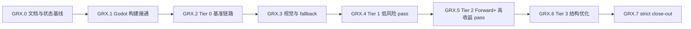

# GRX 执行计划 - Agent 接续任务分解

> 所属契约:[GRX_CONTRACT.md](GRX_CONTRACT.md)
> 版本:v2.16(2026-07-08)
> 粒度:1-2 天 / PR。每个任务只触碰一个子系统或一个 pass,必须有明确验证命令或 evidence JSON。

---

## 0. 总览与依赖

| 小里程碑 | 目标 | 主要输出 | 阻塞关系 |
|---|---|---|---|
| GRX.0 | 固化当前 scaffold 与接续文档 | 契约/计划/CI 三件套 | 无 |
| GRX.1 | Godot module 能 build/load/fallback | SCons detector、build log、DLL load smoke | 依赖当前 patch |
| GRX.2 | 建成 Tier 0 baseline 证据链 | scene generator、runner、baseline JSON | 依赖 GRX.1 |
| GRX.3 | 建成 visual diff 与 fallback telemetry | capture/diff、pass enable matrix | 依赖 GRX.2 |
| GRX.4 | 替换低风险 compute/effects pass | Tier 1 pass evidence | 依赖 GRX.3 |
| GRX.5 | 替换 Forward+ 高收益 pass | Tier 2 pass evidence | 依赖 GRX.4 |
| GRX.6 | 结构性优化 | fusion/cache/prewarm evidence | 依赖 GRX.5 |
| GRX.7 | 严格验收 | strict perf + visual close-out | 依赖全部 |

## 1. GRX.0 - 文档与状态基线

> 本阶段只维护 `milestones/grx/GRX_CONTRACT.md`、`GRX_PLAN.md`、`CI_GATES.md` 三件套,用于固化当前 scaffold 状态、后续任务拆分与 gate 规则;不实现任何 Godot pass,不跑 Godot build,不跑 benchmark,不宣称性能提升。

| Task ID | 目标 | 交付物 | 验证 | 接续说明 |
|---|---|---|---|---|
| 文档基线 | 固化当前 scaffold、任务拆分与 gate 口径 | 契约/计划/CI 三件套 | 文档内容自洽,且不把 Godot build/benchmark 写成已达成 | `GRX-001` 的执行归属见下方 `GRX.1` 表 |

## 2. GRX.1 - Godot 构建接通

| Task ID | 目标 | 交付物 | 验证 | 接续说明 |
|---|---|---|---|---|
| GRX-001 | 补充 SCons/toolchain detector,不安装全局依赖 | detector 脚本或 smoke 步骤,输出 SCons/MSVC/Windows SDK/DXC/Godot tree 状态与下一条可执行命令 | detector 在缺 SCons/MSVC 时返回明确 SKIP/FAIL reason;缺少 launcher 时 `recommended_scons_command` 必须为 `null`; `dxv.exe` 缺失记为后续 validation warning,不改系统环境 | fresh `godot_toolchain_probe.json` 已读取 build summary 的 path-overrides readiness 与 load smoke summary,当前接续已从 `GRX-003` 推进到 `GRX-004` |
| GRX-002 | 让 `modules/rurix_accel` 在 Godot tree 中完成可归档的 path-overrides rebuild evidence | 更新后的 patch + build log + artifact evidence | `git apply --check --directory=external/godot-master spike/godot-rurix/patches/*.patch`; `py -3 ci\godot_rurix_scons_build.py` | fresh `godot_scons_build_summary.json` 已记录 Godot exe、console exe、module lib 的 artifact evidence,且 `command` / `ice_workaround_command` 均包含 `disable_path_overrides=no`;summary 同时暴露 `required_scons_args_satisfied` / `path_overrides_ready` 供 probe 判定 |
| GRX-003 | Godot 启动加载 `rurix_godot.dll`,无 DLL 时 fallback 不崩 | DLL load smoke + fallback log + summary JSON | 有 DLL: session created 或因 D3D12 环境受限明确 `SKIP`; 无 DLL: process exits 0 and logs fallback,且若 missing-DLL 日志出现 session-ready marker 必须判失败并记录 `unexpected_markers` | fresh `godot_load_smoke_summary.json` 已验证 present/missing DLL 两条路径,smoke 项目文件只落在 `target/grx/godot-load-smoke`,且 `external/godot-master/bin` 旧 smoke 文件已按 marker/fingerprint 清理 |

**出口判据**:toolchain detector 输出明确 `build_ready`、`build_artifacts_ready`、`load_smoke_ready` 与下一条可执行命令;`GRX-002` summary 归档 Godot exe / console exe / module lib 的 artifact evidence,且 `command` / `ice_workaround_command` 明确包含 `disable_path_overrides=no`;`GRX-003` summary 归档 DLL present/missing 两条 smoke,且项目文件只落在 `target/grx/godot-load-smoke`;probe 在 fresh build + fresh load smoke evidence 完整后自动切到 `GRX-004` / `GRX.2`,而不是停留在 `run_grx003_load_smoke`;`RXGD_ABI_VERSION` mismatch 能禁用加速而不崩溃。

## 3. GRX.2 - Tier 0 基准链路

| Task ID | 目标 | 交付物 | 验证 | 接续说明 |
|---|---|---|---|---|
| GRX-004 | 生成 7 个 benchmark scene 的最小项目骨架 | Godot benchmark project generator + scenes + per-scene smoke evidence | fresh `target/grx/godot_bench_project_smoke_summary.json` 已记录 `scene_count=7`、`failure_count=0`,且 7 个 scene 都有独立 Godot load evidence | 已完成,下一步进入 `GRX-005 runner`;本项不等于 baseline/perf gate/visual diff/加速 pass 已完成 |
| GRX-005 | 实现 warmup 300 / sample 2000 / vsync off runner | runner + raw frame samples + runner summary | runner 顺序运行 7 个 scene,输出每帧 CPU frame time、GPU timestamp 显式 unavailable 标记、FPS/p95 | 已完成并硬化:runner 现扫描 Godot 日志 failure marker(对齐 `bench_project_smoke.py`),allowlist global script cache warning,其它 `ERROR / SCRIPT ERROR / Parser Error / Failed loading` 让该 scene fail,`per_scene_results` 记录 `failure_markers` / `warnings`,summary 增加 `warning_count`;固定 1920x1080、D3D12 Forward+、`gpu_timestamps_available=false`;当前 evidence 仍只是 quick-smoke,不做 baseline 对比 |
| GRX-006 | 写 baseline evidence JSON schema 与 perf gate 输入格式 | schema + sample baseline/result JSON | `py -3 spike/godot-rurix/bench/perf_gate.py <results.json>` 能解析;建设期可 FAIL 但格式正确 | 已完成并已 hardening:新增 `schemas/baseline_evidence.schema.json` + `schemas/perf_gate_input.schema.json`(draft-07),扩展 `perf_gate.py`(`--kind baseline/perf_gate`、`--strict`、`--validate-only`)。本轮 hardening 修复:strict forbidden marker 改词边界正则(命中 `SKIP: missing`/`skip-reason`/`status=SKIP`/`estimated:true`/`estimated local`,不误伤 `spike`/路径)、baseline reader 校验 `sample_count` 正整数且 `== sample_frames`、strict `thresholds` 三项固定值(1.5/0.3/0.95)防篡改;新增红测 `samples/perf_gate_forbidden_skip_example.json` 与 `samples/baseline_missing_sample_count_example.json`。严禁用 estimated 填 close-out,full baseline 实测与性能提升仍未完成 |

**出口判据**:`GRX-004` 已以 fresh per-scene smoke 收口;`GRX-005` runner 已交付 7 场景 raw frame sample JSON、runner summary(含 failure marker 扫描与 `warning_count`)并硬化;`GRX-006` 已交付并硬化 baseline/perf schema 与 strict perf gate 输入格式(可解析、strict 拒绝非法输入、forbidden marker 词边界正则、`sample_count` 对齐、`thresholds` 固定值);probe 现以 `grx006_schema_ready` 把 `next_action` 推进到 `start_grx007_visual_diff_scaffold`。full baseline 实测对比、真实 visual diff、实际加速 pass、性能提升声明仍留在后续任务,不得提前写成已完成;当前 runner evidence 仍只是 quick-smoke,不能作为 strict close-out 输入。

## 4. GRX.3 - 视觉与 fallback

| Task ID | 目标 | 交付物 | 验证 | 接续说明 |
|---|---|---|---|---|
| GRX-007 | 接入 reference frame capture 与视觉 diff | reference/Rurix capture + diff script | LDR absolute diff; HDR/temporal pass 用 SSIM/PSNR + temporal stability | 已完成 scaffold + hardening:`visual_diff.py` 与 `visual_diff_evidence.schema.json` 现禁止 `status=skip` 携带伪造 diff/帧路径(reference/candidate path、ldr/hdr/temporal diff 必须 null 或缺省),新增红测 `samples/visual_diff_skip_with_fake_ldr_example.json`(skip 带 ldr_diff 必 FORMAT FAIL);收尾 hardening:`status=pass` 帧若 reference/candidate 帧文件缺失、不可读、非合法 channel 文档、或两帧 channel 数量不一致,必须 DIFF FAIL 且非零退出,不再降级为 SKIP,`--write-output` 在任一 pass 帧算不出 diff 时拒绝写出 evidence,新增红测 `samples/visual_diff_pass_missing_frame_artifact_example.json`(pass 帧指向不存在帧文件必 DIFF FAIL);已有红绿保持:pass 缺 ldr_diff FORMAT FAIL、diff 不一致 DIFF FAIL、diff 一致 PASS、`--write-output` 生成 computed ldr_diff evidence;7 场景仍全部 SKIP,不写“视觉验证已通过” |
| GRX-008 | 接入 pass fallback telemetry | telemetry JSON + pass enable matrix | 强制某 pass 返回 fallback 时,Godot 原 pass 接管且 telemetry 记录原因 | 已完成 scaffold + hardening:`fallback_telemetry.py` 与 `fallback_telemetry.schema.json` 区分 scaffold 与 full——scaffold(`run_mode=scaffold`/`evidence_level=scaffold`)允许 timestamp/frame=null 但每 pass 必须 `enable_state=disabled` 且 `godot_fallback_active=true`;full(`run_mode=full` 或 `evidence_level=measured_local`)要求 timestamp 非空、frame 非负整数,measured_local 禁止 `pass_id` 以 `placeholder_` 开头(现 schema 与脚本双侧约束);新增红测 `samples/fallback_telemetry_full_null_timestamp_example.json` 与 `samples/fallback_telemetry_scaffold_fallback_inactive_example.json`,placeholder 仍 FORMAT PASS 且明确不是实际 telemetry。fallback 原因枚举:compile_failed,validation_failed,unsupported_device,visual_diff_failed,manual_disabled。此处仍为 scaffold/格式,不代表任何 pass 已接入或发生真实 fallback |

**出口判据**:每个 pass 都能单独 enable/disable;禁用或失败不会影响其它 pass 和 Godot 原路径。`GRX-007` scaffold 阶段所有 visual evidence 均为 SKIP/placeholder,不得据此宣称视觉验证通过;`GRX-008` scaffold 阶段所有 telemetry 均为 placeholder,不代表任何 pass 已接入或发生真实 fallback。`GRX-009` 准备、第一段 gated scaffold、第二段 core call-site fallback wiring、`segment 3a` historical raw-buffer offline compile success(保留在 `offline_compile_evidence_raw_buffer.json`;canonical `offline_compile_evidence.json` 当前 `status=compile_failed`,segment 4i texture-capable compile 失败因 patched llc 不支持 `llvm.dx.resource.load.texture.2d` intrinsic,canonical artifacts 路径携带 raw-buffer 字节复制自 `artifacts/raw_buffer_historical/`,manifest 顶层 `offline_compile_status=compile_failed`,current first blocker 是 `kernel_binding_kind_mismatch`,`math_pyramid_parity_not_proven` 仅 future-only)、`segment 3b` resource mapping scaffold ready、`segment 4a` runtime binding preflight ready 与 `segment 4b` gated dispatch bring-up ready 已完成;0004/0005/0006 patch applyability gate 均已纳入,其中 0005 必须在已应用 0004 的 scratch copy 中通过 stacked applyability 检查,0006 必须在已应用 0004+0005 的 scratch copy 中通过 stacked applyability 检查,且均不得污染 `external/godot-master`。当前 runtime 仍保持 disabled/fallback,manifest 仍记录 `runtime_state=fallback_only`、`real_gpu_pass=false`、`real_d3d12_dispatch_recorded=false`,bridge 对 luminance 即使 preflight 与 dispatch eligibility 全部通过、explicit dispatch gate 仍关闭并返回 fallback。`segment 4c` standalone real D3D12 dispatch smoke 已 success:`ci/grx009_luminance_d3d12_dispatch_smoke.py` 在真实 D3D12 adapter 上完成一次最小 compute dispatch(tracked luminance DXIL container + RTS0 root signature + descriptor layout,dispatch=1,1,1、fence_completed_value=1、dst UAV readback),evidence `real_d3d12_dispatch_smoke.json` 记录 `status=success`、`runtime_state=fallback_only`、`real_gpu_pass=false`,artifact hash 与 segment 3a offline evidence 一致。这是 standalone measured smoke evidence:bridge 仍不录制 dispatch,不让 `rxgd_record_pass` 返回 OK,不启用 Godot luminance Rurix path。`segment 4d` bridge real D3D12 dispatch recording smoke 已 success:新增默认关闭的 `d3d12-recording-shim` feature 与 harness-only flag `RXGD_CAP_LUMINANCE_DISPATCH_RECORD`,`ci/grx009_luminance_bridge_recording_smoke.py` 在真实 adapter 上经 bridge C ABI 录制一次最小 luminance compute dispatch,`bridge_dispatch_recording_evidence.json` 记 `status=success`(`rxgd_record_pass` 返回 `RXGD_STATUS_OK`、`recorded_passes=1`、`fallback_passes=0`、`gpu_time_ns=0`)。这是 test-only feature + harness-only record-arm 下的 measured bridge evidence:shipping(feature-off)bridge 与默认 Godot 路径仍 fallback,`godot_runtime_luminance_path_enabled=false`、`default_enable_state=disabled`、`gpu_timestamp_status=not_yet`,manifest 仍 `runtime_state=fallback_only`、`real_gpu_pass=false`、`real_d3d12_dispatch_recorded=false`。probe 采用 historical/cumulative predecessor gate,manifest 推进到 4b 后 3a/3b/4a/4c ready 仍为 true。`segment 4e` native D3D12 resource handle mapping 已 ready:栈式 patch 0007 把 Godot runtime luminance pass 传给 bridge 的资源从 logical RID id 改成真实 `ID3D12Resource*` native handle(`renderer_scene_render_rd.cpp` 经 `RenderingDevice::get_driver_resource(DRIVER_RESOURCE_TEXTURE, RID, 0)` 解析 `rb->get_internal_texture()` 与 `luminance_buffers->reduce[0]`,native handle 为 0 或 `RenderingDevice` 不可用时 fallback 到 Godot 原生 luminance path;hook 参数改名为 `p_source_native_handle`/`p_dest_native_handle`),`grx009_patch_0007_applyable=true`、`grx009_segment4e_native_resource_handle_mapping_ready=true`。本段只完成 native handle mapping + preflight/evidence:`RXGD_ABI_VERSION` 不变、Godot module 仍不设置 `RXGD_CAP_LUMINANCE_DISPATCH_RECORD`、shipping/feature-off bridge 仍 fallback,manifest 仍 `runtime_state=fallback_only`、`real_gpu_pass=false`、`real_d3d12_dispatch_recorded=false`。`segment 4f` Godot-runtime bridge dispatch recording smoke 已接线(栈式 patch 0008 + harness `ci/grx009_godot_runtime_bridge_recording_smoke.py` + **两个** tracked evidence + `grx009_patch_0008_applyable`/`grx009_segment4f_godot_runtime_bridge_recording_ready` probe gate):默认 `false` 的 `.../dispatch_recording_smoke` opt-in 与 module 侧 harness-only `RXGD_CAP_LUMINANCE_DISPATCH_RECORD` 让 Godot runtime luminance call site 可在 test-only opt-in + d3d12-recording-shim DLL 下驱动一次 bridge 录制并打印 `RXGD_GODOT_RUNTIME_LUMINANCE_RECORD` marker。evidence 分 latest 与 historical success:`godot_runtime_bridge_recording_evidence.json` 是 latest 证据,每次运行改写、未设 `RURIX_GRX009_SEGMENT4F_GODOT_EXE` 时诚实记 `status=skip`、本身不推进 readiness;`godot_runtime_bridge_recording_success_evidence.json` 是 historical measured success 证据,仅在严格 success 时写入(记录 Godot exe fingerprint、0001..0008 patch stack identity、DLL fingerprint、artifact hashes、`godot_exit_code_zero=true`、marker `recorded=1`,scratch build 二进制不入 Git),之后 SKIP/FAIL 绝不覆盖它。segment 4f readiness gate 只看 historical success 证据。该 runtime smoke 需完整 0001..0008 Godot scratch build(`RURIX_GRX009_SEGMENT4F_GODOT_EXE`)、真实 D3D12 device、MSVC、signed DXC 才 success,缺任一前置写明确 SKIP、不推进 readiness(当前本机 latest `status=skip`、historical success 证据缺失,`next_action` 保持 `start_grx009_godot_runtime_bridge_dispatch_recording_smoke`;录得 historical success 后推进到 `start_grx009_luminance_real_visual_diff_and_measured_fallback_telemetry`,此后 unset env var 重跑使 latest 回落 SKIP 时 readiness 不回退)。`RXGD_ABI_VERSION` 不变,默认(未开 opt-in)module 不设置 record flag,shipping/feature-off bridge 与默认 Godot config 仍 fallback。这不代表真实 GPU pass、默认 Godot runtime bridge-recorded D3D12 dispatch、真实 visual diff、measured telemetry、GPU timestamp 或性能提升已经完成。

## 5. GRX.4 - Tier 1 低风险 pass

| Task ID | 目标 | 交付物 | 验证 | 接续说明 |
|---|---|---|---|---|
| GRX-009 | luminance reduction pass | Rurix pass package + Godot mapping patch | visual diff + dispatch/barrier count + fallback red/green | 单 PR;不过门则默认 disabled。准备、第一段 gated scaffold 与第二段 core call-site fallback wiring 已落地:bridge `LuminanceReductionGate` 仍 fallback+ 栈式 0002 module patch+ 栈式 0003 core call-site patch+ callsite-wired disabled telemetry 样例。`segment 3a` historical raw-buffer offline compile 已 success(保留在 `offline_compile_evidence_raw_buffer.json`,latest evidence 产出 DXIL container、root signature 与 descriptor layout);canonical `offline_compile_evidence.json` 当前 `status=compile_failed`(`blocker_category=dxil_container_missing`、`runtime_mappable=false`、`attempted_binding_kinds=[texture2d,rwtexture2d]`)——segment 4i texture-capable kernel 源 `src/lib_texture.rx` 已就位但 patched llc 不支持 `llvm.dx.resource.load.texture.2d` intrinsic,canonical artifacts 路径携带 raw-buffer 字节复制自 `artifacts/raw_buffer_historical/`,manifest 顶层 `offline_compile_status=compile_failed`,runtime 仍为 `fallback_only`、`real_gpu_pass=false`,current first blocker 是 `kernel_binding_kind_mismatch`(bridge tracked package 仍为 raw-buffer),`math_pyramid_parity_not_proven` 仅 future-only。`segment 3b` resource mapping scaffold 已 ready:包含 `resource_mapping.md`、descriptor `b0/t0/u0`、64-bit integer shader capability gate 与 0004 patch applyability gate。`segment 4a` runtime binding preflight 已 ready 并保持。`segment 4b` gated dispatch bring-up 已 ready:`grx009_patch_0006_applyable=true`,`grx009_segment4b_gated_dispatch_bringup_inputs_ready=true`,`grx009_segment4b_gated_dispatch_bringup_ready=true`,0006 stacked applyability 已在已应用 0004+0005 的 scratch copy 中通过 `git apply --check`;新增默认 false 的 `dispatch_bringup` opt-in 与保留能力 flag `RXGD_CAP_LUMINANCE_DISPATCH_BRINGUP`(`RXGD_ABI_VERSION` 保持 1)。`segment 4c` standalone real D3D12 dispatch smoke 已 success:`ci/grx009_luminance_d3d12_dispatch_smoke.py` 在真实 D3D12 adapter 上把 tracked luminance DXIL container + RTS0 root signature + descriptor layout 完成一次最小 compute dispatch(RTS0 直建 root signature、DXIL 建 compute PSO、SRV t0/UAV u0/b0 绑定、dispatch=1,1,1、fence_completed_value=1、dst UAV readback),evidence `real_d3d12_dispatch_smoke.json` 记录 `status=success`、`runtime_state=fallback_only`、`real_gpu_pass=false`,artifact hash 与 segment 3a offline evidence 一致;`grx009_real_d3d12_dispatch_smoke_ready=true`,predecessor 3a/3b/4a ready 采用 historical 语义仍为 true。`segment 4d` bridge real D3D12 dispatch recording smoke 已 success:新增默认关闭的 `d3d12-recording-shim` feature(`build.rs`+`cc` 编译 `shim/rxgd_luminance_record.cpp` 并链接 `d3d12`/`dxgi`)与 harness-only flag `RXGD_CAP_LUMINANCE_DISPATCH_RECORD (1u << 2)`,`ci/grx009_luminance_bridge_recording_smoke.py` 在真实 adapter 上经 bridge C ABI 录制一次最小 luminance compute dispatch,`bridge_dispatch_recording_evidence.json` 记 `status=success`(`rxgd_record_pass` 返回 `RXGD_STATUS_OK`、`recorded_passes=1`、`fallback_passes=0`、`gpu_time_ns=0`、`checksum=0x4b95f515`),`grx009_bridge_real_d3d12_dispatch_recording_ready=true`。`segment 4e` native D3D12 resource handle mapping 已 ready:栈式 patch `0007-rurix-accel-luminance-native-resource-handle-mapping.patch` 把 Godot runtime luminance pass 传给 bridge 的资源从 logical RID id 改成真实 `ID3D12Resource*` native handle——`drivers/d3d12/d3d12_hooks.h` hook 参数改名为 `p_source_native_handle`/`p_dest_native_handle`,`renderer_scene_render_rd.cpp` Auto Exposure call site 用 `RenderingDevice::get_driver_resource(DRIVER_RESOURCE_TEXTURE, RID, 0)` 解析 `rb->get_internal_texture()`(source)与 `luminance_buffers->reduce[0]`(dest)的真实 native handle,native handle 为 0 或 `RenderingDevice` 不可用时 fallback 到 Godot 原生 luminance path,`modules/rurix_accel` 把真实 `ID3D12Resource*` 写入 `RxGdResource.native_handle` 并对 0 handle 走 fallback;`grx009_patch_0007_applyable=true`、`grx009_segment4e_native_resource_handle_mapping_ready=true`。manifest/evidence 保持 `runtime_state=fallback_only`、`real_gpu_pass=false`、`real_d3d12_dispatch_recorded=false`、`godot_runtime_luminance_path_enabled=false`、`default_enable_state=disabled`、`gpu_timestamp_status=not_yet`。下一步是 `start_grx009_godot_runtime_bridge_dispatch_recording_smoke`(用真实 native handle 从 Godot runtime path 驱动 bridge 录制),本次不开始;segment 4c/4d smoke 均是 measured evidence(4d 经 test-only feature + harness-only record-arm flag 录制),segment 4e 只完成 native handle mapping preflight,`RXGD_ABI_VERSION` 不变、Godot module 仍不设置 `RXGD_CAP_LUMINANCE_DISPATCH_RECORD`,不启用 Godot luminance Rurix path、不完成 Godot runtime pass,shipping/feature-off bridge 与默认 Godot 路径仍 fallback。`segment 4f` Godot-runtime bridge dispatch recording smoke 已接线:栈式 patch `0008-rurix-accel-luminance-godot-runtime-bridge-recording-smoke.patch`(叠在 0001..0007,scratch copy 校验)新增默认 `false` 的 `.../dispatch_recording_smoke` opt-in、module 侧 harness-only flag `RXGD_CAP_LUMINANCE_DISPATCH_RECORD (1u << 2)`(承载在 `RxGdCaps.flags`,`RXGD_ABI_VERSION` 保持 1)、仅 opt-in 开启时在 `try_create_session` 置 flag、`try_record_luminance_reduction` 仅 `rxgd_record_pass` 返回 OK 时打印 `RXGD_GODOT_RUNTIME_LUMINANCE_RECORD` marker;新增 harness `ci/grx009_godot_runtime_bridge_recording_smoke.py` 与**两个** tracked evidence:latest 证据 `godot_runtime_bridge_recording_evidence.json`(每次运行改写、未设 `RURIX_GRX009_SEGMENT4F_GODOT_EXE` 时诚实记 `status=skip`、本身不推进 readiness)与 historical measured success 证据 `godot_runtime_bridge_recording_success_evidence.json`(仅严格 success 时写入,记 Godot exe fingerprint、0001..0008 patch stack identity、DLL fingerprint、artifact hashes、`godot_exit_code_zero=true`、marker `recorded=1`,scratch build 二进制不入 Git;之后 SKIP/FAIL 绝不覆盖),probe 新增 `grx009_patch_0008_applyable=true`/`grx009_segment4f_godot_runtime_bridge_recording_inputs_ready=true`,并分别报告 latest smoke status 与 historical success readiness。该 runtime smoke 需真实 D3D12 device、MSVC、signed DXC 且 `RURIX_GRX009_SEGMENT4F_GODOT_EXE` 指向用完整 0001..0008 栈重建的 Godot scratch build(不得复用只带 0001+0002+0003 的 tracked build)才能 success,缺任一前置写明确 SKIP、不推进 readiness。segment 4f readiness gate 只看 historical success 证据、不看 reproducible-default SKIP 的 latest 文件(当前本机 latest `status=skip`、historical success 证据缺失,`grx009_segment4f_godot_runtime_bridge_recording_ready=false`,`next_action` 保持 `start_grx009_godot_runtime_bridge_dispatch_recording_smoke`;录得 historical success 后推进到 `start_grx009_luminance_real_visual_diff_and_measured_fallback_telemetry`,此后 unset env var 重跑使 latest 回落 SKIP 时 readiness 不回退)。默认(未开 opt-in)module 仍不设置 record flag,shipping/feature-off bridge 与默认 Godot config 仍 fallback,不启用 Godot luminance Rurix path、不完成 Godot runtime pass、不改 `real_gpu_pass`/`real_d3d12_dispatch_recorded`;real GPU pass、visual/perf/measured telemetry、GPU timestamp 仍属后续工作 |
| GRX-010 | tonemap pass | Rurix pass package + telemetry | LDR absolute diff + FPS/p95 scene delta | 先覆盖 post_fx_chain 和 mixed_forward_plus |
| GRX-011 | SSAO/SSIL blur pass | Rurix pass package | visual diff + GPU timestamp | 注意 temporal/noise 稳定性 |
| GRX-012 | TAA resolve pass | Rurix pass package | temporal stability diff + fallback red/green | 不得以单帧截图替代 temporal evidence |
| GRX-013 | particles copy pass | Rurix pass package | particles scene perf + visual diff | 不过门则禁用该 pass |

**出口判据**:Tier 1 全部通过各自视觉/fallback gate;任何单 pass 若 FPS 低于 baseline 95%,默认 disabled 并保留 evidence。

## 6. GRX.5 - Tier 2 Forward+ 高收益 pass

| Task ID | 目标 | 交付物 | 验证 | 接续说明 |
|---|---|---|---|---|
| GRX-014 | clustered light binning | Rurix pass + Godot resource mapping | clustered_lights scene FPS/p95 + visual diff | 这是 1.5x 目标主战场之一 |
| GRX-015 | GPU culling | Rurix pass + indirect visibility buffers | many_mesh_instances scene draw/dispatch count + FPS/p95 | 必须保留 CPU fallback |
| GRX-016 | visible instance compaction | Rurix pass | visibility correctness + mixed scene perf | 与 GPU culling 依赖明确,不合并 PR |
| GRX-017 | material variant sorting | Rurix pass | material_variants scene PSO/cache miss proxy + FPS/p95 | 若 telemetry 不足,先补 telemetry |
| GRX-018 | indirect draw argument generation | Rurix pass | indirect args validation + scene perf | 任何 validation mismatch 立即 fallback |

**出口判据**:Tier 2 后重新跑 7 场景完整 benchmark;若 geomean 仍 <1.5,进入 GRX.6,不得提前 close-out。

## 7. GRX.6 - Tier 3 结构性优化

| Task ID | 目标 | 交付物 | 验证 | 接续说明 |
|---|---|---|---|---|
| GRX-019 | post FX fusion | fused pass package | post_fx_chain dispatch/barrier/VRAM traffic proxy + visual diff | 仅融合相邻 full-screen pass |
| GRX-020 | descriptor/root signature cache | cache implementation + telemetry | PSO/root signature churn 下降 + no ABI break | C ABI 变更必须 bump `RXGD_ABI_VERSION` |
| GRX-021 | pipeline prewarm | prewarm scheduling + telemetry | runtime PSO hitch 减少,p95 下降 | 不得增加启动失败率 |
| GRX-022 | bindless/resource-array 扩展 | Rurix binding/resource-array support | material/texture hot path benchmark | 若触及 compiler semantics,另行判档/RFC |

**出口判据**:Tier 3 后 strict benchmark 有机会通过;若仍未达 1.5x,继续拆新 pass,不得放宽门槛。

## 8. GRX.7 - strict close-out

| Task ID | 目标 | 交付物 | 验证 | 接续说明 |
|---|---|---|---|---|
| GRX-023 | 全场景 strict benchmark | final results JSON + raw samples | `py -3 spike/godot-rurix/bench/perf_gate.py <results.json>` PASS | 必须包含 scene-level baseline/rurix FPS 和 p95 |
| GRX-024 | 视觉证据汇总 | per-scene frame captures + diff report | all visual gates PASS | HDR/temporal pass 不得只用 LDR absolute diff |
| GRX-025 | 默认启用/禁用矩阵 | pass matrix + fallback policy | disabled pass 有原因和证据 | 不合格 pass 默认 disabled |
| GRX-026 | close-out 签署材料 | build log、perf_gate 输出、visual evidence、telemetry summary | GRX_CONTRACT §8 只追加 | 只有 strict 通过后才能写“显著提升已达成” |

## 9. Agent 接续规则

- 每个任务只触碰一个子系统或一个 pass。
- 每个 PR 必须列出输入文件、输出 artifact、验证命令。
- 每个 PR 必须说明失败时如何单独 revert 或禁用。
- 任何脚本新增都必须有 smoke 或 evidence JSON;不允许“脚本存在即完成”。
- 新 pass 必须至少包含一种真实红绿:pass 输出错误、禁用 fallback、视觉 diff 超阈值。
- 后续 agent 若发现任务过大,只能拆得更小,不得合并多个 pass 为一个不可回退 PR。

## 10. 修订记录

| 版本 | 日期 | 变更 |
|---|---|---|
| v1.0 | 2026-07-01 | 初版。按 1-2 天 / PR 拆分 GRX-000~GRX-026,锁定 GRX.0~GRX.7 执行顺序、首批任务卡、验证方式和接续规则。 |
| v1.1 | 2026-07-01 | 收紧 GRX.0 文档基线边界。把文档落地动作下沉为阶段说明,正式任务卡从 `GRX-001` 开始;明确本阶段不跑 Godot build/benchmark,也不宣称性能提升。 |
| v1.2 | 2026-07-01 | 继续收紧 GRX.1 边界:把 `GRX-001` 明确移入 `GRX.1` 执行范围,统一口径为 `GRX.0 = 文档基线`,`GRX.1 = detector/build/load`。 |
| v1.3 | 2026-07-01 | 收紧 `GRX-001` detector 输出口径:缺少 SCons launcher 时不再给出会失败的 `scons ...` 推荐命令,而是输出明确下一步;同时把 `dxv.exe` 缺失明确归类为后续 DXIL/device validation warning,不阻塞 `GRX-002` Godot SCons build。 |
| v1.4 | 2026-07-01 | 收口 `GRX.1` 当前状态:把 `GRX-002` 从抽象 build 目标推进到 artifact evidence 归档,明确本地已有 Godot exe/console exe/module lib,下一步由 probe 自动切到 `GRX-003`;同时细化 `GRX-003` 为 present-DLL 成功或明确 `SKIP`、missing-DLL `exit 0 + fallback log`,不进入 `GRX.2 benchmark`。 |
| v1.5 | 2026-07-01 | 完成 `GRX.1` close-out hardening 口径修正:明确 `GRX-001/002/003` 已有本地 success evidence,`godot_rurix_load_smoke.py` 的项目文件只能落在 `target/grx/godot-load-smoke`,missing-DLL case 需对 session-ready marker 做反向断言并记录 `unexpected_markers`,probe 在 build + load smoke evidence 完整后推进到 `GRX-004` / `GRX.2` 接续。 |
| v1.6 | 2026-07-01 | 以 fresh path-overrides rebuild / smoke evidence 完成 `GRX.1` 收口:明确 `GRX-002` 现以 `disable_path_overrides=no` 命令证据与 artifact evidence 为准,`GRX-003` 已 fresh 验证 present/missing DLL 两条路径并清理 `external/godot-master/bin` 旧 smoke 残留;probe 当前已稳定推进到 `GRX-004`,但未进入 benchmark 实现。 |
| v1.7 | 2026-07-01 | 收口 `GRX.2` 当前状态:明确 `GRX-004` 已以 fresh per-scene smoke 通过,下一步执行 `GRX-005` tracked runner;同时写死本次仍未完成 `GRX-006 baseline schema/perf gate`、visual diff、实际加速 pass 与任何性能提升声明。 |
| v1.8 | 2026-07-01 | 收口 `GRX-005` 硬化 / `GRX-006` 交付:`GRX-005` runner 增加 Godot 日志 failure marker 扫描与 `failure_markers` / `warnings` / `warning_count` 记录;`GRX-006` 完成 baseline/perf schema、`perf_gate.py` schema/strict/`--validate-only` 校验与两个样例 JSON。写死 full baseline 实测、visual diff、实际加速 pass 与性能提升声明仍未完成,当前 runner evidence 仍只是 quick-smoke。 |
| v1.9 | 2026-07-01 | 收口 `GRX-006` hardening / 接续 `GRX-007` scaffold:`perf_gate.py` 修复 strict forbidden marker 前缀漏判(改词边界正则)、baseline reader 补 `sample_count` 正整数且 `== sample_frames` 校验、strict `thresholds` 三项固定值(1.5/0.3/0.95)防篡改;新增两个红测样例;probe 以 `grx006_schema_ready` 推进 `next_action=start_grx007_visual_diff_scaffold`。`GRX-007` 进入 scaffold(capture/diff 脚本 + `visual_diff_evidence.schema.json` + placeholder),7 场景全部 SKIP;full baseline 实测、Rurix 加速 pass、真实 visual diff pass 与性能提升声明仍未完成。 |
| v2.0 | 2026-07-01 | 收口 `GRX-007` hardening / `GRX-008` scaffold hardening / 接续 `GRX-009` 准备:`GRX-007` 的 `visual_diff.py` 与 schema 禁止 `status=skip` 携带伪造 diff/帧路径,新增红测 `visual_diff_skip_with_fake_ldr_example.json`,保持既有 pass 缺 ldr_diff / diff 不一致 / diff 一致 / `--write-output` 红绿;`GRX-008` 的 `fallback_telemetry.py` 与 schema 区分 scaffold 与 full(scaffold 允许 timestamp/frame=null 但必须 disabled + fallback_active,full/measured_local 要求 timestamp/frame 非空非负、禁止 `placeholder_` pass_id),新增两个红测样例并保持 placeholder FORMAT PASS;probe 新增 `grx007_visual_ready`/`grx008_telemetry_ready`(跑红绿样例),GRX-008 ready 后 `next_action=start_grx009_luminance_reduction_pass_prep`。本轮不实现任何实际 Rurix 加速 pass,不宣称视觉验证、fallback 真接入或性能提升已完成。 |
| v2.1 | 2026-07-01 | 收尾 `GRX-007`/`GRX-008` hardening / 产出 `GRX-009` 准备:`GRX-007` 的 `visual_diff.py` 现让 `status=pass` 帧在 reference/candidate 帧文件缺失、不可读、非合法 channel 文档、或 channel 数量不一致时 DIFF FAIL 且非零退出(不再降级 SKIP),`--write-output` 在任一 pass 帧算不出 diff 时拒绝写出,新增红测 `visual_diff_pass_missing_frame_artifact_example.json`;`GRX-008` 的 `fallback_telemetry.schema.json` 补 `measured_local` 禁止 `placeholder_` pass_id 约束(schema 与脚本双侧一致);新增 GRX-009 准备产物 `spike/godot-rurix/passes/luminance_reduction/PASS_CONTRACT.md` 与 `pass_manifest.json`(仅调查 Godot luminance hook 路径/函数,不改 `external/godot-master`),probe 新增 `grx009_prep_ready` 并把 `next_action` 推进到 `start_grx009_luminance_reduction_pass_contract`(就绪后 `start_grx009_luminance_reduction_pass_implementation`)。GRX-009 仍只是准备,不是实际 pass 完成;本轮不实现任何实际 Rurix 加速 pass,不宣称视觉验证、fallback 真接入或性能提升。 |
| v2.2 | 2026-07-02 | 收口 GRX-009 准备 / 交付 gated implementation 第一段:修正文档滞后(准备已完成,下一步为 gated implementation 而非准备);`grx009_prep_ready` 加强为校验 manifest 记录的 Godot source/header/shader/call-site 文件存在于 `external/godot-master`(只读、不改快照);`src/rurix-godot` 新增 `LuminanceReductionGate`(默认 disabled,`request_enable` 恒 `compile_failed`,`rxgd_record_pass` 对 luminance 恒 `RXGD_STATUS_FALLBACK`,移除其占位 estimated GPU time,ABI v1 不变,新增两条单测);新增栈式 0002 module patch(per-pass 设置默认 false + `try_record_luminance_reduction()` 非 OK 即走 Godot 原生路径,仅 `modules/rurix_accel/*`)与 disabled telemetry 样例 `fallback_telemetry_luminance_disabled_example.json`;`ci/godot_rurix_bridge_smoke.py` 改为 patch 栈状态检查(base / 0001-only / 0001+0002,drift 即红)。GRX-009 pass 本体仍未实现:无真实 GPU pass、core call-site 未接线、无真实 visual diff、无 measured telemetry、不宣称性能提升。 |
| v2.3 | 2026-07-02 | 收口 GRX-009 第二段并接续 `segment 3a` 离线 compile evidence:修正 `GRX-009` 条目口径,明确当前已完成 segment 2 core call-site fallback wiring,下一步不再是 core 接线而是开始真实 GPU luminance pass 的离线 kernel/package 编译取证;只有真实 `DXIL + root signature + descriptor layout` artifact 齐备时才允许 manifest 进入 segment 3,否则保持 segment 2 并记录 compile blocker evidence。runtime 默认 disabled/fallback、真实 visual diff、measured telemetry 与性能提升声明仍未完成。 |
| v2.4 | 2026-07-02 | 修复 GRX-009 segment 3a artifact gate 计划口径:IR text / `ret void` entry shell 不再视为 ready;当前 evidence 为 `compile_failed/body_lowering_missing`,current artifacts 只描述 latest compile attempt,manifest 保持 segment 2,next action 指向真实 DXIL container/body lowering blocker,不进入 resource mapping。 |
| v2.5 | 2026-07-04 | 同步 GRX-009 segment 3b close-out 状态:segment 3a offline compile 已 success,segment 3b resource mapping scaffold 已 ready,0004 patch applyability gate 已纳入,下一步为 `start_grx009_luminance_segment4_runtime_binding`。runtime binding、真实 visual diff、measured telemetry、full measured_local perf evidence 与性能提升声明仍未完成。 |
| v2.6 | 2026-07-04 | 同步 GRX-009 segment 4a close-out 状态:runtime binding preflight 已完成,0005 stacked applyability gate 已纳入并通过 scratch copy 检查,下一步为 `start_grx009_luminance_segment4b_gated_dispatch_bringup`。本次不开始 segment 4b,bridge 仍 fallback-only,无 D3D12 dispatch、real GPU pass、真实 visual diff、measured telemetry、full measured_local perf evidence 或性能提升声明。 |
| v2.7 | 2026-07-04 | 同步 GRX-009 segment 4b close-out 状态:gated dispatch bring-up 已 ready,0006 stacked applyability gate 已纳入并在已应用 0004+0005 的 scratch copy 中通过 `git apply --check`,patch 栈扩为 0001..0006 六段,GRX.3 出口判据与 GRX-009 任务行下一步改为提供真实 D3D12 device dispatch smoke(`provide_grx009_luminance_real_d3d12_dispatch_smoke`)。segment 4b 只是"显式 opt-in、失败即 fallback"的接线就绪:manifest/evidence 保持 `runtime_state=fallback_only`、`real_gpu_pass=false`、`real_d3d12_dispatch_recorded=false`,explicit dispatch gate 关闭且 bridge 对 luminance 仍返回 `RXGD_STATUS_FALLBACK`;本次不开始 real D3D12 dispatch smoke,无 D3D12 dispatch、real GPU pass、真实 visual diff、measured telemetry、full measured_local perf evidence 或性能提升声明。 |
| v2.8 | 2026-07-04 | 同步 GRX-009 segment 4c standalone real D3D12 dispatch smoke success 状态:`ci/grx009_luminance_d3d12_dispatch_smoke.py` 在真实 D3D12 adapter(NVIDIA GeForce RTX 4070 Ti)上完成一次最小 compute dispatch(tracked luminance DXIL container + RTS0 root signature + descriptor layout,dispatch=1,1,1、fence_completed_value=1、readback_checksum=0x4b95f515),evidence `real_d3d12_dispatch_smoke.json` 记录 `status=success`、`runtime_state=fallback_only`、`real_gpu_pass=false`,artifact hash 与 segment 3a offline evidence 一致。GRX.3 出口判据与 GRX-009 任务行下一步由 `provide_grx009_luminance_real_d3d12_dispatch_smoke` 改为 `start_grx009_bridge_real_d3d12_dispatch_recording`;probe predecessor gate 改为 historical/cumulative,manifest 推进到 4b 后 3a/3b/4a ready 仍为 true。本次仅做一致性收口,不开始 bridge real D3D12 dispatch recording,不让 `rxgd_record_pass` 返回 OK,不启用 Godot luminance Rurix path;该 smoke 为 standalone measured evidence,不宣称 bridge-recorded D3D12 dispatch、real GPU pass、真实 visual diff、measured telemetry 或性能提升。 |
| v2.9 | 2026-07-04 | 同步 GRX-009 segment 4d bridge real D3D12 dispatch recording smoke success 状态:新增默认关闭的 `d3d12-recording-shim` feature（`src/rurix-godot` 经 `build.rs`+`cc` 编译 Windows-only C++ D3D12 录制 shim `shim/rxgd_luminance_record.cpp` 并链接 `d3d12`/`dxgi`）与 harness-only flag `RXGD_CAP_LUMINANCE_DISPATCH_RECORD (1u << 2)`（承载在既有 `RxGdCaps.flags`，`RXGD_ABI_VERSION` 保持 1），新增 `ci/grx009_luminance_bridge_recording_smoke.py`。真实 D3D12 adapter（NVIDIA GeForce RTX 4070 Ti）上 `bridge_dispatch_recording_evidence.json` 记 `status=success`：`rurix_godot.dll` 经 C ABI 录制一次最小 luminance compute dispatch（`rxgd_record_pass` 返回 `RXGD_STATUS_OK`、`recorded_passes=1`、`fallback_passes=0`、`gpu_time_ns=0`、`fence=1`、`checksum=0x4b95f515`），保持 `runtime_state=fallback_only`、`real_gpu_pass=false`、`real_d3d12_dispatch_recorded=false`、`godot_runtime_luminance_path_enabled=false`、`default_enable_state=disabled`、`gpu_timestamp_status=not_yet`。probe 新增 `grx009_bridge_real_d3d12_dispatch_recording_ready`，ready 后 `next_action=start_grx009_godot_native_resource_handle_mapping`；未 success 时保持 `start_grx009_bridge_real_d3d12_dispatch_recording`。默认 `cargo test -p rurix-godot` 仍不需 Windows SDK/D3D12 link 且保持 fallback。这是 bridge smoke，不是 Godot runtime pass，不宣称 visual diff、measured telemetry、GPU timestamp 或性能提升；不改 `external/godot-master`。 |
| v2.10 | 2026-07-04 | GRX-009 segment 4d evidence artifact hygiene:`ci/grx009_luminance_bridge_recording_smoke.py` 在 feature build 成功后记录当次 feature-built DLL 指纹 `dll_fingerprint`（`dll_path_at_run`/`dll_sha256`/`dll_size_bytes`/`dll_mtime_utc`/`build_profile=debug`/`features=["d3d12-recording-shim"]`），并把该 DLL 复制到 `target/grx009_bridge_recording_smoke/rurix_godot_d3d12_recording_shim.dll`（记 `snapshot_dll_path`/`snapshot_dll_sha256`；二进制在 `target/` 下 gitignored，不纳入 Git）。`ci/godot_rurix_toolchain_probe.py` 读取 evidence 中的 `dll_sha256`、重算当前 `target/debug/rurix_godot.dll` hash，新增 summary 字段 `grx009_bridge_recording_evidence_dll_sha256`/`grx009_bridge_recording_current_dll_sha256`/`grx009_bridge_recording_current_dll_matches_evidence`。因 `target/debug/rurix_godot.dll` 是 mutable artifact（feature-off `cargo build -p rurix-godot` 会原地覆盖），4d readiness 不把当前 DLL hash 纳入 gate：覆盖后 4d 仍 ready=true（historical measured evidence），probe 仅追加 warning 提示重跑 smoke 可刷新当前 artifact 指纹。本次只做证据卫生：不启用 Godot runtime pass，不改 ABI version，不开始 native handle mapping，不把 `real_gpu_pass` 改成 true，`next_action` 仍为 `start_grx009_godot_native_resource_handle_mapping`。 |
| v2.12 | 2026-07-05 | 执行 GRX-009 segment 4f Godot-runtime bridge dispatch recording smoke 接线并先修状态一致性:`pass_manifest.json` 的 `implementation_status.segment_detail` 由 `4b_gated_dispatch_bringup` 改为 `4f_godot_runtime_bridge_recording_smoke`(仍 `segment=4`、`runtime_state=fallback_only`、`real_gpu_pass=false`),CI_GATES §7 改写为 segment 4e ready、probe 下一步 `start_grx009_godot_runtime_bridge_dispatch_recording_smoke`。新增栈式 patch `0008-rurix-accel-luminance-godot-runtime-bridge-recording-smoke.patch`(叠在 0001..0007,scratch copy 校验,不污染 `external/godot-master`):默认 `false` 的 `rendering/rurix_accel/passes/luminance_reduction/dispatch_recording_smoke` opt-in、module 侧 harness-only flag `RXGD_CAP_LUMINANCE_DISPATCH_RECORD (1u << 2)`(`RxGdCaps.flags`,`RXGD_ABI_VERSION` 保持 1)、仅 opt-in 开启时在 `try_create_session` 置 flag、`try_record_luminance_reduction` 仅 `rxgd_record_pass` 返回 OK 时打印 `RXGD_GODOT_RUNTIME_LUMINANCE_RECORD` marker。新增 harness `ci/grx009_godot_runtime_bridge_recording_smoke.py` 与 evidence `godot_runtime_bridge_recording_evidence.json`;`ci/godot_rurix_patch_stack.py`/`ci/godot_rurix_bridge_smoke.py`/`ci/godot_rurix_toolchain_probe.py` 纳入 `grx009_patch_0008_applyable`/`grx009_segment4f_godot_runtime_bridge_recording_ready`,ready 后 `next_action=start_grx009_luminance_real_visual_diff_and_measured_fallback_telemetry`。runtime smoke 需完整 0001..0008 Godot scratch build(`RURIX_GRX009_SEGMENT4F_GODOT_EXE`)、真实 D3D12 device、MSVC、signed DXC 才 success,缺任一前置写明确 SKIP、不推进 readiness(当前本机 `status=skip`)。默认(未开 opt-in)module 不设置 record flag,shipping/feature-off bridge 与默认 Godot config 仍 fallback。本次只完成 segment 4f 接线:不启用默认 Godot luminance Rurix path、不完成 Godot runtime pass、不改 `RXGD_ABI_VERSION`、不把 `real_gpu_pass`/`real_d3d12_dispatch_recorded` 改成 true,不宣称 visual diff、measured telemetry、FPS、p95、GPU timestamp 或性能提升;不改 `external/godot-master`。 |
| v2.13 | 2026-07-06 | GRX-009 segment 4g preflight hardening + segment 4h gated real-pass enablement gate 落地:(a) 4g smoke/probe 加严——reference/candidate 双腿全量 stdout+stderr `runtime_log_audit`(只容忍带 rationale 的 `Could not load global script cache`,其余 `ERROR:` 一律 FAIL)、telemetry 条目强制 `enable_state=enabled`/`fallback_reason=validation_failed`/`godot_fallback_active=true`/`telemetry_frame == visual.capture_frame_index`(实测帧号),并补 stale frame / 错 reason / 错 state / 意外 ERROR 四类 red 回归;4g 证据经 hardened smoke 真机重测后保持 ready=true。(b) 新增 segment 4h:bridge 侧 `RXGD_CAP_LUMINANCE_REAL_PASS (1u << 3)`(ABI v1 不变)real-pass attempt 依次跑 preflight → eligibility → 新的 kernel-binding-kind conformance check(tracked segment 3a kernel 为 raw-buffer views(`target("dx.RawBuffer")`),Godot runtime 提供 Texture2D `ID3D12Resource*` 句柄,failing closed 即 `validation_failed`),任一失败返回 `RXGD_STATUS_FALLBACK` 并每 session 一次打印机读 `RXGD_REAL_PASS_BLOCKED first_missing_prerequisite=...` 诊断;栈式 patch `0009-rurix-accel-luminance-real-pass-optin.patch`(默认 false 的 `.../dispatch_real_pass` opt-in + harness-only `.../real_pass_force_capability_downgrade` 强制失败旋钮 + 仅 bridge 返回 OK 才打印的 `RXGD_GODOT_RUNTIME_LUMINANCE_REAL_PASS` marker);新增 harness `ci/grx009_segment4h_real_pass_enablement_smoke.py`(三腿 pass enable matrix:disabled_default / enabled_real_pass_optin / forced_capability_downgrade,measured_local LDR visual gate `max_abs<=2`/`mean_abs<=0.25`,GRX-008 telemetry,0001..0009 scratch 溯源审计,shipping feature-off DLL)与 latest/success 双证据 + schema + probe gate(`grx009_segment4h_real_pass_enablement_ready`、`grx009_patch_0009_applyable`)+ 全套 red 回归。**用 tracked artifact 严格 success 按设计不可达**:gate 如实上报 first missing prerequisite = runtime-mappable(texture-capable、math-parity)kernel artifact round。默认语义全程不变:pass 默认 `disabled`、`runtime_state=fallback_only`、`real_gpu_pass=false`、`RXGD_ABI_VERSION` 不变,不宣称 real GPU pass、visual 成功、measured telemetry 提升、FPS、p95、GPU timestamp 或任何性能提升;不改 `external/godot-master`。 |
| v2.14 | 2026-07-08 | 执行 GRX-009 segment 4k descriptor/RTS0 cross-check 小步:新增 smoke/evidence/probe gate,证明 `artifacts/dxc_texture_bridge/descriptor_layout.json` 与 `root_signature.rts0.bin` 来自同一套 Rurix binding layout 语义,重新 serialize 的 RTS0 与 tracked RTS0 byte-for-byte match。probe 下一步推进到 `define_grx009_texture_artifact_provenance_policy`。runtime/canonical 仍 fail-closed:`provenance=hlsl_bridge_workaround`,`rurix_owned=false`,`runtime_mappable=false`,`real_gpu_pass=false`,`canonical_artifact_replaced=false`,`offline_compile_evidence.json status=compile_failed`,canonical descriptor 仍 `raw_buffer_view`;不推进 real pass、visual、GPU timestamp、FPS 或性能。 |
| v2.16 | 2026-07-08 | GRX-009 stage A5 收口:segment 4h gated real-pass enablement 取得 strict MEASURED success——`real_pass_enablement_success_evidence.json` 记录 opt-in real dispatch(`enabled`+`dispatch_bringup`+`dispatch_real_pass`,均默认 false)在 0001..0010 scratch Godot(NVIDIA GeForce RTX 4070 Ti)上真正执行且完成(`RXGD_GODOT_RUNTIME_LUMINANCE_REAL_PASS` marker 入证),LDR visual gate 保持绿(max_abs=0),`forced_capability_downgrade` 红腿实测 `unsupported_device`,measured_local telemetry 通过 GRX-008 校验,0001..0010 patch-stack/溯源/日志审计全绿。patch `0010-rurix-accel-luminance-real-pass-result-writeback.patch`(result writeback scaffold)入栈:level-0 结果 dispatch 进真实 `luminance_buffers->reduce[0]`,native Godot luminance path 仍作 continuation/backstop 重渲染全部级别(画面不可能变、Rurix dispatch 尚无净收益)。canonical package 为 owner-approved HLSL bridge texture package(`texture_artifact_provenance_policy.json`)。owner 默认启用决策 `real_pass_default_enable_decision.json`/`.md` 记 `keep_default_disabled`:无 per-pass FPS 证据(契约要求 per-pass FPS >= 0.95x baseline 才可默认 enable)、0010 writeback 仍是 scaffold、math parity GPU 腿仅 level-0 CPU-proven pending multi-level;full baseline + per-pass benchmark 后复评。manifest 顶层如实翻转:`status=stage_a5_real_pass_measured_success_default_disabled`、`implemented=true`、`real_gpu_pass=true`(opt-in 实测口径;默认路径仍 fallback-only)、`runtime_state=fallback_only_by_default_real_pass_optin_measured`、`default_enable_state` 保持 `disabled`;probe manifest 检查 fail-closed 放宽(仅当 4h strict success 存在且全量审计通过时接受新值,否则仍要求旧值),新增决策文件校验 gate,4h + 决策双 ready 后 `next_action` 由 `design_grx009_luminance_real_pass_default_enable_decision` 推进到 `start_grx010_tonemap_pass_contract`。无 FPS、p95、GPU timestamp 或任何性能提升宣称。 |
| v2.15 | 2026-07-08 | 执行 GRX-009 segment 4l texture artifact provenance policy 小步:新增 owner-approved provenance policy(`texture_artifact_provenance_policy.json` + `.md`,`policy_ready=true`)与 `ci/grx009_texture_artifact_provenance_policy_smoke.py`,把 `dxc_texture_artifact_bridge.md` §Canonical Switch Conditions 补上 owner exception 段(`provenance=hlsl_bridge_workaround`+`rurix_owned=false` 可作**临时** runtime-mappable canonical,前提是 RTS0 保持 Rurix-synthesized、descriptor binding_kind=texture2d/rwtexture2d、DXV pass、descriptor/RTS0 cross-check byte-for-byte green、HLSL source SHA-256/DXC version 记录在案)。probe 新增 `grx009_texture_artifact_provenance_policy_ready` 与红绿回归,cross-check + policy 双 ready 后 `next_action=provide_grx009_runtime_mappable_luminance_kernel_artifact`。runtime/canonical 仍 fail-closed:`runtime_mappable=false`,`real_gpu_pass=false`,`canonical_artifact_replaced=false`,`offline_compile_evidence.json status=compile_failed`,canonical descriptor 仍 `raw_buffer_view`;不推进 real pass、visual、GPU timestamp、FPS 或性能。 |
| v2.17 | 2026-07-08 | GRX 阶段 B 收尾:full baseline measured 完成 + GRX-007 bench 层 reference capture 实装。7 场景 full baseline benchmark 已实测(run_id=`20260708T134948Z_full`,warmup 300 / sample 2000 / 1920x1080 / vsync false / measured_local,7 场景全 success),新增 `spike/godot-rurix/bench/aggregate_baseline_evidence.py` 聚合为入库 baseline evidence `spike/godot-rurix/bench/baseline/baseline_full_20260708.json`(per-scene raw JSON hash-pin,通过 `perf_gate.py --kind baseline --strict --validate-only`)。`capture_reference_frames.py` 由 scaffold 改为真实 capture backend:tracked Godot exe D3D12 Forward+ 跑 7 场景各截一帧确定性 reference(fixed-fps、固定帧 600、256x144),输出 `target/grx/godot-visual/reference/<scene>.rgb8` + `capture_summary.json`,并经 `visual_diff.py --write-output` 生成 7 场景全 pass 的 reference-capture 自比对 visual evidence(LDR self-diff 全 0);本机 7 场景 capture 全部 success,无 SKIP。baseline 只是单配置基线、visual evidence 只是 capture 管线自比对基线:不构成 baseline-vs-Rurix 对比、pass 视觉验证或任何性能提升宣称。 |
| v2.18 | 2026-07-08 | 启动 GRX 阶段 C1 / GRX-010 tonemap pass segment A(完全复用 GRX-009 成熟模板,一次切片完成 contract + offline kernel + bridge gate + patch + standalone dispatch smoke):(a) 新增 pass 目录 `spike/godot-rurix/passes/tonemap/`(PASS_CONTRACT.md 调查 Godot tonemap hook/call site/资源流:`tone_mapper.cpp:117` raster fullscreen fragment 入口、`renderer_scene_render_rd.cpp` `_render_buffers_post_process_and_tonemap` Tonemap 段 L826 `can_use_storage` 腿为注入点;pass_manifest.json、resource_mapping.md、rurix.toml、src/lib.rx forward-looking 数学源)。(b) HLSL bridge kernel `artifacts/hlsl_bridge/tonemap_apply.hlsl`(**仅支持 TONEMAPPER_LINEAR + convert_to_srgb 子集**,gaps 逐条入账:Reinhard/Filmic/ACES/AgX、auto exposure、glow、FXAA、BCS、color correction、debanding、HDR 输出、raster-vs-compute 接缝均不支持):DXC cs_6_0 编译 + DXV 验证 + 新 example `emit_grx010_tonemap_rts0` 合成 Rurix-owned RTS0(28-byte b0:source_width/source_height i64 + exposure/white/luminance_multiplier f32,打包形状与 GRX-009 canonical 相同)+ descriptor layout(per-slot `texture2d`/`rwtexture2d` binding_kind),`offline_compile_evidence.json` 记 `status=success`、`provenance=hlsl_bridge_workaround`、`runtime_mappable=true`(GRX-009 owner provenance 政策适用于所有 texture compute pass)、`rurix_owned=false`;`math_parity_evidence.json` CPU float32 reference(linear+sRGB,`pending_gpu_dispatch`)。(c) bridge `TonemapGate`(`src/rurix-godot/src/lib.rs`,模板复制 `LuminanceReductionGate` 的 preflight→eligibility→binding-kind→math-parity→real-dispatch 链,常量/digest 指向 tonemap 产物;dst 形状为 1:1 full-res;新 opt-in flag `RXGD_CAP_TONEMAP_REAL_PASS (1u << 4)` 复用 `RxGdCaps.flags` 位,ABI v1 不变;`rxgd_record_pass` 对 `RXGD_PASS_TONEMAP` 接线,默认路径恒 `RXGD_STATUS_FALLBACK`,**移除历史占位 estimated-timing 路径**,shipping feature-off bridge 在 opt-in arm 上 fail closed 为 `real_dispatch_path_not_linked` 并打印每 session 一次的 `RXGD_TONEMAP_REAL_PASS_BLOCKED` 机读诊断;shim 参数化复用:`d3d12-recording-shim` feature 下经共享 texture-pass 录制入口挂 tonemap DXIL/RTS0 内嵌字节;12 条新单测红绿)。(d) Godot patch `0011-rurix-accel-tonemap-pass-gate-and-callsite.patch`(栈式叠 0001..0010,scratch copy `git apply --check` 通过;默认 false 的 `rendering/rurix_accel/passes/tonemap/enabled` + `try_record_tonemap()` module gate + 默认 false 的 `D3D12Hooks::try_record_tonemap()` 虚函数 + Tonemap call-site opt-in gate,原生 tonemapper 路径始终保留 fallback;本切片不做 scratch 全栈重建与引擎内实测)。(e) CI:`ci/grx010_tonemap_offline_compile_smoke.py`(实测 PASS)+ `ci/grx010_tonemap_d3d12_dispatch_smoke.py` standalone 真实 dispatch smoke(实测 success:RTX 4070 Ti,RTS0 直建 root signature、tracked DXIL 建 compute PSO、SRV t0/UAV u0/b0 绑定、dispatch 1,1,1、fence 完成、readback 首像素与 CPU reference `linear_to_srgb(1.0*1.0*0.5)=0.735357` 逐分量一致 match=1,evidence `real_d3d12_dispatch_smoke.json`);probe 新增 `grx010_tonemap_contract_ready`/`grx010_patch_0011_applyable`/`grx010_tonemap_d3d12_dispatch_smoke_ready` gate 与 next_action 链(contract 未就绪保持 `start_grx010_tonemap_pass_contract`→`fix_grx010_tonemap_patch_0011_applyability`→`provide_grx010_tonemap_real_d3d12_dispatch_smoke`→全绿后 `start_grx010_tonemap_runtime_resource_binding`),validation 回归新增 grx010 红绿 case(tampered offline hash / SKIP smoke 不推进);`godot_rurix_patch_stack.py`/`godot_rurix_bridge_smoke.py` 纳入 0010/0011 stacked 检查与 TonemapGate marker。本切片 measured 上限为 standalone dispatch + CPU parity:pass 默认 `disabled`、manifest `implemented=false`、`runtime_state=fallback_only`、`real_gpu_pass=false`,遗留段为 runtime 资源绑定(0005/0007 级)、runtime bridge recording(4f 级)、引擎内 visual diff + telemetry(4g 级)、gated real-pass enablement(4h 级)与其余 tonemapper 模式;无 FPS、p95、GPU timestamp 或任何性能提升宣称;不改 `external/godot-master`。 |
| v2.11 | 2026-07-04 | 同步 GRX-009 segment 4e native D3D12 resource handle mapping 状态:新增栈式 patch `0007-rurix-accel-luminance-native-resource-handle-mapping.patch`(叠在 0001..0006 之后,scratch copy 校验,不污染 `external/godot-master`),把 Godot runtime luminance pass 传给 bridge 的资源从 logical RID id 改成真实 `ID3D12Resource*` native handle:`drivers/d3d12/d3d12_hooks.h` hook 参数改名为 `p_source_native_handle`/`p_dest_native_handle`;`renderer_scene_render_rd.cpp` Auto Exposure call site 用 `RenderingDevice::get_driver_resource(DRIVER_RESOURCE_TEXTURE, RID, 0)` 解析 `rb->get_internal_texture()`(source)与 `luminance_buffers->reduce[0]`(dest)的真实 native handle,native handle 为 0 或 `RenderingDevice` 不可用时 fallback 到 Godot 原生 luminance path;`modules/rurix_accel` 把真实 `ID3D12Resource*` 写入 `RxGdResource.native_handle` 并对 0 handle 走 fallback。底层接缝 `RenderingDevice::get_driver_resource` → `RenderingDeviceDriverD3D12::get_resource_native_handle` 返回 `ID3D12Resource*`。`ci/godot_rurix_patch_stack.py`/`ci/godot_rurix_bridge_smoke.py`/`ci/godot_rurix_toolchain_probe.py` 新增 `grx009_patch_0007_applyable` 与 `grx009_segment4e_native_resource_handle_mapping_ready`,ready 后 GRX.3 出口判据与 GRX-009 任务行下一步由 `start_grx009_godot_native_resource_handle_mapping` 改为 `start_grx009_godot_runtime_bridge_dispatch_recording_smoke`。本段只完成 native handle mapping + preflight/evidence:不启用默认 Rurix luminance runtime pass、不让 shipping/feature-off bridge 返回 OK、`RXGD_ABI_VERSION` 不变、Godot module 仍不设置 `RXGD_CAP_LUMINANCE_DISPATCH_RECORD`,manifest 保持 `runtime_state=fallback_only`、`real_gpu_pass=false`、`real_d3d12_dispatch_recorded=false`、`godot_runtime_luminance_path_enabled=false`、`default_enable_state=disabled`;不宣称 real GPU pass、visual diff、telemetry 或性能提升;不改 `external/godot-master`。 |
