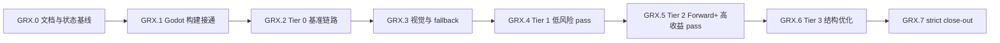

# GRX 执行计划 - Agent 接续任务分解

> 所属契约:[GRX_CONTRACT.md](GRX_CONTRACT.md)
> 版本:v2.28(2026-07-13)
> 粒度:1-2 天 / PR。每个任务只触碰一个子系统或一个 pass,必须有明确验证命令或 evidence JSON。

---

## 0. 总览与依赖

| 小里程碑 | 目标 | 主要输出 | 阻塞关系 |
|---|---|---|---|
| GRX.0 | 固化当前 scaffold 与接续文档 | 契约/计划/CI 三件套 | 无 |
| GRX.1 | Godot module 能 build/load/fallback | SCons detector、build log、DLL load smoke | 依赖当前 patch |
| GRX.2 | 建成 Tier 0 baseline 证据链 | scene generator、runner、baseline JSON | 依赖 GRX.1 |
| GRX.3 | 建成 visual diff 与 fallback telemetry | capture/diff、pass enable matrix | 依赖 GRX.2 |
| GRX.4 | 替换低风险 compute/effects pass | Tier 1 pass evidence | 依赖 GRX.3 |
| GRX.5 | 替换 Forward+ 高收益 pass | Tier 2 pass evidence | 依赖 GRX.4 |
| GRX.6 | 结构性优化 | fusion/cache/prewarm evidence | 依赖 GRX.5 |
| GRX.7 | 严格验收 | strict perf + visual close-out | 依赖全部 |

## 1. GRX.0 - 文档与状态基线

> 本阶段只维护 `milestones/grx/GRX_CONTRACT.md`、`GRX_PLAN.md`、`CI_GATES.md` 三件套,用于固化当前 scaffold 状态、后续任务拆分与 gate 规则;不实现任何 Godot pass,不跑 Godot build,不跑 benchmark,不宣称性能提升。

| Task ID | 目标 | 交付物 | 验证 | 接续说明 |
|---|---|---|---|---|
| 文档基线 | 固化当前 scaffold、任务拆分与 gate 口径 | 契约/计划/CI 三件套 | 文档内容自洽,且不把 Godot build/benchmark 写成已达成 | `GRX-001` 的执行归属见下方 `GRX.1` 表 |

## 2. GRX.1 - Godot 构建接通

| Task ID | 目标 | 交付物 | 验证 | 接续说明 |
|---|---|---|---|---|
| GRX-001 | 补充 SCons/toolchain detector,不安装全局依赖 | detector 脚本或 smoke 步骤,输出 SCons/MSVC/Windows SDK/DXC/Godot tree 状态与下一条可执行命令 | detector 在缺 SCons/MSVC 时返回明确 SKIP/FAIL reason;缺少 launcher 时 `recommended_scons_command` 必须为 `null`; `dxv.exe` 缺失记为后续 validation warning,不改系统环境 | fresh `godot_toolchain_probe.json` 已读取 build summary 的 path-overrides readiness 与 load smoke summary,当前接续已从 `GRX-003` 推进到 `GRX-004` |
| GRX-002 | 让 `modules/rurix_accel` 在 Godot tree 中完成可归档的 path-overrides rebuild evidence | 更新后的 patch + build log + artifact evidence | `git apply --check --directory=external/godot-master spike/godot-rurix/patches/*.patch`; `py -3 ci\godot_rurix_scons_build.py` | fresh `godot_scons_build_summary.json` 已记录 Godot exe、console exe、module lib 的 artifact evidence,且 `command` / `ice_workaround_command` 均包含 `disable_path_overrides=no`;summary 同时暴露 `required_scons_args_satisfied` / `path_overrides_ready` 供 probe 判定 |
| GRX-003 | Godot 启动加载 `rurix_godot.dll`,无 DLL 时 fallback 不崩 | DLL load smoke + fallback log + summary JSON | 有 DLL: session created 或因 D3D12 环境受限明确 `SKIP`; 无 DLL: process exits 0 and logs fallback,且若 missing-DLL 日志出现 session-ready marker 必须判失败并记录 `unexpected_markers` | fresh `godot_load_smoke_summary.json` 已验证 present/missing DLL 两条路径,smoke 项目文件只落在 `target/grx/godot-load-smoke`,且 `external/godot-master/bin` 旧 smoke 文件已按 marker/fingerprint 清理 |

**出口判据**:toolchain detector 输出明确 `build_ready`、`build_artifacts_ready`、`load_smoke_ready` 与下一条可执行命令;`GRX-002` summary 归档 Godot exe / console exe / module lib 的 artifact evidence,且 `command` / `ice_workaround_command` 明确包含 `disable_path_overrides=no`;`GRX-003` summary 归档 DLL present/missing 两条 smoke,且项目文件只落在 `target/grx/godot-load-smoke`;probe 在 fresh build + fresh load smoke evidence 完整后自动切到 `GRX-004` / `GRX.2`,而不是停留在 `run_grx003_load_smoke`;`RXGD_ABI_VERSION` mismatch 能禁用加速而不崩溃。

## 3. GRX.2 - Tier 0 基准链路

| Task ID | 目标 | 交付物 | 验证 | 接续说明 |
|---|---|---|---|---|
| GRX-004 | 生成 7 个 benchmark scene 的最小项目骨架 | Godot benchmark project generator + scenes + per-scene smoke evidence | fresh `target/grx/godot_bench_project_smoke_summary.json` 已记录 `scene_count=7`、`failure_count=0`,且 7 个 scene 都有独立 Godot load evidence | 已完成,下一步进入 `GRX-005 runner`;本项不等于 baseline/perf gate/visual diff/加速 pass 已完成 |
| GRX-004b | bench workload v2:场景负载真实化 + 重录 baseline | 重写 7 个 `_populate_scene()` 使每场景真实压其命名子系统(clustered lights / 独立 mesh 实例 / 材质变体 / auto-exposure+glow post FX / 体积雾+灯光 / GPU 粒子 / 混合)+ runner 增强(`--scenes`/`--profile`/`--leg`/`--pass-matrix`、`override.cfg` 生命周期、raw payload provenance + `pass_engagement`)+ `aggregate_perf_gate_input.py`(engagement 门 fail-closed)+ `workload_v2_calibration.md` | 生成器 + headless `bench_project_smoke.py` 全绿;7 场景 iter 校准落 ~193–260 FPS(RTX 4070 Ti @1080p,非 evidence);`aggregate_perf_gate_input.py` 对 null/不足 engagement 判 `engagement_valid=false` 拒出对比;旧 `baseline_full_20260708.json` `--kind baseline --strict --validate-only` 不回归 | 动机:v1 场景为 minimal skeleton 自述占位、对候选 pass 集敏感度为零、`auto_exposure` 从未开启 → 让 benchmark 测其声称要测的子系统。**gate 数学不变**(仍为同场景双腿对比、同 300/2000 采样、1.5/0.3/0.95 阈值,`perf_gate.py`/schema 未改);v1 baseline 保留为历史 artifact 不动。evidence 级 full baseline(3 次,安静机器上串行)在本卡之外另录;本卡不含任何性能提升宣称。**v2.1 场景消费者特效补齐(harness 缺口修复)**:`post_fx_chain`/`mixed_forward_plus` 开 SSAO(`Environment.ssao_enabled`)、`mixed_forward_plus`/`many_mesh_instances` 开 TAA(`Viewport.use_taa`)、`particles` 一个 emitter 设 `GPUParticles3D.DRAW_ORDER_VIEW_DEPTH`,使 ssao_blur(GRX-011)/taa_resolve(GRX-012)/particles_copy(GRX-013)候选 pass 在场景中有真实消费者;两腿同开(场景语义,非 pass opt-in)。runner 另补 `--godot-exe`/`RURIX_BENCH_GODOT_EXE` exe 参数化(与 `--patch-stack-id` 联动、双腿须同一 exe、`godot_exe`/`godot_exe_sha256` 入 summary)+ `VALID_PASS_MATRIX_KEYS` 补 ssao_blur 四键并预留 taa_resolve/particles_copy 键。**gate 数学与阈值不变**(仍同场景双腿对比、300/2000 采样、1.5/0.3/0.95;`perf_gate.py`/schema 未改);因场景负载变化,须以 `--profile full` 重录 baseline v2.1(重录本身在本卡之外另录,归主会话)。**workload v2.3 覆盖补齐(indirect MultiMesh + no-userdata particles + GPU timestamp 采集面)**:`many_mesh_instances` 增 RID 直连 INDIRECT MultiMesh 变体(`RenderingServer.multimesh_allocate_data(...,use_indirect=true)`,零引擎 patch,与标准 MultiMesh 并存=engage/fail-closed 对)给未来 gpu_culling rd_native 真实 engage 对象;`particles` 增一组无 userdata 自定义 process shader 的 GPUParticles3D(userdata_count==0 / stride 112,与标准 material emitter 并存)给 particles_copy rd_native no-userdata 子集真实 engage 对象;`run_benchmark_scenes.py` + autoload 增 `--gpu-timestamps` 开关(开时追加 Godot `--gpu-profile` 使 RenderingDevice 捕获 timestamp,autoload 按 RENDER_TIMESTAMP marker 名聚合 per-bucket count/mean/median/p95 µs 入 raw payload `gpu_timestamps`,相邻 marker gpu_time 差=bucket 时长、首尾差=帧 GPU 总时长,inf/nan sanity 丢弃入 `discarded_samples`,无数据字段缺省),两腿同开同口径。动机=让 benchmark 能测其声称要测的东西(gpu_culling / particles_copy rd_native 覆盖 + per-pass GPU 时间归因)。**gate 数学与阈值不变**(同场景双腿对比、300/2000 采样、1.5/0.3/0.95;`perf_gate.py`/schema 未改);旧 baseline v2.2 保留为历史 artifact,须以 `--profile full` 重录 baseline v2.3(重录本身在本卡之外另录)。本卡不含任何性能宣称 |
| GRX-005 | 实现 warmup 300 / sample 2000 / vsync off runner | runner + raw frame samples + runner summary | runner 顺序运行 7 个 scene,输出每帧 CPU frame time、GPU timestamp 显式 unavailable 标记、FPS/p95 | 已完成并硬化:runner 现扫描 Godot 日志 failure marker(对齐 `bench_project_smoke.py`),allowlist global script cache warning,其它 `ERROR / SCRIPT ERROR / Parser Error / Failed loading` 让该 scene fail,`per_scene_results` 记录 `failure_markers` / `warnings`,summary 增加 `warning_count`;固定 1920x1080、D3D12 Forward+、`gpu_timestamps_available=false`;当前 evidence 仍只是 quick-smoke,不做 baseline 对比 |
| GRX-006 | 写 baseline evidence JSON schema 与 perf gate 输入格式 | schema + sample baseline/result JSON | `py -3 spike/godot-rurix/bench/perf_gate.py <results.json>` 能解析;建设期可 FAIL 但格式正确 | 已完成并已 hardening:新增 `schemas/baseline_evidence.schema.json` + `schemas/perf_gate_input.schema.json`(draft-07),扩展 `perf_gate.py`(`--kind baseline/perf_gate`、`--strict`、`--validate-only`)。本轮 hardening 修复:strict forbidden marker 改词边界正则(命中 `SKIP: missing`/`skip-reason`/`status=SKIP`/`estimated:true`/`estimated local`,不误伤 `spike`/路径)、baseline reader 校验 `sample_count` 正整数且 `== sample_frames`、strict `thresholds` 三项固定值(1.5/0.3/0.95)防篡改;新增红测 `samples/perf_gate_forbidden_skip_example.json` 与 `samples/baseline_missing_sample_count_example.json`。严禁用 estimated 填 close-out,full baseline 实测与性能提升仍未完成 |

**出口判据**:`GRX-004` 已以 fresh per-scene smoke 收口;`GRX-005` runner 已交付 7 场景 raw frame sample JSON、runner summary(含 failure marker 扫描与 `warning_count`)并硬化;`GRX-006` 已交付并硬化 baseline/perf schema 与 strict perf gate 输入格式(可解析、strict 拒绝非法输入、forbidden marker 词边界正则、`sample_count` 对齐、`thresholds` 固定值);probe 现以 `grx006_schema_ready` 把 `next_action` 推进到 `start_grx007_visual_diff_scaffold`。full baseline 实测对比、真实 visual diff、实际加速 pass、性能提升声明仍留在后续任务,不得提前写成已完成;当前 runner evidence 仍只是 quick-smoke,不能作为 strict close-out 输入。

## 4. GRX.3 - 视觉与 fallback

| Task ID | 目标 | 交付物 | 验证 | 接续说明 |
|---|---|---|---|---|
| GRX-007 | 接入 reference frame capture 与视觉 diff | reference/Rurix capture + diff script | LDR absolute diff; HDR/temporal pass 用 SSIM/PSNR + temporal stability | 已完成 scaffold + hardening:`visual_diff.py` 与 `visual_diff_evidence.schema.json` 现禁止 `status=skip` 携带伪造 diff/帧路径(reference/candidate path、ldr/hdr/temporal diff 必须 null 或缺省),新增红测 `samples/visual_diff_skip_with_fake_ldr_example.json`(skip 带 ldr_diff 必 FORMAT FAIL);收尾 hardening:`status=pass` 帧若 reference/candidate 帧文件缺失、不可读、非合法 channel 文档、或两帧 channel 数量不一致,必须 DIFF FAIL 且非零退出,不再降级为 SKIP,`--write-output` 在任一 pass 帧算不出 diff 时拒绝写出 evidence,新增红测 `samples/visual_diff_pass_missing_frame_artifact_example.json`(pass 帧指向不存在帧文件必 DIFF FAIL);已有红绿保持:pass 缺 ldr_diff FORMAT FAIL、diff 不一致 DIFF FAIL、diff 一致 PASS、`--write-output` 生成 computed ldr_diff evidence;7 场景仍全部 SKIP,不写“视觉验证已通过” |
| GRX-008 | 接入 pass fallback telemetry | telemetry JSON + pass enable matrix | 强制某 pass 返回 fallback 时,Godot 原 pass 接管且 telemetry 记录原因 | 已完成 scaffold + hardening:`fallback_telemetry.py` 与 `fallback_telemetry.schema.json` 区分 scaffold 与 full——scaffold(`run_mode=scaffold`/`evidence_level=scaffold`)允许 timestamp/frame=null 但每 pass 必须 `enable_state=disabled` 且 `godot_fallback_active=true`;full(`run_mode=full` 或 `evidence_level=measured_local`)要求 timestamp 非空、frame 非负整数,measured_local 禁止 `pass_id` 以 `placeholder_` 开头(现 schema 与脚本双侧约束);新增红测 `samples/fallback_telemetry_full_null_timestamp_example.json` 与 `samples/fallback_telemetry_scaffold_fallback_inactive_example.json`,placeholder 仍 FORMAT PASS 且明确不是实际 telemetry。fallback 原因枚举:compile_failed,validation_failed,unsupported_device,visual_diff_failed,manual_disabled。此处仍为 scaffold/格式,不代表任何 pass 已接入或发生真实 fallback |

**出口判据**:每个 pass 都能单独 enable/disable;禁用或失败不会影响其它 pass 和 Godot 原路径。`GRX-007` scaffold 阶段所有 visual evidence 均为 SKIP/placeholder,不得据此宣称视觉验证通过;`GRX-008` scaffold 阶段所有 telemetry 均为 placeholder,不代表任何 pass 已接入或发生真实 fallback。`GRX-009` 准备、第一段 gated scaffold、第二段 core call-site fallback wiring、`segment 3a` historical raw-buffer offline compile success(保留在 `offline_compile_evidence_raw_buffer.json`;canonical `offline_compile_evidence.json` 当前 `status=compile_failed`,segment 4i texture-capable compile 失败因 patched llc 不支持 `llvm.dx.resource.load.texture.2d` intrinsic,canonical artifacts 路径携带 raw-buffer 字节复制自 `artifacts/raw_buffer_historical/`,manifest 顶层 `offline_compile_status=compile_failed`,current first blocker 是 `kernel_binding_kind_mismatch`,`math_pyramid_parity_not_proven` 仅 future-only)、`segment 3b` resource mapping scaffold ready、`segment 4a` runtime binding preflight ready 与 `segment 4b` gated dispatch bring-up ready 已完成;0004/0005/0006 patch applyability gate 均已纳入,其中 0005 必须在已应用 0004 的 scratch copy 中通过 stacked applyability 检查,0006 必须在已应用 0004+0005 的 scratch copy 中通过 stacked applyability 检查,且均不得污染 `external/godot-master`。当前 runtime 仍保持 disabled/fallback,manifest 仍记录 `runtime_state=fallback_only`、`real_gpu_pass=false`、`real_d3d12_dispatch_recorded=false`,bridge 对 luminance 即使 preflight 与 dispatch eligibility 全部通过、explicit dispatch gate 仍关闭并返回 fallback。`segment 4c` standalone real D3D12 dispatch smoke 已 success:`ci/grx009_luminance_d3d12_dispatch_smoke.py` 在真实 D3D12 adapter 上完成一次最小 compute dispatch(tracked luminance DXIL container + RTS0 root signature + descriptor layout,dispatch=1,1,1、fence_completed_value=1、dst UAV readback),evidence `real_d3d12_dispatch_smoke.json` 记录 `status=success`、`runtime_state=fallback_only`、`real_gpu_pass=false`,artifact hash 与 segment 3a offline evidence 一致。这是 standalone measured smoke evidence:bridge 仍不录制 dispatch,不让 `rxgd_record_pass` 返回 OK,不启用 Godot luminance Rurix path。`segment 4d` bridge real D3D12 dispatch recording smoke 已 success:新增默认关闭的 `d3d12-recording-shim` feature 与 harness-only flag `RXGD_CAP_LUMINANCE_DISPATCH_RECORD`,`ci/grx009_luminance_bridge_recording_smoke.py` 在真实 adapter 上经 bridge C ABI 录制一次最小 luminance compute dispatch,`bridge_dispatch_recording_evidence.json` 记 `status=success`(`rxgd_record_pass` 返回 `RXGD_STATUS_OK`、`recorded_passes=1`、`fallback_passes=0`、`gpu_time_ns=0`)。这是 test-only feature + harness-only record-arm 下的 measured bridge evidence:shipping(feature-off)bridge 与默认 Godot 路径仍 fallback,`godot_runtime_luminance_path_enabled=false`、`default_enable_state=disabled`、`gpu_timestamp_status=not_yet`,manifest 仍 `runtime_state=fallback_only`、`real_gpu_pass=false`、`real_d3d12_dispatch_recorded=false`。probe 采用 historical/cumulative predecessor gate,manifest 推进到 4b 后 3a/3b/4a/4c ready 仍为 true。`segment 4e` native D3D12 resource handle mapping 已 ready:栈式 patch 0007 把 Godot runtime luminance pass 传给 bridge 的资源从 logical RID id 改成真实 `ID3D12Resource*` native handle(`renderer_scene_render_rd.cpp` 经 `RenderingDevice::get_driver_resource(DRIVER_RESOURCE_TEXTURE, RID, 0)` 解析 `rb->get_internal_texture()` 与 `luminance_buffers->reduce[0]`,native handle 为 0 或 `RenderingDevice` 不可用时 fallback 到 Godot 原生 luminance path;hook 参数改名为 `p_source_native_handle`/`p_dest_native_handle`),`grx009_patch_0007_applyable=true`、`grx009_segment4e_native_resource_handle_mapping_ready=true`。本段只完成 native handle mapping + preflight/evidence:`RXGD_ABI_VERSION` 不变、Godot module 仍不设置 `RXGD_CAP_LUMINANCE_DISPATCH_RECORD`、shipping/feature-off bridge 仍 fallback,manifest 仍 `runtime_state=fallback_only`、`real_gpu_pass=false`、`real_d3d12_dispatch_recorded=false`。`segment 4f` Godot-runtime bridge dispatch recording smoke 已接线(栈式 patch 0008 + harness `ci/grx009_godot_runtime_bridge_recording_smoke.py` + **两个** tracked evidence + `grx009_patch_0008_applyable`/`grx009_segment4f_godot_runtime_bridge_recording_ready` probe gate):默认 `false` 的 `.../dispatch_recording_smoke` opt-in 与 module 侧 harness-only `RXGD_CAP_LUMINANCE_DISPATCH_RECORD` 让 Godot runtime luminance call site 可在 test-only opt-in + d3d12-recording-shim DLL 下驱动一次 bridge 录制并打印 `RXGD_GODOT_RUNTIME_LUMINANCE_RECORD` marker。evidence 分 latest 与 historical success:`godot_runtime_bridge_recording_evidence.json` 是 latest 证据,每次运行改写、未设 `RURIX_GRX009_SEGMENT4F_GODOT_EXE` 时诚实记 `status=skip`、本身不推进 readiness;`godot_runtime_bridge_recording_success_evidence.json` 是 historical measured success 证据,仅在严格 success 时写入(记录 Godot exe fingerprint、0001..0008 patch stack identity、DLL fingerprint、artifact hashes、`godot_exit_code_zero=true`、marker `recorded=1`,scratch build 二进制不入 Git),之后 SKIP/FAIL 绝不覆盖它。segment 4f readiness gate 只看 historical success 证据。该 runtime smoke 需完整 0001..0008 Godot scratch build(`RURIX_GRX009_SEGMENT4F_GODOT_EXE`)、真实 D3D12 device、MSVC、signed DXC 才 success,缺任一前置写明确 SKIP、不推进 readiness(当前本机 latest `status=skip`、historical success 证据缺失,`next_action` 保持 `start_grx009_godot_runtime_bridge_dispatch_recording_smoke`;录得 historical success 后推进到 `start_grx009_luminance_real_visual_diff_and_measured_fallback_telemetry`,此后 unset env var 重跑使 latest 回落 SKIP 时 readiness 不回退)。`RXGD_ABI_VERSION` 不变,默认(未开 opt-in)module 不设置 record flag,shipping/feature-off bridge 与默认 Godot config 仍 fallback。这不代表真实 GPU pass、默认 Godot runtime bridge-recorded D3D12 dispatch、真实 visual diff、measured telemetry、GPU timestamp 或性能提升已经完成。

## 5. GRX.4 - Tier 1 低风险 pass

| Task ID | 目标 | 交付物 | 验证 | 接续说明 |
|---|---|---|---|---|
| GRX-009 | luminance reduction pass | Rurix pass package + Godot mapping patch | visual diff + dispatch/barrier count + fallback red/green | 单 PR;不过门则默认 disabled。准备、第一段 gated scaffold 与第二段 core call-site fallback wiring 已落地:bridge `LuminanceReductionGate` 仍 fallback+ 栈式 0002 module patch+ 栈式 0003 core call-site patch+ callsite-wired disabled telemetry 样例。`segment 3a` historical raw-buffer offline compile 已 success(保留在 `offline_compile_evidence_raw_buffer.json`,latest evidence 产出 DXIL container、root signature 与 descriptor layout);canonical `offline_compile_evidence.json` 当前 `status=compile_failed`(`blocker_category=dxil_container_missing`、`runtime_mappable=false`、`attempted_binding_kinds=[texture2d,rwtexture2d]`)——segment 4i texture-capable kernel 源 `src/lib_texture.rx` 已就位但 patched llc 不支持 `llvm.dx.resource.load.texture.2d` intrinsic,canonical artifacts 路径携带 raw-buffer 字节复制自 `artifacts/raw_buffer_historical/`,manifest 顶层 `offline_compile_status=compile_failed`,runtime 仍为 `fallback_only`、`real_gpu_pass=false`,current first blocker 是 `kernel_binding_kind_mismatch`(bridge tracked package 仍为 raw-buffer),`math_pyramid_parity_not_proven` 仅 future-only。`segment 3b` resource mapping scaffold 已 ready:包含 `resource_mapping.md`、descriptor `b0/t0/u0`、64-bit integer shader capability gate 与 0004 patch applyability gate。`segment 4a` runtime binding preflight 已 ready 并保持。`segment 4b` gated dispatch bring-up 已 ready:`grx009_patch_0006_applyable=true`,`grx009_segment4b_gated_dispatch_bringup_inputs_ready=true`,`grx009_segment4b_gated_dispatch_bringup_ready=true`,0006 stacked applyability 已在已应用 0004+0005 的 scratch copy 中通过 `git apply --check`;新增默认 false 的 `dispatch_bringup` opt-in 与保留能力 flag `RXGD_CAP_LUMINANCE_DISPATCH_BRINGUP`(`RXGD_ABI_VERSION` 保持 1)。`segment 4c` standalone real D3D12 dispatch smoke 已 success:`ci/grx009_luminance_d3d12_dispatch_smoke.py` 在真实 D3D12 adapter 上把 tracked luminance DXIL container + RTS0 root signature + descriptor layout 完成一次最小 compute dispatch(RTS0 直建 root signature、DXIL 建 compute PSO、SRV t0/UAV u0/b0 绑定、dispatch=1,1,1、fence_completed_value=1、dst UAV readback),evidence `real_d3d12_dispatch_smoke.json` 记录 `status=success`、`runtime_state=fallback_only`、`real_gpu_pass=false`,artifact hash 与 segment 3a offline evidence 一致;`grx009_real_d3d12_dispatch_smoke_ready=true`,predecessor 3a/3b/4a ready 采用 historical 语义仍为 true。`segment 4d` bridge real D3D12 dispatch recording smoke 已 success:新增默认关闭的 `d3d12-recording-shim` feature(`build.rs`+`cc` 编译 `shim/rxgd_luminance_record.cpp` 并链接 `d3d12`/`dxgi`)与 harness-only flag `RXGD_CAP_LUMINANCE_DISPATCH_RECORD (1u << 2)`,`ci/grx009_luminance_bridge_recording_smoke.py` 在真实 adapter 上经 bridge C ABI 录制一次最小 luminance compute dispatch,`bridge_dispatch_recording_evidence.json` 记 `status=success`(`rxgd_record_pass` 返回 `RXGD_STATUS_OK`、`recorded_passes=1`、`fallback_passes=0`、`gpu_time_ns=0`、`checksum=0x4b95f515`),`grx009_bridge_real_d3d12_dispatch_recording_ready=true`。`segment 4e` native D3D12 resource handle mapping 已 ready:栈式 patch `0007-rurix-accel-luminance-native-resource-handle-mapping.patch` 把 Godot runtime luminance pass 传给 bridge 的资源从 logical RID id 改成真实 `ID3D12Resource*` native handle——`drivers/d3d12/d3d12_hooks.h` hook 参数改名为 `p_source_native_handle`/`p_dest_native_handle`,`renderer_scene_render_rd.cpp` Auto Exposure call site 用 `RenderingDevice::get_driver_resource(DRIVER_RESOURCE_TEXTURE, RID, 0)` 解析 `rb->get_internal_texture()`(source)与 `luminance_buffers->reduce[0]`(dest)的真实 native handle,native handle 为 0 或 `RenderingDevice` 不可用时 fallback 到 Godot 原生 luminance path,`modules/rurix_accel` 把真实 `ID3D12Resource*` 写入 `RxGdResource.native_handle` 并对 0 handle 走 fallback;`grx009_patch_0007_applyable=true`、`grx009_segment4e_native_resource_handle_mapping_ready=true`。manifest/evidence 保持 `runtime_state=fallback_only`、`real_gpu_pass=false`、`real_d3d12_dispatch_recorded=false`、`godot_runtime_luminance_path_enabled=false`、`default_enable_state=disabled`、`gpu_timestamp_status=not_yet`。下一步是 `start_grx009_godot_runtime_bridge_dispatch_recording_smoke`(用真实 native handle 从 Godot runtime path 驱动 bridge 录制),本次不开始;segment 4c/4d smoke 均是 measured evidence(4d 经 test-only feature + harness-only record-arm flag 录制),segment 4e 只完成 native handle mapping preflight,`RXGD_ABI_VERSION` 不变、Godot module 仍不设置 `RXGD_CAP_LUMINANCE_DISPATCH_RECORD`,不启用 Godot luminance Rurix path、不完成 Godot runtime pass,shipping/feature-off bridge 与默认 Godot 路径仍 fallback。`segment 4f` Godot-runtime bridge dispatch recording smoke 已接线:栈式 patch `0008-rurix-accel-luminance-godot-runtime-bridge-recording-smoke.patch`(叠在 0001..0007,scratch copy 校验)新增默认 `false` 的 `.../dispatch_recording_smoke` opt-in、module 侧 harness-only flag `RXGD_CAP_LUMINANCE_DISPATCH_RECORD (1u << 2)`(承载在 `RxGdCaps.flags`,`RXGD_ABI_VERSION` 保持 1)、仅 opt-in 开启时在 `try_create_session` 置 flag、`try_record_luminance_reduction` 仅 `rxgd_record_pass` 返回 OK 时打印 `RXGD_GODOT_RUNTIME_LUMINANCE_RECORD` marker;新增 harness `ci/grx009_godot_runtime_bridge_recording_smoke.py` 与**两个** tracked evidence:latest 证据 `godot_runtime_bridge_recording_evidence.json`(每次运行改写、未设 `RURIX_GRX009_SEGMENT4F_GODOT_EXE` 时诚实记 `status=skip`、本身不推进 readiness)与 historical measured success 证据 `godot_runtime_bridge_recording_success_evidence.json`(仅严格 success 时写入,记 Godot exe fingerprint、0001..0008 patch stack identity、DLL fingerprint、artifact hashes、`godot_exit_code_zero=true`、marker `recorded=1`,scratch build 二进制不入 Git;之后 SKIP/FAIL 绝不覆盖),probe 新增 `grx009_patch_0008_applyable=true`/`grx009_segment4f_godot_runtime_bridge_recording_inputs_ready=true`,并分别报告 latest smoke status 与 historical success readiness。该 runtime smoke 需真实 D3D12 device、MSVC、signed DXC 且 `RURIX_GRX009_SEGMENT4F_GODOT_EXE` 指向用完整 0001..0008 栈重建的 Godot scratch build(不得复用只带 0001+0002+0003 的 tracked build)才能 success,缺任一前置写明确 SKIP、不推进 readiness。segment 4f readiness gate 只看 historical success 证据、不看 reproducible-default SKIP 的 latest 文件(当前本机 latest `status=skip`、historical success 证据缺失,`grx009_segment4f_godot_runtime_bridge_recording_ready=false`,`next_action` 保持 `start_grx009_godot_runtime_bridge_dispatch_recording_smoke`;录得 historical success 后推进到 `start_grx009_luminance_real_visual_diff_and_measured_fallback_telemetry`,此后 unset env var 重跑使 latest 回落 SKIP 时 readiness 不回退)。默认(未开 opt-in)module 仍不设置 record flag,shipping/feature-off bridge 与默认 Godot config 仍 fallback,不启用 Godot luminance Rurix path、不完成 Godot runtime pass、不改 `real_gpu_pass`/`real_d3d12_dispatch_recorded`;real GPU pass、visual/perf/measured telemetry、GPU timestamp 仍属后续工作 |
| GRX-010 | tonemap pass | Rurix pass package + telemetry | LDR absolute diff + FPS/p95 scene delta | 先覆盖 post_fx_chain 和 mixed_forward_plus。已 close-out（复用 GRX-009 成熟模板，stage-A5 对等）:contract + hlsl_bridge offline kernel（`provenance=hlsl_bridge_workaround`、per-slot `texture2d/rwtexture2d`、Rurix-owned RTS0）+ fail-closed bridge `TonemapGate` + Godot patch 栈 `0001..0013`（0011 pass-gate+call-site、0012 runtime resource binding、0013 recording smoke + real-pass opt-in，均 scratch copy stacked applyability 通过）+ standalone real D3D12 dispatch smoke + **gated real-pass enablement strict MEASURED success**（`real_pass_enablement_success_evidence.json`，opt-in real dispatch 在 `0001..0013` scratch Godot 上真正执行且完成，`RXGD_GODOT_RUNTIME_TONEMAP_REAL_PASS` marker 入证，22 checks 全绿含 `forced_capability_downgrade` 红腿实测 `unsupported_device`，LDR visual gate `max_abs=0`，measured_local telemetry 通过 GRX-008 校验，`0001..0013` patch-stack/溯源/日志审计全绿）。manifest 如实翻转 `implemented=true`、`real_gpu_pass=true`、`real_d3d12_dispatch_recorded=true`、`runtime_state=fallback_only_by_default_real_pass_optin_measured`（opt-in 实测口径；默认路径仍 fallback-only），`default_enable_state` 保持 `disabled`。owner 默认启用决策 `real_pass_default_enable_decision.json`/`.md` 记 `keep_default_disabled`（无 per-pass FPS 证据、仅 `TONEMAPPER_LINEAR`+sRGB 子集、patch 0013 writeback 仍 scaffold + raster-vs-compute seam 未设计）。probe manifest 检查 fail-closed 放宽（仅当 strict success 存在且全量审计通过时接受新值），enablement + 决策双 ready 后 `next_action=start_grx011_ssao_blur_godot_patch_0014`。无 FPS、p95、GPU timestamp 或任何性能提升宣称；native Godot tonemapper 仍作 continuation/backstop；不改 `external/godot-master` |
| GRX-011 | SSAO/SSIL blur pass | Rurix pass package | visual diff + GPU timestamp | 注意 temporal/noise 稳定性。已 close-out（复用 GRX-009/GRX-010 成熟模板，stage-A5 对等）:contract + hlsl_bridge offline kernel（`provenance=hlsl_bridge_workaround`、per-slot `texture2d/rwtexture2d`、Rurix-owned RTS0）+ fail-closed bridge `SsaoBlurGate` + Godot patch 栈 `0001..0016`（0014 pass-gate+call-site、0015 runtime resource binding、0016 recording smoke + real-pass opt-in，均 scratch copy stacked applyability 通过）+ standalone real D3D12 dispatch smoke（CPU parity ~1 ULP）+ **gated real-pass enablement strict MEASURED success**（`real_pass_enablement_success_evidence.json`，`strict_success=true`，opt-in real dispatch 在 `0001..0016` scratch Godot 上真正执行且完成，candidate 腿 `RXGD_GODOT_RUNTIME_SSAO_BLUR_REAL_PASS recorded=1` + writeback scaffold marker 入证，`forced_capability_downgrade` 红腿实测 `runtime_binding_preflight_failed`/`unsupported_device`，LDR visual gate `max_abs=0`/`mean_abs=0`，measured_local telemetry 通过 GRX-008 校验，`0001..0016` patch-stack/溯源/日志审计全绿）。manifest 如实翻转 `implemented=true`、`real_gpu_pass=true`、`real_d3d12_dispatch_recorded=true`、`runtime_state=fallback_only_by_default_real_pass_optin_measured`（opt-in 实测口径；默认路径仍 fallback-only），`default_enable_state` 保持 `disabled`。owner 默认启用决策 `real_pass_default_enable_decision.json`/`.md` 记 `keep_default_disabled`（①无 per-pass FPS 证据②patch 0016 writeback 仍 scaffold，native ping-pong continuation 全量重跑、candidate bit-exact、无净收益③仅 `MODE_SMART` 单遍单 slice 子集，`MODE_WIDE`/`MODE_NON_SMART`/多 pass ping-pong/4-slice 循环/SSIL 未覆盖）。gate 模块 `ci/grx_gates/grx011_ssao_blur.py` decision+enablement 双 ready 后 probe `next_action=start_grx012_taa_resolve_pass_contract`。无 FPS、p95、GPU timestamp 或任何性能提升宣称；native Godot SSAO blur 仍作 continuation/backstop；`RXGD_PASS_SSIL_BLUR` 不接线;不改 `external/godot-master` |
| GRX-012 | TAA resolve pass | Rurix pass package | temporal stability diff + fallback red/green | 不得以单帧截图替代 temporal evidence。已 close-out（Wave 3，复用 GRX-009/010/011 成熟模板，stage-A5 对等）:contract + hlsl_bridge offline kernel（六资源 1:1 full-res texture，per-slot `texture2d/rwtexture2d`，Rurix-owned RTS0）+ fail-closed bridge `TaaResolveGate` + Godot patch 栈 `0001..0022`（0017 pass-gate+call-site、0018 runtime resource binding(六 native handle)、0019 recording smoke + real-pass opt-in，均 scratch copy stacked applyability 通过）+ standalone real D3D12 dispatch smoke + **gated real-pass enablement strict MEASURED success**（`real_pass_enablement_success_evidence.json`，`strict_success=true`，opt-in real dispatch 在 `0001..0022` scratch Godot 上真正执行且完成，candidate 腿 `RXGD_GODOT_RUNTIME_TAA_RESOLVE_REAL_PASS recorded=1` + writeback scaffold marker 入证，`forced_capability_downgrade` 红腿实测 `runtime_binding_preflight_failed`/`unsupported_device`）。**temporal 硬约束兑现**:连续 8 帧序列（非单帧截图）逐帧对 reference 腿 diff 全 `max_abs=0`（scaffold 逐帧 bit-exact），reference 序列 `nonzero_delta_pairs=7/7` 证携带真实运动。shim `typed_view_format` 扩充深度-模板 typeless 家族（`R32G8X24_TYPELESS`/`R24G8_TYPELESS`→depth-plane SRV 读格式）使六资源 record dispatch 完成。manifest 如实翻转 `implemented=true`、`real_gpu_pass=true`、`real_d3d12_dispatch_recorded=true`、`runtime_state=fallback_only_by_default_real_pass_optin_measured`，`default_enable_state` 保持 `disabled`。owner 决策 `real_pass_default_enable_decision.json`/`.md` 记 `keep_default_disabled`（无 per-pass FPS 证据、patch 0019 writeback 仍 scaffold（native 每帧重跑 resolve 并维护 history）、仅单 resolve 子集 + 一帧延迟 draw_graph 真替代未做）。gate 模块 `ci/grx_gates/grx012_taa_resolve.py` 双 ready 后 probe `next_action=start_grx013_particles_copy_pass_contract`。无 FPS、p95、GPU timestamp、时序稳定性或任何性能提升宣称；native Godot TAA resolve 仍作 continuation/backstop；不改 `external/godot-master` |
| GRX-013 | particles copy pass | Rurix pass package | particles scene perf + visual diff | 不过门则禁用该 pass。已 close-out（Wave 3，复用成熟模板，stage-A5 对等）:contract + hlsl_bridge offline kernel（两 structured buffer，per-slot `structured_buffer/rwstructured_buffer`，Rurix-owned RTS0）+ fail-closed bridge `ParticlesCopyGate` + Godot patch 栈 `0001..0022`（0020 pass-gate+call-site(cull-stage `particles_set_view_axis`，`!do_sort`)、0021 runtime structured-buffer 绑定、0022 recording smoke + real-pass opt-in，均 scratch copy stacked applyability 通过）+ standalone real D3D12 dispatch smoke + **gated real-pass enablement strict MEASURED success**（`real_pass_enablement_success_evidence.json`，`strict_success=true`，opt-in real dispatch 在 `0001..0022` scratch Godot 上真正执行且完成，candidate 腿 `RXGD_GODOT_RUNTIME_PARTICLES_COPY_REAL_PASS recorded=1` + writeback scaffold marker 入证，`dispatch=64x1x1`/`dst_bytes=327680`=4096*80，`forced_capability_downgrade` 红腿实测 `dispatch_eligibility_failed`/`unsupported_device`——注意 particles_copy 无 i64 preflight 故 forced 降级在下一级关口 fail-closed，与纹理 pass 不同，LDR visual gate `max_abs=0`/`mean_abs=0`）。场景 = 确定性 `GPUParticles3D`（fixed seed + fixed_fps，4096 粒子，`TRANSFORM_ALIGN_Z_BILLBOARD` 触发 cull-stage callsite，默认 `DRAW_ORDER_INDEX` 保 `do_sort=false`）。manifest 如实翻转 `implemented=true`、`real_gpu_pass=true`、`real_d3d12_dispatch_recorded=true`、`runtime_state=fallback_only_by_default_real_pass_optin_measured`，`default_enable_state` 保持 `disabled`。owner 决策 `real_pass_default_enable_decision.json`/`.md` 记 `keep_default_disabled`（无 per-pass FPS 证据、patch 0022 writeback 仍 scaffold（native 每帧重填全部 instance）、仅 FILL_INSTANCES 3D ALIGN_DISABLED/ALIGN_BILLBOARD 子集）。gate 模块 `ci/grx_gates/grx013_particles_copy.py` 双 ready 后 probe `next_action=start_grx014_cluster_store_pass_contract`。无 FPS、p95、GPU timestamp 或任何性能提升宣称；native Godot particles copy 仍作 continuation/backstop；不改 `external/godot-master` |

**出口判据**:Tier 1 全部通过各自视觉/fallback gate;任何单 pass 若 FPS 低于 baseline 95%,默认 disabled 并保留 evidence。

## 6. GRX.5 - Tier 2 Forward+ 高收益 pass

| Task ID | 目标 | 交付物 | 验证 | 接续说明 |
|---|---|---|---|---|
| GRX-014 | clustered light binning | Rurix pass + Godot resource mapping | clustered_lights scene FPS/p95 + visual diff | 这是 1.5x 目标主战场之一。已 close-out(Wave 4,stage-A5 对等,复用 GRX-013 成熟模板;范围=bake_cluster 的 compute merge(store)段,cluster_render 光栅段/buffer_clear/`render_element_count==0` early-out 永久留 native):contract 三件套 + hlsl_bridge offline kernel(三 structured buffer `cluster_render` SRV t0 + `render_elements` SRV t1 + `cluster_store` UAV u0,32 字节 b0 `ClusterStore::PushConstant` 镜像,整数精确 CPU parity)+ fail-closed bridge `ClusterStoreGate` + Godot patch 栈 `0001..0026`(0023 pass-gate+call-site、0024 三 buffer runtime binding、0025 recording smoke + real-pass opt-in,均 scratch stacked applyability 通过;0025 依 Wave 4 print 门控纪律:全部 per-dispatch stdout marker 挂 `dispatch_recording_smoke` 门,生产 `dispatch_real_pass` 路径零 per-dispatch stdout)+ standalone real D3D12 dispatch smoke(整数零容差)+ **gated real-pass enablement strict MEASURED success**(`ci/grx014_cluster_store_real_pass_enablement_smoke.py`,`real_pass_enablement_success_evidence.json` `strict_success=true`:opt-in real dispatch 在 `0001..0026` scratch Godot(Windows D3D12 Forward+,RTX 4070 Ti)上执行且完成,candidate 腿 `RXGD_GODOT_RUNTIME_CLUSTER_STORE_REAL_PASS recorded=1`+writeback scaffold marker+RECORD marker(candidate/forced 腿开 recording_smoke 以驱动 instrumentation)入证,forced 红腿实测 `dispatch_eligibility_failed`/`unsupported_device`(b0 全 u32 无 i64,forced 降级在 dispatch-eligibility 关口,GRX-013 同型),LDR visual gate `max_abs=0`/`mean_abs=0`)。场景 = 确定性 clustered-lights(5×5 lit box 网格 + 9 盏静态无阴影 OmniLight3D 保 `render_element_count>0`)。manifest 如实翻转 `implemented=true`、`real_gpu_pass=true`(opt-in 实测口径)、`real_d3d12_dispatch_recorded=true`、`runtime_state=fallback_only_by_default_real_pass_optin_measured`,`default_enable_state` 保持 `disabled`。owner 决策 `real_pass_default_enable_decision.json`/`.md` 记 `keep_default_disabled`(无 per-pass FPS 证据、patch 0025 writeback 仍 scaffold(shim submit 在帧命令序之外,native 每帧重打包全表)、仅 compute merge 段 + in-engine GPU parity pending)。gate 模块 `ci/grx_gates/grx014_cluster_store.py` 五级全 ready 后 probe `next_action=start_grx015_gpu_culling_pass_contract`。无 FPS、p95、GPU timestamp 或任何性能提升宣称;native Godot cluster store 仍作 continuation/backstop;不改 `external/godot-master` |
| GRX-015 | GPU culling | Rurix pass + indirect visibility buffers | many_mesh_instances scene draw/dispatch count + FPS/p95 | 必须保留 CPU fallback |
| GRX-016 | visible instance compaction | Rurix pass | visibility correctness + mixed scene perf | 与 GPU culling 依赖明确,不合并 PR |
| GRX-017 | material variant sorting | Rurix pass | material_variants scene PSO/cache miss proxy + FPS/p95 | 若 telemetry 不足,先补 telemetry。第一切片(telemetry-only)已落地(Wave 4):patch `0026-rurix-accel-material-sorting-telemetry.patch`(默认 false 设置 `rendering/rurix_accel/telemetry/material_sorting/enabled`;`RENDER_LIST_OPAQUE.sort_by_key()` 计时 + 复用既有 PSO-rebind / material_uniform_set 切换分支 O(1) 计数(`if constexpr` 限 COLOR pass,不新增遍历),每 30 帧一行 verbose-only `RXGD_MATERIAL_SORTING_TELEMETRY`;无 D3D12Hooks 虚函数、无 bridge 调用、无 kernel、无 gate 模块)。实测采样已归档 `spike/godot-rurix/passes/material_sorting_telemetry/`(telemetry_sample.json + README:material_variants 场景 17049 opaque 元素、sort ~1.0ms/帧、PSO 切换 ~32/帧、material uniform set 切换 ~2049/帧,标注 **measured 采样非 evidence 级 gate**)。decision=telemetry-only/keep_disabled:是否再做排序/批处理切片由后续依采样与 full baseline 判断;零性能宣称 |
| GRX-018 | indirect draw argument generation | Rurix pass | indirect args validation + scene perf | 任何 validation mismatch 立即 fallback |

**出口判据**:Tier 2 后重新跑 7 场景完整 benchmark;若 geomean 仍 <1.5,进入 GRX.6,不得提前 close-out。

## 7. GRX.6 - Tier 3 结构性优化

| Task ID | 目标 | 交付物 | 验证 | 接续说明 |
|---|---|---|---|---|
| GRX-019 | post FX fusion | fused pass package | post_fx_chain dispatch/barrier/VRAM traffic proxy + visual diff | 仅融合相邻 full-screen pass |
| GRX-020 | descriptor/root signature cache | cache implementation + telemetry | PSO/root signature churn 下降 + no ABI break | C ABI 变更必须 bump `RXGD_ABI_VERSION` |
| GRX-021 | pipeline prewarm | prewarm scheduling + telemetry | runtime PSO hitch 减少,p95 下降 | 不得增加启动失败率 |
| GRX-022 | bindless/resource-array 扩展 | Rurix binding/resource-array support | material/texture hot path benchmark | 若触及 compiler semantics,另行判档/RFC |

**出口判据**:Tier 3 后 strict benchmark 有机会通过;若仍未达 1.5x,继续拆新 pass,不得放宽门槛。

## 8. GRX.7 - strict close-out

| Task ID | 目标 | 交付物 | 验证 | 接续说明 |
|---|---|---|---|---|
| GRX-023 | 全场景 strict benchmark | final results JSON + raw samples | `py -3 spike/godot-rurix/bench/perf_gate.py <results.json>` PASS | 必须包含 scene-level baseline/rurix FPS 和 p95 |
| GRX-024 | 视觉证据汇总 | per-scene frame captures + diff report | all visual gates PASS | HDR/temporal pass 不得只用 LDR absolute diff |
| GRX-025 | 默认启用/禁用矩阵 | pass matrix + fallback policy | disabled pass 有原因和证据 | 不合格 pass 默认 disabled |
| GRX-026 | close-out 签署材料 | build log、perf_gate 输出、visual evidence、telemetry summary | GRX_CONTRACT §8 只追加 | 只有 strict 通过后才能写“显著提升已达成” |

## 9. Agent 接续规则

- 每个任务只触碰一个子系统或一个 pass。
- 每个 PR 必须列出输入文件、输出 artifact、验证命令。
- 每个 PR 必须说明失败时如何单独 revert 或禁用。
- 任何脚本新增都必须有 smoke 或 evidence JSON;不允许“脚本存在即完成”。
- 新 pass 必须至少包含一种真实红绿:pass 输出错误、禁用 fallback、视觉 diff 超阈值。
- 后续 agent 若发现任务过大,只能拆得更小,不得合并多个 pass 为一个不可回退 PR。

## 10. 修订记录

| 版本 | 日期 | 变更 |
|---|---|---|
| v1.0 | 2026-07-01 | 初版。按 1-2 天 / PR 拆分 GRX-000~GRX-026,锁定 GRX.0~GRX.7 执行顺序、首批任务卡、验证方式和接续规则。 |
| v1.1 | 2026-07-01 | 收紧 GRX.0 文档基线边界。把文档落地动作下沉为阶段说明,正式任务卡从 `GRX-001` 开始;明确本阶段不跑 Godot build/benchmark,也不宣称性能提升。 |
| v1.2 | 2026-07-01 | 继续收紧 GRX.1 边界:把 `GRX-001` 明确移入 `GRX.1` 执行范围,统一口径为 `GRX.0 = 文档基线`,`GRX.1 = detector/build/load`。 |
| v1.3 | 2026-07-01 | 收紧 `GRX-001` detector 输出口径:缺少 SCons launcher 时不再给出会失败的 `scons ...` 推荐命令,而是输出明确下一步;同时把 `dxv.exe` 缺失明确归类为后续 DXIL/device validation warning,不阻塞 `GRX-002` Godot SCons build。 |
| v1.4 | 2026-07-01 | 收口 `GRX.1` 当前状态:把 `GRX-002` 从抽象 build 目标推进到 artifact evidence 归档,明确本地已有 Godot exe/console exe/module lib,下一步由 probe 自动切到 `GRX-003`;同时细化 `GRX-003` 为 present-DLL 成功或明确 `SKIP`、missing-DLL `exit 0 + fallback log`,不进入 `GRX.2 benchmark`。 |
| v1.5 | 2026-07-01 | 完成 `GRX.1` close-out hardening 口径修正:明确 `GRX-001/002/003` 已有本地 success evidence,`godot_rurix_load_smoke.py` 的项目文件只能落在 `target/grx/godot-load-smoke`,missing-DLL case 需对 session-ready marker 做反向断言并记录 `unexpected_markers`,probe 在 build + load smoke evidence 完整后推进到 `GRX-004` / `GRX.2` 接续。 |
| v1.6 | 2026-07-01 | 以 fresh path-overrides rebuild / smoke evidence 完成 `GRX.1` 收口:明确 `GRX-002` 现以 `disable_path_overrides=no` 命令证据与 artifact evidence 为准,`GRX-003` 已 fresh 验证 present/missing DLL 两条路径并清理 `external/godot-master/bin` 旧 smoke 残留;probe 当前已稳定推进到 `GRX-004`,但未进入 benchmark 实现。 |
| v1.7 | 2026-07-01 | 收口 `GRX.2` 当前状态:明确 `GRX-004` 已以 fresh per-scene smoke 通过,下一步执行 `GRX-005` tracked runner;同时写死本次仍未完成 `GRX-006 baseline schema/perf gate`、visual diff、实际加速 pass 与任何性能提升声明。 |
| v1.8 | 2026-07-01 | 收口 `GRX-005` 硬化 / `GRX-006` 交付:`GRX-005` runner 增加 Godot 日志 failure marker 扫描与 `failure_markers` / `warnings` / `warning_count` 记录;`GRX-006` 完成 baseline/perf schema、`perf_gate.py` schema/strict/`--validate-only` 校验与两个样例 JSON。写死 full baseline 实测、visual diff、实际加速 pass 与性能提升声明仍未完成,当前 runner evidence 仍只是 quick-smoke。 |
| v1.9 | 2026-07-01 | 收口 `GRX-006` hardening / 接续 `GRX-007` scaffold:`perf_gate.py` 修复 strict forbidden marker 前缀漏判(改词边界正则)、baseline reader 补 `sample_count` 正整数且 `== sample_frames` 校验、strict `thresholds` 三项固定值(1.5/0.3/0.95)防篡改;新增两个红测样例;probe 以 `grx006_schema_ready` 推进 `next_action=start_grx007_visual_diff_scaffold`。`GRX-007` 进入 scaffold(capture/diff 脚本 + `visual_diff_evidence.schema.json` + placeholder),7 场景全部 SKIP;full baseline 实测、Rurix 加速 pass、真实 visual diff pass 与性能提升声明仍未完成。 |
| v2.0 | 2026-07-01 | 收口 `GRX-007` hardening / `GRX-008` scaffold hardening / 接续 `GRX-009` 准备:`GRX-007` 的 `visual_diff.py` 与 schema 禁止 `status=skip` 携带伪造 diff/帧路径,新增红测 `visual_diff_skip_with_fake_ldr_example.json`,保持既有 pass 缺 ldr_diff / diff 不一致 / diff 一致 / `--write-output` 红绿;`GRX-008` 的 `fallback_telemetry.py` 与 schema 区分 scaffold 与 full(scaffold 允许 timestamp/frame=null 但必须 disabled + fallback_active,full/measured_local 要求 timestamp/frame 非空非负、禁止 `placeholder_` pass_id),新增两个红测样例并保持 placeholder FORMAT PASS;probe 新增 `grx007_visual_ready`/`grx008_telemetry_ready`(跑红绿样例),GRX-008 ready 后 `next_action=start_grx009_luminance_reduction_pass_prep`。本轮不实现任何实际 Rurix 加速 pass,不宣称视觉验证、fallback 真接入或性能提升已完成。 |
| v2.1 | 2026-07-01 | 收尾 `GRX-007`/`GRX-008` hardening / 产出 `GRX-009` 准备:`GRX-007` 的 `visual_diff.py` 现让 `status=pass` 帧在 reference/candidate 帧文件缺失、不可读、非合法 channel 文档、或 channel 数量不一致时 DIFF FAIL 且非零退出(不再降级 SKIP),`--write-output` 在任一 pass 帧算不出 diff 时拒绝写出,新增红测 `visual_diff_pass_missing_frame_artifact_example.json`;`GRX-008` 的 `fallback_telemetry.schema.json` 补 `measured_local` 禁止 `placeholder_` pass_id 约束(schema 与脚本双侧一致);新增 GRX-009 准备产物 `spike/godot-rurix/passes/luminance_reduction/PASS_CONTRACT.md` 与 `pass_manifest.json`(仅调查 Godot luminance hook 路径/函数,不改 `external/godot-master`),probe 新增 `grx009_prep_ready` 并把 `next_action` 推进到 `start_grx009_luminance_reduction_pass_contract`(就绪后 `start_grx009_luminance_reduction_pass_implementation`)。GRX-009 仍只是准备,不是实际 pass 完成;本轮不实现任何实际 Rurix 加速 pass,不宣称视觉验证、fallback 真接入或性能提升。 |
| v2.2 | 2026-07-02 | 收口 GRX-009 准备 / 交付 gated implementation 第一段:修正文档滞后(准备已完成,下一步为 gated implementation 而非准备);`grx009_prep_ready` 加强为校验 manifest 记录的 Godot source/header/shader/call-site 文件存在于 `external/godot-master`(只读、不改快照);`src/rurix-godot` 新增 `LuminanceReductionGate`(默认 disabled,`request_enable` 恒 `compile_failed`,`rxgd_record_pass` 对 luminance 恒 `RXGD_STATUS_FALLBACK`,移除其占位 estimated GPU time,ABI v1 不变,新增两条单测);新增栈式 0002 module patch(per-pass 设置默认 false + `try_record_luminance_reduction()` 非 OK 即走 Godot 原生路径,仅 `modules/rurix_accel/*`)与 disabled telemetry 样例 `fallback_telemetry_luminance_disabled_example.json`;`ci/godot_rurix_bridge_smoke.py` 改为 patch 栈状态检查(base / 0001-only / 0001+0002,drift 即红)。GRX-009 pass 本体仍未实现:无真实 GPU pass、core call-site 未接线、无真实 visual diff、无 measured telemetry、不宣称性能提升。 |
| v2.3 | 2026-07-02 | 收口 GRX-009 第二段并接续 `segment 3a` 离线 compile evidence:修正 `GRX-009` 条目口径,明确当前已完成 segment 2 core call-site fallback wiring,下一步不再是 core 接线而是开始真实 GPU luminance pass 的离线 kernel/package 编译取证;只有真实 `DXIL + root signature + descriptor layout` artifact 齐备时才允许 manifest 进入 segment 3,否则保持 segment 2 并记录 compile blocker evidence。runtime 默认 disabled/fallback、真实 visual diff、measured telemetry 与性能提升声明仍未完成。 |
| v2.4 | 2026-07-02 | 修复 GRX-009 segment 3a artifact gate 计划口径:IR text / `ret void` entry shell 不再视为 ready;当前 evidence 为 `compile_failed/body_lowering_missing`,current artifacts 只描述 latest compile attempt,manifest 保持 segment 2,next action 指向真实 DXIL container/body lowering blocker,不进入 resource mapping。 |
| v2.5 | 2026-07-04 | 同步 GRX-009 segment 3b close-out 状态:segment 3a offline compile 已 success,segment 3b resource mapping scaffold 已 ready,0004 patch applyability gate 已纳入,下一步为 `start_grx009_luminance_segment4_runtime_binding`。runtime binding、真实 visual diff、measured telemetry、full measured_local perf evidence 与性能提升声明仍未完成。 |
| v2.6 | 2026-07-04 | 同步 GRX-009 segment 4a close-out 状态:runtime binding preflight 已完成,0005 stacked applyability gate 已纳入并通过 scratch copy 检查,下一步为 `start_grx009_luminance_segment4b_gated_dispatch_bringup`。本次不开始 segment 4b,bridge 仍 fallback-only,无 D3D12 dispatch、real GPU pass、真实 visual diff、measured telemetry、full measured_local perf evidence 或性能提升声明。 |
| v2.7 | 2026-07-04 | 同步 GRX-009 segment 4b close-out 状态:gated dispatch bring-up 已 ready,0006 stacked applyability gate 已纳入并在已应用 0004+0005 的 scratch copy 中通过 `git apply --check`,patch 栈扩为 0001..0006 六段,GRX.3 出口判据与 GRX-009 任务行下一步改为提供真实 D3D12 device dispatch smoke(`provide_grx009_luminance_real_d3d12_dispatch_smoke`)。segment 4b 只是"显式 opt-in、失败即 fallback"的接线就绪:manifest/evidence 保持 `runtime_state=fallback_only`、`real_gpu_pass=false`、`real_d3d12_dispatch_recorded=false`,explicit dispatch gate 关闭且 bridge 对 luminance 仍返回 `RXGD_STATUS_FALLBACK`;本次不开始 real D3D12 dispatch smoke,无 D3D12 dispatch、real GPU pass、真实 visual diff、measured telemetry、full measured_local perf evidence 或性能提升声明。 |
| v2.8 | 2026-07-04 | 同步 GRX-009 segment 4c standalone real D3D12 dispatch smoke success 状态:`ci/grx009_luminance_d3d12_dispatch_smoke.py` 在真实 D3D12 adapter(NVIDIA GeForce RTX 4070 Ti)上完成一次最小 compute dispatch(tracked luminance DXIL container + RTS0 root signature + descriptor layout,dispatch=1,1,1、fence_completed_value=1、readback_checksum=0x4b95f515),evidence `real_d3d12_dispatch_smoke.json` 记录 `status=success`、`runtime_state=fallback_only`、`real_gpu_pass=false`,artifact hash 与 segment 3a offline evidence 一致。GRX.3 出口判据与 GRX-009 任务行下一步由 `provide_grx009_luminance_real_d3d12_dispatch_smoke` 改为 `start_grx009_bridge_real_d3d12_dispatch_recording`;probe predecessor gate 改为 historical/cumulative,manifest 推进到 4b 后 3a/3b/4a ready 仍为 true。本次仅做一致性收口,不开始 bridge real D3D12 dispatch recording,不让 `rxgd_record_pass` 返回 OK,不启用 Godot luminance Rurix path;该 smoke 为 standalone measured evidence,不宣称 bridge-recorded D3D12 dispatch、real GPU pass、真实 visual diff、measured telemetry 或性能提升。 |
| v2.9 | 2026-07-04 | 同步 GRX-009 segment 4d bridge real D3D12 dispatch recording smoke success 状态:新增默认关闭的 `d3d12-recording-shim` feature（`src/rurix-godot` 经 `build.rs`+`cc` 编译 Windows-only C++ D3D12 录制 shim `shim/rxgd_luminance_record.cpp` 并链接 `d3d12`/`dxgi`）与 harness-only flag `RXGD_CAP_LUMINANCE_DISPATCH_RECORD (1u << 2)`（承载在既有 `RxGdCaps.flags`，`RXGD_ABI_VERSION` 保持 1），新增 `ci/grx009_luminance_bridge_recording_smoke.py`。真实 D3D12 adapter（NVIDIA GeForce RTX 4070 Ti）上 `bridge_dispatch_recording_evidence.json` 记 `status=success`：`rurix_godot.dll` 经 C ABI 录制一次最小 luminance compute dispatch（`rxgd_record_pass` 返回 `RXGD_STATUS_OK`、`recorded_passes=1`、`fallback_passes=0`、`gpu_time_ns=0`、`fence=1`、`checksum=0x4b95f515`），保持 `runtime_state=fallback_only`、`real_gpu_pass=false`、`real_d3d12_dispatch_recorded=false`、`godot_runtime_luminance_path_enabled=false`、`default_enable_state=disabled`、`gpu_timestamp_status=not_yet`。probe 新增 `grx009_bridge_real_d3d12_dispatch_recording_ready`，ready 后 `next_action=start_grx009_godot_native_resource_handle_mapping`；未 success 时保持 `start_grx009_bridge_real_d3d12_dispatch_recording`。默认 `cargo test -p rurix-godot` 仍不需 Windows SDK/D3D12 link 且保持 fallback。这是 bridge smoke，不是 Godot runtime pass，不宣称 visual diff、measured telemetry、GPU timestamp 或性能提升；不改 `external/godot-master`。 |
| v2.10 | 2026-07-04 | GRX-009 segment 4d evidence artifact hygiene:`ci/grx009_luminance_bridge_recording_smoke.py` 在 feature build 成功后记录当次 feature-built DLL 指纹 `dll_fingerprint`（`dll_path_at_run`/`dll_sha256`/`dll_size_bytes`/`dll_mtime_utc`/`build_profile=debug`/`features=["d3d12-recording-shim"]`），并把该 DLL 复制到 `target/grx009_bridge_recording_smoke/rurix_godot_d3d12_recording_shim.dll`（记 `snapshot_dll_path`/`snapshot_dll_sha256`；二进制在 `target/` 下 gitignored，不纳入 Git）。`ci/godot_rurix_toolchain_probe.py` 读取 evidence 中的 `dll_sha256`、重算当前 `target/debug/rurix_godot.dll` hash，新增 summary 字段 `grx009_bridge_recording_evidence_dll_sha256`/`grx009_bridge_recording_current_dll_sha256`/`grx009_bridge_recording_current_dll_matches_evidence`。因 `target/debug/rurix_godot.dll` 是 mutable artifact（feature-off `cargo build -p rurix-godot` 会原地覆盖），4d readiness 不把当前 DLL hash 纳入 gate：覆盖后 4d 仍 ready=true（historical measured evidence），probe 仅追加 warning 提示重跑 smoke 可刷新当前 artifact 指纹。本次只做证据卫生：不启用 Godot runtime pass，不改 ABI version，不开始 native handle mapping，不把 `real_gpu_pass` 改成 true，`next_action` 仍为 `start_grx009_godot_native_resource_handle_mapping`。 |
| v2.12 | 2026-07-05 | 执行 GRX-009 segment 4f Godot-runtime bridge dispatch recording smoke 接线并先修状态一致性:`pass_manifest.json` 的 `implementation_status.segment_detail` 由 `4b_gated_dispatch_bringup` 改为 `4f_godot_runtime_bridge_recording_smoke`(仍 `segment=4`、`runtime_state=fallback_only`、`real_gpu_pass=false`),CI_GATES §7 改写为 segment 4e ready、probe 下一步 `start_grx009_godot_runtime_bridge_dispatch_recording_smoke`。新增栈式 patch `0008-rurix-accel-luminance-godot-runtime-bridge-recording-smoke.patch`(叠在 0001..0007,scratch copy 校验,不污染 `external/godot-master`):默认 `false` 的 `rendering/rurix_accel/passes/luminance_reduction/dispatch_recording_smoke` opt-in、module 侧 harness-only flag `RXGD_CAP_LUMINANCE_DISPATCH_RECORD (1u << 2)`(`RxGdCaps.flags`,`RXGD_ABI_VERSION` 保持 1)、仅 opt-in 开启时在 `try_create_session` 置 flag、`try_record_luminance_reduction` 仅 `rxgd_record_pass` 返回 OK 时打印 `RXGD_GODOT_RUNTIME_LUMINANCE_RECORD` marker。新增 harness `ci/grx009_godot_runtime_bridge_recording_smoke.py` 与 evidence `godot_runtime_bridge_recording_evidence.json`;`ci/godot_rurix_patch_stack.py`/`ci/godot_rurix_bridge_smoke.py`/`ci/godot_rurix_toolchain_probe.py` 纳入 `grx009_patch_0008_applyable`/`grx009_segment4f_godot_runtime_bridge_recording_ready`,ready 后 `next_action=start_grx009_luminance_real_visual_diff_and_measured_fallback_telemetry`。runtime smoke 需完整 0001..0008 Godot scratch build(`RURIX_GRX009_SEGMENT4F_GODOT_EXE`)、真实 D3D12 device、MSVC、signed DXC 才 success,缺任一前置写明确 SKIP、不推进 readiness(当前本机 `status=skip`)。默认(未开 opt-in)module 不设置 record flag,shipping/feature-off bridge 与默认 Godot config 仍 fallback。本次只完成 segment 4f 接线:不启用默认 Godot luminance Rurix path、不完成 Godot runtime pass、不改 `RXGD_ABI_VERSION`、不把 `real_gpu_pass`/`real_d3d12_dispatch_recorded` 改成 true,不宣称 visual diff、measured telemetry、FPS、p95、GPU timestamp 或性能提升;不改 `external/godot-master`。 |
| v2.13 | 2026-07-06 | GRX-009 segment 4g preflight hardening + segment 4h gated real-pass enablement gate 落地:(a) 4g smoke/probe 加严——reference/candidate 双腿全量 stdout+stderr `runtime_log_audit`(只容忍带 rationale 的 `Could not load global script cache`,其余 `ERROR:` 一律 FAIL)、telemetry 条目强制 `enable_state=enabled`/`fallback_reason=validation_failed`/`godot_fallback_active=true`/`telemetry_frame == visual.capture_frame_index`(实测帧号),并补 stale frame / 错 reason / 错 state / 意外 ERROR 四类 red 回归;4g 证据经 hardened smoke 真机重测后保持 ready=true。(b) 新增 segment 4h:bridge 侧 `RXGD_CAP_LUMINANCE_REAL_PASS (1u << 3)`(ABI v1 不变)real-pass attempt 依次跑 preflight → eligibility → 新的 kernel-binding-kind conformance check(tracked segment 3a kernel 为 raw-buffer views(`target("dx.RawBuffer")`),Godot runtime 提供 Texture2D `ID3D12Resource*` 句柄,failing closed 即 `validation_failed`),任一失败返回 `RXGD_STATUS_FALLBACK` 并每 session 一次打印机读 `RXGD_REAL_PASS_BLOCKED first_missing_prerequisite=...` 诊断;栈式 patch `0009-rurix-accel-luminance-real-pass-optin.patch`(默认 false 的 `.../dispatch_real_pass` opt-in + harness-only `.../real_pass_force_capability_downgrade` 强制失败旋钮 + 仅 bridge 返回 OK 才打印的 `RXGD_GODOT_RUNTIME_LUMINANCE_REAL_PASS` marker);新增 harness `ci/grx009_segment4h_real_pass_enablement_smoke.py`(三腿 pass enable matrix:disabled_default / enabled_real_pass_optin / forced_capability_downgrade,measured_local LDR visual gate `max_abs<=2`/`mean_abs<=0.25`,GRX-008 telemetry,0001..0009 scratch 溯源审计,shipping feature-off DLL)与 latest/success 双证据 + schema + probe gate(`grx009_segment4h_real_pass_enablement_ready`、`grx009_patch_0009_applyable`)+ 全套 red 回归。**用 tracked artifact 严格 success 按设计不可达**:gate 如实上报 first missing prerequisite = runtime-mappable(texture-capable、math-parity)kernel artifact round。默认语义全程不变:pass 默认 `disabled`、`runtime_state=fallback_only`、`real_gpu_pass=false`、`RXGD_ABI_VERSION` 不变,不宣称 real GPU pass、visual 成功、measured telemetry 提升、FPS、p95、GPU timestamp 或任何性能提升;不改 `external/godot-master`。 |
| v2.14 | 2026-07-08 | 执行 GRX-009 segment 4k descriptor/RTS0 cross-check 小步:新增 smoke/evidence/probe gate,证明 `artifacts/dxc_texture_bridge/descriptor_layout.json` 与 `root_signature.rts0.bin` 来自同一套 Rurix binding layout 语义,重新 serialize 的 RTS0 与 tracked RTS0 byte-for-byte match。probe 下一步推进到 `define_grx009_texture_artifact_provenance_policy`。runtime/canonical 仍 fail-closed:`provenance=hlsl_bridge_workaround`,`rurix_owned=false`,`runtime_mappable=false`,`real_gpu_pass=false`,`canonical_artifact_replaced=false`,`offline_compile_evidence.json status=compile_failed`,canonical descriptor 仍 `raw_buffer_view`;不推进 real pass、visual、GPU timestamp、FPS 或性能。 |
| v2.16 | 2026-07-08 | GRX-009 stage A5 收口:segment 4h gated real-pass enablement 取得 strict MEASURED success——`real_pass_enablement_success_evidence.json` 记录 opt-in real dispatch(`enabled`+`dispatch_bringup`+`dispatch_real_pass`,均默认 false)在 0001..0010 scratch Godot(NVIDIA GeForce RTX 4070 Ti)上真正执行且完成(`RXGD_GODOT_RUNTIME_LUMINANCE_REAL_PASS` marker 入证),LDR visual gate 保持绿(max_abs=0),`forced_capability_downgrade` 红腿实测 `unsupported_device`,measured_local telemetry 通过 GRX-008 校验,0001..0010 patch-stack/溯源/日志审计全绿。patch `0010-rurix-accel-luminance-real-pass-result-writeback.patch`(result writeback scaffold)入栈:level-0 结果 dispatch 进真实 `luminance_buffers->reduce[0]`,native Godot luminance path 仍作 continuation/backstop 重渲染全部级别(画面不可能变、Rurix dispatch 尚无净收益)。canonical package 为 owner-approved HLSL bridge texture package(`texture_artifact_provenance_policy.json`)。owner 默认启用决策 `real_pass_default_enable_decision.json`/`.md` 记 `keep_default_disabled`:无 per-pass FPS 证据(契约要求 per-pass FPS >= 0.95x baseline 才可默认 enable)、0010 writeback 仍是 scaffold、math parity GPU 腿仅 level-0 CPU-proven pending multi-level;full baseline + per-pass benchmark 后复评。manifest 顶层如实翻转:`status=stage_a5_real_pass_measured_success_default_disabled`、`implemented=true`、`real_gpu_pass=true`(opt-in 实测口径;默认路径仍 fallback-only)、`runtime_state=fallback_only_by_default_real_pass_optin_measured`、`default_enable_state` 保持 `disabled`;probe manifest 检查 fail-closed 放宽(仅当 4h strict success 存在且全量审计通过时接受新值,否则仍要求旧值),新增决策文件校验 gate,4h + 决策双 ready 后 `next_action` 由 `design_grx009_luminance_real_pass_default_enable_decision` 推进到 `start_grx010_tonemap_pass_contract`。无 FPS、p95、GPU timestamp 或任何性能提升宣称。 |
| v2.15 | 2026-07-08 | 执行 GRX-009 segment 4l texture artifact provenance policy 小步:新增 owner-approved provenance policy(`texture_artifact_provenance_policy.json` + `.md`,`policy_ready=true`)与 `ci/grx009_texture_artifact_provenance_policy_smoke.py`,把 `dxc_texture_artifact_bridge.md` §Canonical Switch Conditions 补上 owner exception 段(`provenance=hlsl_bridge_workaround`+`rurix_owned=false` 可作**临时** runtime-mappable canonical,前提是 RTS0 保持 Rurix-synthesized、descriptor binding_kind=texture2d/rwtexture2d、DXV pass、descriptor/RTS0 cross-check byte-for-byte green、HLSL source SHA-256/DXC version 记录在案)。probe 新增 `grx009_texture_artifact_provenance_policy_ready` 与红绿回归,cross-check + policy 双 ready 后 `next_action=provide_grx009_runtime_mappable_luminance_kernel_artifact`。runtime/canonical 仍 fail-closed:`runtime_mappable=false`,`real_gpu_pass=false`,`canonical_artifact_replaced=false`,`offline_compile_evidence.json status=compile_failed`,canonical descriptor 仍 `raw_buffer_view`;不推进 real pass、visual、GPU timestamp、FPS 或性能。 |
| v2.17 | 2026-07-08 | GRX 阶段 B 收尾:full baseline measured 完成 + GRX-007 bench 层 reference capture 实装。7 场景 full baseline benchmark 已实测(run_id=`20260708T134948Z_full`,warmup 300 / sample 2000 / 1920x1080 / vsync false / measured_local,7 场景全 success),新增 `spike/godot-rurix/bench/aggregate_baseline_evidence.py` 聚合为入库 baseline evidence `spike/godot-rurix/bench/baseline/baseline_full_20260708.json`(per-scene raw JSON hash-pin,通过 `perf_gate.py --kind baseline --strict --validate-only`)。`capture_reference_frames.py` 由 scaffold 改为真实 capture backend:tracked Godot exe D3D12 Forward+ 跑 7 场景各截一帧确定性 reference(fixed-fps、固定帧 600、256x144),输出 `target/grx/godot-visual/reference/<scene>.rgb8` + `capture_summary.json`,并经 `visual_diff.py --write-output` 生成 7 场景全 pass 的 reference-capture 自比对 visual evidence(LDR self-diff 全 0);本机 7 场景 capture 全部 success,无 SKIP。baseline 只是单配置基线、visual evidence 只是 capture 管线自比对基线:不构成 baseline-vs-Rurix 对比、pass 视觉验证或任何性能提升宣称。 |
| v2.18 | 2026-07-08 | 启动 GRX 阶段 C1 / GRX-010 tonemap pass segment A(完全复用 GRX-009 成熟模板,一次切片完成 contract + offline kernel + bridge gate + patch + standalone dispatch smoke):(a) 新增 pass 目录 `spike/godot-rurix/passes/tonemap/`(PASS_CONTRACT.md 调查 Godot tonemap hook/call site/资源流:`tone_mapper.cpp:117` raster fullscreen fragment 入口、`renderer_scene_render_rd.cpp` `_render_buffers_post_process_and_tonemap` Tonemap 段 L826 `can_use_storage` 腿为注入点;pass_manifest.json、resource_mapping.md、rurix.toml、src/lib.rx forward-looking 数学源)。(b) HLSL bridge kernel `artifacts/hlsl_bridge/tonemap_apply.hlsl`(**仅支持 TONEMAPPER_LINEAR + convert_to_srgb 子集**,gaps 逐条入账:Reinhard/Filmic/ACES/AgX、auto exposure、glow、FXAA、BCS、color correction、debanding、HDR 输出、raster-vs-compute 接缝均不支持):DXC cs_6_0 编译 + DXV 验证 + 新 example `emit_grx010_tonemap_rts0` 合成 Rurix-owned RTS0(28-byte b0:source_width/source_height i64 + exposure/white/luminance_multiplier f32,打包形状与 GRX-009 canonical 相同)+ descriptor layout(per-slot `texture2d`/`rwtexture2d` binding_kind),`offline_compile_evidence.json` 记 `status=success`、`provenance=hlsl_bridge_workaround`、`runtime_mappable=true`(GRX-009 owner provenance 政策适用于所有 texture compute pass)、`rurix_owned=false`;`math_parity_evidence.json` CPU float32 reference(linear+sRGB,`pending_gpu_dispatch`)。(c) bridge `TonemapGate`(`src/rurix-godot/src/lib.rs`,模板复制 `LuminanceReductionGate` 的 preflight→eligibility→binding-kind→math-parity→real-dispatch 链,常量/digest 指向 tonemap 产物;dst 形状为 1:1 full-res;新 opt-in flag `RXGD_CAP_TONEMAP_REAL_PASS (1u << 4)` 复用 `RxGdCaps.flags` 位,ABI v1 不变;`rxgd_record_pass` 对 `RXGD_PASS_TONEMAP` 接线,默认路径恒 `RXGD_STATUS_FALLBACK`,**移除历史占位 estimated-timing 路径**,shipping feature-off bridge 在 opt-in arm 上 fail closed 为 `real_dispatch_path_not_linked` 并打印每 session 一次的 `RXGD_TONEMAP_REAL_PASS_BLOCKED` 机读诊断;shim 参数化复用:`d3d12-recording-shim` feature 下经共享 texture-pass 录制入口挂 tonemap DXIL/RTS0 内嵌字节;12 条新单测红绿)。(d) Godot patch `0011-rurix-accel-tonemap-pass-gate-and-callsite.patch`(栈式叠 0001..0010,scratch copy `git apply --check` 通过;默认 false 的 `rendering/rurix_accel/passes/tonemap/enabled` + `try_record_tonemap()` module gate + 默认 false 的 `D3D12Hooks::try_record_tonemap()` 虚函数 + Tonemap call-site opt-in gate,原生 tonemapper 路径始终保留 fallback;本切片不做 scratch 全栈重建与引擎内实测)。(e) CI:`ci/grx010_tonemap_offline_compile_smoke.py`(实测 PASS)+ `ci/grx010_tonemap_d3d12_dispatch_smoke.py` standalone 真实 dispatch smoke(实测 success:RTX 4070 Ti,RTS0 直建 root signature、tracked DXIL 建 compute PSO、SRV t0/UAV u0/b0 绑定、dispatch 1,1,1、fence 完成、readback 首像素与 CPU reference `linear_to_srgb(1.0*1.0*0.5)=0.735357` 逐分量一致 match=1,evidence `real_d3d12_dispatch_smoke.json`);probe 新增 `grx010_tonemap_contract_ready`/`grx010_patch_0011_applyable`/`grx010_tonemap_d3d12_dispatch_smoke_ready` gate 与 next_action 链(contract 未就绪保持 `start_grx010_tonemap_pass_contract`→`fix_grx010_tonemap_patch_0011_applyability`→`provide_grx010_tonemap_real_d3d12_dispatch_smoke`→全绿后 `start_grx010_tonemap_runtime_resource_binding`),validation 回归新增 grx010 红绿 case(tampered offline hash / SKIP smoke 不推进);`godot_rurix_patch_stack.py`/`godot_rurix_bridge_smoke.py` 纳入 0010/0011 stacked 检查与 TonemapGate marker。本切片 measured 上限为 standalone dispatch + CPU parity:pass 默认 `disabled`、manifest `implemented=false`、`runtime_state=fallback_only`、`real_gpu_pass=false`,遗留段为 runtime 资源绑定(0005/0007 级)、runtime bridge recording(4f 级)、引擎内 visual diff + telemetry(4g 级)、gated real-pass enablement(4h 级)与其余 tonemapper 模式;无 FPS、p95、GPU timestamp 或任何性能提升宣称;不改 `external/godot-master`。 |
| v2.11 | 2026-07-04 | 同步 GRX-009 segment 4e native D3D12 resource handle mapping 状态:新增栈式 patch `0007-rurix-accel-luminance-native-resource-handle-mapping.patch`(叠在 0001..0006 之后,scratch copy 校验,不污染 `external/godot-master`),把 Godot runtime luminance pass 传给 bridge 的资源从 logical RID id 改成真实 `ID3D12Resource*` native handle:`drivers/d3d12/d3d12_hooks.h` hook 参数改名为 `p_source_native_handle`/`p_dest_native_handle`;`renderer_scene_render_rd.cpp` Auto Exposure call site 用 `RenderingDevice::get_driver_resource(DRIVER_RESOURCE_TEXTURE, RID, 0)` 解析 `rb->get_internal_texture()`(source)与 `luminance_buffers->reduce[0]`(dest)的真实 native handle,native handle 为 0 或 `RenderingDevice` 不可用时 fallback 到 Godot 原生 luminance path;`modules/rurix_accel` 把真实 `ID3D12Resource*` 写入 `RxGdResource.native_handle` 并对 0 handle 走 fallback。底层接缝 `RenderingDevice::get_driver_resource` → `RenderingDeviceDriverD3D12::get_resource_native_handle` 返回 `ID3D12Resource*`。`ci/godot_rurix_patch_stack.py`/`ci/godot_rurix_bridge_smoke.py`/`ci/godot_rurix_toolchain_probe.py` 新增 `grx009_patch_0007_applyable` 与 `grx009_segment4e_native_resource_handle_mapping_ready`,ready 后 GRX.3 出口判据与 GRX-009 任务行下一步由 `start_grx009_godot_native_resource_handle_mapping` 改为 `start_grx009_godot_runtime_bridge_dispatch_recording_smoke`。本段只完成 native handle mapping + preflight/evidence:不启用默认 Rurix luminance runtime pass、不让 shipping/feature-off bridge 返回 OK、`RXGD_ABI_VERSION` 不变、Godot module 仍不设置 `RXGD_CAP_LUMINANCE_DISPATCH_RECORD`,manifest 保持 `runtime_state=fallback_only`、`real_gpu_pass=false`、`real_d3d12_dispatch_recorded=false`、`godot_runtime_luminance_path_enabled=false`、`default_enable_state=disabled`;不宣称 real GPU pass、visual diff、telemetry 或性能提升;不改 `external/godot-master`。 |
| v2.20 | 2026-07-11 | GRX-004b bench workload v2:把 7 个 benchmark 场景从 minimal skeleton(v1 baseline ~1700–2700 FPS、对候选 pass 集零敏感、`auto_exposure` 从未开启)重写为真实压各自命名子系统的确定性负载(固定 per-scene RNG seed):`clustered_lights`=512 omni+384 spot 重叠灯(per-type cluster 容量 512、溢出静默丢弃无 ERROR)+625 受光盒;`many_mesh_instances`=20 万独立 `MeshInstance3D`+6 万 `MultiMesh`(`use_indirect` 因 tracked Godot `multimesh.h` 无该属性留 `TODO(GRX-015/016/018)`+普通 MultiMesh 成分);`material_variants`=2048 材质变体(切换 shader feature 位以产不同 PSO)×4.5 万打乱提交实例;`post_fx_chain`=`auto_exposure`(经 `CameraAttributesPractical`+`WorldEnvironment.camera_attributes`,使 luminance 减小 pass 真触发)+7 级 glow+FILMIC+2.0x 内部超采样+400 emissive 球+48 omni;`volumetric_fog`=密雾(density 0.1)+400 重叠 omni+500 柱(该场景无对应加速 pass,负载故意来自灯光/几何供其他 pass 吃);`particles`=60 万 GPU 粒子(12 emitter);`mixed_forward_plus`=按比例混合。RTX 4070 Ti @1080p iter 校准全落 ~193–260 FPS 目标带(见 `spike/godot-rurix/bench/workload_v2_calibration.md`,标注非 evidence)。`SCENE_NOTES` 同步改写去除 placeholder 措辞。runner 增强(向后兼容,无新参数行为不变):`--scenes` 子集、`--profile full\|iter`(iter=120/600,`run_mode=iter` 物理进不了 strict gate)、`--leg baseline\|rurix`+`--pass-matrix`(rurix 腿运行前写 `override.cfg`(`[rendering]` 下键取自 patch 0001..0013 的 `rendering/rurix_accel/*` GLOBAL_GET 键名,fail-closed allowlist)、运行后删、baseline 腿断言无 `override.cfg`)、raw payload 增 `leg`/`pass_matrix`(echo)/`dll_sha256`/`godot_exe_sha256`/`patch_stack_id`(取不到记 null+note)/`pass_engagement`(per-pass recorded/fallback,兼容每帧 marker 与退出汇总两形态,解析不到记 null);gd.tmpl 同增 `--leg`/`--pass-matrix-path` 与 payload 字段。新增 `spike/godot-rurix/bench/aggregate_perf_gate_input.py`(baseline evidence + rurix 腿 summary → perf_gate 输入,严格对齐 `--kind perf_gate` schema、strict 禁 skip/estimated、自校验;engagement 门:rurix 腿 pass_matrix 非空但 engagement 为 null/recorded 不足采样帧数 → `engagement_valid=false` 且拒出对比、写诊断,宁 invalid 勿假对比;dev/iter run_mode 直接拒)。**gate 数学与阈值不变**(同场景双腿对比、300/2000 采样、1.5/0.3/0.95;`perf_gate.py` 与 schema 未改);v1 baseline `baseline/baseline_full_20260708.json` 保留为历史 artifact 不动(`--kind baseline --strict --validate-only` 不回归);`aggregate_baseline_evidence.py` 对 v2 enriched raw payload 不回归。evidence 级 full baseline(3 次,安静机器上串行)在本卡之外另录;无 FPS/p95/GPU timestamp 或任何性能提升宣称;不改 `external/godot-master`。 |
| v2.21 | 2026-07-12 | GRX-011 ssao_blur close-out(Wave 2,stage-A5 对等,复用 GRX-009/GRX-010 成熟模板)+ 本 wave 既有 pass 事实收录:(a) **GRX-011 ssao_blur**——gated real-pass enablement 取得 strict MEASURED success(`real_pass_enablement_success_evidence.json`,`strict_success=true`:opt-in real dispatch 在 `0001..0016` scratch Godot(Windows D3D12 Forward+,RTX 4070 Ti)上执行且完成,candidate 腿 `RXGD_GODOT_RUNTIME_SSAO_BLUR_REAL_PASS recorded=1` + writeback scaffold marker 入证,checks 全绿含 `native_continuation_writeback_scaffold`/`real_pass_dispatched_and_completed`,`forced_capability_downgrade` 红腿实测 `runtime_binding_preflight_failed`/`unsupported_device`,LDR visual gate `max_abs=0`/`mean_abs=0`,measured_local telemetry 通过,`0001..0016` 溯源/日志审计全绿);栈式 patch `0014`(pass-gate + call-site)/`0015`(runtime resource binding `RenderingDevice::get_driver_resource` 真实 `ID3D12Resource*`)/`0016`(默认 false `dispatch_real_pass`/`dispatch_recording_smoke`/`real_pass_force_capability_downgrade` opt-in + `RXGD_CAP_SSAO_BLUR_REAL_PASS`(1u<<5) + `d3d12-recording-shim` real dispatch path,`RXGD_ABI_VERSION` 保持 1)入栈;manifest 顶层如实翻转(`status=grx011_real_pass_measured_success_default_disabled`、`implemented=true`、`real_gpu_pass=true` opt-in 实测口径、`real_d3d12_dispatch_recorded=true`、`runtime_state=fallback_only_by_default_real_pass_optin_measured`、`default_enable_state` 保持 `disabled`),新增 `implementation_status.real_pass_measured_success` block;owner 决策 `real_pass_default_enable_decision.json`/`.md` 记 `keep_default_disabled`(①无 per-pass FPS 证据②patch 0016 writeback 仍 scaffold、native ping-pong continuation 全量重跑、candidate bit-exact、无净收益③仅 `MODE_SMART` 单遍单 slice 子集);表驱动 gate 模块 `ci/grx_gates/grx011_ssao_blur.py`(contract/patch/dispatch-smoke/enablement/decision 五级 fail-closed)decision+enablement 双 ready 后 probe `next_action` 由 `start_grx011_ssao_blur_godot_patch_0014` 推进到 `start_grx012_taa_resolve_pass_contract`,`grx_gate_module_error` 消除。(b) **GRX-009 luminance 真替代(4h 重签)**——patch 0010 原地由 level-0 result-writeback *scaffold* 改为真实**多级 luminance pyramid** writeback(`hook_contract_v2.md`:`[source, reduce[0..L-1], current, prev]` native-handle 数组 + 新增默认 false `try_record_luminance_pyramid()` 虚函数,既有 `try_record_luminance_reduction()` 签名字节不变;Godot cascade byte-for-byte floor 规则 `MAX(dim/8,1)`),candidate stdout 记 `levels=pyramid` + `native_continuation=skipped real=1 one_frame_latency=1`(真实替代、非 scaffold),LDR visual gate 保持 bit-exact `max_abs=0`(fixed-frame capture 在 auto-exposure EMA 收敛后取);one-frame latency 为 `declared_not_measured`(文档化于 patch 0010/marker/bridge 契约,本 harness 不跨帧指纹);patch 0010 字节变更故 4h success evidence 经 scratch rebuild 重签(patch 号不变,PATCH_ALLOCATION §4 规则2)。(c) **GRX-010 tonemap 重签**——tonemap 4h success evidence 对新 shim-v2 DLL 重签(`dll_sha256` 更新),仍 `native_continuation_writeback_scaffold`=true(writeback scaffold 不变)、bit-exact、`default_enable_state=disabled`。(d) **shim v2 / typeless 防护**——`src/rurix-godot/shim/rxgd_luminance_record.cpp` 升级为参数化执行模型 + `typed_view_format` typeless→typed 映射(如 `R8G8_TYPELESS→R8G8_UNORM`,补齐 R8G8/deinterleaved slice 家族)+ `format_is_typeless` fail-closed 守卫(以 typeless format 建 SRV/UAV 是移除设备的非法 D3D12 调用,无法映射即干净 fallback)。(e) **workload v2 baseline**——GRX-004b workload v2 evidence 级 full baseline(3 次 full 取中位 + 方差留档)已随本 wave 落地(见 commit `eb918c8`;v2.20 已记 workload v2 场景真实化)。**全程 default disabled、fallback-only、零性能宣称**:无 FPS、p95、GPU timestamp 或任何性能提升宣称;不改 `external/godot-master`;luminance/tonemap 的证据与 patch 由各自 wave 提交,本条只如实收录。 |
| v2.22 | 2026-07-12 | GRX-012 taa_resolve + GRX-013 particles_copy 双 close-out(Wave 3,stage-A5 对等,复用 GRX-009/010/011 成熟模板):**GRX-012 taa_resolve** gated real-pass enablement 取得 strict MEASURED success(`real_pass_enablement_success_evidence.json`,`strict_success=true`:opt-in real dispatch 在 `0001..0022` scratch Godot(Windows D3D12 Forward+,RTX 4070 Ti)上执行且完成,candidate 腿 `RXGD_GODOT_RUNTIME_TAA_RESOLVE_REAL_PASS recorded=1`+writeback scaffold marker 入证,`forced_capability_downgrade` 红腿实测 `runtime_binding_preflight_failed`/`unsupported_device`);**temporal 硬约束(GRX_PLAN DoD)兑现**——连续 8 帧序列(非单帧截图)逐帧对 reference diff 全 `max_abs=0`(scaffold 逐帧 bit-exact),reference 序列 `nonzero_delta_pairs=7/7` 证携带真实运动;栈式 patch `0017`(pass-gate+call-site,`render_forward_clustered.cpp` `using_taa` 分支,`rb->has_texture(taa,history)` 守卫)/`0018`(六 native handle 绑定)/`0019`(默认 false opt-in 三旋钮 + `RXGD_CAP_TAA_RESOLVE_REAL_PASS`(1u<<6) + `d3d12-recording-shim` real dispatch path)入栈。**GRX-013 particles_copy** 同取 strict MEASURED success(candidate 腿 `RXGD_GODOT_RUNTIME_PARTICLES_COPY_REAL_PASS recorded=1`+writeback scaffold marker,`dispatch=64x1x1`/`dst_bytes=327680`=4096*80,`forced_capability_downgrade` 红腿实测 `dispatch_eligibility_failed`/`unsupported_device`——particles_copy 无 i64 preflight 故 forced 降级在下一级 dispatch-eligibility 关口 fail-closed,与纹理 pass 的 preflight 关口不同;LDR visual gate `max_abs=0`);场景 = 确定性 `GPUParticles3D`(fixed seed + fixed_fps,4096 粒子,`TRANSFORM_ALIGN_Z_BILLBOARD` 触发 cull-stage `particles_set_view_axis`,默认 `DRAW_ORDER_INDEX` 保 `do_sort=false` 选中在册 plain COPY_MODE_FILL_INSTANCES 子集);栈式 patch `0020`(pass-gate+call-site)/`0021`(两 structured-buffer 绑定)/`0022`(默认 false opt-in 三旋钮 + `RXGD_CAP_PARTICLES_COPY_REAL_PASS`(1u<<7) + real dispatch path)入栈。**shim 修复(W2-G 同类)**:`d3d12-recording-shim` 的 `typed_view_format` 映射扩充组合深度-模板 typeless 家族(`R32G8X24_TYPELESS`→`R32_FLOAT_X8X24_TYPELESS`、`R24G8_TYPELESS`→`R24_UNORM_X8_TYPELESS`),否则六资源 TAA record dispatch 在 depth SRV 处 fail-closed。两 manifest 顶层如实翻转(`implemented=true`、`real_gpu_pass=true` opt-in 实测口径、`real_d3d12_dispatch_recorded=true`、`runtime_state=fallback_only_by_default_real_pass_optin_measured`、`default_enable_state` 保持 `disabled`),各新增 `implementation_status.real_pass_measured_success` block;两 owner 决策 `real_pass_default_enable_decision.json`/`.md` 记 `keep_default_disabled`(无 per-pass FPS 证据、writeback 仍 scaffold 无净收益、仅各自子集覆盖)。表驱动 gate 模块 `ci/grx_gates/grx012_taa_resolve.py`/`grx013_particles_copy.py` 的 `_contract_ready` 由 segment-A 断言(`implemented=false`)放宽为 close-out 断言(pass_id + `default_enable_state=disabled` + math_parity + patch-allocation 引用),decision+enablement 双 ready 后 probe `next_action` 经 grx011→grx012→grx013 全绿 walk 推进到 `start_grx014_cluster_store_pass_contract`,`grx_gate_module_error` 消除;probe validation `run_grx_gate_sequence_cases` (1b) 更新为三 gate 全 ready(3 records、无 module_error、advance 到 grx014)。新增验证命令:`py -3 ci\grx012_taa_resolve_real_pass_enablement_smoke.py`、`py -3 ci\grx013_particles_copy_real_pass_enablement_smoke.py`、`py -3 ci\grx_gates\grx012_taa_resolve.py`、`py -3 ci\grx_gates\grx013_particles_copy.py`。**全程 default disabled、fallback-only、零性能宣称**:默认 Godot config 下 bridge 对 `RXGD_PASS_TAA_RESOLVE`/`RXGD_PASS_PARTICLES_COPY` 仍返回 `RXGD_STATUS_FALLBACK`、native 接管;shipping feature-off bridge 仍 fail closed 为 `real_dispatch_path_not_linked`;无 FPS、p95、GPU timestamp、时序稳定性或任何性能提升宣称;不改 `external/godot-master`。 |
| v2.23 | 2026-07-12 | GRX-014 cluster_store close-out + GRX-017 telemetry-only 首切片 + Wave 4 print 门控修订与全量 enablement 重签:**(a) print 门控修订(W4-P0 遗留项②收口)**——patch 0009/0010/0013/0016/0019/0022 原地修订(号不变,PATCH_ALLOCATION §4 规则2):模块侧 per-dispatch `RXGD_GODOT_RUNTIME_<PASS>_REAL_PASS` 与 call-site `..._WRITEBACK` scaffold marker 全部改挂各 pass 的 harness-only `dispatch_recording_smoke` opt-in,生产 `dispatch_real_pass` 路径零 per-dispatch stdout(engagement 改读 shim engagement counter file / `RXGD_SUMMARY`);五个 enablement 冒烟(4h/grx010/grx011/grx012/grx013)candidate/forced 腿改为开 `dispatch_recording_smoke`(reference 腿全默认),RECORD marker 断言改为 reference/forced 腿禁止 + candidate 腿与 real-pass 结果耦合;probe 4h/grx010 严格审计同步(checks 键 `record_marker_absent_all_runs` 拆分为 `record_marker_absent_reference_and_forced` + candidate 耦合键)。**(b) 全量 enablement 重签**——五个 pinned 栈逐级增量 scratch rebuild(0010b→0013b→0016b→0022b→0026)后,4h/grx010/grx011/grx012/grx013 五个 enablement 冒烟全部重跑回 strict MEASURED success(LDR/temporal 全 bit-exact `max_abs=0`),luminance 4d bridge recording 与 4g visual fallback 冒烟独立重跑刷新(4f 证据 pin 的 0001..0008 栈字节未变,保留 historical 口径)。**(c) GRX-014 cluster_store close-out**(详见 GRX.5 任务行:patch 0023/0024/0025 + `ci/grx014_cluster_store_real_pass_enablement_smoke.py` strict success + manifest 翻转 + owner `keep_default_disabled` 决策 + gate 模块五级全 ready,probe `next_action` 推进到 `start_grx015_gpu_culling_pass_contract`;validation `run_grx_gate_sequence_cases` (1b) 更新为四 gate 全 ready、零 module_error)。**(d) GRX-017 telemetry-only 首切片**(patch 0026 + `spike/godot-rurix/passes/material_sorting_telemetry/` 实测采样归档,measured 采样非 evidence 级 gate)。**(e) runner allowlist**——`run_benchmark_scenes.py` `VALID_PASS_MATRIX_KEYS` 追加 cluster_store 四键 + material_sorting telemetry 键(与 GLOBAL_DEF_BASIC 键名逐一致)。全程 default disabled、fallback-only、零性能宣称;不改 `external/godot-master`。 |
| v2.19 | 2026-07-11 | GRX-010 tonemap close-out(stage-A5 对等，复用 GRX-009 成熟模板):gated real-pass enablement 取得 strict MEASURED success——`real_pass_enablement_success_evidence.json` 记录 opt-in real dispatch(`enabled`+`dispatch_real_pass`，均默认 false)在 `0001..0013` scratch Godot(Windows D3D12 Forward+)上真正执行且完成(`RXGD_GODOT_RUNTIME_TONEMAP_REAL_PASS` marker + patch 0013 writeback scaffold marker 入证),22 checks 全绿含 `forced_capability_downgrade` 红腿实测 `unsupported_device`,LDR visual gate `max_abs=0`/`mean_abs=0`,measured_local telemetry 通过 GRX-008 校验,`0001..0013` patch-stack/溯源/日志审计全绿。栈式 patch `0012-rurix-accel-tonemap-runtime-resource-binding.patch`(runtime 资源绑定:`RenderingDevice::get_driver_resource` 解析真实 `ID3D12Resource*`)与 `0013-rurix-accel-tonemap-recording-smoke-and-real-pass-optin.patch`(默认 false 的 `dispatch_real_pass`/`dispatch_recording_smoke`/`real_pass_force_capability_downgrade` opt-in + `RXGD_CAP_TONEMAP_REAL_PASS`(1u<<4) + `RXGD_GODOT_RUNTIME_TONEMAP_RECORD` marker + `d3d12-recording-shim` real dispatch path)入栈,`ci/godot_rurix_patch_stack.py`/`ci/godot_rurix_bridge_smoke.py` 纳入 0012/0013 stacked applyability 检查。owner 默认启用决策 `real_pass_default_enable_decision.json`/`.md` 记 `keep_default_disabled`:无 per-pass FPS 证据、仅 `TONEMAPPER_LINEAR`+sRGB 子集、patch 0013 writeback 仍 scaffold + raster-vs-compute output seam 未设计;full baseline + per-pass benchmark 后复评。manifest 顶层如实翻转:`status=grx010_real_pass_measured_success_default_disabled`、`implemented=true`、`real_gpu_pass=true`(opt-in 实测口径;默认路径仍 fallback-only)、`real_d3d12_dispatch_recorded=true`、`runtime_state=fallback_only_by_default_real_pass_optin_measured`、`default_enable_state` 保持 `disabled`、`godot_runtime_tonemap_path_enabled=false`,新增 `implementation_status.real_pass_measured_success` block。probe manifest 检查 fail-closed 放宽(仅当 tonemap strict success 存在且全量审计通过时接受新值,否则仍要求旧值——`grx010_manifest_*_ok` 系列),新增 `grx010_real_pass_enablement_ready`/`grx010_real_pass_default_enable_decision_ready`/`grx010_patch_0012_applyable`/`grx010_patch_0013_applyable` gate,enablement + 决策双 ready 后 `next_action` 由 `start_grx010_tonemap_runtime_resource_binding` 推进到 `start_grx011_ssao_blur_godot_patch_0014`。validation 回归新增 grx010 close-out 红绿 case(pre-close-out fixture 归一化、篡改 success sha256 报 conflict 且 manifest 新值被拒、SKIP 不推进)。无 FPS、p95、GPU timestamp 或任何性能提升宣称;native Godot tonemapper 仍作 continuation/backstop;不改 `external/godot-master`。 |
| v2.24 | 2026-07-13 | GRX 路线 B(Route B rd_native)首个**非 scaffold 真替代**——tonemap rd_native 同帧真替代 PoC:backend 选择器 `rendering/rurix_accel/passes/tonemap/backend==2` 让 Rurix tonemap kernel 作为主 `RenderingDevice` 帧内 `compute_list` 一等 pass 运行,成功 record 时**真正跳过** native Godot tonemapper(非 patch 0013 shim 的 writeback scaffold——rd_native 无 scaffold 清空动作,candidate 画面即 kernel 输出)。**bridge-independent**:不走 rxgd session/`rxgd_record_pass`,不占任何 `RxGdCaps.flags` cap bit(`RXGD_ABI_VERSION` 保持 1),仅需 `RurixAccelD3D12Hooks` 单例存在。单片 patch `0040-rurix-accel-tonemap-rd-native-inframe-replacement.patch`(叠 branch-HEAD culling 尾栈 `0001-0029`):新增默认 false 虚函数 `D3D12Hooks::try_record_tonemap_rd_native(RID,RID,Size2i,Size2i,f32,f32,f32)`(`d3d12_hooks.h` 加 `core/templates/rid.h`+`core/math/vector2i.h`)、三态 `backend`(0 disabled/1 shim/2 rd_native)+ `rd_container_path` 设置(独立于既有 shim 四设置,不动它们)、module 惰性建管线(`FileAccess`→`shader_create_from_bytecode`→`compute_pipeline_create`,失败 latch 不每帧重试)+ usage-bits 前置校验(src SAMPLING/dst STORAGE)+ `UniformSetCacheRD`(t0 SRV/u0 UAV,自动失效)+ 28B b0 + `compute_list` dispatch ceil(dest/8),全链 fail-closed 回落 native。**enablement strict MEASURED success**(`ci/grx_rb_tonemap_rd_native_enablement_smoke.py`,`rd_native_enablement_success_evidence.json` `real_gpu_pass=true`/`real_replacement=true`/`native_tonemapper_skipped=true`):在 `0001-0029+0040` scratch Godot(Windows D3D12 Forward+,RTX 4070 Ti)上,candidate 腿印 `RXGD_RD_NATIVE_TONEMAP active`(rd_native 引擎接管、native 按构造跳过)且捕获帧与 native LINEAR reference **逐字节一致**(LDR `max_abs=0`/`mean_abs=0`,tonemap_mode LINEAR 对齐 kernel 子集边界)——**第一次真替代的画面证据**;fail_closed 红腿(backend=2 + 垃圾容器路径)实测 RD 拒容器(`Incorrect magic number in shader container`)→ latch → 回落 native,画面与 reference 逐字节一致;三腿各连捕 3 帧全稳定;所用容器 sha 与 S2 probe(~1 ULP)证据逐字节一致。**双尾发现**:culling 尾(0027-0029)与 fused 尾(0036-0038)均对 0026 tip 同锚点插入,strict `git apply` 下互斥不可合栈——组合栈 `0001-0029+0036-0038+0040` 不可装配(既有冻结 patch 的先决条件,非 0040 引入);0040 落 culling 尾(branch HEAD),PATCH_ALLOCATION 登记 0040-0049=Route B rd_native、bindless 预留由 0040+ 顺延至 0050+。**全程 default disabled(backend 默认 0)、无性能宣称**:无 FPS、p95、GPU timestamp 或任何加速宣称;kernel 仅覆盖 LINEAR+linear_to_srgb 子集(其余 tonemapper 模式/auto exposure/glow/HDR/raster-vs-compute 全帧多色阶表征留后续轮次);不改 `external/godot-master`。 |
| v2.25 | 2026-07-13 | GRX 路线 B(Route B rd_native)复制阶段第一批——ssao_blur + taa_resolve rd_native 双 pass 非 scaffold 真替代(完全复制 v2.24 tonemap rd_native 范式)。**patch 0041 ssao_blur rd_native**(叠 `0001-0029+0040`):新增默认 false 虚函数 `D3D12Hooks::try_record_ssao_blur_rd_native(int64_t compute_list,RID,RID,Size2i,f32,f32,f32)` + 三态 `passes/ssao_blur/backend`(0/1/2)+ `rd_container_path`(独立于既有 shim 四设置)。关键差异=SSAO compute list 由 `generate_ssao` 在整链外**只开一次**,故 rd_native 记到调用方**已开的 compute list**(hook 首参 `int64_t p_compute_list`),**不**自开自闭;仅 `blur_pipeline==SSAO_BLUR_PASS_SMART` 的 SMART slice 走 rd_native(`MODE_SMART` 单 slice 子集,WIDE/very-low/interleave/SSIL 回 native);usage-bits 前置(deinterleaved AO 纹理 R8G8_UNORM SAMPLING+STORAGE 双备)+ t0 SRV/u0 UAV + 28B b0[i64 w,i64 h,f32 edge_sharpness,f32 hspx,f32 hspy]。**patch 0042 taa_resolve rd_native**(叠 `0001-0029+0040+0041`):新增默认 false 虚函数 `try_record_taa_resolve_rd_native(RID color,RID depth,RID velocity,RID prev_velocity,RID history,RID temp,Size2i,f32 disocclusion,f32 variance)` + 三态 `passes/taa_resolve/backend` + `rd_container_path`。注入点=`TAA::process` 内(taa.cpp,非 shim 的 `render_forward_clustered` 调用点),仅替代 `resolve()` 那一次 compute dispatch;**history 维护保留**——其后三次 native `copy_to_rect`(temp→internal/internal→history/velocity→prev_velocity)照常运行,时域反馈环完整(设计取舍:让 native copy 段照跑,不用需 CAN_COPY bits 的 RD copy API);六资源 t0..t4 SRV/u0 UAV(binding 5)+ 28B b0[i64 w,i64 h,f32 disocclusion,f32 variance,f32 reserved0];resolve() 本是独立 list 故自开自闭 compute list;taa.cpp 加 `project_settings.h`+`d3d12_hooks.h`。**双尾决策**:评估后**保持双尾、不 rebase fused**——rd_native 系列(0040/0041/0042)落 branch-HEAD culling 尾(`0001-0029`,最大可行 Route-B 栈);rebase 0036-0038 会改其 sha 使 grx019 fused enablement 冻结证据失效需全 GPU 重跑,代价超出本批范围(详见 PATCH_ALLOCATION §1 双尾决策段)。**单次共享增量 build**:`0001-0029+0040+0041+0042`(32 patch)自 scratch-0040 树增量 SCons 构建,我改的 6 个 TU(register_types/rurix_accel/ss_effects/taa/render_forward_clustered/renderer_scene_render_rd)全重编 + 91MB 主 exe 重链,`check-only` 全栈 stacked-applyable + build SUCCESS + `tracked_patch_stack_only=true`。**两 enablement strict MEASURED success**(RTX 4070 Ti,Windows D3D12 Forward+):`ci/grx_rb_ssao_blur_rd_native_enablement_smoke.py` candidate 腿印 `RXGD_RD_NATIVE_SSAO_BLUR active`、captured 帧与 native reference 逐字节一致(LDR `max_abs=0`/`mean_abs=0`);`ci/grx_rb_taa_resolve_rd_native_enablement_smoke.py` candidate 腿印 `RXGD_RD_NATIVE_TAA_RESOLVE active`、**连续 8 帧序列(temporal DoD,frame 16..23)逐帧**在阈值内(max<=2/mean<=0.25,最差帧 `max_abs=1`/最差 mean≈0.0305);两 smoke fail_closed 红腿实测 RD 拒垃圾容器→latch→回落 native、与 reference 逐字节/逐帧一致。**容器 provenance**:ssao `6887b3f6…`/taa `42af7d19…` 与 S1 container smoke(ssao 49、taa 69 结构断言)逐字节一致——**无 S2 ~1-ULP probe(仅 tonemap 有)→ `s2_probe_proven=false`**,结构级锚,如实标注。两 manifest 加 `rd_native` block、两 PASS_CONTRACT 追加 §13、PATCH_ALLOCATION §1 登记 0041/0042 + 双尾决策段。**grx015 validation stale fixture 修复**:`run_grx_gate_sequence_cases` (1b) 原断言 grx015 first_issue 含「0027」「DEFERRED」已过期(gpu_culling 0027-0029 patch 已 landed measured-blocked),按现实改为断言 first_issue 命名 enablement strict_success 缺口(`enablement`+`strict_success`),注释同步。**全程 default disabled(backend 默认 0)、bridge-independent(不占 cap bit,`RXGD_ABI_VERSION` 保持 1)、零性能宣称**:无 FPS、p95、GPU timestamp 或任何加速宣称;native 路径仍作 fail-closed backstop;不改 `external/godot-master`。 |
| v2.26 | 2026-07-13 | GRX 路线 B(Route B rd_native)复制阶段**第二批**——particles_copy + cluster_store + fused_post_chain rd_native 三 pass(buffer-path + fused,复制 v2.24/v2.25 范式)。**patch 0043 particles_copy rd_native**(叠 `0001-0029+0040+0041+0042`,sha256 `cc160b15…b202072`):新增默认 false 虚函数 `try_record_particles_copy_rd_native(int64_t compute_list,RID src_particles,RID dst_instances,uint32_t total_particles,const uint8_t*,uint32_t)` + 三态 `passes/particles_copy/backend`(0/1/2)+ `rd_container_path`。**本批首个 buffer-path rd_native**:两 structured buffer 均以 `UNIFORM_TYPE_STORAGE_BUFFER` 绑定(RAW≡structured 由 `rd_buffer_probe_evidence.json` 零容差证明),128B CopyPushConstant b0 原样透传,buffer 无 `texture_get_format` 故无 usage-bits 前置。注入点=`particles_set_view_axis` 的 COPY_MODE_FILL_INSTANCES(已读 base 源第 1337 行核实该点由 `compute_list_begin()` 自开活动 list),故 rd_native 记到调用方**已开的 compute list**(SSAO 同 list 范式,不自开自闭);子集 `!do_sort && copy_mode_2d==0`(3D ALIGN_DISABLED/Z_BILLBOARD),真跳过 native fill-instances dispatch=真省一次。**patch 0044 cluster_store rd_native**(叠 `…+0043`,sha256 `a6417953…c98f60c4e`):新增 `try_record_cluster_store_rd_native(int64_t compute_list,RID cluster_render,RID render_elements,RID cluster_store,Size2i,const uint8_t*,uint32_t)` + 三态设置。**GRX-014 从 patch 0025 scaffold 兑现为真替代(patch 层)**:`bake_cluster` store 段自身在 `compute_list_begin()` 内 dispatch(base 源第 517-538 行),rd_native 天然同 list bind Rurix pipeline 直接替代 native dispatch(本批最干净注入);三 structured buffer 按 Rurix 容器序 cluster_render_buffer=t0/element_buffer=t1/cluster_buffer=u0(Godot native set-0 号 1/3/2 不同),32B ClusterStore::PushConstant b0;仅 compute merge(store)段走 rd_native,光栅段/clears/count==0 early-out 留 native。**patch 0045 fused_post_chain rd_native**(叠 `…+0044`,sha256 `418406b2…6a3f3f2b9`):新增 `try_record_fused_post_chain_rd_native(RID src_color,RID lum_source,RID prev_luminance,RID dst_color,RID dst_luminance,Size2i,Size2i,f32,f32,f32)` + 三态设置 + 自带 `RD_NATIVE_FUSED_POST_CHAIN_*` 64B/5-resource 常量(与 fused 尾 `FUSED_POST_CHAIN_RESOURCE_MAPPING_*` **区分命名,两尾永不撞号**)。fusion-first 两级回退:**fused rd_native → tonemap rd_native(0040,已在栈)→ native**;**自包含于 culling 尾**(fused shim scaffold 0036-0038 在互斥 fused 尾,不在本栈,故级联进 0040 而非 fused shim gate);五纹理 t0..t2 SRV/u0 u1 UAV + 自开 compute list。**诚实 measured-blocked 边界**:公有 Luminance API 在 tonemap 调用点不暴露独立双缓冲 luminance-final 目标,module 设别名守卫(`lum_source==prev_luminance||dst_color==dst_luminance` → fail-closed),故 culling 尾上 fused gate 恒级联到 tonemap rd_native,`RXGD_RD_NATIVE_FUSED_POST_CHAIN active` marker 仅在提供独立 luminance 目标后才现(待 Luminance-API 扩展,归下批;dst_luminance 双缓冲 SWAP 语义 0038 先例属该扩展);此为诚实 measured-blocked 非失败,结构路径完整、自动生效。**共享 build**:`0001-0029+0040-0045`(35 patch)`--check-only` 全栈 stacked-applyable PASS;自 scratch-rb2 树增量 SCons 构建(编译验证)进行中,回合内未及完成→按契约报状态即止(build 启动后回合将尽则报状态即止)。三 patch 全 `git format-patch` 生成、LF CR=0。**enablement 状态(诚实)**:三 smoke `ci/grx_rb_{particles_copy,cluster_store,fused_post_chain}_rd_native_enablement_smoke.py` 由 tonemap 模板克隆生成(矩阵/多帧/LDR/marker 逻辑逐字节保真,py_compile + SKIP 路径 end-to-end 验证过,引用全 `0001-0029+0040-0045` 栈),但 strict-success vs measured-blocked 需在新建 scratch exe(GPU)上判定=剩余步骤;particles/cluster 期望 strict-capable(下游可见帧 diff),fused 期望 `measured_blocked_by_design`(`first_missing_prerequisite=fused_luminance_double_buffer_api_unexposed`)。**未宣称 real_gpu_pass**。三 manifest 加 `rd_native` block(status pending/measured-blocked)、三 PASS_CONTRACT 追加 §13、PATCH_ALLOCATION §1 登记 0043/0044/0045 + §2 rd_native 块更新。**遗留(归下批)**:fused 的 Luminance-API 扩展(独立 luminance 双缓冲 + SWAP)、luminance 多 kernel 末级、gpu_culling CBV。**全程 default disabled(backend 默认 0)、bridge-independent(不占 cap bit,`RXGD_ABI_VERSION` 保持 1)、零性能宣称**:无 FPS、p95、GPU timestamp 或任何加速宣称;native 路径仍作 fail-closed backstop;不改 `external/godot-master`。 |
| v2.27 | 2026-07-13 | GRX 路线 B 第二批 **GPU enablement 收口**(v2.26 patch 面的真机兑现;rb2 全栈 scratch build `0001-0029+0040-0045` 35 patch,Windows D3D12 Forward+,RTX 4070 Ti)。**(a) particles_copy rd_native strict MEASURED success + 0043 原地修订(号不变,PATCH_ALLOCATION §4 规则2)**:首轮 enablement(`ParticleProcessMaterial` 场景)实测 candidate 画面为精确子集稀疏图(`max_abs=191`,candidate 亮像素为 reference 严格子集)→ 两连 local-RD probe 定位根因:①真容器 + `UNIFORM_TYPE_STORAGE_BUFFER`(RAW 视图,与 in-engine 绑定语义一致)+ 合成 112B-stride 数据 → GPU vs CPU 参考 **0/1280 逐字节无差**(kernel + RAW 绑定无罪,顺带补上 particles kernel 此前缺失的 RAW≡structured 实证);②合成 128B-stride(userdata_count=1)数据 + CPU **错读模型**(kernel 数学作用于 112-stride 错位读)→ **0/1280 逐字节复现 GPU 输出**(stride 定罪)。根因=kernel「no userdata」缺口实为 STRIDE 边界:标准 `ParticleProcessMaterial` **恒用 USERDATA1** 累积速度 → `userdata_count==1`/stride 128,kernel 按 112 编译,仅 112*i 恰 128 对齐的每第 8 实例读到完整粒子(可见数与 234 亮像素吻合)。修订=0043 调用点门加 `userdata_count == 0`(带 userdata 系统 fail-closed 走 native;修订版 sha256 `fcb74373…bef0d1ca`),增量重编 rb2(单 TU+重链,sidecar 重签 `tracked_patch_stack_only=true`),smoke 场景改 **no-userdata 自定义 particles shader**(INDEX 派生静态云、ACTIVE 3-of-4 模式、explosiveness=1 单爆发、frame 12 凍结 sim——凍结后 cull 阶段仍每帧跑 fill-instances copy)→ 复跑 **strict success**:candidate 印 `RXGD_RD_NATIVE_PARTICLES_COPY active`、帧与 native reference **逐字节一致**(LDR `max_abs=0`/`mean_abs=0`,3511 亮粒子像素非空画面),fail_closed 红腿实测 RD 拒垃圾容器→回落 native 逐字节一致,三腿 3 帧全稳定,`rd_native_enablement_success_evidence.json` 落档 `real_gpu_pass=true`。**(b) cluster_store rd_native strict MEASURED success = GRX-014 真替代化真机确认**:candidate 印 `RXGD_RD_NATIVE_CLUSTER_STORE active`(bake_cluster 已开 list 内替代 native store dispatch),5 盏彩色 OmniLight 场景 clustered-lit 帧与 native reference **逐字节一致**(LDR `max_abs=0`;19556/36864 lit 像素、红/蓝主导区并存=打包 cluster 表真实驱动画面),fail_closed 红腿 RD 拒容器→逐字节回落;`real_gpu_pass=true` 落档——**lit 画面消费的 cluster 表来自 Rurix kernel,GRX-014 从 0025 scaffold 兑现为真替代**。**(c) fused_post_chain measured_blocked_by_design 真机 CONFIRMED + 级联实测**:smoke 重构为 **5 腿矩阵**(reference/candidate/fail_closed 三腿 AE ON + reference_noae/cascade 两腿 AE OFF):AE 腿证 luminance buffer 真实存在(LuminanceReduce shader 加载、AE 与非 AE reference 画面实测不同)→ fused gate **真到达别名守卫**并 fail-closed,fused marker 五腿全缺席、candidate 与垃圾容器 fail_closed 帧均与 reference **逐字节一致**(zero image impact;垃圾容器因守卫先于容器加载从未被读,RD 拒容器错误按预期缺席——仅记录不强制,fused 版 smoke 相应放宽该模板断言);cascade 腿(AE OFF + tonemap backend=2 已证 0040 容器)实测 fused gate 在 invalid-lum-RID 关口 fail-closed → `RXGD_RD_NATIVE_TONEMAP active` **仅**现于该腿、帧与非 AE reference **逐字节一致**(LDR `max_abs=0`)——**fused rd_native → tonemap rd_native → native 两级回退真机打通**;evidence 记 `measured_prerequisite_blocked`/`first_missing_prerequisite=fused_luminance_double_buffer_api_unexposed`/`cascade_confirmed=true`,culling 尾上按设计**永不写 success**。**(d) 收尾**:三 manifest `rd_native.enablement` 按实测翻转(particles/cluster status=success + `real_gpu_pass=true`(opt-in 实测口径)、fused=measured_prerequisite_blocked confirmed)、三 PASS_CONTRACT §13 补实测段、PATCH_ALLOCATION 0043 行改修订版 sha + §2 块补三判定;particles/cluster/fused 三 smoke 修 WORK 目录撞名(初版误共用 tonemap 工作目录)+ docstring 按各自 pass 如实改写。**全程 default disabled(backend 默认 0)、bridge-independent、零性能宣称**:无 FPS、p95、GPU timestamp 或任何加速宣称;native 路径仍作 fail-closed backstop;不改 `external/godot-master`(0043 修订经 scratch 树 git 手术 amend+cherry-pick 再 `git format-patch` 生成,规则4 合规)。 |
| v2.28 | 2026-07-13 | bench workload v2.3:覆盖补齐(indirect MultiMesh + no-userdata particles + GPU timestamp 采集面),动机=让 benchmark 能测其声称要测的东西。`generate_benchmark_project.py`:`many_mesh_instances` 增 RID 直连 INDIRECT MultiMesh 变体(`RenderingServer.multimesh_allocate_data(...,use_indirect=true)`,零引擎 patch,与标准 MultiMesh 并存=engage/fail-closed 对)给未来 gpu_culling rd_native 真实 engage 对象;`particles` 增一组无 userdata 自定义 process shader 的 GPUParticles3D(userdata_count==0 / stride 112,与标准 material emitter 并存)给 particles_copy rd_native no-userdata 子集真实 engage 对象。`run_benchmark_scenes.py` + autoload 增 `--gpu-timestamps` 开关(开时追加 Godot `--gpu-profile` 捕获 RenderingDevice timestamp,autoload 按 RENDER_TIMESTAMP marker 名聚合 per-bucket count/mean/median/p95 µs 入 raw payload `gpu_timestamps`,相邻 marker 差=bucket 时长、首尾差=帧 GPU 总时长,inf/nan 丢弃入 `discarded_samples`,无数据字段缺省),两腿同开同口径,供 per-pass GPU 时间归因。**gate 数学与阈值不变**(同场景双腿对比、300/2000、1.5/0.3/0.95;`perf_gate.py`/schema 未改);旧 baseline v2.2 保留,须以 `--profile full` 重录 baseline v2.3(另录,归主会话)。本卡不含任何性能宣称。 |
