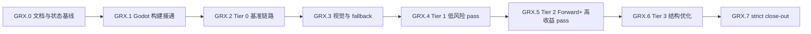

# GRX 执行计划 - Agent 接续任务分解

> 所属契约:[GRX_CONTRACT.md](GRX_CONTRACT.md)
> 版本:v2.2(2026-07-02)
> 粒度:1-2 天 / PR。每个任务只触碰一个子系统或一个 pass,必须有明确验证命令或 evidence JSON。

---

## 0. 总览与依赖

| 小里程碑 | 目标 | 主要输出 | 阻塞关系 |
|---|---|---|---|
| GRX.0 | 固化当前 scaffold 与接续文档 | 契约/计划/CI 三件套 | 无 |
| GRX.1 | Godot module 能 build/load/fallback | SCons detector、build log、DLL load smoke | 依赖当前 patch |
| GRX.2 | 建成 Tier 0 baseline 证据链 | scene generator、runner、baseline JSON | 依赖 GRX.1 |
| GRX.3 | 建成 visual diff 与 fallback telemetry | capture/diff、pass enable matrix | 依赖 GRX.2 |
| GRX.4 | 替换低风险 compute/effects pass | Tier 1 pass evidence | 依赖 GRX.3 |
| GRX.5 | 替换 Forward+ 高收益 pass | Tier 2 pass evidence | 依赖 GRX.4 |
| GRX.6 | 结构性优化 | fusion/cache/prewarm evidence | 依赖 GRX.5 |
| GRX.7 | 严格验收 | strict perf + visual close-out | 依赖全部 |

## 1. GRX.0 - 文档与状态基线

> 本阶段只维护 `milestones/grx/GRX_CONTRACT.md`、`GRX_PLAN.md`、`CI_GATES.md` 三件套,用于固化当前 scaffold 状态、后续任务拆分与 gate 规则;不实现任何 Godot pass,不跑 Godot build,不跑 benchmark,不宣称性能提升。

| Task ID | 目标 | 交付物 | 验证 | 接续说明 |
|---|---|---|---|---|
| 文档基线 | 固化当前 scaffold、任务拆分与 gate 口径 | 契约/计划/CI 三件套 | 文档内容自洽,且不把 Godot build/benchmark 写成已达成 | `GRX-001` 的执行归属见下方 `GRX.1` 表 |

## 2. GRX.1 - Godot 构建接通

| Task ID | 目标 | 交付物 | 验证 | 接续说明 |
|---|---|---|---|---|
| GRX-001 | 补充 SCons/toolchain detector,不安装全局依赖 | detector 脚本或 smoke 步骤,输出 SCons/MSVC/Windows SDK/DXC/Godot tree 状态与下一条可执行命令 | detector 在缺 SCons/MSVC 时返回明确 SKIP/FAIL reason;缺少 launcher 时 `recommended_scons_command` 必须为 `null`; `dxv.exe` 缺失记为后续 validation warning,不改系统环境 | fresh `godot_toolchain_probe.json` 已读取 build summary 的 path-overrides readiness 与 load smoke summary,当前接续已从 `GRX-003` 推进到 `GRX-004` |
| GRX-002 | 让 `modules/rurix_accel` 在 Godot tree 中完成可归档的 path-overrides rebuild evidence | 更新后的 patch + build log + artifact evidence | `git apply --check --directory=external/godot-master spike/godot-rurix/patches/*.patch`; `py -3 ci\godot_rurix_scons_build.py` | fresh `godot_scons_build_summary.json` 已记录 Godot exe、console exe、module lib 的 artifact evidence,且 `command` / `ice_workaround_command` 均包含 `disable_path_overrides=no`;summary 同时暴露 `required_scons_args_satisfied` / `path_overrides_ready` 供 probe 判定 |
| GRX-003 | Godot 启动加载 `rurix_godot.dll`,无 DLL 时 fallback 不崩 | DLL load smoke + fallback log + summary JSON | 有 DLL: session created 或因 D3D12 环境受限明确 `SKIP`; 无 DLL: process exits 0 and logs fallback,且若 missing-DLL 日志出现 session-ready marker 必须判失败并记录 `unexpected_markers` | fresh `godot_load_smoke_summary.json` 已验证 present/missing DLL 两条路径,smoke 项目文件只落在 `target/grx/godot-load-smoke`,且 `external/godot-master/bin` 旧 smoke 文件已按 marker/fingerprint 清理 |

**出口判据**:toolchain detector 输出明确 `build_ready`、`build_artifacts_ready`、`load_smoke_ready` 与下一条可执行命令;`GRX-002` summary 归档 Godot exe / console exe / module lib 的 artifact evidence,且 `command` / `ice_workaround_command` 明确包含 `disable_path_overrides=no`;`GRX-003` summary 归档 DLL present/missing 两条 smoke,且项目文件只落在 `target/grx/godot-load-smoke`;probe 在 fresh build + fresh load smoke evidence 完整后自动切到 `GRX-004` / `GRX.2`,而不是停留在 `run_grx003_load_smoke`;`RXGD_ABI_VERSION` mismatch 能禁用加速而不崩溃。

## 3. GRX.2 - Tier 0 基准链路

| Task ID | 目标 | 交付物 | 验证 | 接续说明 |
|---|---|---|---|---|
| GRX-004 | 生成 7 个 benchmark scene 的最小项目骨架 | Godot benchmark project generator + scenes + per-scene smoke evidence | fresh `target/grx/godot_bench_project_smoke_summary.json` 已记录 `scene_count=7`、`failure_count=0`,且 7 个 scene 都有独立 Godot load evidence | 已完成,下一步进入 `GRX-005 runner`;本项不等于 baseline/perf gate/visual diff/加速 pass 已完成 |
| GRX-005 | 实现 warmup 300 / sample 2000 / vsync off runner | runner + raw frame samples + runner summary | runner 顺序运行 7 个 scene,输出每帧 CPU frame time、GPU timestamp 显式 unavailable 标记、FPS/p95 | 已完成并硬化:runner 现扫描 Godot 日志 failure marker(对齐 `bench_project_smoke.py`),allowlist global script cache warning,其它 `ERROR / SCRIPT ERROR / Parser Error / Failed loading` 让该 scene fail,`per_scene_results` 记录 `failure_markers` / `warnings`,summary 增加 `warning_count`;固定 1920x1080、D3D12 Forward+、`gpu_timestamps_available=false`;当前 evidence 仍只是 quick-smoke,不做 baseline 对比 |
| GRX-006 | 写 baseline evidence JSON schema 与 perf gate 输入格式 | schema + sample baseline/result JSON | `py -3 spike/godot-rurix/bench/perf_gate.py <results.json>` 能解析;建设期可 FAIL 但格式正确 | 已完成并已 hardening:新增 `schemas/baseline_evidence.schema.json` + `schemas/perf_gate_input.schema.json`(draft-07),扩展 `perf_gate.py`(`--kind baseline/perf_gate`、`--strict`、`--validate-only`)。本轮 hardening 修复:strict forbidden marker 改词边界正则(命中 `SKIP: missing`/`skip-reason`/`status=SKIP`/`estimated:true`/`estimated local`,不误伤 `spike`/路径)、baseline reader 校验 `sample_count` 正整数且 `== sample_frames`、strict `thresholds` 三项固定值(1.5/0.3/0.95)防篡改;新增红测 `samples/perf_gate_forbidden_skip_example.json` 与 `samples/baseline_missing_sample_count_example.json`。严禁用 estimated 填 close-out,full baseline 实测与性能提升仍未完成 |

**出口判据**:`GRX-004` 已以 fresh per-scene smoke 收口;`GRX-005` runner 已交付 7 场景 raw frame sample JSON、runner summary(含 failure marker 扫描与 `warning_count`)并硬化;`GRX-006` 已交付并硬化 baseline/perf schema 与 strict perf gate 输入格式(可解析、strict 拒绝非法输入、forbidden marker 词边界正则、`sample_count` 对齐、`thresholds` 固定值);probe 现以 `grx006_schema_ready` 把 `next_action` 推进到 `start_grx007_visual_diff_scaffold`。full baseline 实测对比、真实 visual diff、实际加速 pass、性能提升声明仍留在后续任务,不得提前写成已完成;当前 runner evidence 仍只是 quick-smoke,不能作为 strict close-out 输入。

## 4. GRX.3 - 视觉与 fallback

| Task ID | 目标 | 交付物 | 验证 | 接续说明 |
|---|---|---|---|---|
| GRX-007 | 接入 reference frame capture 与视觉 diff | reference/Rurix capture + diff script | LDR absolute diff; HDR/temporal pass 用 SSIM/PSNR + temporal stability | 已完成 scaffold + hardening:`visual_diff.py` 与 `visual_diff_evidence.schema.json` 现禁止 `status=skip` 携带伪造 diff/帧路径(reference/candidate path、ldr/hdr/temporal diff 必须 null 或缺省),新增红测 `samples/visual_diff_skip_with_fake_ldr_example.json`(skip 带 ldr_diff 必 FORMAT FAIL);收尾 hardening:`status=pass` 帧若 reference/candidate 帧文件缺失、不可读、非合法 channel 文档、或两帧 channel 数量不一致,必须 DIFF FAIL 且非零退出,不再降级为 SKIP,`--write-output` 在任一 pass 帧算不出 diff 时拒绝写出 evidence,新增红测 `samples/visual_diff_pass_missing_frame_artifact_example.json`(pass 帧指向不存在帧文件必 DIFF FAIL);已有红绿保持:pass 缺 ldr_diff FORMAT FAIL、diff 不一致 DIFF FAIL、diff 一致 PASS、`--write-output` 生成 computed ldr_diff evidence;7 场景仍全部 SKIP,不写“视觉验证已通过” |
| GRX-008 | 接入 pass fallback telemetry | telemetry JSON + pass enable matrix | 强制某 pass 返回 fallback 时,Godot 原 pass 接管且 telemetry 记录原因 | 已完成 scaffold + hardening:`fallback_telemetry.py` 与 `fallback_telemetry.schema.json` 区分 scaffold 与 full——scaffold(`run_mode=scaffold`/`evidence_level=scaffold`)允许 timestamp/frame=null 但每 pass 必须 `enable_state=disabled` 且 `godot_fallback_active=true`;full(`run_mode=full` 或 `evidence_level=measured_local`)要求 timestamp 非空、frame 非负整数,measured_local 禁止 `pass_id` 以 `placeholder_` 开头(现 schema 与脚本双侧约束);新增红测 `samples/fallback_telemetry_full_null_timestamp_example.json` 与 `samples/fallback_telemetry_scaffold_fallback_inactive_example.json`,placeholder 仍 FORMAT PASS 且明确不是实际 telemetry。fallback 原因枚举:compile_failed,validation_failed,unsupported_device,visual_diff_failed,manual_disabled。此处仍为 scaffold/格式,不代表任何 pass 已接入或发生真实 fallback |

**出口判据**:每个 pass 都能单独 enable/disable;禁用或失败不会影响其它 pass 和 Godot 原路径。`GRX-007` scaffold 阶段所有 visual evidence 均为 SKIP/placeholder,不得据此宣称视觉验证通过;`GRX-008` scaffold 阶段所有 telemetry 均为 placeholder,不代表任何 pass 已接入或发生真实 fallback。`GRX-009` 准备、第一段 gated scaffold 与第二段 core call-site fallback wiring 已完成,但 `segment 3a` 当前 blocked:`offline_compile_evidence.json` 记录 `compile_failed/body_lowering_missing`;current artifacts 只描述 latest compile attempt 产物,任何 `artifact_kind=dxil_ir_text`、`semantic_status=entry_shell_only` 的 IR 只能作为 debug/non-ready evidence。没有真实 DXIL container,没有真实 compute body lowering。runtime 仍保持 disabled/fallback,manifest 不得推进 segment 3,下一步是修复真实 DXIL container/body lowering blocker,不得进入 resource mapping,更不得宣称视觉验证、measured telemetry 或性能提升已经完成。

## 5. GRX.4 - Tier 1 低风险 pass

| Task ID | 目标 | 交付物 | 验证 | 接续说明 |
|---|---|---|---|---|
| GRX-009 | luminance reduction pass | Rurix pass package + Godot mapping patch | visual diff + dispatch/barrier count + fallback red/green | 单 PR;不过门则默认 disabled。准备已完成,第一段 gated scaffold 与第二段 core call-site fallback wiring 也已落地:bridge `LuminanceReductionGate` 恒 `RXGD_STATUS_FALLBACK`+ 栈式 0002 module patch+ 栈式 0003 core call-site patch+ callsite-wired disabled telemetry 样例。`segment 3a` 当前 blocked:latest evidence 为 `compile_failed/body_lowering_missing`;current artifacts 只描述 latest compile attempt,`dxil_ir_text`/`entry_shell_only` 只能作为 debug/non-ready evidence,不是真实 DXIL container,非平凡 luminance compute body 也未 lowering;`grx009_segment3a_compile_ready=false`,manifest 保持 `segment 2`。下一步是修复真实 DXIL container/body lowering blocker,不进入 resource mapping。runtime 默认 disabled/fallback、真实 visual/perf/measured telemetry 仍属后续工作 |
| GRX-010 | tonemap pass | Rurix pass package + telemetry | LDR absolute diff + FPS/p95 scene delta | 先覆盖 post_fx_chain 和 mixed_forward_plus |
| GRX-011 | SSAO/SSIL blur pass | Rurix pass package | visual diff + GPU timestamp | 注意 temporal/noise 稳定性 |
| GRX-012 | TAA resolve pass | Rurix pass package | temporal stability diff + fallback red/green | 不得以单帧截图替代 temporal evidence |
| GRX-013 | particles copy pass | Rurix pass package | particles scene perf + visual diff | 不过门则禁用该 pass |

**出口判据**:Tier 1 全部通过各自视觉/fallback gate;任何单 pass 若 FPS 低于 baseline 95%,默认 disabled 并保留 evidence。

## 6. GRX.5 - Tier 2 Forward+ 高收益 pass

| Task ID | 目标 | 交付物 | 验证 | 接续说明 |
|---|---|---|---|---|
| GRX-014 | clustered light binning | Rurix pass + Godot resource mapping | clustered_lights scene FPS/p95 + visual diff | 这是 1.5x 目标主战场之一 |
| GRX-015 | GPU culling | Rurix pass + indirect visibility buffers | many_mesh_instances scene draw/dispatch count + FPS/p95 | 必须保留 CPU fallback |
| GRX-016 | visible instance compaction | Rurix pass | visibility correctness + mixed scene perf | 与 GPU culling 依赖明确,不合并 PR |
| GRX-017 | material variant sorting | Rurix pass | material_variants scene PSO/cache miss proxy + FPS/p95 | 若 telemetry 不足,先补 telemetry |
| GRX-018 | indirect draw argument generation | Rurix pass | indirect args validation + scene perf | 任何 validation mismatch 立即 fallback |

**出口判据**:Tier 2 后重新跑 7 场景完整 benchmark;若 geomean 仍 <1.5,进入 GRX.6,不得提前 close-out。

## 7. GRX.6 - Tier 3 结构性优化

| Task ID | 目标 | 交付物 | 验证 | 接续说明 |
|---|---|---|---|---|
| GRX-019 | post FX fusion | fused pass package | post_fx_chain dispatch/barrier/VRAM traffic proxy + visual diff | 仅融合相邻 full-screen pass |
| GRX-020 | descriptor/root signature cache | cache implementation + telemetry | PSO/root signature churn 下降 + no ABI break | C ABI 变更必须 bump `RXGD_ABI_VERSION` |
| GRX-021 | pipeline prewarm | prewarm scheduling + telemetry | runtime PSO hitch 减少,p95 下降 | 不得增加启动失败率 |
| GRX-022 | bindless/resource-array 扩展 | Rurix binding/resource-array support | material/texture hot path benchmark | 若触及 compiler semantics,另行判档/RFC |

**出口判据**:Tier 3 后 strict benchmark 有机会通过;若仍未达 1.5x,继续拆新 pass,不得放宽门槛。

## 8. GRX.7 - strict close-out

| Task ID | 目标 | 交付物 | 验证 | 接续说明 |
|---|---|---|---|---|
| GRX-023 | 全场景 strict benchmark | final results JSON + raw samples | `py -3 spike/godot-rurix/bench/perf_gate.py <results.json>` PASS | 必须包含 scene-level baseline/rurix FPS 和 p95 |
| GRX-024 | 视觉证据汇总 | per-scene frame captures + diff report | all visual gates PASS | HDR/temporal pass 不得只用 LDR absolute diff |
| GRX-025 | 默认启用/禁用矩阵 | pass matrix + fallback policy | disabled pass 有原因和证据 | 不合格 pass 默认 disabled |
| GRX-026 | close-out 签署材料 | build log、perf_gate 输出、visual evidence、telemetry summary | GRX_CONTRACT §8 只追加 | 只有 strict 通过后才能写“显著提升已达成” |

## 9. Agent 接续规则

- 每个任务只触碰一个子系统或一个 pass。
- 每个 PR 必须列出输入文件、输出 artifact、验证命令。
- 每个 PR 必须说明失败时如何单独 revert 或禁用。
- 任何脚本新增都必须有 smoke 或 evidence JSON;不允许“脚本存在即完成”。
- 新 pass 必须至少包含一种真实红绿:pass 输出错误、禁用 fallback、视觉 diff 超阈值。
- 后续 agent 若发现任务过大,只能拆得更小,不得合并多个 pass 为一个不可回退 PR。

## 10. 修订记录

| 版本 | 日期 | 变更 |
|---|---|---|
| v1.0 | 2026-07-01 | 初版。按 1-2 天 / PR 拆分 GRX-000~GRX-026,锁定 GRX.0~GRX.7 执行顺序、首批任务卡、验证方式和接续规则。 |
| v1.1 | 2026-07-01 | 收紧 GRX.0 文档基线边界。把文档落地动作下沉为阶段说明,正式任务卡从 `GRX-001` 开始;明确本阶段不跑 Godot build/benchmark,也不宣称性能提升。 |
| v1.2 | 2026-07-01 | 继续收紧 GRX.1 边界:把 `GRX-001` 明确移入 `GRX.1` 执行范围,统一口径为 `GRX.0 = 文档基线`,`GRX.1 = detector/build/load`。 |
| v1.3 | 2026-07-01 | 收紧 `GRX-001` detector 输出口径:缺少 SCons launcher 时不再给出会失败的 `scons ...` 推荐命令,而是输出明确下一步;同时把 `dxv.exe` 缺失明确归类为后续 DXIL/device validation warning,不阻塞 `GRX-002` Godot SCons build。 |
| v1.4 | 2026-07-01 | 收口 `GRX.1` 当前状态:把 `GRX-002` 从抽象 build 目标推进到 artifact evidence 归档,明确本地已有 Godot exe/console exe/module lib,下一步由 probe 自动切到 `GRX-003`;同时细化 `GRX-003` 为 present-DLL 成功或明确 `SKIP`、missing-DLL `exit 0 + fallback log`,不进入 `GRX.2 benchmark`。 |
| v1.5 | 2026-07-01 | 完成 `GRX.1` close-out hardening 口径修正:明确 `GRX-001/002/003` 已有本地 success evidence,`godot_rurix_load_smoke.py` 的项目文件只能落在 `target/grx/godot-load-smoke`,missing-DLL case 需对 session-ready marker 做反向断言并记录 `unexpected_markers`,probe 在 build + load smoke evidence 完整后推进到 `GRX-004` / `GRX.2` 接续。 |
| v1.6 | 2026-07-01 | 以 fresh path-overrides rebuild / smoke evidence 完成 `GRX.1` 收口:明确 `GRX-002` 现以 `disable_path_overrides=no` 命令证据与 artifact evidence 为准,`GRX-003` 已 fresh 验证 present/missing DLL 两条路径并清理 `external/godot-master/bin` 旧 smoke 残留;probe 当前已稳定推进到 `GRX-004`,但未进入 benchmark 实现。 |
| v1.7 | 2026-07-01 | 收口 `GRX.2` 当前状态:明确 `GRX-004` 已以 fresh per-scene smoke 通过,下一步执行 `GRX-005` tracked runner;同时写死本次仍未完成 `GRX-006 baseline schema/perf gate`、visual diff、实际加速 pass 与任何性能提升声明。 |
| v1.8 | 2026-07-01 | 收口 `GRX-005` 硬化 / `GRX-006` 交付:`GRX-005` runner 增加 Godot 日志 failure marker 扫描与 `failure_markers` / `warnings` / `warning_count` 记录;`GRX-006` 完成 baseline/perf schema、`perf_gate.py` schema/strict/`--validate-only` 校验与两个样例 JSON。写死 full baseline 实测、visual diff、实际加速 pass 与性能提升声明仍未完成,当前 runner evidence 仍只是 quick-smoke。 |
| v1.9 | 2026-07-01 | 收口 `GRX-006` hardening / 接续 `GRX-007` scaffold:`perf_gate.py` 修复 strict forbidden marker 前缀漏判(改词边界正则)、baseline reader 补 `sample_count` 正整数且 `== sample_frames` 校验、strict `thresholds` 三项固定值(1.5/0.3/0.95)防篡改;新增两个红测样例;probe 以 `grx006_schema_ready` 推进 `next_action=start_grx007_visual_diff_scaffold`。`GRX-007` 进入 scaffold(capture/diff 脚本 + `visual_diff_evidence.schema.json` + placeholder),7 场景全部 SKIP;full baseline 实测、Rurix 加速 pass、真实 visual diff pass 与性能提升声明仍未完成。 |
| v2.0 | 2026-07-01 | 收口 `GRX-007` hardening / `GRX-008` scaffold hardening / 接续 `GRX-009` 准备:`GRX-007` 的 `visual_diff.py` 与 schema 禁止 `status=skip` 携带伪造 diff/帧路径,新增红测 `visual_diff_skip_with_fake_ldr_example.json`,保持既有 pass 缺 ldr_diff / diff 不一致 / diff 一致 / `--write-output` 红绿;`GRX-008` 的 `fallback_telemetry.py` 与 schema 区分 scaffold 与 full(scaffold 允许 timestamp/frame=null 但必须 disabled + fallback_active,full/measured_local 要求 timestamp/frame 非空非负、禁止 `placeholder_` pass_id),新增两个红测样例并保持 placeholder FORMAT PASS;probe 新增 `grx007_visual_ready`/`grx008_telemetry_ready`(跑红绿样例),GRX-008 ready 后 `next_action=start_grx009_luminance_reduction_pass_prep`。本轮不实现任何实际 Rurix 加速 pass,不宣称视觉验证、fallback 真接入或性能提升已完成。 |
| v2.1 | 2026-07-01 | 收尾 `GRX-007`/`GRX-008` hardening / 产出 `GRX-009` 准备:`GRX-007` 的 `visual_diff.py` 现让 `status=pass` 帧在 reference/candidate 帧文件缺失、不可读、非合法 channel 文档、或 channel 数量不一致时 DIFF FAIL 且非零退出(不再降级 SKIP),`--write-output` 在任一 pass 帧算不出 diff 时拒绝写出,新增红测 `visual_diff_pass_missing_frame_artifact_example.json`;`GRX-008` 的 `fallback_telemetry.schema.json` 补 `measured_local` 禁止 `placeholder_` pass_id 约束(schema 与脚本双侧一致);新增 GRX-009 准备产物 `spike/godot-rurix/passes/luminance_reduction/PASS_CONTRACT.md` 与 `pass_manifest.json`(仅调查 Godot luminance hook 路径/函数,不改 `external/godot-master`),probe 新增 `grx009_prep_ready` 并把 `next_action` 推进到 `start_grx009_luminance_reduction_pass_contract`(就绪后 `start_grx009_luminance_reduction_pass_implementation`)。GRX-009 仍只是准备,不是实际 pass 完成;本轮不实现任何实际 Rurix 加速 pass,不宣称视觉验证、fallback 真接入或性能提升。 |
| v2.2 | 2026-07-02 | 收口 GRX-009 准备 / 交付 gated implementation 第一段:修正文档滞后(准备已完成,下一步为 gated implementation 而非准备);`grx009_prep_ready` 加强为校验 manifest 记录的 Godot source/header/shader/call-site 文件存在于 `external/godot-master`(只读、不改快照);`src/rurix-godot` 新增 `LuminanceReductionGate`(默认 disabled,`request_enable` 恒 `compile_failed`,`rxgd_record_pass` 对 luminance 恒 `RXGD_STATUS_FALLBACK`,移除其占位 estimated GPU time,ABI v1 不变,新增两条单测);新增栈式 0002 module patch(per-pass 设置默认 false + `try_record_luminance_reduction()` 非 OK 即走 Godot 原生路径,仅 `modules/rurix_accel/*`)与 disabled telemetry 样例 `fallback_telemetry_luminance_disabled_example.json`;`ci/godot_rurix_bridge_smoke.py` 改为 patch 栈状态检查(base / 0001-only / 0001+0002,drift 即红)。GRX-009 pass 本体仍未实现:无真实 GPU pass、core call-site 未接线、无真实 visual diff、无 measured telemetry、不宣称性能提升。 |
| v2.3 | 2026-07-02 | 收口 GRX-009 第二段并接续 `segment 3a` 离线 compile evidence:修正 `GRX-009` 条目口径,明确当前已完成 segment 2 core call-site fallback wiring,下一步不再是 core 接线而是开始真实 GPU luminance pass 的离线 kernel/package 编译取证;只有真实 `DXIL + root signature + descriptor layout` artifact 齐备时才允许 manifest 进入 segment 3,否则保持 segment 2 并记录 compile blocker evidence。runtime 默认 disabled/fallback、真实 visual diff、measured telemetry 与性能提升声明仍未完成。 |
| v2.4 | 2026-07-02 | 修复 GRX-009 segment 3a artifact gate 计划口径:IR text / `ret void` entry shell 不再视为 ready;当前 evidence 为 `compile_failed/body_lowering_missing`,current artifacts 只描述 latest compile attempt,manifest 保持 segment 2,next action 指向真实 DXIL container/body lowering blocker,不进入 resource mapping。 |
