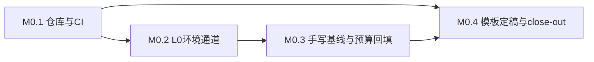

# M0 执行计划 — 小里程碑分解

> 所属契约:[M0_CONTRACT.md](M0_CONTRACT.md)
> 版本:v1.0(2026-06-11)
> 粒度依据:11 §7(1–2 周小里程碑 + 阶段两级结构);本计划是工作分解,验收以契约 §4 为准,本文不重定义成功。

---

## 0. 总览与依赖

| 小里程碑 | 时长(估) | 交付物映射 | 阻塞关系 |
|---|---|---|---|
| M0.1 | ~1 周 | D-M0-1 | 无前置 |
| M0.2 | ~1 周 | D-M0-2 | 依赖 M0.1(探测器代码需进 CI) |
| M0.3 | ~1–1.5 周 | D-M0-3 | 依赖 M0.2(基线必须在 L0 验证通过的环境下采样) |
| M0.4 | ~0.5 周 | D-M0-4 / D-M0-5 | 依赖 M0.3(预算回填后才能 close-out) |

时长为 `estimated`(无历史数据),仅作排程参考,不构成验收承诺。

## 1. M0.1 — 仓库初始化与 CI PR Smoke(~1 周)

| # | 任务 | 验证方式 |
|---|---|---|
| 1 | 初始化实现仓库,落 10 §4 一等公民目录骨架(`spec/` `rfcs/` `conformance/` `tests/ui/` `unsafe-audit/` `agents/`,空目录带 README 占位说明) | 目录存在性脚本核对 |
| 2 | 自托管 runner 注册(开发机 RTX 4070 Ti,14 §8) | runner 在线状态截图/命令输出 |
| 3 | PR Smoke 工作流:guardrail 脚本 + 注册表 schema 校验 + 占位单测,**必须含至少一个会真实失败的断言路径**(反 YAML-only,H06 D11.8-2 教训) | 构造一个故意失败的 PR 验证红→修复→绿 |
| 4 | guardrail 核对脚本首版([CI_GATES.md](CI_GATES.md) §4 清单) | 本地执行 + CI 内执行各一次 |

**出口判据**:契约 G-M0-2 达成(真实 PR 绿过,附 run URL)。

## 2. M0.2 — L0 环境验证通道(~1 周)

| # | 任务 | 验证方式 |
|---|---|---|
| 1 | 锁频规程文档化并实测一轮([BENCH_PROTOCOL.md](BENCH_PROTOCOL.md) §2;RTX 4070 Ti 实际锁频值以 `nvidia-smi -q -d SUPPORTED_CLOCKS` 输出为准回填,禁止凭记忆填写) | 命令输出存档 |
| 2 | NVML 环境画像探测器:驱动模型/HAGS/TDR/驱动与 Toolkit 版本(字段集见 08 §2.3;NVML 优先,`nvidia-smi` 仅人工后备,r6) | 输出通过 [evidence_schema.json](evidence_schema.json) 校验 |
| 3 | 温度稳态窗与进程隔离检查实现(r11 §1) | 探测器输出含稳态判定字段 |
| 4 | 上一项目 H05 采样脚本思路(triple_run/trimmed_mean/threshold_drift/capability_probe,08 §4)按 CUDA 语境重写为 harness 脚本 | 单测:对合成数据复算 trimmed mean/IQR |
| 5 | 探测器与 harness 进 CI PR Smoke(无 GPU 分支降级但 schema 不变,14 §5) | CI run 输出 |

**出口判据**:契约 G-M0-3 达成(环境画像全字段非空且过 schema 校验)。

## 3. M0.3 — 手写 PTX 基线与预算回填(~1–1.5 周)

| # | 任务 | 验证方式 |
|---|---|---|
| 1 | 手写 SAXPY `.ptx`(target `compute_89`,00 §5 PTX baseline)+ Driver API 装载 harness(`cuModuleLoadDataEx`,JIT 日志常开,08 §2.4) | kernel 结果数值校验(host 参考实现逐元素比对) |
| 2 | bandwidthTest 等价 harness:H2D / D2H / D2D 三向,pinned 与 pageable 分开记录 | 同上 + 指标合理性人工 review |
| 3 | 按协议采样(warmup ≥10 + CV<5% 稳态 → 50×3 → trimmed mean,[BENCH_PROTOCOL.md](BENCH_PROTOCOL.md) §3) | 证据 JSON 过 schema 校验 |
| 4 | 三次独立运行(进程级重启)取 trimmed mean,回填 [m0_budget.json](m0_budget.json) 全部 `m0.bench.*` 条目为 `measured_local` | 预算 evaluator 加载无 skip |
| 5 | 证据 JSON(含环境画像)归档入仓库 `evidence/` 目录 | 文件路径登记进 close-out |

**出口判据**:契约 G-M0-1 达成(预算零 `estimated` 残留)。

## 4. M0.4 — 模板定稿与 close-out(~0.5 周)

| # | 任务 | 验证方式 |
|---|---|---|
| 1 | 契约 YAML 模板从本里程碑实例中提炼为 `milestones/TEMPLATE_CONTRACT.md`(供 M1+ 复用) | 模板字段与 14 §1 四要素一一对应 |
| 2 | [../../registry/deferred.json](../../registry/deferred.json) / [spike_gating.json](../../registry/spike_gating.json) 随 M0 实际执行情况补登(新增只追加) | schema 校验 + guardrail |
| 3 | [../../agents/AGENTS.md](../../agents/AGENTS.md) v1 的验证命令清单用 M0.1–M0.3 实测命令回填占位 | 命令逐条真实执行一遍 |
| 4 | M0 close-out:验收记录 + guardrail 输出 + run URL 追加进契约 §8 | guardrail 全过 |

**出口判据**:契约 G-M0-4 达成,M0 关闭。

## 5. 风险提示(引用,不另建登记)

- 锁频需管理员权限且 GeForce 驱动对 `-lgc/-lmc` 的支持随驱动版本波动(r11 §1.2)——M0.2 第 1 项首日即验证,失败则按 14 §5 标记 `evidence=unlocked` 并在 12 号文档勘误流程登记。
- WDDM 2 秒 TDR watchdog(r11 §1.4)——基线 kernel 单次执行远小于阈值,但 harness 必须读取 TDR 配置入画像。

## 6. 修订记录

| 版本 | 日期 | 变更 |
|---|---|---|
| v1.0 | 2026-06-11 | 初版 |
