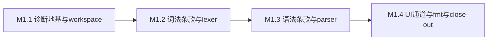

# M1 执行计划 — 小里程碑分解

> 所属契约:[M1_CONTRACT.md](M1_CONTRACT.md)
> 版本:v1.0(2026-06-11)
> 粒度依据:11 §7(1–2 周小里程碑 + 阶段两级结构);本计划是工作分解,验收以契约 §4 为准,本文不重定义成功。

---

## 0. 总览与依赖

| 小里程碑 | 时长(估) | 交付物映射 | 阻塞关系 |
|---|---|---|---|
| M1.1 | ~2 周 | D-M1-1 | 无前置 |
| M1.2 | ~2 周 | D-M1-2 | 依赖 M1.1(lexer 产出的 token 必须携带 Span,诊断必须走 DiagCtxt) |
| M1.3 | ~2–3 周 | D-M1-3 | 依赖 M1.2(parser 消费 TokenStream;语法条款引用词法条款) |
| M1.4 | ~1–2 周 | D-M1-4 / D-M1-5 / D-M1-6 | 依赖 M1.3(UI 黄金路径与 fmt 都以 parser 定型为前提) |

时长为 `estimated`(无历史数据),仅作排程参考,不构成验收承诺。

## 1. M1.1 — 诊断地基与 workspace(~2 周)

| # | 任务 | 验证方式 |
|---|---|---|
| 1 | rurixc Rust workspace 初始化(`src/` 实体化,D-201;crate 划分最小起步,按需拆分);CI PR Smoke 追加 cargo fmt --check / clippy / test 步骤([CI_GATES.md](CI_GATES.md) §2) | CI run 输出 |
| 2 | `Span`(携带 edition 字段,D-404 第一天预埋)+ `SourceMap`(多文件/行列映射/snippet 提取) | 单测(行列映射边界用例) |
| 3 | `DiagCtxt`/`Diag` 结构:emit-or-cancel 强制(泄漏即 ICE);error/warning + 多 span label + note + help + suggestion(携带 `Applicability`,07 §5) | 单测(含泄漏 ICE 路径) |
| 4 | 错误码注册表 `registry/error_codes.json`(RX0xxx 词法/语法段,分配制;schema 校验接入 `ci/check_schemas.py`)+ message-key 骨架(编译期校验 key 有效性) | `py -3 ci/check_schemas.py` PASS |
| 5 | M0 留痕勘误:[../m0/BENCH_PROTOCOL.md](../m0/BENCH_PROTOCOL.md) §2.2 进程隔离条款可执行化修订("记录而非中止",M0 close-out §8.2.3)——**独立 PR**,只追加修订记录行 | guardrail 通过 + 修订记录可见 |

**出口判据**:cargo test 绿 + error_codes schema 校验 PASS(契约 D-M1-1 完成判据)。

## 2. M1.2 — 词法条款与 lexer(~2 周)

| # | 任务 | 验证方式 |
|---|---|---|
| 1 | spec 词法条款首批(RXS-0xxx;FLS 风格 Syntax/Legality 分节,10 §4;依据 05 §12 语法基调 D-114)——**规范先行,条款 PR 先于实现 PR** | spec/ 变更携带档位标记(guardrail) |
| 2 | lexer 实现:TokenStream,span 全保留;词法错误经 DiagCtxt 产出首批 RX0xxx 实例 | 单测 + 条款号引用核对 |
| 3 | 语法样例集 v1(`conformance/syntax/` 正例起步,覆盖 05 语法草图的已定型部分) | 样例计数脚本 |
| 4 | lexer 吞吐基准 harness(统计协议复用 `bench/stats.py`:trimmed mean/IQR/CV;进程级三次运行规则对齐 M0 BENCH_PROTOCOL §3) | harness 单测(合成数据复算) |

**出口判据**:词法条款逐条有测试锚定(G-M1-4 词法部分)+ lexer 单测全绿。

## 3. M1.3 — 语法条款与 parser(~2–3 周)

| # | 任务 | 验证方式 |
|---|---|---|
| 1 | spec 语法条款(产生式;与词法条款同档位纪律) | 同 M1.2 第 1 项 |
| 2 | 手写递归下降 parser:错误恢复优先(同步点/anchor 集);事件流接口预留(07 §9),完整无损树 → `// STUB(RD-004)` 双侧标注 | 单测 + 错误恢复用例(单文件多错误) |
| 3 | AST 定义(贴近用户语法,不做类型/数据流,D-202 层职责表)+ feature gate 骨架(gate 声明/检查通道,10 §5) | 单测(gate 未启用时使用 gated 语法报错) |
| 4 | 语法样例集扩充至 ≥100 并 100% 解析(数量为 estimated 工程选择,调整经 Direct PR 留痕,契约 §4.1) | 样例集跑批 0 失败 |
| 5 | parser 吞吐基准 harness(同 M1.2 第 4 项协议) | harness 单测 |

**出口判据**:契约 G-M1-1 达成。

## 4. M1.4 — UI golden、rx fmt、基准回填与 close-out(~1–2 周)

| # | 任务 | 验证方式 |
|---|---|---|
| 1 | UI golden 框架:`//~ ERROR RX####` 注释比对 + `.stderr` snapshot + 路径/行号规范化 + 受控 bless 流程(bless 是审批动作,14 §6) | 框架自测(故意不匹配必须红) |
| 2 | 黄金路径 1(解析错误)snapshot ≥10 条入 `tests/ui/` | 计数 + CI 全绿 |
| 3 | guardrail 激活验证:构造未审批 bless / 篡改 snapshot 的 PR 必须红,修复转绿(契约 G-M1-2 红绿程序) | 两次 run URL 存档 |
| 4 | `rx fmt` 雏形 + 幂等核对脚本(fmt(fmt(x)) == fmt(x),字节级) | 语法样例集全量幂等(G-M1-5) |
| 5 | 前端基准回填:lexer/parser 吞吐三次进程级独立运行 trimmed mean → [m1_budget.json](m1_budget.json) `m1.bench.*` 全部转 `measured_local`(阈值 = 实测 × 0.95),证据 JSON 归档 `evidence/` | `py -3 ci/budget_eval.py --strict` PASS |
| 6 | traceability 矩阵工具首版(条款 ↔ 测试)+ M1 close-out(验收记录 + guardrail 输出 + run URL 追加契约 §8) | G-M1-4 + guardrail 全过 |

**出口判据**:契约 G-M1-2 / G-M1-3 / G-M1-4 / G-M1-5 达成,M1 关闭。

## 5. 风险提示(引用,不另建登记)

- 前端吞吐基准在开发机 CPU 上采样,受后台负载/电源计划影响——harness 必须记录采样环境(电源计划/并发负载概况)入证据 JSON;波动超 IQR 剔除规则时按 14 §5 留痕,不得静默重跑挑数。
- `rx fmt` 雏形与语法定型互相追赶:语法条款变更的 PR 必须同 PR 更新 fmt 与样例集,否则幂等门(G-M1-5)在 close-out 时阻塞。
- 错误恢复质量无定量门(MVP 允许保守粗糙,07 §4"先正确性、后诊断对齐")——以 UI golden 锁底线,不在 M1 追打磨。

## 6. 修订记录

| 版本 | 日期 | 变更 |
|---|---|---|
| v1.0 | 2026-06-11 | 初版 |
