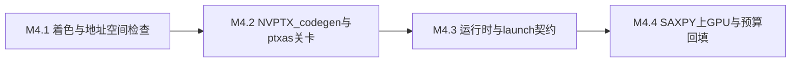

# M4 执行计划 — 小里程碑分解

> 所属契约:[M4_CONTRACT.md](M4_CONTRACT.md)
> 版本:v1.0(2026-06-13)
> 粒度依据:11 §7(1–2 周小里程碑 + 阶段两级结构);本计划是工作分解,验收以契约 §4 为准,本文不重定义成功。

---

## 0. 总览与依赖

| 小里程碑 | 时长(估) | 交付物映射 | 阻塞关系 |
|---|---|---|---|
| M4.1 | ~2 周 | D-M4-1 / D-M4-2(着色/addrspace 条款先行部分) | 依赖 M3 HIR/typeck/MIR 闭环(已交付,`m3-closed`) |
| M4.2 | ~2–3 周 | D-M4-3 / D-M4-2(codegen 条款) | 依赖 M4.1(codegen 消费着色定型后的 device MIR;addrspace 信息来自着色检查) |
| M4.3 | ~2–3 周 | D-M4-4 / D-M4-6 / D-M4-2(launch 条款) | 依赖 M4.2(launch 需 PTX 产物 + 装载通道;类型契约依赖 codegen 形态定型) |
| M4.4 | ~1–2 周 | D-M4-5 | 依赖 M4.3(SAXPY 真跑需运行时全链路;基准回填依赖端到端管线存在) |

时长为 `estimated`(M3 实际节奏可作弱参考),仅作排程参考,不构成验收承诺。

## 1. M4.1 — 着色与地址空间检查(~2 周)

| # | 任务 | 验证方式 |
|---|---|---|
| 1 | guardrail 基准切换:`ci/check_guardrails.py` 本地/push 回退基准 `m2-closed → m3-closed`(PR 路径仍以 GITHUB_BASE_REF 为准),双基准核对后落地,留痕 [CI_GATES.md](CI_GATES.md) 修订行 | `py -3 ci/check_guardrails.py m3-closed` PASS |
| 2 | spec 条款先行:host/device/kernel 着色规则、地址空间映射(addrspace 0/1/3/4/5)、barrier uniform 可达性条款入 spec(RXS-#### 续号)——**条款 PR 先于实现 PR** | spec 档位标记 guardrail + 修订行 |
| 3 | 着色检查:函数着色(host/device/kernel)作为符号属性在 HIR 层校验(07 §3);跨着色非法调用(host 调 device-only、device 触 host-only)→ 3xxx 诊断 | 单测 + UI snapshot |
| 4 | 地址空间检查:View/Buffer 的地址空间作为类型参数,一致性在类型检查层完成(无需数据流);barrier 可达性保守 uniform 检查骨架(依赖 thread id 的分支内调 barrier → 须 unsafe,06 §2.2) | 单测 + conformance 正例 0 诊断 |
| 5 | 3xxx 错误码段位首批分配 + `coloring.*`/`addrspace.*` message-key(registry 只追加);host 回归网(hello-world 冒烟)持续绿 | `py -3 ci/check_schemas.py` PASS + UI snapshot |

**出口判据(✅ 已达成,M4 closed 2026-06-14)**:着色/地址空间反例(契约 G-M4-3 的 3xxx 子集)全拦截;conformance 正例 0 诊断;host hello-world 冒烟不回归。

## 2. M4.2 — NVPTX codegen 与 ptxas 关卡(~2–3 周)

| # | 任务 | 验证方式 |
|---|---|---|
| 1 | spec 条款:NVPTX codegen 约束(ptx_kernel 调用约定 / launch bounds 属性 / addrspace 建模 / sreg 索引)入 spec | 同 M4.1 第 2 项 |
| 2 | device codegen 链路:device MIR → LLVM IR(NVPTX 约束子集)→ PTX 文本;`ptx_kernel` 调用约定、`nvvm.maxntid/reqntid` launch bounds、`llvm.nvvm.read.ptx.sreg.*` 索引 intrinsics;目标 `compute_89`,LLVM pin 22.1.x | 单测(小 kernel codegen 中间产物快照) |
| 3 | ptxas 干验证关卡:生成的 PTX 过 `ptxas -arch=sm_89`(strict-only,不产 cubin);拒绝 = RX6xxx 编译错误;防御非 ASCII 路径(ptxas 崩溃先例);6xxx 错误码段位首批分配 | 单测 + UI snapshot(G-M4-4 通道) |
| 4 | PTX 文本 golden 评估 + NVPTX 雷区回归集起步:PTX 形态此阶段定型,准备 golden 基线挂 IR golden 机制(激活在 M4.2/M4.3,经红绿验证);遇 shfl 选择失败/sqrt 近似约束类雷区登记 pin 绕行 | 评估记录入 CI_GATES 修订行 |

**出口判据(✅ 已达成,M4 closed 2026-06-14)**:示例 kernel(SAXPY 雏形)全管线产 PTX 且过 ptxas 干验证;ptxas 拒绝路径产 RX6xxx;codegen 反例(6xxx 子集)入 UI 通道。

## 3. M4.3 — 运行时与 launch 类型契约(~2–3 周)

| # | 任务 | 验证方式 |
|---|---|---|
| 1 | spec 条款:launch 类型契约(维度/参数/context-brand)+ 装载协商 + poisoned 语义入 spec | 同 M4.1 第 2 项 |
| 2 | 运行时对象:Context(affine 根)/Stream/Buffer(`cuMemAlloc`/`cuMemAllocHost`)/launch(`cuLaunchKernel`)经典内存路径(显式 H2D/D2H + pinned staging,D-121);`CudaError` 结构化映射 | 单测(子进程隔离,GPU 操作) |
| 3 | Module 装载 + 协商:PTX 嵌入 host 产物 data 段;`cuModuleLoadDataEx` 装载;装载前 PTX `.version` 与驱动能力比对(不匹配 → 结构化诊断 + 指引,07 §7/08 §2.4);poisoned context 状态机(`CUDA_ERROR_ASSERT`/`CONTEXT_IS_DESTROYED` → 后续操作确定性错误) | 单测 + 装载真跑 |
| 4 | launch 类型契约 conformance:`conformance/launch/reject/<category>/`(契约 §4 四类)+ `accept/`;CI 步骤(launch conformance 批跑)接入,红绿真跑 | G-M4-2 计数 + CI run 输出 |
| 5 | 黄金路径 4:`tests/ui/` 目标后端错误 snapshot ≥10(3xxx 着色/地址空间 + 6xxx codegen/ptxas,经 bless 审批) | G-M4-3 计数 + CI 绿 |
| 6 | PTX golden guardrail 激活(M4.2 预评估落地):基线入库 + 核对入 CI,真实红绿验证 | guardrail 红绿 run URL 留痕 |

**出口判据(✅ 已达成,M4 closed 2026-06-14)**:契约 G-M4-2 + G-M4-3 + G-M4-4 达成;运行时全链路(装载→launch→拷回)对示例 kernel 真跑成功。

## 4. M4.4 — SAXPY 上 GPU、预算回填与 close-out(~1–2 周)

| # | 任务 | 验证方式 |
|---|---|---|
| 1 | Rurix `kernel fn saxpy` 完整实现 + host 驱动程序(alloc/H2D/launch/D2H/逐元素核对),全管线产单 EXE 真跑 exit 0 | 端到端真跑 + 正确性核对(f32 精确相等) |
| 2 | 基准采样(G-M4-1):BENCH_PROTOCOL.md §3 协议(warmup/稳态/L2 清理/50×3 trials/trimmed mean)+ **三次进程级独立运行**;锁频 L0 前置(降级证据 `unlocked` 不得回填);证据 JSON 入 evidence/ | `evidence_level=measured_local` 核验 |
| 3 | 预算回填:[m4_budget.json](m4_budget.json) `m4.ratio.saxpy_vs_m0_baseline` estimated → measured_local(numerator = M4 SAXPY 有效带宽 entry,denominator = `m0.bench.saxpy.effective_bandwidth_gbps`),阈值 0.95,revision_log 追加 | `py -3 ci/budget_eval.py --strict` ≥0.95 通过 |
| 4 | (GPU)SAXPY measured 冒烟/回归接入 CI(BENCH_PROTOCOL §5 回归判定);nightly 全量 bench 含 Rurix SAXPY | CI run 输出 |
| 5 | traceability 矩阵再生成(`ci/trace_matrix.py`,含 device 新条款)+ 全锚定核对 | G-M4-5 |
| 6 | M4 close-out 草拟(验收记录 + guardrail 输出 + NVIDIA 白名单评估结论 + 红绿 run URL 追加契约 §8;关闭判定人工) | guardrail 全过 |

**出口判据(✅ 已达成,M4 closed 2026-06-14)**:契约 G-M4-1 / G-M4-5 达成(measured ratio 1.0001 ≥ 0.95,`budget_eval --strict` PASS),close-out 终审完成(M4_CONTRACT §8.4,`status: closed`)。

## 5. 风险提示(引用,不另建登记)

- **LLVM/NVPTX 后端绑定成本**:device codegen 深度绑定 pin 的 LLVM 22.1.x 与 ptxas 行为(r2:Triton 同款现实)。对策:pin 版本 + NVPTX 雷区回归集(shfl 选择失败/sqrt 近似约束类遇雷登记 pin 绕行,07 §7);升级走季度评估,不在 M4 期变动。
- **WDDM 计时噪声**:GPU kernel 计时受 WDDM batch 调度扭曲(r11)。对策:统一 CUDA Event 计时 + 测量区前后 `cuStreamSynchronize` 刷队列(06 §4.3);沿用 BENCH_PROTOCOL §2 锁频/稳态/环境画像纪律。
- **95% 阈值的测量稳态**:G-M4-1 是 MVP 中点硬证据,measured_local 必须在锁频成功的环境采;锁频降级(`unlocked`)证据不得回填(运行间差异可达 50%+,r11)。三次进程级独立运行 + trimmed mean,阈值比值 0.95 = 对 M0 手写 PTX 基线(412.87 GB/s)的硬判据;若 Rurix SAXPY 未达标,优先排查 codegen 产出(访存合并/寄存器/launch 配置)而非放宽阈值。
- **着色检查与 M3 借用检查衔接面**:着色/地址空间检查在 HIR 层(无数据流),与 M3 的 MIR 借用检查 pass 是不同层;M4 只保证借用检查 pass 结构可被 M5 的 device 扩展(views 不相交证明)接入,本里程碑不实现 device 借用扩展。host 回归网(hello-world 冒烟 + MIR golden)是常驻回归网,每个 M4.x PR 必须保持绿。
- **错误码段位纪律**:3xxx(着色/地址空间)/6xxx(codegen/目标)/7xxx(链接/工具链)分配制递增、含义冻结(10 §6);ptxas 拒绝归 6xxx,装载/工具链类归 7xxx,分配 PR 留痕裁决。
- **GPU 测试子进程隔离**:device 运行时测试与潜在崩溃类测试全部子进程化(14 §6),崩溃不连坐 harness;GPU 步骤占自托管 runner GPU 队列(CI_GATES §1)。

## 6. 修订记录

| 版本 | 日期 | 变更 |
|---|---|---|
| v1.0 | 2026-06-13 | 初版(M4 契约配套;CI 步骤 17–20 为 M4.2/M4.3/M4.4 计划项,落地时回填实测命令) |
| v1.1 | 2026-06-14 | M4.1~M4.4 出口判据全部勾掉(✅ 已达成);M4 契约 `status: closed`(G-M4-1 measured ratio 1.0001、`budget_eval --strict` PASS,close-out 见 M4_CONTRACT §8.4) |
