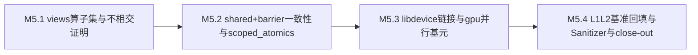

# M5 执行计划 — 小里程碑分解

> 所属契约:[M5_CONTRACT.md](M5_CONTRACT.md)
> 版本:v1.0(2026-06-14)
> 粒度依据:11 §7(1–2 周小里程碑 + 阶段两级结构);本计划是工作分解,验收以契约 §4 为准,本文不重定义成功。

---

## 0. 总览与依赖

| 小里程碑 | 时长(估) | 交付物映射 | 阻塞关系 |
|---|---|---|---|
| M5.1 | ~2–3 周 | D-M5-1(views 不相交证明 + 条款先行) | 依赖 M4 着色/地址空间 + MIR 借用检查(已交付,`m4-closed`);M4 借用检查 pass 结构可扩展点是接入面 |
| M5.2 | ~2 周 | D-M5-2 / D-M5-3(shared+barrier 一致性 + scoped atomics 条款,映射 D-406 人工落笔) | 依赖 M5.1(shared view 收窄依赖 views 不相交;barrier 一致性消费着色/views 信息) |
| M5.3 | ~2–3 周 | D-M5-4 / D-M5-5(libdevice 链接 + gpu 并行基元自研 kernel) | 依赖 M5.2(reduce/scan/GEMM 需 shared+barrier + scoped atomics;数学函数需 libdevice) |
| M5.4 | ~1–2 周 | D-M5-5(基准回填)/ D-M5-6(Sanitizer + 黄金路径 5 收口) | 依赖 M5.3(基准回填需 kernel 真跑全链路;Sanitizer 需 device 并行 kernel 存在) |

时长为 `estimated`(M4 实际节奏可作弱参考),仅作排程参考,不构成验收承诺。

## 1. M5.1 — views 算子集与不相交证明(~2–3 周)

| # | 任务 | 验证方式 |
|---|---|---|
| 1 | guardrail 基准切换:先打 `m4-closed` tag(随 M5 开工,对齐 `m3-closed` 随 M3 终审打出的先例);`ci/check_guardrails.py` 本地/push 回退基准 `m3-closed → m4-closed`(PR 路径仍以 GITHUB_BASE_REF 为准),双基准核对后落地,留痕 [CI_GATES.md](CI_GATES.md) 修订行 | `py -3 ci/check_guardrails.py m4-closed` PASS |
| 2 | spec 条款先行:views 算子集(`split_at`/`chunks`/`windows`)语义 + 子 view 不相交性规则 + 越界规则入 spec(RXS-0078 续号)——**条款 PR 先于实现 PR** | spec 档位标记 guardrail + 修订行 |
| 3 | views 不相交证明:作为 MIR 借用检查的 device 扩展 pass(07 §4),消费 M4 着色/地址空间边界信息;重叠子 view 同时可变借用 / 别名可变 view 写冲突 / view 越界 → 3xxx 诊断 | 单测 + UI snapshot |
| 4 | 3xxx 错误码段位续接分配(RX300x 接 M4 的 RX3006)+ `views.*` message-key(registry 只追加);host 回归网(hello-world 冒烟 + SAXPY 回归)持续绿 | `py -3 ci/check_schemas.py` PASS + UI snapshot |
| 5 | conformance/views accept/reject 语料 + 批跑测试接入(`m5.counter.views_conformance_categories`) | conformance 正例 0 诊断 + reject 全拦截 |

**出口判据(✅ 已达成,M5 closed 2026-06-15)**:views 不相交反例(契约 G-M5-2)全拦截;conformance 正例 0 诊断;host SAXPY/hello-world 回归不退化。

## 2. M5.2 — shared+barrier 一致性与 scoped atomics(~2 周)

| # | 任务 | 验证方式 |
|---|---|---|
| 1 | spec 条款:`shared let` 读写 + barrier 一致性数据流规则(把 M4 RXS-0068 保守 uniform 骨架完整化为数据流判定,06 §2.2);scoped atomics `Atomic<T, Scope>` 类型契约入 spec(RXS 续号) | 同 M5.1 第 2 项 |
| 2 | shared+barrier 一致性检查:`shared let`(addrspace 3)写后未过 barrier 不可读他 lane 写入等保守规则,数据流判定;违例 → 3xxx 诊断 | 单测 + UI snapshot |
| 3 | **scoped atomics + PTX `atom.{order}.{scope}` 映射层(D-406 禁区 — 人工落笔)**:AI 完成类型契约条款化 + 挂测试骨架;PTX 映射语义实现由人工完成,本表只登记接入点与验证义务 | 人工实现真跑 + spec 锚定 |
| 4 | scoped atomics scope 误用 → 黄金路径 5 子集 snapshot(bless 审批) | UI snapshot(G-M5-3 子集) |

**出口判据(✅ 已达成,M5 closed 2026-06-15)**:shared+barrier 一致性违例全拦截;scoped atomics 类型契约条款化完成且映射(人工)真跑;黄金路径 5 的 shared/atomics 子集 snapshot 入库。

## 3. M5.3 — libdevice 链接与 gpu 并行基元(~2–3 周)

| # | 任务 | 验证方式 |
|---|---|---|
| 1 | spec 条款:libdevice 链接流程(保留外部符号 → 链 bc → internalize → DCE → NVVMReflect,07 §7)入 spec(RXS 续号) | 同 M5.1 第 2 项 |
| 2 | device codegen 接通 libdevice:保留外部数学符号 → 链 libdevice bc → internalize → DCE → NVVMReflect;NVVMReflect flag(ftz/precision)裁决留痕 | 单测(数学函数 codegen 中间产物)+ ptxas 关卡过 |
| 3 | gpu 并行基元自研 kernel(Rurix 源,全 safe 代码目标):reduce / scan / transpose / tiled GEMM(经典 shared-memory tiling,不触 Tensor Core intrinsics);全管线产 PTX 并真跑 | 端到端真跑 + 正确性核对 |
| 4 | SG-002 复评留痕:tiled GEMM 基准落地后复评 SG-002 触发条件,结论(预期仍 not_triggered:自研 kernel 不动 Tensor Core/WGMMA intrinsics)入 spike_gating decisions + CI_GATES §4 | spike_gating 追加 decisions |
| 5 | L1/L2 微基准 harness 接入(RD-002 承接,复用 BENCH_PROTOCOL §3;手写 CUDA C++ 对照实现作 denominator 锚点) | harness 冒烟正确性 PASS |

**出口判据(✅ 已达成,M5 closed 2026-06-15)**:libdevice 链接接通且 gpu 基元 kernel 数学函数真跑;reduce/scan/transpose/GEMM 全管线产 EXE 真跑成功;基准 harness 就位。

## 4. M5.4 — L1+L2 基准回填、Sanitizer 与 close-out(~1–2 周)

| # | 任务 | 验证方式 |
|---|---|---|
| 1 | 基准采样(G-M5-1):BENCH_PROTOCOL §3 协议 + **三次进程级独立运行**;锁频 L0 前置(降级证据 `unlocked` 不得回填);reduce/scan/GEMM-tile 证据 JSON 入 evidence/。脚手架:`bench/lock_clocks.py`(--lock/--check/--unlock + `require_locked()` 采样前置闸门)→ `bench/cuda_ref_triple.py`(CUDA C++ 对照分母 ×3 回填 `m5.bench.*_cuda.*`)→ `bench/rurix_{reduce,scan,gemm_tile}_triple.py`(自研 kernel 分子 ×3 + ratio);`bench/m5_bench_all.py` 为一键编排入口 | `py -3 bench/lock_clocks.py --lock`(管理员)→ `py -3 bench/m5_bench_all.py` → `evidence_level=measured_local` 核验 |
| 2 | 预算回填:[m5_budget.json](m5_budget.json) `m5.ratio.{reduce,scan,gemm_tile}_vs_cuda` estimated → measured_local(numerator = 自研 kernel,denominator = 手写 CUDA C++ 对照),阈值 0.90,revision_log 追加 | `py -3 ci/budget_eval.py --strict` ≥0.90 通过 |
| 3 | **Compute Sanitizer 纳入 nightly(G-M5-4)**:`racecheck` + `memcheck` 对全部自研 kernel + M4 SAXPY 回归;激活经真实红绿验证(构造已知竞争 kernel → racecheck 红 → 修复转绿);报告归档 | CI nightly 全绿 + 红绿 run URL 留痕 |
| 4 | 黄金路径 5 收口:`tests/ui/` 并行安全错误 snapshot ≥10(views 重叠/别名 + shared+barrier + scoped atomics,经 bless 审批) | G-M5-3 计数 + CI 绿 |
| 5 | NVIDIA 再分发白名单审计 formal 激活(libdevice 链接引入再分发物时逐项核对,M4 §8.2 标注到期时点):结论入 [CI_GATES.md](CI_GATES.md) §4 + close-out | 审计结论留痕 |
| 6 | traceability 矩阵再生成(`ci/trace_matrix.py`,含 M5 新条款)+ 全锚定核对;M5 close-out 草拟(验收记录 + guardrail 输出 + Sanitizer 红绿 + 白名单结论 + run URL 追加契约 §8) | G-M5-5 + guardrail 全过 |

**出口判据(✅ 已达成,M5 closed 2026-06-15)**:契约 G-M5-1 / G-M5-4 / G-M5-5 达成(measured ratio reduce 0.9925 / scan 1.0058 / gemm_tile 1.0016 ≥0.90,`budget_eval --strict` PASS,Sanitizer racecheck+memcheck nightly 全绿),close-out 终审完成(M5_CONTRACT §8,`status: closed`;关闭判定 + EULA 裁决由白栀/owner 人工签署 §8.8)。

## 5. 风险提示(引用,不另建登记)

- **views 不相交证明的判定复杂度**:子 view 不相交在一般情形需区间/别名分析;M5 取保守先行(07 §4)——能证不相交才放行,证不出保守拒绝(可 unsafe 逃生),避免假阴性(漏报竞争)。判定规则随真实 kernel 需求扩展,扩展经 conformance 类别留痕。
- **scoped atomics 映射禁区(D-406)**:`atom.{order}.{scope}` 的内存序/作用域映射语义错误会导致难复现的竞争 bug。对策:**人工落笔**(AI 不擅自实现映射),Compute Sanitizer racecheck 作运行期背书(G-M5-4),映射 PR 必须引用 RXS 条款 + 真跑红绿。
- **libdevice 链接的工具链绑定**:libdevice bc 版本绑定 CUDA Toolkit,internalize/DCE/NVVMReflect 流程对 LLVM pin(22.1.x)敏感。对策:沿用 M4 NVPTX 雷区回归集 + pin 版本;libdevice 定位禁硬编码版本文件名(沿用 M4 CI_GATES §1 的 r6 教训)。
- **90% 阈值的测量稳态**:G-M5-1 是安全并行硬证据,measured_local 必须在锁频成功的环境采;锁频降级(`unlocked`)证据不得回填。三次进程级独立运行 + trimmed mean;若自研 kernel 未达标,优先排查 codegen/访存合并/shared bank conflict/occupancy 而非放宽阈值。手写 CUDA C++ 对照实现须同协议、同问题规模采样。
- **Compute Sanitizer 计时与隔离**:Sanitizer 运行显著拖慢 kernel,只在 nightly 正确性维度跑(不用于 measured 基准);GPU 队列、子进程隔离(14 §6),崩溃不连坐 harness。
- **device 借用扩展与 host 借用检查衔接面**:views 不相交是 M3 host 借用检查(MIR 层)的 device 扩展 pass;M4 已保证 pass 结构可扩展。host 回归网(hello-world 冒烟 + MIR golden + SAXPY 回归)是常驻回归网,每个 M5.x PR 必须保持绿。
- **错误码段位纪律**:3xxx(着色/地址空间/views 不相交/shared+barrier)续接 M4 的 RX3006;scoped atomics scope 误用归 3xxx 续接;分配制递增、含义冻结(10 §6),分配 PR 留痕裁决。

## 6. 修订记录

| 版本 | 日期 | 变更 |
|---|---|---|
| v1.0 | 2026-06-14 | 初版(M5 契约配套;CI 步骤 22+ 为 M5.x 计划项,落地时回填实测命令;guardrail 三项动作:基准切换 m3-closed→m4-closed、NVIDIA 白名单 formal 激活、Compute Sanitizer nightly 均为计划项) |
| v1.1 | 2026-06-14 | M5.4 任务 1(脚手架):锁频检查 `bench/lock_clocks.py`(--lock/--check/--unlock + `require_locked()` 前置闸门,接入三个 rurix_*_triple.py)+ CUDA 对照分母三次运行器 `bench/cuda_ref_triple.py` + 编排入口 `bench/m5_bench_all.py`;CUDA 对照 PTX(`bench/kernels/cuda_*.ptx`)纳入版本控制。实跑三次采样 + measured_local 回填留作任务 2(需管理员锁频后操作者执行) |
| v1.2 | 2026-06-15 | M5.1~M5.4 出口判据全部勾掉(✅ 已达成);M5 契约 `status: closed`(G-M5-1 三比值 0.9925/1.0058/1.0016 ≥0.90、`budget_eval --strict` PASS、Sanitizer nightly 全绿、traceability 82/82 全锚定;关闭判定 + EULA 裁决由白栀/owner 人工签署,见 M5_CONTRACT §8.8)。stacked 链 #23→#27 合入 main、`m5-closed` tag、guardrail 基准 `m4-closed→m5-closed` 切换留痕见 M5_CONTRACT §8.10 / CI_GATES §6 |
