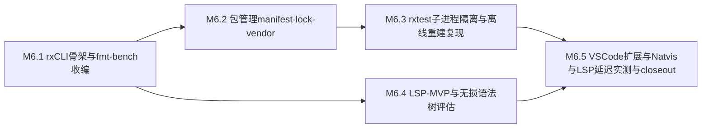

# M6 执行计划 — 小里程碑分解

> 所属契约:[M6_CONTRACT.md](M6_CONTRACT.md)
> 版本:v1.0(2026-06-15)
> 粒度依据:11 §7(1–2 周小里程碑 + 阶段两级结构);本计划是工作分解,验收以契约 §4 为准,本文不重定义成功。

---

## 0. 总览与依赖

| 小里程碑 | 时长(估) | 交付物映射 | 阻塞关系 |
|---|---|---|---|
| M6.1 | ~2 周 | D-M6-1(rx CLI 骨架 + rx fmt 收编 RD-005 + rx bench 收编 RD-003 + 条款先行) | 依赖 rurixc query 层(07 §2,已具雏形)+ M0~M5 既有 harness/fmt 雏形;单一前端不另起引擎 |
| M6.2 | ~2 周 | D-M6-2(包管理 rurix.toml/rurix.lock/vendor/SHA-256,path/git/archive 三来源) | 依赖 M6.1(rx CLI 总入口与子命令分发面;rx build 接 manifest 解析) |
| M6.3 | ~1–2 周 | D-M6-3(rx test 子进程隔离 + workspace 多包 + 离线重建复现门 G-M6-1) | 依赖 M6.2(离线重建需 lock/vendor 就位;workspace 单根锁) |
| M6.4 | ~2–3 周 | D-M6-4(LSP MVP + 无损语法树通道评估 RD-004) | 依赖 M6.1(常驻 query 层 server 模式经 rx;LSP 复用 §5 诊断 JSON);与 M6.2/M6.3 可并行 |
| M6.5 | ~1–2 周 | D-M6-5(VS Code 扩展 + Natvis 首批 + LSP 10k 行延迟实测 G-M6-2)/ D-M6-6(close-out) | 依赖 M6.3(工具链就位)+ M6.4(LSP server 就位) |

时长为 `estimated`(M0~M5 实际节奏可作弱参考),仅作排程参考,不构成验收承诺。

## 1. M6.1 — rx CLI 骨架与 fmt/bench 收编(~2 周)

| # | 任务 | 验证方式 |
|---|---|---|
| 1 | spec 条款先行:`spec/toolchain.md` 新建,rx CLI 总入口 + 核心子命令语义面(build/run/check/test/bench/fmt 的语义契约与退出码约定)入 spec(RXS-0083 续号)——**条款 PR 先于实现 PR**;每条款 ≥1 测试锚定(`//@ spec: RXS-####`)随实现 PR 同落,trace_matrix 维持全锚定 | spec 档位标记 guardrail + 修订行 + `trace_matrix --check` PASS |
| 2 | `rx` 总入口 + 子命令分发骨架(build/run/check);单一前端经 rurixc query 层(07 §2/§9),不另起引擎 | rx CLI 子命令冒烟(`m6.counter.rx_cli_core_subcommands`)|
| 3 | **rx fmt 收编(RD-005)**:雏形格式器收编进 `rx fmt`;`ci/check_fmt_idempotent.py` 既有幂等门延续到 rx fmt(全语料二次格式化 0 diff) | `py -3 ci/check_fmt_idempotent.py`(经 rx fmt)PASS + RD-005 history 追加 |
| 4 | **rx bench 收编(RD-003)**:M5 bench harness 脚本(`bench/*.py`)协议收编进 `rx bench`(复用 BENCH_PROTOCOL §3:L0 锁频前置 / 三次进程级独立运行 / trimmed mean);收编后 harness 脚本退役留痕 | rx bench `--smoke` 正确性 PASS + RD-003 history 追加 |
| 5 | 新段位错误码首批分配(rx CLI/工具链诊断:子命令用法错误 / manifest 缺失 等)+ message-key(registry 只追加);host 回归网持续绿 | `py -3 ci/check_schemas.py` PASS + UI snapshot |

**出口判据**:rx build/run/check 端到端真跑;rx fmt 幂等门绿;rx bench 收编 harness 协议;spec/toolchain.md 首批条款锚定;host hello-world/SAXPY 回归不退化。

## 2. M6.2 — 包管理 manifest/lock/vendor(~2 周)

| # | 任务 | 验证方式 |
|---|---|---|
| 1 | spec 条款:`rurix.toml`(意图)+ `rurix.lock`(精确解析图 + 内容树 SHA-256)格式语义入 spec(RXS 续号,09 §7.1/7.2);依赖三来源 path/git/archive 解析规则 | 同 M6.1 第 1 项 |
| 2 | manifest 解析 + 依赖解析图(workspace 单根锁;feature additive-v1 + `unification="selected"`);**无 build.rs**(`build.model="declarative"`,声明式元数据) | 单测(解析/解析图)+ 冲突检测 |
| 3 | `rurix.lock` 生成 + 内容树 SHA-256 校验 + `vendor/` 可提交;`--locked/--offline` 离线路径 | 单测 + 离线解析冒烟 |
| 4 | 工具链/包管理诊断错误码续接分配(lock 不一致 / digest 不符 / 来源不可达)+ message-key | `py -3 ci/check_schemas.py` PASS |

**出口判据**:三来源 manifest 解析 + lock 生成 + 内容树校验就位;离线解析路径可跑;为 M6.3 复现门铺底。

## 3. M6.3 — rx test 子进程隔离与离线重建复现(~1–2 周)

| # | 任务 | 验证方式 |
|---|---|---|
| 1 | `rx test` 内建 `#[test]` 运行器 + GPU 测试自动子进程隔离选项(14 §6,崩溃不连坐 harness) | rx test 端到端 + GPU 子进程隔离冒烟 |
| 2 | workspace 多包(单根锁;path/git/archive 三来源各 ≥1 包的样例 workspace) | workspace 构建冒烟 |
| 3 | **三包离线重建逐字节可复现门(G-M6-1)**:`rx build --locked --offline` 干净环境重建,两次产物 content SHA-256 逐字节一致;`m6.counter.offline_rebuild_reproducible` 证据归档 | 复现证据 + 计数核对 `py -3 ci/budget_eval.py` |
| 4 | 复现门**真实红绿验证**(反 YAML-only):篡改一个内容树 digest → 重建/校验红 → 复原转绿,run URL 归档 | 两次 run URL 留痕 |

**出口判据**:rx test 子进程隔离就位;三包 workspace 离线重建逐字节可复现门绿且经真实红绿验证(契约 G-M6-1)。

## 4. M6.4 — LSP MVP 与无损语法树评估(~2–3 周)

| # | 任务 | 验证方式 |
|---|---|---|
| 1 | spec 条款:LSP 能力面(publishDiagnostics/completion/definition+references/highlight/rename 的语义契约,07 §9)入 spec(RXS 续号) | 同 M6.1 第 1 项 |
| 2 | `rurixc --tooling-server` 常驻 query 层(单一前端,07 §9;进程内 memoization + 模块/函数级失效,不做跨会话红绿增量) | server 模式冒烟 + query 失效单测 |
| 3 | LSP MVP 能力:publishDiagnostics(直接消费 §5 诊断 JSON)/ completion / definition+references / highlight / rename | LSP 能力面测试(`m6.counter.lsp_capabilities`)|
| 4 | **无损语法树通道评估(RD-004)**:LSP MVP 开工时评估接通;若按 07 §9 容忍"保存时全量 body 重查询"则继续推迟,处置留痕(代码侧 `// STUB(RD-004)` 双侧标注) | RD-004 history 追加(接通/推迟处置) |

**出口判据**:LSP server 五项 MVP 能力在样例工程可用;RD-004 通道接通或推迟处置留痕;为 M6.5 延迟实测铺底。

## 5. M6.5 — VS Code 扩展、Natvis 与 LSP 延迟实测、close-out(~1–2 周)

| # | 任务 | 验证方式 |
|---|---|---|
| 1 | VS Code 扩展(LSP 客户端 + 语法高亮 TextMate 起步,08 §8 D-240) | 扩展手动联调 + LSP 往返冒烟 |
| 2 | Natvis 首批(标准库 Buffer/View/Vec/Mat 可视化,08 §5) | host 调试可视化核对 |
| 3 | **LSP 10k 行交互延迟预算实测(G-M6-2)**:10k 行样例工程上 completion/publishDiagnostics(保存后)/definition 延迟,BENCH_PROTOCOL 协议化采样;`m6.bench.lsp_interaction_latency_ms` estimated → measured_local 回填,阈值裁定(参照 07 §6 增量 check < 5s 行业线) | `py -3 ci/budget_eval.py --strict` 通过 |
| 4 | M6 close-out 草拟:验收记录 + guardrail 输出 + 离线重建复现红绿 + LSP 延迟 measured_local 证据 + RD-003/RD-004/RD-005 收编/处置 close 留痕(追加契约 §8) | G-M6-1~G-M6-5 + guardrail 全过 |

**出口判据**:契约 G-M6-1 / G-M6-2 达成(三包离线重建逐字节可复现 + LSP 10k 行延迟 measured_local),close-out 终审完成(M6_CONTRACT §8;关闭判定由白栀/agent 自主签署)。

## 6. 风险提示(引用,不另建登记)

- **离线重建逐字节可复现的非确定性源**:时间戳 / 文件序 / 并行编译序 / CGU 划分易引入非确定性。对策:产物哈希前规范化(去时间戳、排序文件项)+ 单 CGU per package 起步(07 §8),证据驱动再拆分;复现门构造篡改 digest 红绿验证。
- **无 build.rs 的现实张力(09 §7.1)**:native/GPU 元数据全声明式可能不覆盖全部场景;逃生舱(受限 runner/allowlist)按需后置而非本里程碑——遇硬需求按 14 §4 登记 RD-### 而非擅自加 build.rs。
- **LSP 单一前端 query 层的增量边界(07 §2/§9)**:MVP 容忍"保存时全量 body 重查询",不做跨会话红绿增量;10k 行延迟达标依赖 query memoization + 模块/函数级失效,而非持久化指纹(r1 教训:增量有时比全量更慢)。RD-004 无损语法树通道为增量细化前提,评估接通而非强行。
- **rx bench 收编的证据连续性(RD-003)**:harness 脚本收编进 `rx bench` 时必须保持 BENCH_PROTOCOL §3 协议一致(L0 锁频前置 / 三次进程级独立运行 / trimmed mean),既有 measured_local 证据口径不变;收编后脚本退役留痕,M5 比值证据不被改写(evidence/ 只增不删不改)。
- **rx fmt 收编的幂等承诺(RD-005)**:收编后 `ci/check_fmt_idempotent.py` 既有幂等门必须延续(全语料二次格式化 0 diff),格式行为变更须经审查防风格漂移(gofmt 哲学,杜绝 AI 风格漂移)。
- **新段位错误码纪律**:rx CLI/包管理/LSP 工具链诊断的错误码按 07 §5 段位语义分配(工具链类归 7xxx 续接或经裁决新段位),分配制递增、含义冻结(10 §6),分配 PR 留痕裁决,无实现不预造。
- **host 回归网常驻绿**:hello-world 冒烟 + SAXPY 冒烟 + MIR/borrowck 测 + cargo fmt/clippy(pin 1.93.1)+ cargo test --workspace 是常驻回归网,每个 M6.x PR 必须保持绿;新增 rx CLI/包管理/LSP crate 默认 `unsafe_code=deny`。

## 7. 修订记录

| 版本 | 日期 | 变更 |
|---|---|---|
| v1.0 | 2026-06-15 | 初版(M6 契约配套;M6.1~M6.5 小里程碑分解 + 依赖图;rx CLI/包管理/rx test/LSP MVP 排程;deferred 承接 RD-003/RD-004/RD-005 随各小里程碑收编/评估,RD-007 顺延评估;CI 步骤为 M6.x 计划项,落地时回填实测命令) |
