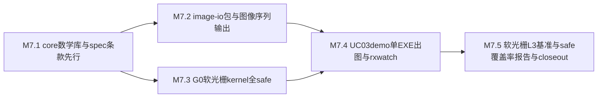

# M7 执行计划 — 小里程碑分解

> 所属契约:[M7_CONTRACT.md](M7_CONTRACT.md)
> 版本:v1.0(2026-06-15)
> 粒度依据:11 §7(1–2 周小里程碑 + 阶段两级结构);本计划是工作分解,验收以契约 §4 为准,本文不重定义成功。

---

## 0. 总览与依赖

| 小里程碑 | 时长(估) | 交付物映射 | 阻塞关系 |
|---|---|---|---|
| M7.1 | ~2 周 | D-M7-1(core 数学库 Vec/Mat/swizzle/几何原语 + 条款先行 spec/stdlib.md RXS-0104) | 依赖 M6 rx CLI / device codegen 既有面;全 safe API,host+device 双路径 |
| M7.2 | ~1–2 周 | D-M7-2(image-io 包 + 确定性图像序列输出) | 依赖 M7.1(数学库类型供像素/缓冲表示);供 M7.4 出图落盘 |
| M7.3 | ~2–3 周 | D-M7-3(G0 软光栅 kernel:binning/tile 光栅/深度/tonemap,全 safe 目标) | 依赖 M7.1(数学库 Vec/Mat/几何原语);与 M7.2 可并行 |
| M7.4 | ~2 周 | D-M7-4(UC-03 demo:SPH 仿真 + 软光栅出图,单 EXE + 图像序列 G-M7-1)+ rx watch(D-M7-6 子项) | 依赖 M7.2(image-io 出图)+ M7.3(软光栅 kernel) |
| M7.5 | ~1–2 周 | D-M7-5(软光栅 L3 基准 measured_local G-M7-2)/ D-M7-6(safe 覆盖率报告 + close-out) | 依赖 M7.3(软光栅就位)+ M7.4(demo 场景) |

时长为 `estimated`(M0~M6 实际节奏可作弱参考),仅作排程参考,不构成验收承诺。

## 1. M7.1 — core 数学库与 spec 条款先行(~2 周)

| # | 任务 | 验证方式 |
|---|---|---|
| 1 | spec 条款先行:**新建 `spec/stdlib.md`**,core 数学库类型面(Vec/Mat/swizzle/几何原语的构造、算术、谓词语义与 host+device 双路径约定)入 spec(RXS-0104 续号)——**条款 PR 先于实现 PR**;每条款 ≥1 测试锚定(`//@ spec: RXS-####`)随实现 PR 同落,trace_matrix 维持全锚定 | spec 档位标记 guardrail + 修订行 + `trace_matrix --check` PASS |
| 2 | core 数学库 Vec/Mat/swizzle 实现(全 safe API,host+device 双路径);构造 / 分量算术 / swizzle / 矩阵乘 | 数学库 conformance 冒烟(`m7.counter.math_primitives`) |
| 3 | 几何原语(点 / 向量 / 法线 / AABB / 射线等)+ 几何谓词(相交 / 包含)正确性 | 几何原语 conformance 真跑 |
| 4 | 新段位错误码首批分配(stdlib/数学库诊断:维度不匹配 / swizzle 非法分量 等)+ message-key(registry 只追加);host 回归网持续绿 | `py -3 ci/check_schemas.py` PASS + UI snapshot |

**出口判据**:core 数学库 Vec/Mat/swizzle/几何原语 host+device 双路径端到端真跑;spec/stdlib.md 首批条款锚定;host hello-world/SAXPY 回归不退化。

## 2. M7.2 — image-io 包与图像序列输出(~1–2 周)

| # | 任务 | 验证方式 |
|---|---|---|
| 1 | spec 条款:image-io 接口语义面(无损格式优先 PPM/PNG;确定性字节布局 / 通道序)入 spec(RXS 续号,09 §7 包形态) | 同 M7.1 第 1 项 |
| 2 | image-io 包(确定性图像序列输出:固定输入 → 逐字节确定字节流);经 M6 包管理 rurix.toml 集成 | 单测(编解码 / 确定性)+ 离线构建冒烟 |
| 3 | 图像序列落盘接口(供软光栅 / UC-03 demo 出图;逐帧 content SHA-256 可核对) | 落盘确定性单测 |
| 4 | image-io 诊断错误码续接分配(格式不支持 / 写入失败)+ message-key | `py -3 ci/check_schemas.py` PASS |

**出口判据**:image-io 包确定性图像序列输出就位;落盘逐字节可复现;为 M7.4 demo 出图与 M7.1 数学库像素表示铺底。

## 3. M7.3 — G0 软光栅 kernel(全 safe,~2–3 周)

| # | 任务 | 验证方式 |
|---|---|---|
| 1 | spec 条款:软光栅 kernel 语义面(binning / tile 光栅 / 深度 / tonemap 的数据流与边界约定)入 spec(RXS 续号,07 §7 device codegen 作用面) | 同 M7.1 第 1 项 |
| 2 | G0 compute 软光栅 kernel:binning + tile 光栅 + 深度测试 + tonemap,**全 safe 代码目标**(优先 views/shared+barrier 等 M5 安全并行基元;凡落 unsafe 须 `// SAFETY:` + 注册) | 软光栅 kernel 冒烟 + 确定性帧像素(`m7.counter.soft_raster_kernels_safe`) |
| 3 | **safe 覆盖率统计(G-M7-3)**:软光栅 kernel safe 覆盖计数 + unsafe 落点·原因留痕(反哺 views 扩展清单) | safe 覆盖计数核对 `py -3 ci/budget_eval.py` |
| 4 | 软光栅 kernel codegen 形态纳入既有 PTX/IR golden bless;device kernel 纳入 Compute Sanitizer nightly | check_ptx_bless + nightly racecheck/memcheck 绿 |

**出口判据**:G0 软光栅 binning/tile 光栅/深度/tonemap kernel 在样例场景出图;safe 覆盖计数达标且 unsafe 落点留痕(契约 G-M7-3);为 M7.4 demo 与 M7.5 L3 基准铺底。

## 4. M7.4 — UC-03 demo 单 EXE 出图与 rx watch(~2 周)

| # | 任务 | 验证方式 |
|---|---|---|
| 1 | UC-03 验收 demo:**SPH 仿真**(粒子流体)+ **软光栅出图**(M7.3 kernel)+ image-io 落盘图像序列;`rx build` 产**单 EXE** | demo 单 EXE 端到端真跑 |
| 2 | **确定性图像序列(G-M7-1)**:固定输入 / 随机种子下两次运行逐帧 content SHA-256 逐字节一致;`m7.counter.uc03_demo_image_sequence` 证据归档 | 图像序列复现证据 + 计数核对 |
| 3 | 图像序列门**真实红绿验证**(反 YAML-only):篡改一帧像素 / 破坏 demo 管线 → 校验红 → 复原转绿,run URL 归档 | 两次 run URL 留痕 |
| 4 | **kernel 热重载 `rx watch`**(D-M7-6 子项,08 §6):源变更→重编译→重载;host/CPU 编排,非验收硬门,功能冒烟 | rx watch 热重载冒烟 |

**出口判据**:UC-03 demo 单 EXE 分发 + 确定性输出图像序列门绿且经真实红绿验证(契约 G-M7-1);rx watch 热重载冒烟可用。

## 5. M7.5 — 软光栅 L3 基准、safe 覆盖率报告与 close-out(~1–2 周)

| # | 任务 | 验证方式 |
|---|---|---|
| 1 | **软光栅 L3 基准实测(G-M7-2)**:L3 规模场景(大三角形 / 大分辨率帧)帧时间 / 吞吐,BENCH_PROTOCOL 协议化采样;`m7.bench.soft_raster_l3_frame_ms` estimated → measured_local 回填,direction 与阈值裁定 | `py -3 ci/budget_eval.py --strict` 通过 |
| 2 | **safe 覆盖率报告(G-M7-3)**:汇总软光栅 kernel safe 覆盖 + unsafe 落点·原因(反哺 views 扩展清单) | safe 覆盖计数达标 + 报告留痕 |
| 3 | M7 close-out 草拟:验收记录 + guardrail 输出 + UC-03 demo 图像序列红绿 + 软光栅 L3 基准 measured_local 证据 + RD-007 处置留痕(追加契约 §8) | G-M7-1~G-M7-5 + guardrail 全过 |

**出口判据**:契约 G-M7-1 / G-M7-2 / G-M7-3 达成(UC-03 demo 单 EXE 出图 + 软光栅 L3 measured_local + safe 覆盖率报告),close-out 终审完成(M7_CONTRACT §8;关闭判定由白栀/owner 人工签署)。

## 6. 风险提示(引用,不另建登记)

- **图像序列逐字节可复现的非确定性源**:浮点累加序 / 并行归约序 / tile 调度序 / 随机种子易引入非确定性。对策:固定随机种子 + 确定性归约(M5 自研 reduce/scan 基元)+ tile 顺序固定;图像序列门构造篡改一帧像素红绿验证。
- **软光栅全 safe 代码目标的现实张力(11 §3 M7)**:tile 光栅 / 原子深度合成等可能诱发 unsafe;对策优先复用 M5 安全并行基元(views 不相交 / shared+barrier / scoped atomics),凡落 unsafe 须 `// SAFETY:` + 注册 + safe 覆盖率报告留痕原因(反哺 views 扩展清单),不擅自扩 unsafe 面。
- **const 泛型值运行期单态化(RD-007)的触发面**:几何原语 / 数组长度类 const 泛型(如固定维度 Mat、tile 尺寸)可能触发运行期单态化;非 M7 验收门,按需接通或继续留痕(RXS-0064 语义不变,回填仅补实现侧),遇硬需求按 14 §4 处置而非擅自跨层改造。
- **软光栅 L3 基准的证据连续性(G-M7-2)**:L3 基准复用 BENCH_PROTOCOL §3 协议(L0 锁频前置 / 三次进程级独立运行 / trimmed mean),经 `rx bench` 入口编排(RD-003 已收编);estimated 占位在 M7.5 回填 measured_local,close-out `--strict` 全局零 estimated。
- **新段位错误码纪律**:stdlib/数学库/image-io/软光栅工具链诊断的错误码按 07 §5 段位语义分配(分配制递增、含义冻结,10 §6),分配 PR 留痕裁决,无实现不预造。
- **host 回归网常驻绿**:hello-world 冒烟 + SAXPY 冒烟 + MIR/borrowck 测 + cargo fmt/clippy(pin 1.93.1)+ cargo test --workspace 是常驻回归网,每个 M7.x PR 必须保持绿;新增 stdlib/image-io/软光栅/demo crate 默认 `unsafe_code=deny`。

## 7. 修订记录

| 版本 | 日期 | 变更 |
|---|---|---|
| v1.0 | 2026-06-15 | 初版(M7 契约配套;M7.1~M7.5 小里程碑分解 + 依赖图;core 数学库/image-io/G0 软光栅/UC-03 demo/rx watch 排程;deferred 承接 RD-007 顺延评估;CI 步骤为 M7.x 计划项,落地时回填实测命令) |
