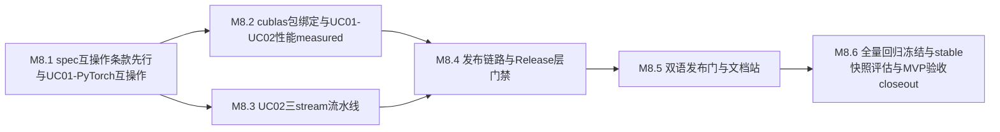

# M8 执行计划 — 小里程碑分解

> 所属契约:[M8_CONTRACT.md](M8_CONTRACT.md)
> 版本:v1.0(2026-06-16)
> 粒度依据:11 §7(1–2 周小里程碑 + 阶段两级结构);本计划是工作分解,验收以契约 §4 为准,本文不重定义成功。

---

## 0. 总览与依赖

| 小里程碑 | 时长(估) | 交付物映射 | 阻塞关系 |
|---|---|---|---|
| M8.1 | ~2–3 周 | D-M8-1(UC-01 PyTorch 互操作:PYD/nanobind/`__cuda_array_interface__`/DLPack + 条款先行 spec/interop.md RXS-0122) | 依赖 M5 自研 kernel / M6 rx CLI(`rx build --emit=pyd`);host+device 既有面 |
| M8.2 | ~2–3 周 | D-M8-2(cublas 包 GEMM/GEMV 三层绑定)+ UC-01/UC-02 L1/L2 性能 measured_local 回填 | 依赖 M8.1(互操作通道)+ M5 GEMM 对照基线 |
| M8.3 | ~2 周 | D-M8-3(UC-02 三 stream 重叠流水线:affine Context/Stream/Event/Buffer + 跨线程所有权转移 + 流序分配类型化) | 依赖 M4 运行时 Context/Stream/Buffer + M5 安全并行面;与 M8.2 可并行 |
| M8.4 | ~2–3 周 | D-M8-4(发布链路 rurixup/MSI/winget + Azure 签名/SBOM/许可审计 + artifact 上传 + CI Release 层门禁,RD-001) | 依赖 M6 包管理(打包/锁文件)+ M8.1~M8.3 产物可签名 |
| M8.5 | ~1–2 周 | D-M8-5(诊断双语全量覆盖 + 覆盖率发布门,RD-006)+ D-M8-6 子项(文档站 rx doc) | 依赖 M1 message-key 骨架 + 全里程碑诊断面;发布门挂 M8.4 Release 层 |
| M8.6 | ~1–2 周 | D-M8-6(全量回归冻结 + stable API 快照冻结评估)+ MVP 验收 close-out | 依赖 M8.1~M8.5 全部就位;UC-01/UC-02/UC-03 端到端 + L1/L2 性能 + 零 estimated |

时长为 `estimated`(M0~M7 实际节奏可作弱参考),仅作排程参考,不构成验收承诺。

## 1. M8.1 — spec 互操作条款先行与 UC-01 PyTorch 互操作(~2–3 周)

| # | 任务 | 验证方式 |
|---|---|---|
| 1 | spec 条款先行:**新建 `spec/interop.md`**,互操作语义面(`rx build --emit=pyd` PYD 产出约定 / `__cuda_array_interface__` v3 + DLPack 双协议零拷贝语义 / C ABI 边界)入 spec(RXS-0122 续号)——**条款 PR 先于实现 PR**;每条款 ≥1 测试锚定(`//@ spec: RXS-####`)随实现 PR 同落,trace_matrix 维持全锚定 | spec 档位标记 guardrail + 修订行 + `trace_matrix --check` PASS |
| 2 | UC-01 互操作实现:`rx build --emit=pyd` 产 PYD(nanobind + scikit-build-core);`__cuda_array_interface__` v3 / DLPack 双协议零拷贝接入 PyTorch | 互操作冒烟(步骤 34,`m8.counter.uc01_pytorch_operators`) |
| 3 | 算子替换端到端(SAXPY/Reduction/GEMM 类瓶颈算子,复用 M5 自研 kernel);图像序列门**真实红绿**(篡改算子结果 → 红 → 复原绿) | 算子替换数值对照 + run URL 归档 |
| 4 | 新段位错误码首批分配(互操作诊断:协议不支持 / 设备指针非法 / 形状不匹配 等)+ message-key(registry 只追加);host 回归网持续绿 | `py -3 ci/check_schemas.py` PASS + UI snapshot |

**出口判据**:UC-01 PyTorch 算子替换端到端真跑(`m8.counter.uc01_pytorch_operators ≥3`);spec/interop.md 首批条款锚定;host 回归不退化。

## 2. M8.2 — cublas 包绑定与 UC-01/UC-02 性能 measured(~2–3 周)

| # | 任务 | 验证方式 |
|---|---|---|
| 1 | spec 条款:cublas 绑定语义面(GEMM/GEMV 三层绑定:raw FFI / safe wrapper / 高层 API;runtime DLL 白名单约定)入 spec(RXS 续号) | 同 M8.1 第 1 项 |
| 2 | cublas 绑定包(GEMM/GEMV 三层绑定);NVIDIA runtime DLL 按需附带(Attachment A 白名单审计) | cublas 绑定冒烟(步骤 35,`m8.counter.cublas_bindings`)+ check_redistribution |
| 3 | **UC-01/UC-02 L1/L2 性能 measured_local 回填(G-M8-2)**:自研 / 绑定 kernel ≥ 手写 CUDA C++ 对照 90%;`m8.bench.*` / `m8.ratio.*` 经 `rx bench` 协议化采样(BENCH_PROTOCOL §3),direction/阈值裁定,**零 estimated 占位** | `py -3 ci/budget_eval.py --strict` 通过 |
| 4 | cublas 诊断错误码续接分配 + message-key | `py -3 ci/check_schemas.py` PASS |

**出口判据**:cublas GEMM/GEMV 三层绑定就位(`m8.counter.cublas_bindings ≥2`);UC-01/UC-02 L1/L2 性能 measured_local 入库;为 MVP 性能判据铺底。

## 3. M8.3 — UC-02 三 stream 重叠流水线(~2 周)

| # | 任务 | 验证方式 |
|---|---|---|
| 1 | spec 条款:UC-02 流水线类型化语义面(affine Context/Stream/Event/Buffer + 跨线程所有权转移 + 流序分配类型化;复用既有 RXS device/运行时条款,新增仅补缺口)入 spec(RXS 续号,按需) | 同 M8.1 第 1 项 |
| 2 | UC-02 三 stream 重叠流水线 demo:affine Context/Stream/Event/Buffer 编排 + 跨线程所有权转移 + 流序分配类型化端到端 | UC-02 流水线冒烟(步骤 36,`m8.counter.uc02_stream_pipeline`) |
| 3 | 资源生命周期错误类别 100% 编译期拦截(MVP 验收判据;预设 use-after-free / double-free / 跨 stream 未同步等类别) | conformance reject 类别全拦截 + UI golden |
| 4 | UC-02 多 stream device 路径纳入既有 Compute Sanitizer nightly | nightly racecheck/memcheck 绿 |

**出口判据**:UC-02 三 stream 重叠流水线端到端(`m8.counter.uc02_stream_pipeline ≥1`);资源生命周期错误类别 100% 编译期拦截;为 MVP 三旗舰用例铺底。

## 4. M8.4 — 发布链路与 Release 层门禁(~2–3 周,RD-001)

| # | 任务 | 验证方式 |
|---|---|---|
| 1 | spec 条款:发布产物语义面(原子分发 / 语言本体与 NVIDIA 再分发组件分离打包 / 签名清单约定)入 spec(RXS 续号) | 同 M8.1 第 1 项 |
| 2 | 发布链路:`rurixup` 引导 + MSI + winget 打包;编译器/运行时/标准库按版本原子分发;语言本体与 NVIDIA 再分发组件分离打包 | 发布链路冒烟(步骤 38) |
| 3 | **签名 + SBOM + 许可审计**:全部 EXE/DLL/MSI 经 **Azure Artifact Signing**(Authenticode + 时间戳);SBOM SPDX 构建生成 + CycloneDX 视图;`check_redistribution` 白名单审计(NVIDIA 仅 Attachment A 最小集) | 验签通过 + SBOM 齐备 + 审计绿 |
| 4 | **CI Release 层门禁建成(14 §8)**:bench `--strict` + hard block + 签名/SBOM/许可审计 + artifact 上传;**真实红绿验证**(未签名/缺 SBOM/白名单外组件 → 红 → 修复绿) | Release 层 run URL 归档(`m8.counter.release_artifacts_signed`) |

**出口判据**:发布链路 rurixup/MSI/winget 产签名产物 + SBOM + 许可审计绿;CI Release 层门禁经真实红绿验证(契约 G-M8-4,RD-001 兑现);`m8.counter.release_artifacts_signed ≥1`。

## 5. M8.5 — 双语发布门与文档站(~1–2 周,RD-006)

| # | 任务 | 验证方式 |
|---|---|---|
| 1 | 诊断消息中英双语全量回填(message-key 本地化:`zh.messages` 与 `en.messages` key 集对齐) | 双语覆盖核对(步骤 37,`m8.counter.bilingual_diagnostic_coverage`) |
| 2 | 覆盖率核对入发布门(10 §6):zh/en key 集对齐断言入 CI(缺键即红);双语覆盖门**真实红绿**(en 有 zh 无 → 红 → 补齐绿) | `py -3 ci/bilingual_coverage.py` + run URL 归档 |
| 3 | 文档站(`rx doc` 生成,D-M8-6 子项):规范 + conformance + API 文档站点 | `rx doc` 生成冒烟(步骤 39) |
| 4 | 诊断双语全量纳入发布门 hard block(M8.4 Release 层) | Release 层双语门绿 |

**出口判据**:诊断消息中英双语全量覆盖(`m8.counter.bilingual_diagnostic_coverage ≥1`,RD-006 兑现);覆盖率核对入发布门;文档站 `rx doc` 生成就位。

## 6. M8.6 — 全量回归冻结、stable 快照评估与 MVP 验收 close-out(~1–2 周)

| # | 任务 | 验证方式 |
|---|---|---|
| 1 | **全量 conformance/UI/基准回归冻结(G-M8-6)**:conformance 全绿 + UI golden 全绿 + L1 基准无 Critical 回归(10 §6 发布门) | 全量回归 nightly 冻结跑绿 |
| 2 | **stable API 快照冻结评估**:M7 无 stable 面;评估 stable 面定义 + 快照机制激活与否,裁决留痕;激活后 stable API 快照变更须经审批 bless | 裁决留痕 + (激活则)快照 bless 机制 |
| 3 | **MVP 验收门(11 §3 / 01 §6 第一层全量)**:UC-01/UC-02/UC-03 三大旗舰用例端到端 + L1/L2 性能判据达标 + 预设资源生命周期错误类别 100% 编译期拦截 + **全部预算阈值 measured_local(零 estimated 占位)** | `budget_eval --strict` 全局零 estimated + 三 UC 端到端 |
| 4 | M8 close-out 草拟:验收记录 + guardrail 输出 + 三 UC 端到端红绿 + 发布链路签名/SBOM 证据 + 双语覆盖证据 + stable 快照评估结论 + RD-001/RD-006/RD-007 处置留痕(追加契约 §8) | G-M8-1~G-M8-7 + guardrail 全过 |

**出口判据**:MVP 验收(01 §6 第一层全量)达成;close-out 终审完成(M8_CONTRACT §8;关闭判定 / 基准切换 / `m8-closed` tag 由白栀/agent 自主签署)。

## 7. 风险提示(引用,不另建登记)

- **PYD / DLPack 零拷贝的 ABI / 生命周期张力(UC-01)**:`__cuda_array_interface__` v3 / DLPack 设备指针跨框架共享易引入悬垂 / 双重释放;对策:互操作边界 affine 所有权 + DLPack capsule 消费语义条款化(spec/interop.md),FFI 边界 unsafe 最小化 + `// SAFETY:` + 注册,零拷贝路径数值对照 + 篡改红绿。
- **互操作 / cublas FFI 的 unsafe 面(全 safe 目标张力)**:PYD/C ABI/cublas 绑定不可避免触 FFI unsafe;对策:FFI 边界 crate 经裁决最小开 unsafe + 每块 `// SAFETY:` + unsafe-audit 注册,safe wrapper 层对上全 safe,新 crate 默认 `unsafe_code=deny`。
- **零 estimated 占位的 MVP 硬反转(11 §3 / 01 §6)**:MVP 验收要求全部预算阈值 `measured_local`;对策:m8 budget entries 开工留空,UC-01/UC-02 L1/L2 性能随 m8.2 实测回填 measured_local,close-out `--strict` 全局零 estimated 残留,**不跨里程碑欠债**(14 §3)。
- **NVIDIA 再分发许可红线(r6)**:cublas runtime DLL 按需附带须经 Attachment A 白名单最小集审计;完整 Toolkit/驱动/Nsight 永不捆绑;EULA 法律签署维持 pending-human-review,agent 自主签署(对齐 M5 redistribution_audit 先例)。
- **签名后端落地(Azure Artifact Signing)**:of-record 为 Azure Artifact Signing(开工 agent 裁定);m8.4 发布子里程碑落地时若需带档复议(OV 证书等)按裁决留痕,不擅自切换。
- **const 泛型值运行期单态化(RD-007)的触发面**:UC-01/UC-02 算子或 cublas 绑定若触发数组长度类 const 泛型运行期单态化;非 M8 验收门,按需接通或继续留痕(RXS-0064 语义不变,回填仅补实现侧),遇硬需求按 14 §4 处置而非擅自跨层改造。
- **host 回归网常驻绿**:hello-world + SAXPY 冒烟 + MIR/borrowck 测 + cargo fmt/clippy(pin 1.93.1)+ cargo test --workspace 是常驻回归网,每个 M8.x PR 必须保持绿;新增互操作/cublas/发布链路 crate 默认 `unsafe_code=deny`。

## 8. 修订记录

| 版本 | 日期 | 变更 |
|---|---|---|
| v1.0 | 2026-06-16 | 初版(M8 契约配套;M8.1~M8.6 小里程碑分解 + 依赖图;UC-01 互操作 / cublas 包 / UC-02 流水线 / 发布链路 / 双语发布门 / 文档站 / MVP 验收冻结排程;deferred 承接 RD-001/RD-006 inherited + RD-007 顺延评估;CI 步骤为 M8.x 计划项,落地时回填实测命令;Release 层门禁建成挂 M8.4) |
