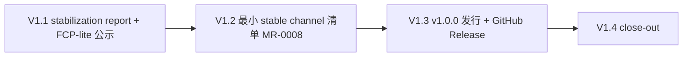

# V1 执行计划 — 子里程碑分解

> 所属契约:[V1_CONTRACT.md](V1_CONTRACT.md)
> 版本:v1.0（2026-07-14）
> 粒度依据:11 §7(小里程碑两级结构);本计划是工作分解,验收以契约 §4 为准,本文不重定义成功。
> agent 裁决(契约 §7 v1.0):V1.1~V1.4 严格串行;FCP-lite 通告即推进;channel 清单 Mini-RFC(MR-0008)前置;版号跳变归 V1.3;close-out 独立(对齐 G2.6 先例)。
> **定位口径**:11 §5 三要件与 RD-008 激活已于 G2.5 完成;V1 执行 RFC-0008 §6 stabilization 路径收尾(观察期判定 → stabilization report → FCP-lite → 进入 stable = v1.0.0 发行),不重造机制。

---

## 0. 总览与依赖

| 子里程碑 | 时长(估) | 交付物映射 | 阻塞关系 / gating |
|---|---|---|---|
| V1.1 | ~2–3 天 | D-V1-1(stabilization report)+ D-V1-2(FCP-lite 公示) | **V1 入口,先做**(report 锚定 g2-closed 时点的 180/88 面,V1.2 条款增长在其后发生并被 report §4 预先声明为加性);Direct 档 |
| V1.2 | ~1 周 | D-V1-3(最小 stable channel 清单) | 依赖 V1.1(FCP 通告含在途事项预告);**Mini-RFC 前置(MR-0008)**;条款先行(RXS-0185 续号);快照重 bless 同 PR |
| V1.3 | ~2–3 天 | D-V1-4(v1.0.0 发行)+ D-V1-5(首个 GitHub Release) | 依赖 V1.2(channel_manifest.json 进发布产物);版号跳变 + 触发器收窄 + tag + release.yml 全绿 + gh release create;发布后 11_ROADMAP 勘误走独立 PR(00 §6.3) |
| V1.4 | ~1 天 | close-out 终审 | 依赖 V1.3;契约翻 closed + 基准 g2-closed→v1-closed + v1-closed tag + deferred/SG 处置(agent 自主签署) |

时长为 `estimated`,仅作排程参考,不构成验收承诺。子里程碑不另立 contract(单 V1 阶段契约,契约 §7 v1.0)。

## 1. V1.1 — stabilization report + FCP-lite 公示（G-V1-1 / G-V1-2,入口先做）

| # | 任务 | 验证方式 / gating |
|---|---|---|
| 1 | STABILIZATION_REPORT.md:① stable 面盘点(逐项贴 `ci/stable_snapshot.py --check` 真实输出 + 快照 SHA-256 + 锚定 commit);② 观察期三段式(定型点 G2.5 / 后续两里程碑 G2.6+GRX 零 stable 面修订实证 / 残余弱点与对冲如实陈述);③ 已知缺口诚实列举(🔒 禁区残余 / open RD / 生态判据 / 生产签名 pending);④ 预先声明 V1.2 加性条款(RXS-0180 L2) | report 内容闭合 + evidence/v1.1-stabilization/ 机器事实归档(git log/stat + snapshot 输出原文) |
| 2 | FCP-lite 公示:公开 GitHub Issue(标题 `[FCP-lite] Rurix 语言 1.0 稳定化(edition 2026)`,label fcp-lite),advisory 语义声明 + report 链接 + 缺口摘要 + 在途事项预告(MR-0008 / v1.0.0 发行计划) | issue 真实 URL 回填契约 §8(不伪造);通告保持开放,发布不关闭 |

**出口判据**:report 合入 main + FCP-lite issue 创建 + URL 回填。

## 2. V1.2 — 最小 stable channel 清单（G-V1-3,MR-0008）

| # | 任务 | 验证方式 / gating |
|---|---|---|
| 1 | **Mini-RFC 前置**:rfcs/mini-0008-stable-channel-manifest.md(动机/设计/失败测试先行/范围红线)合入先于实现;rfcs/README 台账修正(下一未用 = MR-0008,跳过 GRX 占用 0006/0007) | Mini-RFC 合入 + 台账一致 |
| 2 | 条款先行:spec/release.md 延伸 RXS-0185 续号(channel 清单存在性·字段语义·确定性序列化;同版号一致性判据 + Release 层第 8 子门),修订行带档位标记且数据行避「版本」子串 | spec 档位 guardrail + `trace_matrix --check` 全锚定(条款体与 ≥1 测试锚定同 PR,commit 序条款在前) |
| 3 | rurixup 实现:channel 模块(确定性 channel_manifest.json,channel=stable,无时间戳)+ gate 第 8 子门 channel-manifest + `--channel`(缺省 stable)/`--simulate-channel-drift`;零新 RX 码、零新 unsafe | cargo test 单测锚定(//@ spec: RXS-0185 续号) |
| 4 | **stable 快照重 bless(同 PR)**:条款增长 → `RURIX_BLESS=1 ci/stable_snapshot.py` + bless_log 同 diff 追加 | 步骤 49 `ci/edition_smoke.py` 复绿(硬红门,不可分 PR) |
| 5 | CI 步骤 50:新建 `ci/channel_manifest_smoke.py`(green 确定性两次逐字节一致;red 漂移注入 exit 2 + 未知 channel exit 1;复原绿),接线 pr-smoke.yml + release.yml | 真实红绿 + run URL 归档;不写 evidence,零 budget/schema 改动 |

**出口判据**:MR-0008 → 条款+实现+重 bless+步骤 50 单 PR 合入;trace 维持全锚定;run URL 归档。

## 3. V1.3 — v1.0.0 发行 + 首个 GitHub Release（G-V1-4 / G-V1-5）

| # | 任务 | 验证方式 / gating |
|---|---|---|
| 1 | 版号跳变:Cargo.toml workspace 1.0.0 + Cargo.lock;`ci/release_pipeline_smoke.py` 版号注入点参数化 workspace_version();全仓 `0.1.0` 残留审计;**release.yml tag 触发器收窄 `v[0-9]+.[0-9]+.[0-9]+*`** | 本地 `RURIXUP_SIGN=1 ci/release_pipeline_smoke.py` 真签绿 + evidence 版号 1.0.0 |
| 2 | 发行:annotated tag v1.0.0 推送 → release.yml self-hosted runner 全量 success;核验 bundle rurix_version=1.0.0;下载 artifact | run URL 归档 + 版号三点一致(tag/workspace/bundle) |
| 3 | 首个 GitHub Release:`gh release create v1.0.0 --verify-tag` 附产物 + SHA256SUMS;body 诚实标注(测试证书签名 / Azure 生产签名 pending 人工门 / NVIDIA 白名单 pending-human-review)+ report/FCP 链接;body 存 evidence/v1.3-release/ | Release URL 回填契约 §8 |
| 4 | 11_ROADMAP 勘误(独立 PR,00 §6.3):§5 语言 1.0 行加发行标注(tag + Release URL + 日期) | check_planning_docs 预期 advisory 标注,留痕即可 |

**出口判据**:v1.0.0 tag + release.yml 全绿 + GitHub Release 发布 + 勘误合入。

## 4. V1.4 — close-out（agent 自主签署）

| # | 任务 | 验证方式 |
|---|---|---|
| 1 | 全量回归冻结:cargo test/clippy/fmt + trace + budget --strict(零 estimated)+ stable_snapshot --check + bilingual + guardrails 真实输出 | 全绿原文追加契约 §8 |
| 2 | close-out 终审:G-V1-1~5 留痕指针表 + deferred 处置(RD-007/RD-009 carry-forward 不 force-close)+ SG 复评(维持 not_triggered;D-008 红线不解除) | 契约 §8 追加 |
| 3 | 签署兑现:契约 status active→closed;`ci/check_guardrails.py` 基准 g2-closed→v1-closed;推 annotated `v1-closed` tag(触发器已收窄不误触发);双基准 advisory 复核 | agent 签署留痕(对齐 G2 §8.8 先例) |

**出口判据**:V1 期验收达成;close-out 终审完成。

## 5. 风险提示（引用,不另建登记）

- **快照重 bless 原子性(V1.2)**:条款增长使 `stable_snapshot --check` 翻红且嵌在 pr-smoke 步骤 49(硬红);对策:条款+重 bless+bless_log 同 PR,分 PR 必卡死。
- **milestone tag 误触发 release(V1.3/V1.4)**:`v1-closed` 命中现触发器 `v*`;对策:V1.3 PR 先收窄为 `v[0-9]+.[0-9]+.[0-9]+*`,且先于 v1-closed tag 生效(契约 §7 ⑪)。
- **版号硬编码暗雷(V1.3)**:`ci/release_pipeline_smoke.py` 5 处 `"0.1.0"` 不改则 CI 绿但产物 bundle 版号错;对策:参数化 workspace_version() + 全仓残留审计。
- **观察期论证诚实性(V1.1)**:「main 自 g2-closed 零提交」是必要非充分佐证;对策:三段式主证据落 G2.6/GRX 实证,残余弱点(日历窗口短、里程碑 1 同日)如实写 + 对冲条款(FCP 开放 / RXS-0180 L2 / 破坏走 edition)。
- **签名诚实边界(V1.3)**:GitHub Release 产物为测试证书签名;对策:body 诚实标注,不得宣称生产签名齐备(契约 §7 ⑤)。
- **GRX 交错(全期)**:GRX 分支占 RXS-0181~0184/MR-0006/0007,若 V1 期间合入 main 会使快照面漂移;对策:V1 期间不合入(契约 §7 ⑦),例外时 V1.2 rebase 重 bless。
- **LF/CRLF 纪律(全期)**:新文件 LF+尾换行;registry/*.json 等既有 CRLF 例外文件追加行保持原风格、既有行 0-byte;禁 Python 文本模式写文件,逐文件核 CR+尾字节(g2.2 教训)。

## 6. 修订记录

| 版本 | 日期 | 变更 |
|---|---|---|
| v1.0 | 2026-07-14 | 初版(V1 契约配套;V1.1~V1.4 子里程碑分解 + 依赖图;stabilization report + FCP-lite 先行 / channel 清单 MR-0008 前置 + 快照重 bless 同 PR / 版号跳变 + 触发器收窄 + tag + release.yml + gh release / close-out 独立排程;deferred 承接 RD-007 inherited + RD-009 open 顺延 G2→V1;CI 步骤 50 为计划项,随 V1.2 实现 PR 回填实测命令与 run URL;开工裁决引用户 2026-07-14 四项 AskUserQuestion 裁决,留痕契约 §7) |
